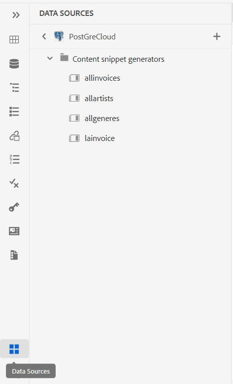

# Adobe Experience Manager Guides as a Cloud Serviceの2023年7月リリースの新機能

この記事では、Adobe Experience Manager Guidesの2023年7月バージョン（後に&#x200B;*AEM Guides as a Cloud Service*&#x200B;と呼ばれます）の新機能と強化機能について説明します。

アップグレード手順、互換性マトリックス、およびこのリリースで修正された問題について詳しくは、[ リリースノート ](release-notes-2023-7-0.md)を参照してください。

## データソースに接続し、トピックにデータを挿入する

AEM Guidesのすぐに使えるコネクタを使用して、データソースに素早く接続できます。 データソースに接続すると、データをソースと同期させることができます。また、データの更新は自動的に反映されるため、AEM Guidesは真のコンテンツハブとなります。 この機能により、データを手動で追加またはコピーする時間と労力を節約できます。

AEM Guidesでは、JIRAおよびSQL （MySQL、PostgreSQL、SQL Server、SQLite）データベース用のすぐに使えるコネクタを設定できます。 デフォルトのインターフェイスを拡張して、他のコネクタを追加することもできます。

追加すると、Web エディターの&#x200B;**データソース** パネルの下に一覧表示されている設定済みコネクタを表示できます。

{width="300"}

コンテンツスニペットジェネレーターを作成して、接続されたデータソースからデータを取得できます。 トピックにデータを挿入して編集します。

コンテンツスニペットジェネレーターを作成したら、それを再利用して任意のトピックにデータを挿入できます。 詳細については、[ データソースからコンテンツスニペットを挿入](../user-guide/web-editor-content-snippet.md)を参照してください。

## レビューパネル：レビュープロジェクトとアクティブなレビュータスクを表示します

Adobe AEM Guidesなら、レビューをよりシームレスに。 Web エディター内のレビューパネルが表示されます。 レビューパネルには、自分が属しているレビュープロジェクト内のすべてのレビュープロジェクトとアクティブなレビュータスクが表示されます。

この機能を利用すれば、レビュータスクを簡単に開いてコメントを表示し、一元的なビューでコメントにすばやく対応できます。
{width="800"}
詳細については、[左パネル ](../user-guide/web-editor-features.md#id2051EA0M0HS) セクション内の&#x200B;**レビュー**&#x200B;機能の説明を参照してください。

## マップコレクションの機能強化

マップコレクションは、複数のマップを整理し、一括公開するのに役立ちます。 マップコレクションに多くの新しい機能強化が行われました。

- また、ネイティブPDF出力プリセットをマップコレクションに追加し、それらを使用してPDF出力を生成することもできます。
- 管理者が作成したグローバルプロファイルプリセットとフォルダープロファイルプリセットを表示し、それらを使用してPDF出力を生成できます。
- これで、個々のプリセットを選択するだけでなく、DITA マップのすべてのフォルダープロファイルプリセットを一括で有効にすることもできます。
  {width="800"}

詳細については、[出力生成にマップコレクションを使用](../user-guide/generate-output-use-map-collection-output-generation.md)を参照してください。

## ネイティブのPDF出力の生成中に一時HTML ファイルにアクセスする機能

AEM Guidesでは、ネイティブのPDF出力の生成中に作成された一時HTML ファイルをダウンロードできます。 出力プリセット設定で、一時ファイルをダウンロードするオプションを選択します。  次に、AEM Guidesを使用すると、そのプリセットを使用して出力を生成する際に作成された一時ファイルをダウンロードできます。

この機能を使用すると、暫定的なスタイルとレイアウトにアクセスして、生成プロセスをより詳細に把握できます。また、必要に応じてCSS スタイルを修正または変更できます。

{width="800"}

詳しくは、[PDF出力プリセットの作成](../web-editor/native-pdf-web-editor.md#create-output-preset)を参照してください。

## HTML5とカスタム出力を生成するマイクロサービスベースのパブリッシング

新しいパブリッシングマイクロサービスを使用すると、AEM Guides as a Cloud Serviceで大規模なパブリッシングワークロードを同時に実行し、業界をリードするAdobe I/O Runtime サーバーレスプラットフォームを活用できます。マイクロサービスを使用して、HTML5とカスタム出力を生成することもできます。
複数の公開リクエストを実行し、パフォーマンスを向上させて、これらの出力形式を生成できます。
詳しくは、[AEM Guides as a Cloud Serviceのマイクロサービスベースの公開の設定](../knowledge-base/publishing/configure-microservices.md)を参照してください。

## AEM Guidesのバージョンの詳細については、「概要」を参照してください

AEM **バージョン情報**&#x200B;と共に、AEM Guides バージョンの詳細も確認できます。 現在のバージョンの詳細は、AEM ナビゲーションページの&#x200B;**ヘルプ**&#x200B;の&#x200B;**バージョン情報** オプションで確認できます。

{width="800"}
