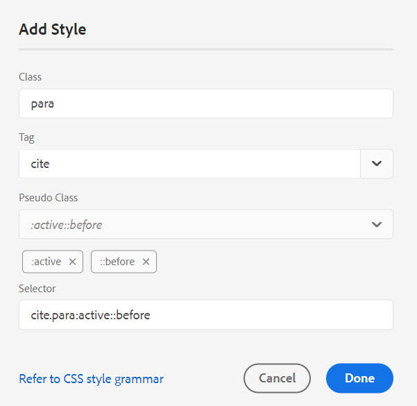

# Adobe Experience Manager Guidesas a Cloud Serviceの 2023 年 9 月リリースの新機能

この記事では、Adobe Experience Manager Guidesの 2023 年 9 月バージョン（後で *AEM Guidesas a Cloud Service* と呼ばれます）の新機能および拡張機能について説明します。

アップグレード手順、互換性マトリックス、このリリースで修正された問題について詳しくは、[&#x200B; リリースノート &#x200B;](release-notes-2023-9-0.md) を参照してください。

## データ ソースに接続してトピックを挿入する

AEM Guidesには、データソースとの接続に役立つ標準搭載のコネクタが用意されており、AEM Guidesを真のコンテンツハブとしています。 これにより、手動でのデータ追加やレプリケーションに費やす時間と労力を節約できるというメリットが得られます。

管理者は、JIRA や SQL （MySQL、PostgreSQL、SQL Server、SQLite）などの既存の標準コネクタに加えて、MariaDB、H2DB、AdobeCommerce、Elasticsearchデータベース用のコネクタも設定できます。 また、デフォルトのインターフェイスを拡張することで、他のコネクタを追加することもできます。

設定済みのコネクタは、web エディターの **データソース** パネルに表示されます。

*接続されているデータソースを表示します*。

また、接続されたデータソースからトピックを作成できるようになりました。 トピックには、テーブル、リスト、段落など、様々な形式のデータを含めることができます。 また、すべてのトピックに対して DITA マップを作成することもできます。 データソースから取り込む際に、トピックにメタデータを関連付けることができます。

詳しくは、[&#x200B; データソースのデータを使用 &#x200B;](../user-guide/web-editor-content-snippet.md) を参照してください。

## コンテンツへの引用文献の追加

引用は、コンテンツに追加された情報のソースへの参照です。 引用は、信頼性を確立し、盗用を防ぐのに役立ちます。 引用は、読者がソースを見つけて、テキストに表示される情報を確認するのに役立ちます。

AEM Guidesでは、引用文を追加したり、引用文を読み込んでコンテンツに適用したりできます。 これらの引用は、書籍、Web サイト、ジャーナルの任意のソースから追加できます。

トピックに引用文を挿入した後、Web エディターでプレビューできます。 ネイティブPDFを使用して、引用のあるコンテンツを公開することもできます。

{width="300" align="left"}

*引用文献のリストを引用文献パネルに表示します。*

詳しくは、[&#x200B; コンテンツでの引用の追加と管理 &#x200B;](../user-guide/web-editor-apply-citations.md) を参照してください。

## コンテンツフラグメントへのPublish

コンテンツフラグメントは、AEMの個別のコンテンツです。 コンテンツモデルに基づく構造化コンテンツです。 コンテンツフラグメントは、デザイン情報やレイアウト情報を含まない純粋なコンテンツです。 これらは、AEMがサポートするチャネルとは独立して作成および管理できます。 コンテンツフラグメントのモジュール性と再利用性により、柔軟性、一貫性、効率、管理の簡素化が実現します。

AEM Guidesでは、トピックまたはトピック内の要素をコンテンツフラグメントに公開する方法を提供するようになりました。 トピックとコンテンツフラグメントモデルの間に JSON ベースのマッピングを作成できます。 このマッピングを使用して、トピック内の一部またはすべての要素に存在するコンテンツをコンテンツフラグメントに公開します。

AEM Guidesとコンテンツフラグメントの機能を最大限に活用して、任意のAEM サイトでコンテンツフラグメントを使用します。 また、コンテンツフラグメントでサポートされている API を使用して詳細を抽出することもできます。

{width="550" align="left"}

*コンテンツフラグメントにトピックをPublishします。*

詳しくは、[&#x200B; コンテンツフラグメントへのPublish](../user-guide//publish-content-fragment.md) を参照してください。

## 機能強化の確認

AEM Guidesは、次の機能でレビュー機能が強化されました。

### レビュートピックを検索

レビューの実施は、AEM Guidesの重要な機能です。 これは、レビュー担当者が割り当てられたドキュメントをレビューするのに役立ちます。
これで、レビュー・パネルのトピック・ビューの検索バーにタイトルまたはファイル・パスのテキストの一部を入力して、トピックを検索できます。 すべてのトピックを表示するか、コメント付きのトピックを表示するかを選択することもできます。 デフォルトでは、レビュータスクに存在するすべてのトピックを表示できます。 詳しくは、「トピックを確認 [&#x200B; を参照してください &#x200B;](../user-guide/review-topics.md)。

{width="800" align="left"}

*レビューパネルでレビュートピックを検索*

## Guides 拡張機能フレームワーク

AEM Guides上にカスタムパッケージを作成し、AEM Guides Extension Framework を使用して拡張機能を提供します。 これらのパッケージは、開発者やコンサルタントがエディターのコンポーネントを拡張するのに役立ちます。 ボタン、ダイアログ、ドロップダウンをターゲットにして、AEM Guides UI と簡単に相互運用できるカスタム JavaScriptを追加できます。

## ネイティブPDFの機能強化

2023 年 9 月リリースで、AEM Guidesをより堅牢なPDFにするために、次のネイティブ製品の機能強化が行われました。

### PDF出力でのページの順序付け

PDF内の以下のセクションの表示/非表示を切り替えたり、最終的なPDF出力で表示する順序を調整したりできます。

* 目次
* チャプターとトピック
* 図のリスト
* テーブルのリスト
* 索引
* 用語集
* 引用
* ページレイアウト

PDF出力の特定のセクションを表示しない場合は、切り替えスイッチをオフにして非表示にできます。

詳しくは、「ページ順序 [&#x200B; を参照してくだ &#x200B;](../native-pdf/components-pdf-template.md#page-order) い。

### ページの結合

ネイティブPDF出力では、デフォルトで、すべてのセクションが新しいページから始まります。 これで、セクションを前のページまたは次のページに結合できます。 これにより、PDF出力で選択されたページに続くセクションが公開され、ページ間に改ページはありません。

詳しくは、「**ページの順序**」セクションの [&#x200B; ページの結合 &#x200B;](../native-pdf/components-pdf-template.md#page-order) 機能の説明を参照してください。

### 現在のページからチャプターを開始

奇数ページまたは偶数ページからチャプターを開始するための基本的な設定、目次の構造、および目次エントリの引出線の形式を定義できます。

現在のページからチャプターを開始することもできます。 これを選択すると、すべてのチャプターが連続して公開され、改ページは一切行われません。 例えば、チャプターが 15 ページの途中で終了する場合、次のチャプターも 15 ページ目から開始します。

詳細については、&lbrack;PDFの詳細設定 **の [ 全般**] タブの説明を参照してください [&#128279;](../native-pdf/components-pdf-template.md#advanced-pdf-settings-advanced-pdf-settings)。

### 静的ページ

カスタムページレイアウトを作成して、PDF出力で静的ページとして公開することもできます。 これにより、メモや空白のページなどの静的コンテンツを追加できます。

詳しくは、「ページの順序 **の節の** 静的ページ [&#x200B; 機能の説明を参照し &#x200B;](../native-pdf/components-pdf-template.md#page-order) ください。

### クロスリファレンスの変数

変数を使用して相互参照を定義できます。 変数を使用すると、その値がプロパティから選択されます。

{figure} と {table} も使用できるようになりました。
{figure} を使用して、図形番号に相互参照を追加します。 図表番号として定義した自動番号スタイルから図番号が選択されます。

{table} を使用して、テーブル番号に相互参照を追加します。 キャプションに対して定義した自動番号スタイルからテーブル番号が選択されます。

詳しくは、[&#x200B; 相互参照 &#x200B;](../native-pdf/components-pdf-template.md##cross-references) を参照してください。

### CSS エディターの再設計

CSS エディターのデザインを一新し、セレクターとスタイルプロパティのユーザーエクスペリエンスが向上しました。

#### スタイルを追加ダイアログの機能強化

カスタムセレクターを使用して、複雑なスタイルを追加できるようになりました。 新しいセレクターフィールドは、クラス、タグ、疑似クラスの組み合わせ以外のカスタムセレクターを追加するのに役立ちます。 例えば、テーブル内のすべて `table a.link` ハイパーリンクにスタイルを作成できます。

{width="300" align="left"}

*新しいスタイルの詳細を追加します。*

#### スタイルのプロパティのカスタマイズ

AEM Guidesでは、スタイルの「プレビュー」セクションに新しいプロパティパネルが表示されるようになりました。 プロパティパネルからスタイルのプロパティをより効率的かつ迅速に編集できます。

## 1 つの定義済みリスト定義で複数のサブジェクト定義をサポート

1 つのマップに 1 つ以上のサブジェクト定義を定義し、別のマップに定義済みリスト定義を定義してから、マップ参照を追加できるようになりました。 サブジェクトの定義済みリストの参照は、同じマップまたは参照先のマップで解決されます。

また、条件を定義して、トピック内の特定の要素に適用できるようになりました。  これらの条件は、特定の要素に対してのみ表示され、その他のすべての要素に対しては表示されません。

サブジェクト定義と列挙の階層定義の処理の詳細については、[&#x200B; 左パネル &#x200B;](../user-guide/web-editor-features.md#id2051EA0M0HS) セクションのサブジェクト スキーム機能の説明を参照してください。

## Map コレクション内のすべてのプリセットを選択します

個々のプリセットとすべてのフォルダープロファイルプリセットを有効にするだけでなく、DITA マップのすべてのプリセットも一度に有効にすることができます。
{width="800" align="left"}\
*マップコレクション内のすべてのプリセットを選択します。*

詳しくは、[&#x200B; 出力生成にマップ コレクションを使用 &#x200B;](../user-guide/generate-output-use-map-collection-output-generation.md) を参照してください。

## 一括Publish ダッシュボードでのネイティブPDFのサポート

AEM Guidesの一括アクティベーション機能を使用すると、オーサリングからパブリッシュインスタンスまで、コンテンツをすばやく簡単にアクティベーションできます。 一括有効化マップには、ネイティブPDF出力プリセット、AEM サイト、PDF、HTML 5、カスタム、JSON 出力を含めることができます。
詳しくは、[&#x200B; 公開済みコンテンツの一括アクティベーション &#x200B;](../user-guide/conf-bulk-activation.md) を参照してください。

## 改良された一括移動ツール

管理者は、改善された一括移動ツールを使用して、多数のファイルがあるフォルダーを別の場所に移動できるようになりました。
ファイルを参照ダイアログを使用して、移動するソースフォルダーを選択できます。 また、ソースフォルダーを移動する宛先の場所を参照して選択することもできます。 フィールドの近くにある  {width="25" align="left"} を選択して、そのフィールドに関する詳細を表示します。

詳しくは、[&#x200B; ファイルを一括で移動 &#x200B;](../user-guide/authoring-file-management.md#move-files-bulk) を参照してください。

## コンテキストメニューからのプレビューエクスペリエンスの強化

コンテキストメニューを使用すると、ファイル （.dita、.xml、.audio、video、または image）を開かずにすばやくプレビューできます。 プレビューペインのサイズを変更できるようになりました。コンテンツに参照リンクが含まれている場合は、その参照リンクを選択して新しいタブで開くことができます。

{width="800" align="left"}

*ペインでファイルをプレビューします。*

コンテキストメニューの詳細については、**左パネル [&#x200B; セクションの** ファイルのオプション &#x200B;](../user-guide/web-editor-features.md#id2051EA0M0HS) 機能の説明を参照してください。

## 宛先のパス、サイト名、ファイル名の各オプションで、現在の日時の変数を使用する

AEM Site またはPDFで出力を生成する際に、変数を使用して **Destination Path**、**Site Name**、または **File Name** オプションを設定できます。 `${system_date}` 変数と `${system_time}` 変数も使用できるようになりました。 これらの変数を使用すると、これらのオプションに現在の日付と時刻を追加できます。

[&#x200B; 宛先パス、サイト名、ファイル名のオプションを設定するための変数を使用する &#x200B;](../user-guide/generate-output-use-variables.md) 方法を説明します。
