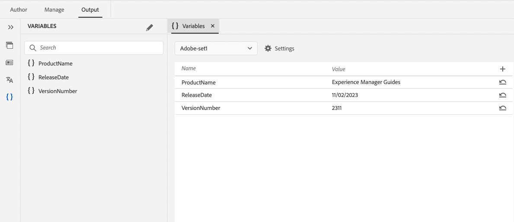

# 2023 年 12 月リリースのAdobe Experience Managerガイドas a Cloud Serviceの新機能

この記事では、Adobe Experience Managerガイド ( 後で *Experience Managerガイドas a Cloud Service*) をクリックします。

アップグレードの手順、互換性マトリックス、およびこのリリースで修正された問題の詳細については、 [リリースノート](release-notes-2023.12.0.md).

## ネイティブPDF出力での変数の使用

変数セットを使用すると、製品名やバージョンなどの特定の条件に基づいて変化する情報を動的に挿入および管理できます。 この機能は、同じPDFレイアウトを使用し、異なる値の出力を生成する場合に役立ちます。 値のセットごとに個別のレイアウトを作成する必要はありません。

例えば、各製品に対して変数セットを作成できます。 この変数セットは、ProductName、VersionNumber、ReleaseDate など、様々な製品詳細の変数で構成できます。 次に、これらの変数に異なる値を追加できます。

**変数セット 1:Adobeセット 1**

* ProductName:Experience Managerガイド
* バージョン番号： 2311
* リリース日： 11/02/2023

**変数セット 1:Adobeセット 2**

* ProductName:Experience Managerガイド
* バージョン番号： 2310
* リリース日： 09/27/2023

{width="800" align="left"}

*Web エディターの「出力」タブで変数を作成します。*

また、値にタグを付けた変数を作成し、HTMLを設定できます。 例えば、 `` タグを使用します。

変数を作成したら、出力テンプレートのページレイアウトを使用して、ドキュメント内の適切な場所に変数を追加できます。 値は、出力プリセットで選択した変数セットに基づいて、PDF出力で自動的に選択されます。

*レイアウトレイアウトの変数を使用して、ネイティブPDF出力をPDFします。*

この機能を使用すると、ドキュメント内の動的コンテンツを含むカスタマイズされた出力を生成し、変更を効率的に管理できます。 また、スタイルを適用し、変数の書式設定にHTMLマークアップを使用することもできます。

また、必要に応じて任意の変数セットの値をすばやく更新し、出力を再生成することもできます。 例えば、あるバージョンの詳細を更新する必要がある場合は、VersionNumber でそのバージョンの値を更新し、出力を再生成できます。

## 属性を編集するエクスペリエンスが改良されました。

これで、要素の属性を **コンテンツのプロパティ** パネルを使用して、Web エディターで設定できます。

{width="300" align="left"}

*[ コンテンツプロパティ ] パネルから属性を追加します。*

また、属性を簡単に編集および削除することもできます。

詳しくは、 **コンテンツのプロパティ** 内の機能の説明 [右パネル](../user-guide/web-editor-features.md#id2051EB003YK) 」セクションに入力します。

## オーサリング中にメタデータを編集

これで、オーサリング中に、 **ファイルのプロパティ** をクリックします。 また、 **その他のプロパティを編集** をクリックして、さらにメタデータを更新します。

{width="300" align="left"}

*右側のパネルからメタデータを更新し、ファイルのプロパティを編集します。*

詳しくは、 **ファイルのプロパティ** 内の機能の説明 [右パネル](../user-guide/web-editor-features.md#id2051EB003YK) 」セクションに入力します。

## ServiceNow ナレッジベースにコンテンツを公開する機能

コンテンツを ServiceNow ナレッジベースプラットフォームに公開することもできます。

2023 年 12 月リリースでは、管理者として ServiceNow ナレッジベースサーバーの公開プロファイルを作成できます。 次に、作成者または発行者として、出力プリセットでその ServiceNow 公開プロファイルを選択し、指定したナレッジベースに出力を公開できます。

この機能を使用すると、テキスト、ビデオ、画像などのコンテンツを ServiceNow ナレッジベースプラットフォームに公開し、包括的なリポジトリを維持できます。

{width="300" align="left"}

*ServiceNow ナレッジベースの出力プリセットを作成します。*

## 強化されたマップコレクションダッシュボード

Experience Managerガイドは、強化されたマップコレクションダッシュボードを提供します。 マップコレクションでは、DITA マップ用のメタデータプロパティを一括ですばやく設定できます。 各 DITA マップのメタデータプロパティを個別に更新する必要がないので、この機能は便利です。

これで、DITA マップのファイル名を表示できます。 また、ベースラインも表示できます。 これにより、プリセットに使用されるベースラインをすばやく見つけるのに役立ちます。

{width="800" align="left"}

*マップコレクションダッシュボードで出力を表示、編集、生成します。*

方法を学ぶ [出力生成にマップコレクションを使用](../user-guide/generate-output-use-map-collection-output-generation.md).

## マップビューでキー属性を表示する

トピックまたはマップ参照のキー属性を定義する際に、タイトル、対応するアイコンおよびキーを左側のパネルに表示することもできます。 キーは次のように表示されます。 `key=<key-name>`.

詳しくは、 **マップビュー** 機能の説明 [左パネル](../user-guide/web-editor-features.md#id2051EA0M0HS) 」セクションに入力します。

 {width="300" align="left"}

*[ マップビュー ] で key 属性を表示します。*

## ラベルに基づいてベースラインを複製する機能

Experience Managerガイドで、Web エディターからベースラインを作成する際のユーザーエクスペリエンスが強化されました。\
 {width="300" align="left"}
*Web エディターからベースラインを作成します。*

また、ラベルに基づいてベースラインを複製することもできます。 参照バージョンは、複製時に指定されたラベルに基づいて選択されます（存在する場合）。複製時に選択されない場合は、複製されたベースラインからバージョンを選択します。

 {width="300" align="left"}

*ラベルに基づいてベースラインを複製するか、正確なコピーを作成します。*

## 一括アクティベーションマップコレクションの作成プロセスを改善しました。

一括アクティベーションマップコレクションを作成するプロセスが、より調和したものになりました。 これで、アクティベーションの結果ページが表示されたら、アクティベーションの結果とログを表示できます。
詳しくは、 [一括アクティベーションマップコレクションの作成](../user-guide/conf-bulk-activation-create-map-collection.md).

## AEM Site 出力のクロスマップリンクの解決

AEMサイト出力でレンダリングされるクロスマップリンク（スコープピアを持つ XREF）が、生成されたマップに対してパブリッシュコンテキストセットのファイルタイトルに従って解決されるようになりました。

## ドキュメントのタイトルを使用するAEM Site 出力の URL を設定

Experience Managerガイドを使用すると、AEM Site 出力の URL を管理者が設定できます。 ファイル名が存在しない場合や、すべての特殊文字が含まれている場合は、AEM Site 出力の URL で区切り文字に置き換えるように設定できます。 また、最初の子トピックの名前に置き換えることもできます。 方法を学ぶ [ドキュメントのタイトルを使用するAEM Site 出力の URL を設定](../cs-install-guide/conf-output-generation.md#configure-the-url-of-the-aem-site-output-to-use-the-document-title).

