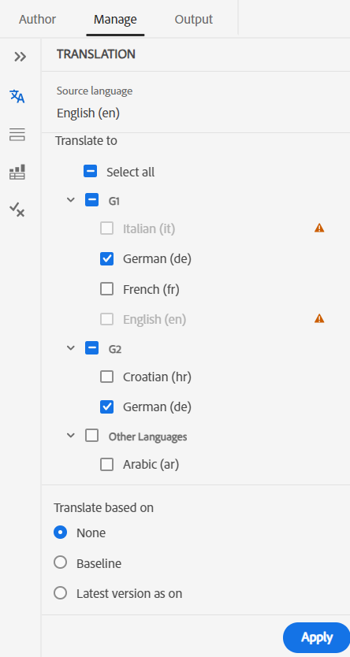
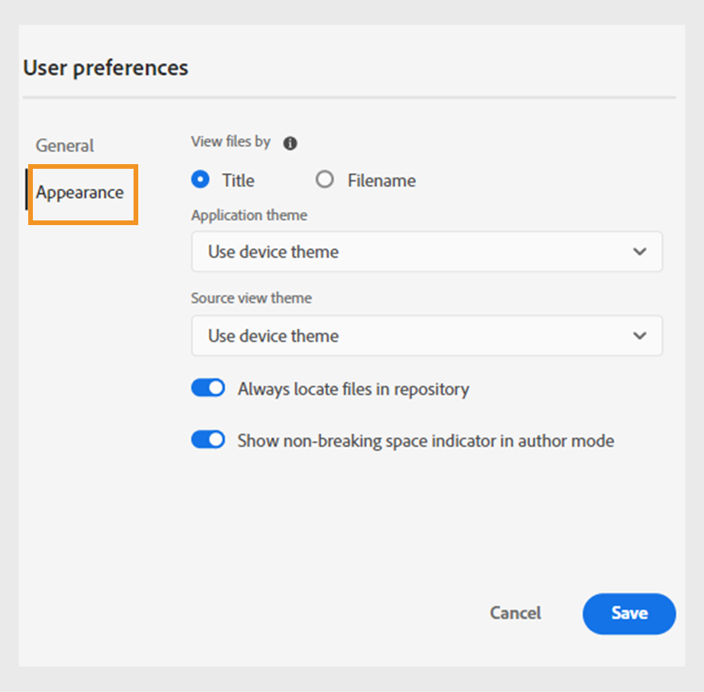

# 2024.4.0 リリースの新機能

この記事では、Adobe Experience Manager Guides 2024.4.0 リリースの新機能と機能強化について説明します。

このリリースで修正された問題の一覧については、[2024.4.0リリースで修正された問題](fixed-issues-2024-04-0.md)を参照してください。

[2024.4.0 リリースのアップグレード手順 &#x200B;](upgrade-instructions-2024-04-0.md) について説明します。

## 事前設定済みの言語グループを使用してコンテンツを複数の言語に翻訳する機能

Experience Manager Guides では、言語グループを作成し、コンテンツを複数の言語へと容易に翻訳できるようになりました。この機能は、組織のニーズに応じて翻訳を整理および管理するのに役立ちます。

例えば、ヨーロッパの一部の国向けにコンテンツを翻訳する必要がある場合、英語（EN）、フランス語（FR）、ドイツ語（DE）、スペイン語（ES）、イタリア語（IT）などのヨーロッパ言語の言語グループを作成できます。

{width="300" align="left"}

*ドキュメントを翻訳する言語グループまたは言語を選択します。*

>[!NOTE]
>
>言語のターゲットフォルダーが見つからない場合や、ターゲット言語がソース言語と同じ場合は、グレー表示され、警告サインが表示されます。

管理者は、言語グループを作成し、複数のフォルダープロファイルに設定できます。作成者は、フォルダープロファイルで設定されている言語グループを表示できます。

全体として、言語グループを作成すると、翻訳プロジェクトの効率と生産性が向上し、最終的には複数の言語にわたるローカライゼーションプロセスが向上します。

[Web エディターからドキュメントを翻訳 &#x200B;](../user-guide/translate-documents-web-editor.md) する方法を説明します。

## 翻訳後に翻訳プロジェクトを自動的に削除または無効化

管理者は、翻訳が完了した後に翻訳プロジェクトが自動的に無効または削除されるように設定できるようになりました。 この機能を使用すると、翻訳が完了した後に、リソースを効率的に使用し、ファイルを管理できます。

プロジェクトを削除すると、プロジェクトに存在するすべてのファイルとフォルダが完全に削除されます。 翻訳プロジェクトを削除すると、占有ディスク領域を解放することもできます。

翻訳プロジェクトは、後で使用する場合に無効にすることができます。

{width="550" align="left"}

*翻訳プロジェクトの言語グループとクリーンアップ設定の指定*

[&#x200B; 翻訳プロジェクトを自動的に削除または無効にする &#x200B;](../user-guide/translate-documents-web-editor.md#automatically-delete-or-disable-a-completed-translation-project) 方法について説明します。

## プレビューインスタンスの一括有効化コレクションでマップの出力を有効化します

現在は、パブリッシュインスタンスで一括アクティベーションコレクションの出力をアクティベートする以外に、Cloud ServiceとしてのExperience Managerガイドが **プレビュー** インスタンスでアクティベートする機能を提供しています。

この機能を使用すると、コンテンツをプレビューインスタンスに対してアクティブ化できるので、**Publish** インスタンスに対してアクティブ化する前に、コンテンツの外観と動作を確認できます。

{width="800" align="left"}

*アクティブ化されたマップ出力に関する情報は、「監査履歴&#x200B;**タブに表示**&#x200B;れます。*

詳しくは、[&#x200B; 一括アクティベーション &#x200B;](../user-guide/conf-bulk-activation-publish-map-collection.md) を参照してください。

## データソースコネクタの機能強化

2024.4.0 リリースでは、データソースコネクタに対して次の機能強化を行いました。

### Salsify、Akeneo、およびMicrosoft Azure DevOps Boards （ADO） データ ソースに接続します

また、既存の標準コネクタに加えて、Experience Manager Guides では、Salsify、Akeneo、Microsoft Azure DevOps Boards（ADO）データソース用のコネクタも提供します。管理者は、これらのコネクタをダウンロードしてインストールできます。次に、インストールしたコネクタを設定します。

### サンプルクエリをコピー&amp;ペーストして、コンテンツスニペットまたはトピックを作成します

サンプルデータクエリをジェネレーターにコピー＆ペーストするだけで、コンテンツスニペットまたはトピックを作成できます。この機能を使用すると、構文を覚えたり、クエリを手動で作成したりする必要がありません。クエリを手動で入力する代わりに、サンプルクエリをコピー＆ペーストし、編集し、使用して要件に応じたデータを取得できます。

{width="800" align="left"}

*サンプルクエリをコピーして編集し、コンテンツスニペットを作成します。*

### ファイルコネクタを使用した JSON データファイルへの接続

管理者は、JSON データファイルをデータソースとして使用するように JSON ファイルコネクタを設定できるようになりました。コネクタを使用して、コンピューターまたは Adobe Experience Manager Assets から JSON ファイルを読み込みます。次に、作成者は、ジェネレーターを使用してコンテンツスニペットまたはトピックを作成できます。

この機能は、JSON ファイルに保存されたデータを使用し、様々なスニペット間で再利用するのに役立ちます。また、JSON ファイルを更新するたびに、コンテンツも動的に更新されます。

### コネクタに複数のリソース URL を設定して、コンテンツスニペットやトピックを作成する

管理者は、Generic REST Client、Salsify、Akeneo、Microsoft Azure DevOps Boards （ADO）など、一部のコネクタに対して複数のリソース URL を設定できます。

次に、作成者は、ジェネレーターを使用してデータソースに接続し、コンテンツスニペットまたはトピックを作成します。この機能は、URL ごとにデータソースを作成する必要がないので便利です。これにより、単一のコンテンツスニペットまたはトピック内の特定のデータソースについて、任意のリソースからデータをすばやく取得できます。

データソースコネクタの詳細と、[&#x200B; ユーザーインターフェイスからデータソースコネクタを設定する &#x200B;](../cs-install-guide/conf-data-source-connector-tools.md) 方法を表示します。

[データソースからデータを使用](../user-guide/web-editor-content-snippet.md)する方法を参照してください。

## ユーザー環境設定の新しい UI で web エディターのエクスペリエンスをカスタマイズ

Web エディターの **ユーザーの環境設定** ダイアログボックスに、新しい **外観** タブが含まれるようになりました。 この新しいタブを使用すると、web エディターインターフェイスで最も一般的なルックアンドフィール環境設定を簡単に設定できます。

タイトルまたはファイル名でファイルを表示するようにを設定したり、アプリケーションのテーマやソースビューを変更したりできます。 また、リポジトリビューで開いているファイルを見つけたり、改行しないスペースを処理したりするための設定を指定する場合にも役立ちます。

{width="550" align="left"}

*好みに応じて外観をカスタマイズします。*

**ユーザー環境設定** 機能の説明について詳しくは、「[&#x200B; 左パネル &#x200B;](../user-guide/web-editor-features.md#id2051EA0M0HS)」セクションを参照してください。

## Web エディターのリポジトリ表示で、開いているファイルを見つけます

**ユーザー環境設定** の「**リポジトリ内のファイルを常に見つける**」オプションを選択して、リポジトリビューですばやく移動してファイルを見つけます。 手動で検索する必要はありません。

また、編集時には、リポジトリ階層内のファイルの場所を簡単に確認できます。

詳しくは、[&#x200B; リポジトリ表示で開いているファイルを見つける &#x200B;](../user-guide/web-editor-edit-topics.md#locate-an-open-file-in-the-repository-view) を参照してください。

## Web エディターでの非改行スペースの処理を改善しました

Experience Manager Guidesを使用すると、Web エディターでドキュメントを編集する際に、改行なしのスペースインジケーターを表示できます。 また、非改行スペースの処理も改善されます。
Web エディターでドキュメントの WYSIWYG 表示を保持するために、複数の連続する空白が 1 つのスペースに変換されます。 また、この機能は、ドキュメントの全体的な外観とプロフェッショナリズムを向上させるのに役立ちます。

詳しくは、[Web エディターのその他の機能 &#x200B;](../user-guide/web-editor-other-features.md) を参照してください。

## Adobe Experience Manager Assets上の選択したフォルダーに対する後処理を無効にする

管理者は、Experience Manager Assets上の選択したフォルダーに対する後処理と UUID の生成を無効にできるようになりました。 この設定は、特に多くのアセットや複雑なフォルダー構造を処理する場合に役立つ可能性があります。 また、複数のユーザーが互いに干渉することなく、同時にアセットをすばやくアップロードできます。  

フォルダーの後処理を無効にすると、そのすべての子フォルダーにも影響します。 ただし、Experience Manager Guidesには、無視されたフォルダー内の個々の子フォルダーに対して後処理を選択的に有効にする機能が追加されました。

[&#x200B; フォルダーの後処理を無効にする &#x200B;](../cs-install-guide/conf-folder-post-processing.md) 方法を説明します。

## リポジトリビューでのファイルの検索とフィルタリングのエクスペリエンスを改善しました

ファイルのフィルタリング時のエクスペリエンスが向上しました。ファイルをフィルタリングする刷新された機能によりファイルを簡単に検索および移動する方法が改善されました。

{width="300" align="left"}

*テキスト`general purpose.`* を含むファイルを検索します

関連ファイルへの迅速なアクセスや、より直感的なユーザーインターフェイスなどのメリットが得られ、検索エクスペリエンスがよりスムーズかつ効率的になります。

 {width="300" align="left"}

*クイックフィルターを使用して、DITA ファイルと非 DITA ファイルを検索します。*

**フィルター検索**&#x200B;機能について詳しくは、[左パネル](../user-guide/web-editor-features.md#id2051EA0M0HS)の節を参照してください。

## 位置に応じて有効な要素を表示および挿入するための分離リスト

Web エディターでドキュメントを編集する際に、現在の場所および現在の場所以外で有効な要素の分離されたリストを表示できるようになりました。 必要に応じて、次のオプションから要素を選択します。

* **現在の位置にある有効な要素** 現在のカーソル位置に挿入できます。
* **現在の場所以外の有効な要素** 要素階層内の現在の要素の親の後に挿入できます。

{width="300" align="left"}

*有効な要素の分類リストを表示して、現在の場所に要素を挿入します。*

この有効なエレメントの分割リストを使用すると、コンテンツ構造を維持し、DITA 標準に準拠することができます。

**要素の挿入** 機能については、[セカンダリツールバー &#x200B;](../user-guide/web-editor-features.md#2051ea0j0y4) の節を参照してください。

## コンテンツプロパティタイプは、ドロップダウンメニューとして表示されます

これで、コンテンツのプロパティ **タイプ** がドロップダウンメニューとして表示されます。 ドロップダウンから、現在のタグの階層全体のタグを表示して選択できます。

このドロップダウンメニューを使用すると、階層構造内の関連するタグにすばやくアクセスできます。

{width="300" align="left"}

*現在のタグの階層からタグを選択します。*

**コンテンツのプロパティ** 機能について詳しくは、「[&#x200B; 右パネル &#x200B;](../user-guide/web-editor-features.md#id2051eb003yk)」の節を参照してください。

## マップ エディタからファイルを一括でチェックする際のパフォーマンスが向上しました

Experience Manager Guidesでは、マップエディタからのバルクファイルのチェックイン機能のパフォーマンスと操作性が向上しています。 この機能強化により、ファイルを一括でより迅速にチェックインできるようになりました。
ファイルのチェックイン操作の進行状況は、&lbrack; 新しいバージョンとして保存してロック解除 **ダイアログ ボックスからも確認** きます。 最後に、操作が完了し、選択したすべてのチェックアウト済みファイルがチェックインされると、成功メッセージが表示されます。

{width="300" align="left"} ダイアログボックス

*マップエディタから一括でチェックインされたファイルのリストとステータスを表示します。*

詳細な [&#x200B; 高度なマップエディターの操作 &#x200B;](../user-guide/map-editor-advanced-map-editor.md) 方法

## DITA-OT による出力の生成時に一時ファイルをダウンロード

また、DITA-OT を使用してAEM サイト、HTML、カスタム、JSON、またはPDF出力を公開する際に生成された一時ファイルをダウンロードすることもできます。 この機能は、出力生成プロセス中に発生する可能性のある問題を分析し、効果的なトラブルシューティングを行うのに役立ちます。  
DITA-OT を使用して生成された出力に渡されたメタデータプロパティを選択した場合は、metadata.xml ファイルをダウンロードすることもできます。 

プリセットについて詳しくは、[&#x200B; 出力プリセットについて &#x200B;](../user-guide/generate-output-understand-presets.md) を参照してください。

## マイクロサービスベースの公開用に IMS JWT 資格情報を IMS OAuth 資格情報に置き換えます。

サービスアカウント（JWT）資格情報は、**OAuth サーバー間** 資格情報に置き換わるものとして、非推奨になりました。 サービスアカウント（JWT）資格情報を使用するアプリケーションは、2025 年 1 月 1 日（PT）以降は機能しなくなります。 アプリケーションが引き続き機能するように、2025 年 1 月 1 日までに新しい資格情報に移行する必要があります。

Experience Manager Guidesの Cloud Publishing サービスが、Adobe IMSの OAuth ベースの認証で保護されるようになりました。 [OAuth 認証を使用してマイクロサービスベースの公開を設定する &#x200B;](../knowledge-base/publishing/configure-microservices-imt-config.md) 方法を説明します。
