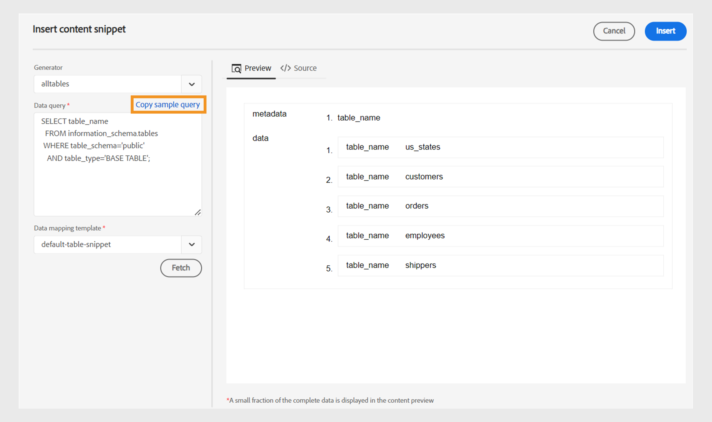
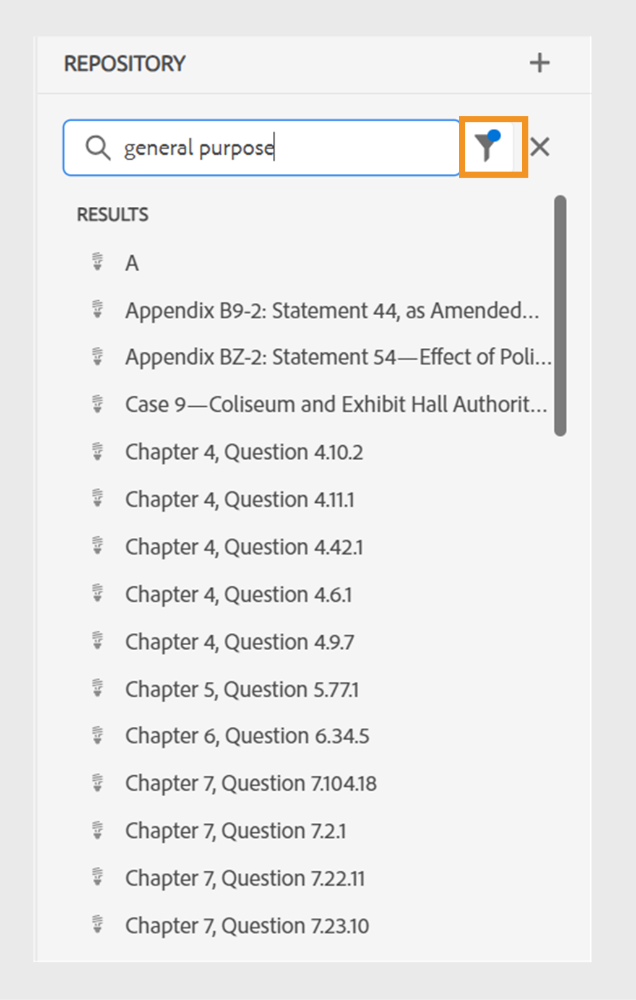

# 2024.4.0 リリースの新機能

この記事では、Adobe Experience Manager Guidesの2024.4.0 リリースの新機能と強化機能について説明します。

このリリースで修正された問題の一覧については、[2024.4.0リリースで修正された問題](fixed-issues-2024-04-0.md)を参照してください。

2024.4.0 リリース ](upgrade-instructions-2024-04-0.md)の[ アップグレード手順について説明します。

## 事前設定済みの言語グループを使用して、コンテンツを複数の言語に翻訳したい

Experience Manager Guides では、言語グループを作成し、コンテンツを複数の言語へと容易に翻訳できるようになりました。 この機能は、組織のニーズに応じて翻訳を整理および管理するのに役立ちます。

例えば、ヨーロッパの一部の国向けにコンテンツを翻訳する必要がある場合、英語（EN）、フランス語（FR）、ドイツ語（DE）、スペイン語（ES）、イタリア語（IT）などのヨーロッパ言語の言語グループを作成できます。

{width="300"}

*ドキュメントを翻訳する言語グループまたは言語を選択します。*

>[!NOTE]
>
>言語のターゲットフォルダーが見つからない場合や、ターゲット言語がソース言語と同じ場合は、グレー表示され、警告サインが表示されます。

管理者は、言語グループを作成し、複数のフォルダープロファイルに設定できます。 作成者は、フォルダープロファイルで設定されている言語グループを表示できます。

全体として、言語グループを作成すると、翻訳プロジェクトの効率と生産性が向上し、最終的には複数の言語にわたるローカライゼーションプロセスが向上します。

Web エディター](../user-guide/translate-documents-web-editor.md)からドキュメントを[翻訳する方法について説明します。

## 翻訳後に翻訳プロジェクトを自動的に削除または無効にする

管理者は、翻訳プロジェクトを無効にするか、翻訳の完了後に自動的に削除するように設定できます。 この機能は、翻訳完了後にリソースを効率的に使用し、ファイルを管理するのに役立ちます。

プロジェクトを削除すると、プロジェクトに存在するすべてのファイルとフォルダーが完全に削除されます。 翻訳プロジェクトを削除すると、使用中のディスク領域を解放することもできます。

翻訳プロジェクトを後で使用する場合は、翻訳プロジェクトを無効にできます。

{width="550"}

*翻訳プロジェクトの言語グループとクリーンアップ設定を構成します。*

翻訳プロジェクトを自動的に削除または無効化する方法について詳しくは、](../user-guide/translate-documents-web-editor.md#automatically-delete-or-disable-a-completed-translation-project)を参照してください。[

## プレビューインスタンスでマップの出力を一括アクティベーションコレクションでアクティベートします

現在、パブリッシュインスタンスで一括アクティベーションコレクションの出力をアクティブ化することに加えて、Experience Manager Gudies as Cloud Servicesには、**Preview** インスタンスでアクティベートする機能が用意されています。

この機能は、コンテンツをプレビューインスタンスにアクティベートするのに役立ちます。この機能を使用すると、**パブリッシュ** インスタンスにアクティベートする前に、コンテンツの外観と動作を確認できます。

{width="800"}

*アクティブ化されたマップ出力に関する情報を&#x200B;**監査履歴**タブで表示します。*

[ バルクアクティベーション ](../user-guide/conf-bulk-activation-publish-map-collection.md)の詳細をご覧ください。

## データソースコネクタの機能強化

2024.4.0 リリースでは、データソースコネクタに対して次の機能強化を行いました。

### Salsify、Akeneo、Microsoft Azure DevOps Boards （ADO）データソースへの接続

また、既存の標準コネクタに加えて、Experience Manager Guides では、Salsify、Akeneo、Microsoft Azure DevOps Boards（ADO）データソース用のコネクタも提供します。 管理者は、これらのコネクタをダウンロードしてインストールできます。 次に、インストールしたコネクタを設定します。

### サンプルクエリをコピー&amp;ペーストして、コンテンツスニペットまたはトピックを作成します

サンプルデータクエリをジェネレーターにコピー＆ペーストするだけで、コンテンツスニペットまたはトピックを作成できます。 この機能を使用すると、構文を覚えたり、クエリを手動で作成したりする必要がありません。 クエリを手動で入力する代わりに、サンプルクエリをコピー＆ペーストし、編集し、使用して要件に応じたデータを取得できます。

{width="800"}

*サンプルクエリをコピーして編集し、コンテンツスニペットを作成します。*

### ファイルコネクタを使用したJSON データファイルへの接続

管理者は、JSON データファイルをデータソースとして使用するように JSON ファイルコネクタを設定できるようになりました。 コネクタを使用して、コンピューターまたは Adobe Experience Manager Assets から JSON ファイルを読み込みます。 次に、作成者は、ジェネレーターを使用してコンテンツスニペットまたはトピックを作成できます。

この機能は、JSON ファイルに保存されたデータを使用し、様々なスニペット間で再利用するのに役立ちます。 また、JSON ファイルを更新するたびに、コンテンツも動的に更新されます。

### 1つのコネクタに複数のリソース URLを設定して、コンテンツスニペットまたはトピックを作成します

管理者は、Generic REST Client、Salsify、Akeneo、Microsoft Azure DevOps Boards（ADO）などの一部のコネクタに対して複数のリソース URL を設定できます。

次に、作成者は、ジェネレーターを使用してデータソースに接続し、コンテンツスニペットまたはトピックを作成します。 この機能は、URL ごとにデータソースを作成する必要がないので便利です。 これは、単一のコンテンツスニペットまたはトピック内の特定のデータソースのリソースからデータを迅速に取得するのに役立ちます。

データソースコネクタの詳細と、[ユーザーインターフェイスからデータソースコネクタを設定](../cs-install-guide/conf-data-source-connector-tools.md)する方法を参照してください。

[データソースからデータを使用](../user-guide/web-editor-content-snippet.md)する方法を参照してください。

## ユーザー設定の新しいUIを使用して、Web エディター体験をカスタマイズします

Web エディターの&#x200B;**ユーザー環境設定** ダイアログボックスに、新しい&#x200B;**アピアランス** タブが追加されました。 この新しいタブでは、Web エディターのインターフェイスで最も一般的なルックアンドフィール設定を便利に設定できます。

タイトルまたはファイル名でファイルを表示するように設定したり、アプリケーションとソースビューのテーマを変更したりできます。 また、リポジトリビューで開いているファイルを見つけたり、区切り以外のスペースを処理したりするための設定を行う場合にも役立ちます。

{width="550"}

*好みに合わせて外観をカスタマイズします。*

**ユーザー設定**&#x200B;機能の説明について詳しくは、[左パネル ](../user-guide/web-editor-features.md#id2051EA0M0HS) セクションを参照してください。

## Web エディターのリポジトリービューで開いているファイルを探します

**ユーザー環境設定**&#x200B;で「**常にリポジトリ内のファイルを探す**」オプションを選択して、リポジトリビューでファイルをすばやく移動して見つけます。 手作業で検索する必要はありません。

この機能は、編集中に、リポジトリ階層内のファイルの場所を簡単に表示するのにも役立ちます。

詳細については、[ リポジトリビュー](../user-guide/web-editor-edit-topics.md#locate-an-open-file-in-the-repository-view)で開いているファイルを見つけます。

## Web エディターでの非改行スペースの処理を改善

Experience Manager Guidesを使用すると、Web エディターでドキュメントを編集する際に、改行しないスペースインジケーターを表示できます。 また、非分割スペースの処理も改善されます。
複数の連続する空白を1つの空白に変換し、Web エディターでのWYSIWYG表示を維持します。 この機能は、文書の全体的な外観と専門性を向上させるのにも役立ちます。

詳しくは、[Web エディターのその他の機能](../user-guide/web-editor-other-features.md)を参照してください。

## Adobe Experience Manager Assetsの選択フォルダーの後処理を無効にする

管理者は、Experience Manager Assetsの選択フォルダーのUUIDの後処理と生成を無効にできるようになりました。 この設定は、多くのアセットや複雑なフォルダー構造を扱う場合に特に役立ちます。 また、複数のユーザーが干渉することなく、同時にアセットを迅速にアップロードすることもできます。  

フォルダーの後処理を無効にすると、そのフォルダーのすべての子フォルダーにも影響します。 ただし、Experience Manager Guidesでは、無視されたフォルダー内の個々の子フォルダーの後処理を選択的に有効にできるようになりました。

フォルダー](../cs-install-guide/conf-folder-post-processing.md)の後処理を[無効にする方法について説明します。

## リポジトリビューでのファイルの検索とフィルタリングのエクスペリエンスが刷新されました

ファイルのフィルタリング時のエクスペリエンスが向上しました。 ファイルをフィルタリングする刷新された機能によりファイルを簡単に検索および移動する方法が改善されました。

{width="300"}

*テキスト`general purpose.`* を含むファイルを検索します

関連ファイルへの迅速なアクセスや、より直感的なユーザーインターフェイスなどのメリットが得られ、検索エクスペリエンスがよりスムーズかつ効率的になります。

 {width="300"}

*クイックフィルターを使用して、DITA ファイルと非 DITA ファイルを検索します。*

**フィルター検索**&#x200B;機能について詳しくは、[左パネル](../user-guide/web-editor-features.md#id2051EA0M0HS)の節を参照してください。

## 位置に応じて有効な要素を表示および挿入するための分離リスト

Web エディターでドキュメントを編集する際に、現在の場所と現在の場所の外部で有効な要素の個別リストを表示できるようになりました。 必要に応じて、次のオプションからエレメントを選択します。

* **現在のカーソル位置に挿入できる現在の場所**&#x200B;の有効な要素。
* **現在の場所**&#x200B;の外部にある有効な要素です。この要素は、要素階層内の現在の要素の親の後に挿入できます。

{width="300"}

*有効な要素の個別リストを表示して、現在の場所に要素を挿入します。*

この有効な要素の分割リストは、コンテンツ構造を維持し、DITA標準に従うのに役立ちます。

[セカンダリツールバー](../user-guide/web-editor-features.md#2051ea0j0y4) セクションの&#x200B;**エレメントを挿入**&#x200B;機能について詳しく説明します。

## コンテンツのプロパティタイプがドロップダウンメニューとして表示される

これで、コンテンツのプロパティ **Type**&#x200B;がドロップダウンメニューとして表示されます。 ドロップダウンから、現在のタグの完全な階層のタグを表示して選択できます。

このドロップダウンメニューを使用すると、階層構造内の関連するタグにすばやくアクセスできます。

{width="300"}

*現在のタグの階層からタグを選択します。*

**コンテンツのプロパティ**&#x200B;機能について詳しくは、[右側のパネル ](../user-guide/web-editor-features.md#id2051eb003yk)の節を参照してください。

## マップエディターからファイルを一括チェックする際のパフォーマンスが向上しました

Experience Manager Guidesは、マップエディターのバルクファイルチェックイン機能のパフォーマンスとエクスペリエンスを向上させます。 この改善により、ファイルを一括でチェックインしやすくなります。
ファイルのチェックイン操作の進行状況は、**新しいバージョンとして保存およびロック解除** ダイアログボックスからも確認できます。 最後に、操作が完了し、選択したすべてのチェックアウト済みファイルがチェックインされた後に、成功メッセージが表示されます。

{width="300"}

*マップエディターから一括でチェックインされたファイルのリストとステータスを表示します。*

詳細マップエディターの使用方法[について説明します](../user-guide/map-editor-advanced-map-editor.md)

## DITA-OTで出力を生成する際に、一時ファイルをダウンロードします

AEM サイト、HTML、カスタム、JSON、またはPDF出力をDITA-OTを通じて公開するときに生成された一時ファイルをダウンロードすることもできます。 この機能は、出力生成プロセス中に発生する可能性のある問題を分析し、効果的にトラブルシューティングするのに役立ちます。  
DITA-OTを使用して生成された出力に渡されたメタデータプロパティを選択した場合は、metadata.xml ファイルをダウンロードすることもできます。 

プリセットの詳細については、[出力プリセットについて](../user-guide/generate-output-understand-presets.md)を参照してください。

## IMS JWT認証情報を、マイクロサービスベースの公開用のIMS OAuth認証情報に置き換えます

サービスアカウント （JWT）資格情報は非推奨となり、**OAuth サーバー間**&#x200B;資格情報が優先されました。 サービスアカウント（JWT）資格情報を使用しているアプリケーションは、2025年1月1日以降に動作を停止します。 アプリケーションが引き続き機能するようにするには、2025年1月1日までに新しい資格情報に移行する必要があります。

Experience Manager Guidesのクラウドパブリッシングサービスは、Adobe IMSのOAuth ベースの認証によって保護されるようになりました。 OAuth認証](../knowledge-base/publishing/configure-microservices-imt-config.md)を使用してマイクロサービスベースの公開を[設定する方法について説明します。
