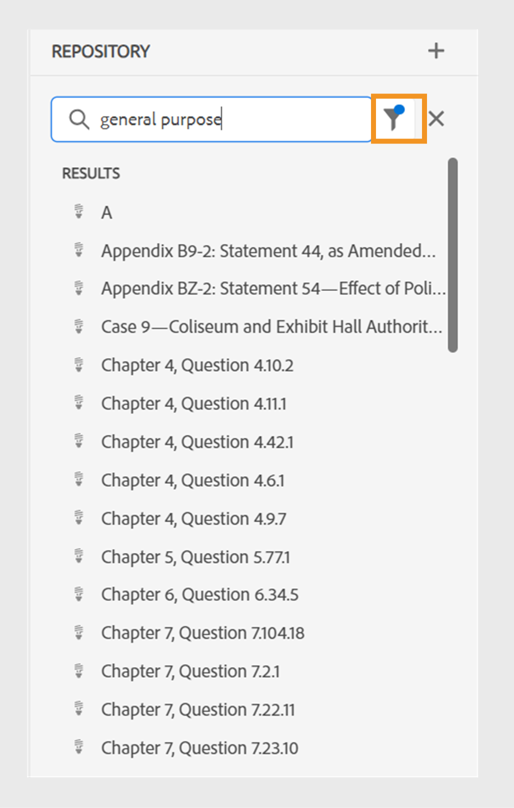

# 2024.4.0 リリースの新機能

この記事では、Adobe Experience Manager Guides 2024.4.0 リリースの新機能と機能強化について説明します。

このリリースで修正された問題のリストについては、 [2024.4.0 リリースの問題を修正しました](fixed-issues-2024-04-0.md).

について [2024.4.0 リリースのアップグレード手順](upgrade-instructions-2024-04-0.md).

## 事前設定済みの言語グループを使用してコンテンツを複数の言語に翻訳する機能

Experience Managerガイドを使用すると、言語グループを作成し、コンテンツを複数の言語に簡単に翻訳できるようになりました。 この機能は、組織のニーズに応じて翻訳を整理および管理するのに役立ちます。

例えば、ヨーロッパの一部の国でコンテンツを翻訳する必要がある場合、英語（EN）、フランス語（FR）、ドイツ語（DE）、スペイン語（ES）、イタリア語（IT）などのヨーロッパ言語の言語グループを作成できます。

{width="300" align="left"}

*ドキュメントを翻訳する言語グループまたは言語を選択します。*

>[!NOTE]
>
>言語のターゲットフォルダーがない場合や、ターゲット言語がソースと同じ場合は、灰色表示になり、警告記号が表示されます。

管理者は、言語グループを作成して、複数のフォルダープロファイルに設定できます。 作成者は、フォルダープロファイルで設定されている言語グループを表示できます。

全体的に、言語グループを作成すると、翻訳プロジェクトの効率と生産性が向上し、最終的には複数の言語にまたがるローカリゼーションプロセスが改善されます。

方法を学ぶ [web エディターからのドキュメントの翻訳](../user-guide/translate-documents-web-editor.md).

## 翻訳後に翻訳プロジェクトを自動的に削除または無効化

管理者は、翻訳が完了した後に翻訳プロジェクトが自動的に無効または削除されるように設定できるようになりました。 この機能を使用すると、翻訳が完了した後に、リソースを効率的に使用し、ファイルを管理できます。

プロジェクトを削除すると、プロジェクトに存在するすべてのファイルとフォルダが完全に削除されます。 翻訳プロジェクトを削除すると、占有ディスク領域を解放することもできます。

翻訳プロジェクトは、後で使用する場合に無効にすることができます。

{width="550" align="left"}

*翻訳プロジェクトの言語グループとクリーンアップ設定を指定します。*

の方法の詳細情報 [翻訳プロジェクトを自動的に削除または無効化](../user-guide/translate-documents-web-editor.md#automatically-delete-or-disable-a-completed-translation-project).

## プレビューインスタンスの一括有効化コレクションでマップの出力を有効化します

これで、パブリッシュインスタンスで一括アクティベーションコレクションの出力をアクティベートする以外に、Cloud ServiceとしてのExperience Managerガイドにも、でアクティベートする機能が用意されました **プレビュー** インスタンス。

この機能を使用すると、コンテンツをプレビューインスタンスに対してアクティブ化できるので、に対してアクティブ化する前に、コンテンツの外観と動作を確認できます **公開** インスタンス。

{width="800" align="left"}

*で、アクティブ化されたマップ出力に関する情報を表示します。**監査履歴**タブ。*

の詳細情報  [一括有効化](../user-guide/conf-bulk-activation-publish-map-collection.md).

## データソースコネクタの機能強化

2024.4.0 リリースでは、データソースコネクタに次の機能強化が行われました。

### Salsify、Akeneo、およびMicrosoft Azure DevOps Boards （ADO） データ ソースに接続します

Experience Managerガイドでは、既存の標準コネクタに加えて、Salsify、Akeneo、およびMicrosoft Azure DevOps Boards （ADO） データソース用のコネクタも提供しています。 管理者は、これらのコネクタをダウンロードしてインストールできます。 次に、インストールされているコネクタを設定します。

### サンプルクエリをコピー&amp;ペーストして、コンテンツスニペットまたはトピックを作成します

サンプルデータクエリをジェネレーターに簡単にコピー&amp;ペーストして、コンテンツスニペットまたはトピックを作成できます。 この機能を使用すると、構文を覚える必要も、手動でクエリを作成する必要もなくなります。 クエリを手動で入力する代わりに、サンプルクエリをコピーして貼り付け、編集し、必要に応じて使用してデータを取得できます。

{width="800" align="left"}

*サンプルクエリをコピーして編集し、コンテンツスニペットを作成します。*

### ファイルコネクタを使用した JSON データファイルへの接続

管理者は、JSON ファイルコネクタを設定して、JSON データファイルをデータソースとして使用できるようになりました。 コネクタを使用して、コンピューターまたはAdobe Experience Manager Assetsから JSON ファイルを読み込みます。 次に、作成者はジェネレーターを使用してコンテンツスニペットやトピックを作成できます。

この機能により、JSON ファイルに保存されたデータを使用し、様々なスニペットで再利用できます。 また、JSON ファイルを更新するたびに、コンテンツも動的に更新されます。

### コネクタに複数のリソース URL を設定して、コンテンツスニペットやトピックを作成する

管理者は、Generic REST Client、Salsify、Akeneo、Microsoft Azure DevOps Boards （ADO）など、一部のコネクタに対して複数のリソース URL を設定できます。

次に、作成者はデータソースに接続し、ジェネレーターを使用してコンテンツスニペットやトピックを作成します。 この機能は、URL ごとにデータソースを作成する必要がないので便利です。 これにより、単一のコンテンツスニペットまたはトピック内の特定のデータソースについて、任意のリソースからデータをすばやく取得できます。

データソースコネクタとその方法の詳細について説明します [ユーザーインターフェイスからのデータソースコネクタの設定](../cs-install-guide/conf-data-source-connector-tools.md).

方法を学ぶ [データソースからのデータの使用](../user-guide/web-editor-content-snippet.md).

## ユーザー環境設定の新しい UI で web エディターのエクスペリエンスをカスタマイズ

この **ユーザー環境設定** web エディターのダイアログボックスに、新しい **外観** タブ。 この新しいタブを使用すると、web エディターインターフェイスで最も一般的なルックアンドフィール環境設定を簡単に設定できます。

タイトルまたはファイル名でファイルを表示するようにを設定したり、アプリケーションのテーマやソースビューを変更したりできます。 また、リポジトリビューで開いているファイルを見つけたり、改行しないスペースを処理したりするための設定を指定する場合にも役立ちます。

{width="550" align="left"}

*好みに応じて外観をカスタマイズします。*

の詳細情報 **ユーザー環境設定** での機能の説明 [左パネル](../user-guide/web-editor-features.md#id2051EA0M0HS) セクション。

## Web エディターのリポジトリ表示で、開いているファイルを見つけます

「」を選択します **常にリポジトリ内のファイルを探す** のオプション **ユーザー環境設定** を使用すると、リポジトリビューでファイルをすばやく移動して見つけることができます。 手動で検索する必要はありません。

また、編集時には、リポジトリ階層内のファイルの場所を簡単に確認できます。

詳しくは、次を参照してください [リポジトリ表示で開いているファイルを見つける](../user-guide/web-editor-edit-topics.md#locate-an-open-file-in-the-repository-view).

## Web エディターでの非改行スペースの処理を改善しました

Experience Manager ガイドを使用すると、Web エディタで文書を編集するときに、改行なしのスペース インジケータを表示できます。 また、非改行スペースの処理も改善されます。
Web エディターでドキュメントの WYSIWYG 表示を保持するために、複数の連続する空白が 1 つのスペースに変換されます。 また、この機能は、ドキュメントの全体的な外観とプロフェッショナリズムを向上させるのに役立ちます。

詳しくは、 [web エディターのその他の機能](../user-guide/web-editor-other-features.md).

## Adobe Experience Manager Assets上の選択したフォルダーに対する後処理を無効にする

管理者は、Experience Manager Assets上の選択したフォルダーに対する後処理と UUID の生成を無効にできるようになりました。 この設定は、特に多くのアセットや複雑なフォルダー構造を処理する場合に役立つ可能性があります。 また、複数のユーザーが互いに干渉することなく、同時にアセットをすばやくアップロードできます。  

フォルダーの後処理を無効にすると、そのすべての子フォルダーにも影響します。 ただし、Experience Managerガイドには、無視されたフォルダー内の個々の子フォルダーに対して後処理を選択的に有効にする機能が追加されました。

方法を学ぶ [フォルダーの後処理を無効にする](../cs-install-guide/conf-folder-post-processing.md).

## リポジトリビューでのファイルの検索とフィルタリングのエクスペリエンスを改善しました

これで、ファイルのフィルタリング時の操作性が向上しました。 ファイルをフィルタリングする機能が改善され、ファイルの検索と移動が簡単になりました。

{width="300" align="left"}

*テキストを含むファイルの検索`general purpose.`*

関連ファイルへの迅速なアクセス、より直感的なユーザーインターフェイスなどのメリットにより、検索エクスペリエンスがよりスムーズかつ効率的になります。

 {width="300" align="left"}

*クイックフィルターを使用して、DITA ファイルと非 DITA ファイルを検索します。*

の詳細情報 **フィルター検索** の機能 [左パネル](../user-guide/web-editor-features.md#id2051EA0M0HS) セクション。

## 位置に応じて有効な要素を表示および挿入するための分離リスト

Web エディターでドキュメントを編集する際に、現在の場所および現在の場所以外で有効な要素の分離されたリストを表示できるようになりました。 必要に応じて、次のオプションから要素を選択します。

* **現在の場所での有効な要素** 現在のカーソル位置に挿入できます。
* **現在の場所以外の有効な要素** 要素階層内の現在の要素の親の後に挿入できます。

{width="300" align="left"}

*有効な要素の分類リストを表示して、現在の場所に要素を挿入します。*

この有効なエレメントの分割リストを使用すると、コンテンツ構造を維持し、DITA 標準に準拠することができます。

の詳細情報 **要素を挿入** の機能 [セカンダリツールバー](../user-guide/web-editor-features.md#2051ea0j0y4) セクション。

## コンテンツプロパティタイプは、ドロップダウンメニューとして表示されます

ここで、コンテンツのプロパティ **タイプ** ドロップダウンメニューとして表示されます。 ドロップダウンから、現在のタグの階層全体のタグを表示して選択できます。

このドロップダウンメニューを使用すると、階層構造内の関連するタグにすばやくアクセスできます。

{width="300" align="left"}

*現在のタグの階層からタグを選択します。*

の詳細情報 **コンテンツのプロパティ** の機能 [右パネル](../user-guide/web-editor-features.md#id2051eb003yk) セクション。

## マップ エディタからファイルを一括でチェックする際のパフォーマンスが向上しました

Experience Manager ガイドを使用すると、マップ エディタからのバルク ファイルのチェックイン機能のパフォーマンスと操作性が向上します。 この機能強化により、ファイルを一括でより迅速にチェックインできるようになりました。
ファイルのチェックイン操作の進行状況は、 **新しいバージョンとして保存してロックを解除** ダイアログが表示されます。 最後に、操作が完了し、選択したすべてのチェックアウト済みファイルがチェックインされると、成功メッセージが表示されます。

{width="300" align="left"}

*マップ エディタから一括でチェックされたファイルのリストとステータスを表示します。*

方法を学ぶ [高度なマップエディターの操作](../user-guide/map-editor-advanced-map-editor.md)

## DITA-OT による出力の生成時に一時ファイルをダウンロード

また、DITA-OT を使用してAEM サイト、HTML、カスタム、JSON、またはPDF出力を公開する際に生成された一時ファイルをダウンロードすることもできます。 この機能は、出力生成プロセス中に発生する可能性のある問題を分析し、効果的なトラブルシューティングを行うのに役立ちます。  
DITA-OT を使用して生成された出力に渡されたメタデータプロパティを選択した場合は、metadata.xml ファイルをダウンロードすることもできます。 

プリセットについて詳しくは、 [出力プリセットについて](../user-guide/generate-output-understand-presets.md).

## マイクロサービスベースの公開用に IMS JWT 資格情報を IMS OAuth 資格情報に置き換えます。

サービスアカウント（JWT）資格情報は廃止され、に置き換わりました **OAuth サーバー間** 資格情報。 サービスアカウント（JWT）資格情報を使用するアプリケーションは、2025 年 1 月 1 日（PT）以降は機能しなくなります。 アプリケーションが引き続き機能するように、2025 年 1 月 1 日までに新しい資格情報に移行する必要があります。

Experience Managerガイド用の Cloud Publishing サービスが、Adobe IMS OAuth ベースの認証で保護されるようになりました。 方法を学ぶ [oauth 認証を使用したマイクロサービスベースのパブリッシングの設定](../knowledge-base/publishing/configure-microservices-imt-config.md).
