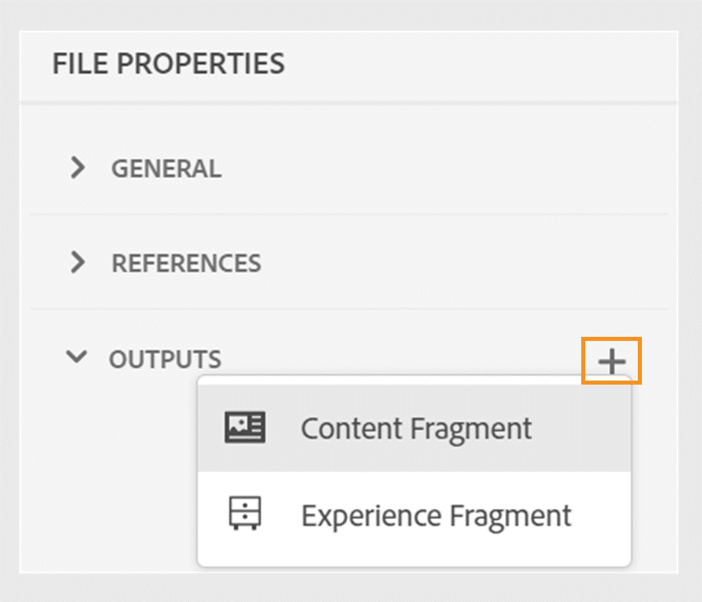
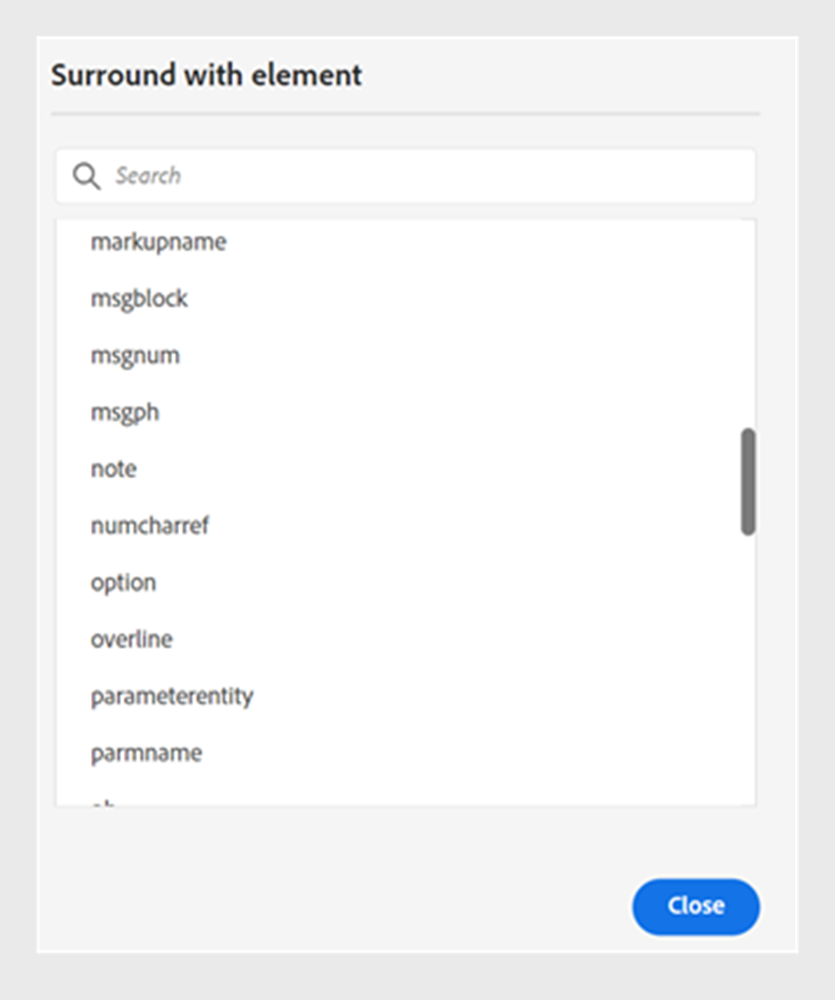

# 2024.06.0 リリースの新機能

この記事では、Adobe Experience Manager Guidesの2024.06.0 リリースの新機能と強化機能について説明します。

このリリースで修正された問題の一覧については、[2024.06.0リリースで修正された問題](fixed-issues-2024-06-0.md)を参照してください。

2024.06.0 リリース [&#128279;](upgrade-instructions-2024-06-0.md)の アップグレード手順について説明します。

## トピックまたはその要素をエクスペリエンスフラグメントに公開する

エクスペリエンスフラグメントとは、Adobe Experience Manager内でコンテンツとレイアウトを統合するモジュール式のコンテンツユニットです。 エクスペリエンスフラグメントは、一貫性のある魅力的なエクスペリエンスを構築し、複数のチャネルをまたいでさらに再利用するのに役立ちます。

Experience Manager Guidesでは、トピックまたはそのエレメントをエクスペリエンスフラグメントに公開できるようになりました。 エクスペリエンスフラグメント内のトピックとその要素の間に、JSON ベースのマッピングを作成できます。 例えば、ブランディング要素、プロモーションバナー、顧客の声、イベントプロモーションを含むヘッダーやフッター用のエクスペリエンスフラグメントを作成できます。

詳しくは、[&#x200B; エクスペリエンスフラグメントの公開](../user-guide/publish-experience-fragment.md)を参照してください。

## コンテンツフラグメント公開の機能強化

Experience Manager Guidesには、コンテンツフラグメントに関する便利な拡張機能も用意されています。

- DITAVAL ファイルまたは条件付き属性を使用して、コンテンツフラグメントに公開する際に、条件を含むコンテンツを簡単にフィルターできます。
- トピックのコンテンツフラグメントは、**ファイルプロパティ**&#x200B;の&#x200B;**出力** セクションで公開および表示することもできます。

{width="300"}

詳しくは、[&#x200B; コンテンツフラグメントの公開](../user-guide/publish-content-fragment.md)を参照してください。

## トピックファイルプロパティからネイティブのPDF出力にメタデータを渡す機能

Experience Manager Guidesでは、ネイティブのPDF出力を生成しながら、トピックのファイルプロパティからページレイアウトにメタデータを追加できます。 この機能を使用して、タイトル、タグ、説明などのトピック固有のメタデータをページレイアウトに追加します。 トピックのドキュメントの状態に基づいてトピックの背景に透かしを追加するなど、トピックのメタデータに基づいて、公開されたPDFをカスタマイズすることもできます。

 {width="300"}

*ページレイアウトのフィールドにメタデータを追加します。*

ページレイアウトでフィールドとメタデータ [&#128279;](../native-pdf/design-page-layout.md#add-fields-metadata)を追加する方法について説明します。

## 操作のために要素をまたがる部分的なコンテンツを選択します

Experience Manager Guidesを使用すると、Web エディターのエレメント全体でコンテンツを選択する際のエクスペリエンスが向上します。 さまざまな要素からコンテンツを簡単に選択し、太字、斜体、下線などの操作を実行できます。 この機能を使用すると、部分的に選択したコンテンツの書式をシームレスに適用または削除できます。 複数の要素にわたって選択したコンテンツをすばやく削除することもできます。 コンテンツが削除されると、必要に応じて、残りのコンテンツが1つの有効な要素の下に自動的に結合されます。

エレメント間で部分的なコンテンツを選択し、有効なDITA エレメントの下でコンテンツを囲むこともできます。
 {width="300"}

*選択したコンテンツを有効な要素で囲みます。*

全体として、これらの機能強化は、より優れたエクスペリエンスを提供し、ドキュメントの編集中に効率を向上させるのに役立ちます。

詳細については、[要素](../user-guide/web-editor-edit-topics.md#partial-selection-of-content-across-elements)全体のコンテンツの部分選択を参照してください。

## ネイティブ PDF パブリッシングでのMarkdown ドキュメントのサポート

Experience Manager Guidesは、ネイティブのPDF パブリッシングでMarkdown ドキュメントもサポートしています。 この機能は便利で、DITA マップ内のMarkdown ファイルのPDFを生成するのに役立ちます。 PDFのネイティブ公開におけるMarkdown サポートにより、ドキュメントを簡単に作成、管理、共有できます。

詳しくは、「[Markdown ドキュメントのサポート &#x200B;](../web-editor/native-pdf-web-editor.md#support-for-markdown-documents)」をご覧ください。

## 大規模な翻訳プロジェクトのパフォーマンスと拡張性を向上

翻訳機能は、かつてないほど高速かつスケーラブルです。 強化されたパフォーマンスを提供する新しいアーキテクチャが付属しています。 プロジェクトの作成時間が以前よりも短縮され、プロセス中の競合はほとんどなくなりました。 このパフォーマンスの向上により、翻訳を高速化し、大規模な翻訳プロジェクトでもスムーズな操作を実現できます。

この改善は、生産性と全体的な体験を向上させるので、非常に有益です。

Web エディター[&#128279;](../user-guide/translate-documents-web-editor.md)からドキュメントを翻訳する方法について詳しくは、こちらを参照してください。
