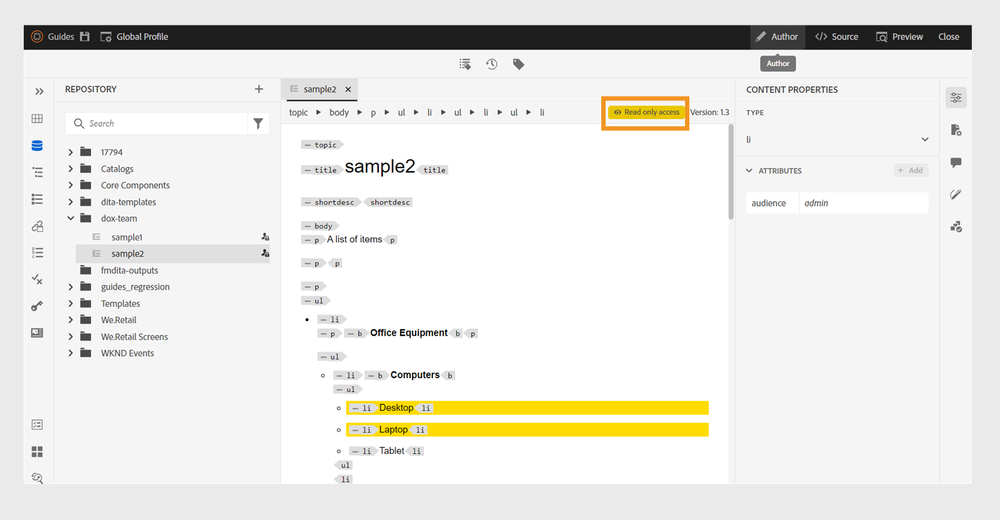

# 2024.10.0 リリースの新機能（2024 年 10 月）

この記事では、Adobe Experience Manager Guidesas a Cloud Serviceの 2024.10.0 リリースで導入された新機能と機能強化について説明します。

このリリースで修正された問題の一覧については、[2024.10.0リリースで修正された問題](fixed-issues-2024-10-0.md)を参照してください。

[2024.10.0 リリースのアップグレード手順 ](../release-info/upgrade-instructions-2024-10-0.md) について説明します。

## 公開機能の強化

2024.10.0 リリースでは、コンテンツの公開が次のように強化されました。

### コンテンツフラグメントの公開の機能強化

Experience Manager Guidesでは、コンテンツフラグメントにいくつかの便利な機能強化も提供しています。

- Experience Manager Guidesでは、トピックやその要素をコンテンツフラグメントに公開できます。

- **ファイルのプロパティ** の「**出力**」セクションから、トピックのコンテンツフラグメントを公開および表示できます。

- コンテンツフラグメントへの公開時に条件でコンテンツをフィルタリングすることで、コンテンツフラグメントのバリエーションを簡単に作成できます。

- 新しいマッピングインターフェイスを使用し、要素を簡単に選択してコンテンツフラグメントに公開できます。

現在は、コンテンツフラグメントを公開すると、完全なコンテンツフラグメントが上書きされるのではなく、マッピングされたコンテンツのみが置き換えられます。 この機能を使用すると、複数のトピックやコンテンツフラグメントエディターなど、複数のソースからのデータをコンテンツフラグメントに含めることができます。

詳しくは、[Publish コンテンツフラグメント ](../user-guide/publish-content-fragment.md) を参照してください。

### 条件フィルターに基づくPublish エクスペリエンスフラグメントのバリアント

Experience Manager Guidesでは、トピックまたはその要素をエクスペリエンスフラグメントに公開できます。 条件または DITAVAL フィルターを使用してエクスペリエンスフラグメントのバリアントを作成し、それらを様々なチャネルや様々なオーディエンスで再利用することもできます。

[Publishエクスペリエンスフラグメント ](../user-guide/publish-experience-fragment.md) の使用方法の詳細情報。

### AEM Sites プリセットが使いやすいように再編成されました

設定が再編成され、出力プリセットを簡単に設定し、AEM Sites出力を生成できるようになりました。
**新規出力プリセット** ダイアログボックスで「**従来のコンポーネントマッピングを使用**」オプションを選択すると、既存のAEM Sites プリセットを作成できます。

AEM Sites プリセットの「**一般**」、「**コンテンツ**」および「**クロスマップ参照**」タブを表示します。
- **一般**：出力を生成するための一般的な設定が含まれます。 サイトと出力パスの指定、既存の出力ページの削除または上書き、以前に生成された削除トピック用のページの削除、デザイン テンプレートの選択、一時ファイルの保持、生成後のワークフローの指定を行うことができます。
- **コンテンツ**：出力生成用のコンテンツに適用される設定が含まれます。 公開するフィルタ、DITA マップのベースライン、およびメタデータプロパティを選択できます。
- **クロスマップ参照**：このリストには、スコープ =&quot;peer&quot;を持つクロスマップ参照を含むトピックが含まれています。 他の DITA マップで使用可能なトピックへの scope=&quot;peer&quot;を使用して、クロスマップ参照のリストの公開コンテキストを指定できます。 このタブは、Experience Manager Guides（UUID）版を使用している場合に表示されます。

### Web エディターでのAEM Sites プリセットからのクロスマップ参照

Experience Manager Guidesの最新の機能強化では、web エディターのAEM Sites プリセットにクロスマップ参照が導入されています。
Experience Manager Guidesのクロスマップ参照は、コンテンツのナビゲーションを改善し、コンテンツの再利用を増やし、ユーザーエクスペリエンスを向上させるのに役立ちます。

scope=&quot;peer&quot;を使用して、他の DITA マップで使用可能なトピックへのクロスマップ参照のリストの公開コンテキストを指定できます。 例えば、マップ A のトピック 1 には、トピック 2 への参照が含まれています。 トピック 2 は、1 つまたは複数のマップに存在できます。  各リンクの親マップと、特定のプリセットまたは最近公開された出力を選択できます。

同じトピックがファイル内で複数回参照される場合は、インスタンスごとに異なる公開コンテキストを追加できます。 これにより、コンテンツの柔軟性と制御が向上します。 たとえば、Topic 3 は Map B と Map C の両方に存在します。Topic 1 には、Topic 3 への 2 つの参照が含まれています。 最初のリンクの親マップとしてマップ B を選択し、2 番目のリンクの親としてマップ C を選択できます。

***AEM Sites**&#x200B;プリセットの「**クロスマップ参照**&#x200B;タブから、リンクされたトピックの公開コンテキストを指定します。*

[AEM Sites プリセット ](../user-guide/generate-output-aem-site.md) の詳細情報。

### HTML5 出力のフラットまたはネストされたファイル階層を選択するオプション

Experience Manager Guidesでは、コンテンツ全体がHTML5 出力フォーマットで公開され、1 つのフォルダーに保存される一時ファイルについて、フラットなフォルダー階層を維持できるようになりました。
ファイル階層をフラット化しない場合、HTML5 の出力はネストされたフォルダー階層で生成されます。 つまり、ファイルがサブフォルダーに整理されたコンテンツの元のフォルダー構造が出力にレプリケートされます。 このネストされたフォルダー階層により、ファイルの編成と分類がより複雑になり、大量のデータの管理と移動が容易になります。

詳しくは、[HTML 5 出力の生成 ](../user-guide/generate-output-html5.md) を参照してください。

## エディターの機能強化

2024.10.0 リリースでは、次のエディターの機能強化が追加されました。

### ロックされたファイルのオーサーモードおよびSourceモードへの読み取り専用アクセス

DITA または Markdown ファイルが別のユーザーによってロックまたはチェックアウトされている場合、コンテンツを編集または変更することはできません。 プレビューの他に、オーサーモードまたはSourceモードで読み取り専用ファイルとして表示することもできます。
読み取り専用モードでは、**オーサー** または **Source** モード内でタグおよび属性と共にコンテンツを表示し、ファイルのプロパティを編集できます。

読み取り専用の DITA マップの **レイアウト** ビューにアクセスすることもできます。
>[!NOTE]
>
> オーサーモード、Source モード、レイアウトモードで読み取り専用ファイルに調和してアクセスできるように、フォルダープロファイル管理者が *ui_config.json* を更新する必要があります。

*ロックされているファイルをオーサーモードおよびSource モードで表示します。*

[ ロックされているファイルをオーサーモードとSource モードで開く ](../user-guide/web-editor-edit-topics.md#open-locked-files-in-author-and-source-modes) 方法を説明します。

### 強化されたコンテンツ組織のグループ化された条件

Experience Manager Guidesで、条件をグループ化し、ネストされた階層内に表示して、1 つのグループに複数の条件を追加できるようになりました。 条件をグループ化すると、コンテンツ全体で条件を整理および適用しやすくなります。

{width="300" align="left"}

**条件** 機能の説明について詳しくは、[ 左パネル ](../user-guide/web-editor-features.md#id2051EA0M0HS) セクションを参照してください。

