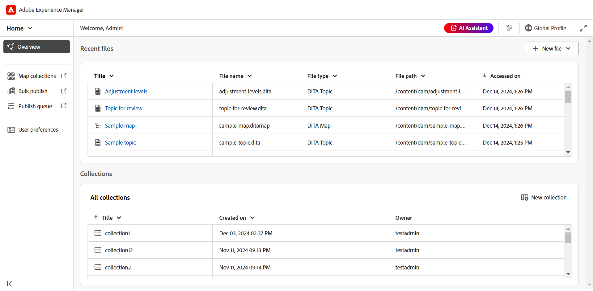
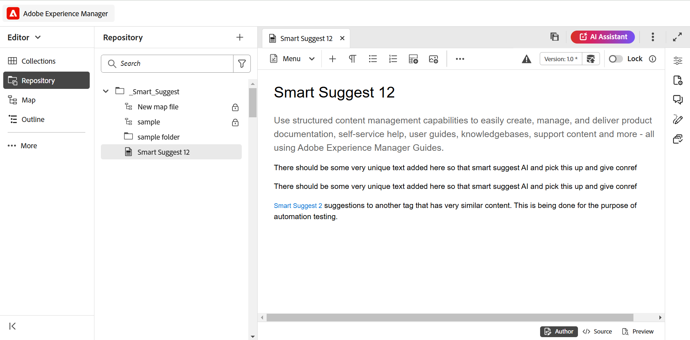
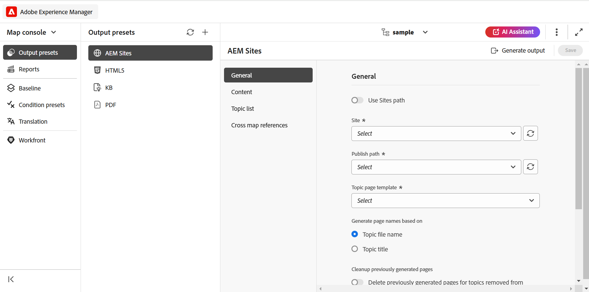
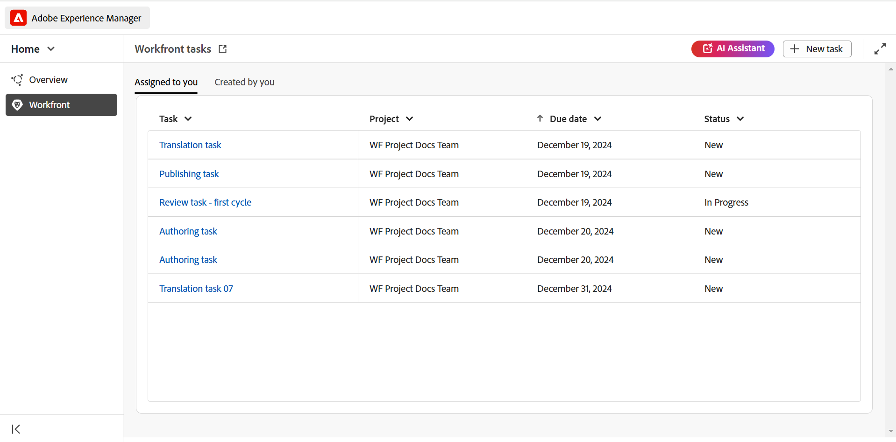
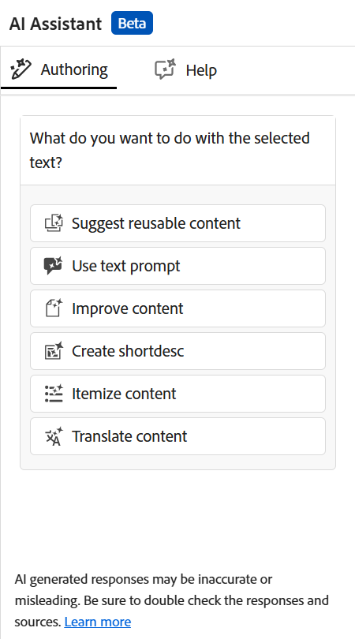
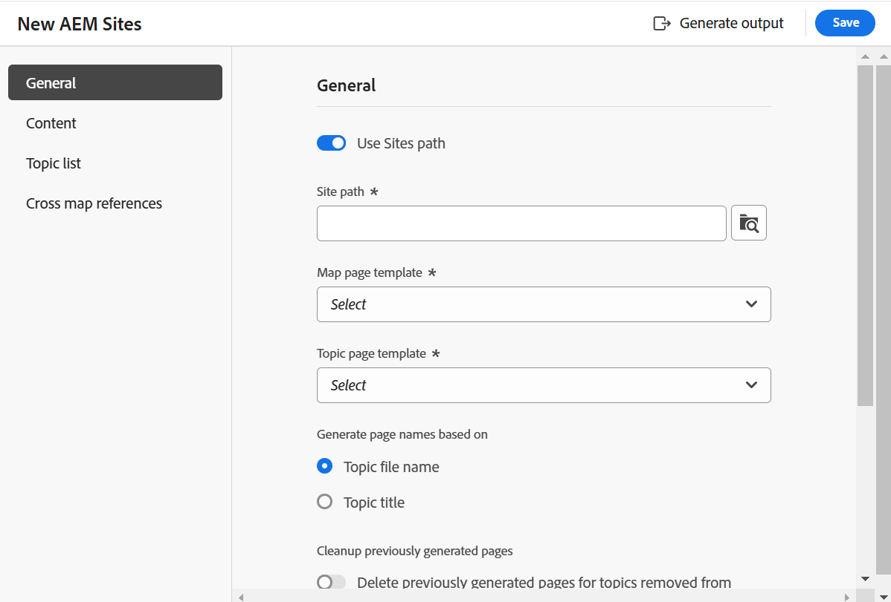
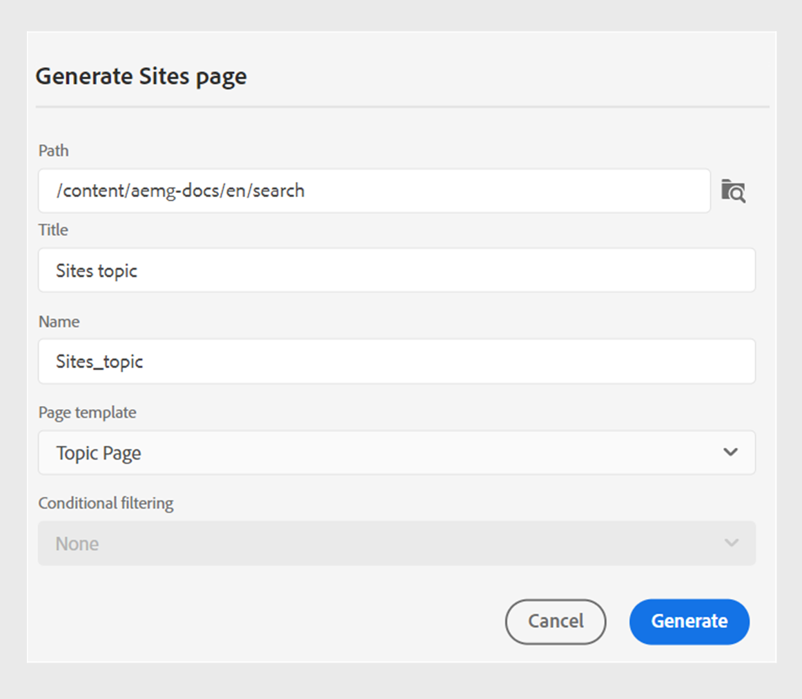
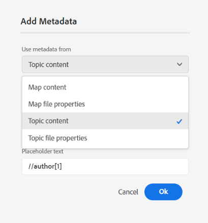
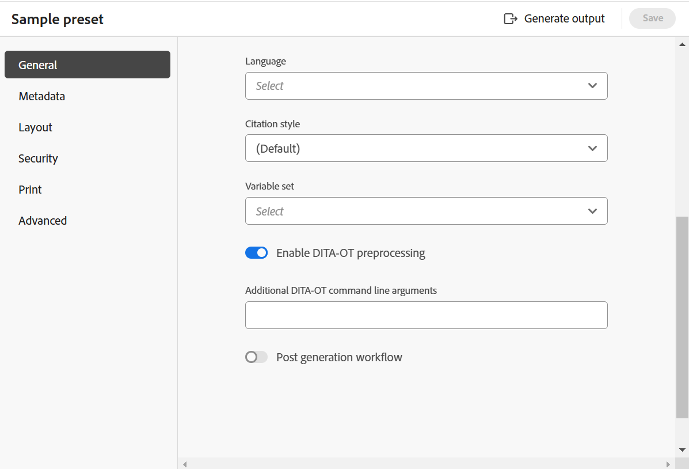

# 2025.02.0 リリース（2025年2月）の新機能

この記事では、Adobe Experience Manager Guides as a Cloud Serviceの2025.02.0 リリースで導入された新機能と強化機能について説明します。

## 生産性とエクスペリエンスを向上させるExperience Manager Guides UIの刷新

Adobe Experience Manager Guidesには、これまでにないスピードと効率で作業できるように刷新されたデザインと強化機能が追加されました。 新しいUIは、直感的で強化されたユーザーエクスペリエンス、まったく新しいホームページ、よりクリーンで整理されたエディターツールバー、専用のマップコンソール、および強化された機能をもたらします。

主なハイライトは次のとおりです。

- **ホームページの紹介**: Experience Manager Guidesには、最近アクセスしたファイルやコレクションなどを簡単に確認できる、直観的なウェルカム画面エクスペリエンスを提供するホームページが追加されました。

  詳しくは、[Adobe Experience Manager Guides ホームページのエクスペリエンス &#x200B;](../user-guide/intro-home-page.md)を参照してください。

  {width="800"}

- **新しいエディターのエクスペリエンス**：新しい外観でエディターを体験してください。 刷新されたエディターインターフェイスは、よりクリーンで整理されたツールバー、シームレスなナビゲーション、全体的に直感的なエクスペリエンスを特徴とし、ドキュメントをより迅速かつ効率的に作成するのに役立ちます。

  [&#x200B; エディター機能について](../user-guide/web-editor-features.md)を理解します。

  {width="800"}

- **専用マップコンソール**：すべてのマップ管理機能と公開機能が組み込まれた専用コンソールであるマップコンソールの紹介。 単一のインターフェイスから、出力の生成、コンテンツの翻訳、レポートの作成などをおこなえます。

  [&#x200B; マップの管理と公開](../user-guide/map-console-overview.md)について詳しく説明します。

  {width="800"}

## Adobe Workfrontと統合し、堅牢な作業管理機能を実現

Experience Manager Guidesは、Adobe Workfrontとシームレスに統合されたため、Experience Manager GuidesのCCMSのコア機能に加えて、堅牢なプロジェクト管理機能も利用できます。

Experience Manager Guidesから直接、Adobe Workfrontのタスクを作成、管理できます。 例えば、作成者はExperience Manager Guides インターフェイス内でレビュータスク（1つ以上のDITA トピックまたはマップが追加された状態）を直接作成し、レビューアーに割り当てることができます。 レビュアーは、Experience Manager Guides レビューUIで割り当てられたタスクに作業し、コメントを付けて作成者に返すことができます。 同様に、公開と翻訳のタスクを作成し、それを作業する必要があるユーザーに割り当てることができます。

また、この統合により、作業キューを監視し、整理され、すべてのタスク（割り当てられたタスク）を把握できるようになります。 また、プロジェクトマネージャーは、Adobe Workfrontの強力な機能を活用し、Experience Manager Guides内の詳細なプロジェクトを管理できます。

詳しくは、[Workfrontとの連携](../user-guide/workfront-integration.md)を参照してください。

{width="800"}

## AI アシスタント（Beta）のスマートオーサリング機能とヘルプ機能で生産性を向上

現在は、Experience Manager GuidesのAIを活用したスマートオーサリングとヘルプ機能で、生産性が向上しています。 AI アシスタントにより、スマートなオーサリング機能とスマートな提案により、既存のリポジトリのコンテンツを再利用し、効率を向上できます。 スマートヘルプを使用すると、Experience Manager Guidesの機能やワークフローなどに関する質問に対する適切な回答をすばやく見つけることができます。

詳しくは、[Experience Manager GuidesのAI アシスタント &#x200B;](../user-guide/ai-assistant.md)を参照してください。

{width="300"}

## 新しいAEM Sites パブリッシングエンジンの高速化とスケーラビリティ

まったく新しい公開エンジンであるAEM Sitesでは、高速かつスケーラブルな公開が可能です。ページ作成とレンダリングを高速化する複合コンポーネントマッピングで最適化されています。 AEM テンプレートエディターを使用して、必要に応じてカスタマイズできる、新しい編集可能なテンプレートを利用できます。 WCM コアコンポーネントと専用のGuides コンポーネントを組み合わせて使用することで、エンドユーザーがAEM Sitesページで最高の体験を得られるようにします。 また、既存のテンプレートをカスタマイズして、この新しい公開エンジンの力を活用することもできます。

[AEM Sites パブリッシング &#x200B;](../user-guide/generate-output-aem-site-web-editor.md)の詳細をご覧ください。

{width="500"}

## 単一のトピックを公開して、スタンドアロンコンテンツをAEM Sitesにシームレスに公開

AEM Sites ページへのシングルトピックパブリッシング機能を導入しました。マップ全体をパブリッシュしなくても、個々のトピックをAEM Sites ページに直接公開できます。  これにより、公開プロセスが合理化され、マーケティングコンテンツ、技術情報、その他のスタンドアロンコンテンツなどのスタンドアロンコンテンツを扱う際の効率が向上します。 また、単一のトピックを公開するためのマップを作成する必要がなくなるため、コンテンツのメンテナンスも簡素化されます。

詳しくは、[AEM Sites ページの公開](../user-guide/publish-aem-sites.md)を参照してください。

{width="500"}

## まったく新しいMarkdown エディターで、リッチなオーサリング体験を実現

マークダウンのトピックをよりクリーンで効率的、かつ強力に作成する方法を紹介します。 Experience Manager Guidesは、よく整理されたツールバーと高度な機能を備えた新しいMarkdown エディターインターフェイスを導入します。これには、コンテンツを同時にオーサリングおよびプレビューするための&#x200B;**並べて**&#x200B;表示が含まれます。 また、マップの一部であるMarkdown トピックを複数のチャネルにシームレスに公開することもできます。

詳しくは、[Markdown オーサリング &#x200B;](../user-guide/web-editor-markdown-topic.md)を参照してください。

{width="800"}

## エディターの機能強化

新しいリリースの一部として、次のエディターの機能強化が行われました。

**テーブル挿入の機能強化**

- 表またはシンプルな挿入ダイアログのヘッダー行、ボディ行および列のデフォルト値を設定する機能。
- 外部ソースからコピーしたテーブルをシンプルまたはテーブルとして貼り付けるようにテーブル設定を設定できます。

  詳細については、[&#x200B; エディター機能の詳細](../user-guide/web-editor-features.md#content-insertion-options)の「テーブル」セクションを参照してください。

**DITA要素のわかりやすい名前機能を強化**

DITA エレメントのわかりやすい名前の機能が改善されました。 これで、親しみやすい名前をエレメントに割り当てると、デフォルトの列挙値が保持され、更新された名前がパンくずリスト、コンテンツプロパティ、再利用可能なコンテンツパネル、用語集パネルおよびその他の関連する場所に反映されるようになりました。

**フィルター検索のエクスペリエンスの強化**

Adobe Experience Manager Guides リポジトリでのフィルターされた検索結果のアセット表示制限が強化されました。 これで、検索条件に一致するすべての関連アセットまたはファイルが検索結果に表示されるようになりました。 リストをスクロールしてより多くの結果を読み込み、必要なアセットを見つけるために繰り返し検索する必要がなくなります。

**画像の代替テキストが要素として追加されました**

最新のDITA規格に従って、画像で代替テキストに`<alt>`要素が使用されるようになりました。 代替テキストに`@alt`属性を使用することは推奨されませんが、以前のDITA バージョンでは引き続きサポートされています。

**エディターツールバーでの相互参照のカスタマイズ**

次に、**相互参照**&#x200B;用のカスタムツールバーボタンを作成して、メニューオプションの1つに直接アクセスします。 例えば、このオプションを設定して、web リンク、電子メールリンク、ファイル参照またはその他の使用可能なオプションに直接ジャンプできます（要件に応じて）。

詳細については、[&#x200B; トップバーとツールバーのカスタマイズ &#x200B;](../guides-ui-extensions/customisations/toolbar-topbar.md)を参照してください。

## 機能強化を見る

2025.02.0 リリースでは、次のレビューの機能強化が行われました。

- レビュータスクを作成する際に、プロジェクト名を入力して、プロジェクト ドロップダウンリストでプロジェクト名をすばやく見つけて選択できるようになりました。 これにより、長いプロジェクトリストをスクロールする必要がなくなり、複数のプロジェクトを管理する場合に、レビュータスクをより迅速かつ効率的に割り当てることができるようになりました。

- エディターとレビューUIで、レビュー&#x200B;**返信** ボックスが複数行のエントリをサポートするようになりました。 **Shift**+**Enter**&#x200B;を使用して、次の行に移動できます。 コメントの書き込み中にコメントボックスを展開することもできます。

  詳細については、[&#x200B; トピックのレビュー](../user-guide/review-topics.md)を参照してください。

- レビュータスクが閉じられていても、作成者はエディターでレビューコメントにアクセスできるようになりました。 最新の機能強化により、レビューパネルには、エディター内の各プロジェクトのアクティブなレビュータスクとクローズされたレビュータスクの両方が表示されます。 閉じたレビュータスクを選択すると、対応するコメントが右側のコメントパネルに表示され、タスクを閉じた後でも重要なレビューコメントに継続的にアクセスできます。

  詳細については、[&#x200B; エディター機能について](../user-guide/web-editor-features.md)の「レビュー」セクションを参照してください。

## 公開の機能強化

新しいリリースの一部として、次の公開の機能強化が行われました。

**ネイティブ PDFの機能強化**

- ネイティブ PDF出力を生成する際に、トピックの`prolog`要素（著作権、作成者、その他の詳細など）のメタデータをページレイアウトに含める機能。 これにより、生成されたPDFがより詳細になり、重要なコンテキストが提供されるため、読者にとってより有益なものになります。

  詳細については、[&#x200B; ページレイアウト &#x200B;](../native-pdf/design-page-layout.md#add-fields-and-metadata-add-fields-metadata)でフィールドとメタデータを追加するを参照してください。

  {width="300"}

- ネイティブ PDF出力のDITA-OT前処理を有効または無効にするオプションを導入しました。 コンテンツの処理中にDITA-OT ベースの正規化またはカスタム DITA-OT プラグインが必要な場合は、このオプションを有効にします。 これにより、PDF生成時にコンテンツがどのように処理されるかを、より詳細に制御できるようになります。 デフォルトでは、設定は&#x200B;**有効**&#x200B;に設定されています。

  詳しくは、[PDF出力プリセットの操作](../user-guide/generate-output-pdf.md)を参照してください。

  {width="500"}

- ネイティブ PDF出力の印刷設定は、**テンプレート**&#x200B;設定から&#x200B;**ネイティブ PDF出力プリセット**&#x200B;に変更され、使いやすくなりました。 カラープロファイルなど、異なる印刷設定を持つオンラインおよび印刷PDFに同じテンプレートを使用できるようになりました。

  詳しくは、[&#x200B; ネイティブ PDF出力プリセット &#x200B;](../web-editor/native-pdf-web-editor.md)を参照してください

- ネイティブPDF出力に目次ページのブックマークを追加して、特に長いPDFでシームレスにページナビゲーションを行うことができます。

  詳しくは、[PDF出力にカスタムブックマークを追加](../native-pdf/add-custom-bookmark.md)を参照してください。

## コンテンツ管理の強化

新しいリリースの一環として、次のコンテンツ管理の機能強化が行われました。

**レポートのカスタムメタデータフィールド**

この機能を使用すると、**設定**&#x200B;を通じてレポートのカスタムメタデータフィールドを設定できます。 設定が完了したら、レポートのフィルターパネルで&#x200B;**列**&#x200B;の下にこれらのフィールドを表示できます。このフィールドを選択または選択解除して、表示を制御できます。

詳しくは、マップコンソール [&#128279;](../user-guide/reports-web-editor.md)のDITA マップレポートを参照してください。

**翻訳UIの更新ボタン**

翻訳UIに更新ボタンが導入されました。更新されたファイルとステータスで翻訳ダッシュボードを更新できます。

**アセット後処理ワークフローの強化**

アセットの後処理のサポートは、REST APIとAPI SDKを介して提供されています。 これで、アセット処理イベントがトリガーされ、さらにワークフローを定義するためにリッスンできるようになります。

詳しくは、[後処理イベントハンドラー](../api-reference/post-process-event.md)を参照してください。

## 廃止される機能

**クイック生成**

Experience Manager Guidesでは、リポジトリビューまたはマップビューから直接出力を生成する&#x200B;**クイック生成**&#x200B;機能がサポートされなくなりました。

この機能は、リポジトリパネルとマップビューパネルの両方から削除されました。 すべてのマップ管理および関連アクションの公開には、**マップコンソール**&#x200B;を使用することをお勧めします。

詳細については、[&#x200B; マップ管理と公開](../user-guide/map-console-overview.md)を参照してください。

**ルート マップ メタデータ引数をDITA-OT コマンド ラインに渡す**

ルートマップメタデータ引数をDITA-OT コマンドラインを通じて渡す機能は、リリースの一部として廃止されました。 次に、プリセットの&#x200B;**ファイルプロパティ**&#x200B;または&#x200B;**メタデータ** フィールドを使用して、必要なDITA-OT メタデータを渡すことをお勧めします。

DITA-OT コマンドラインでメタデータを引き続き渡すには、`Config.Manager`で`pass.metadata.args.cmd.line`を更新する必要があります。

詳細については、[出力生成設定の設定](../cs-install-guide/conf-output-generation.md#configure-the-dita-ot-command-line-argument-field-to-accept-root-map-metadata)を参照してください。
