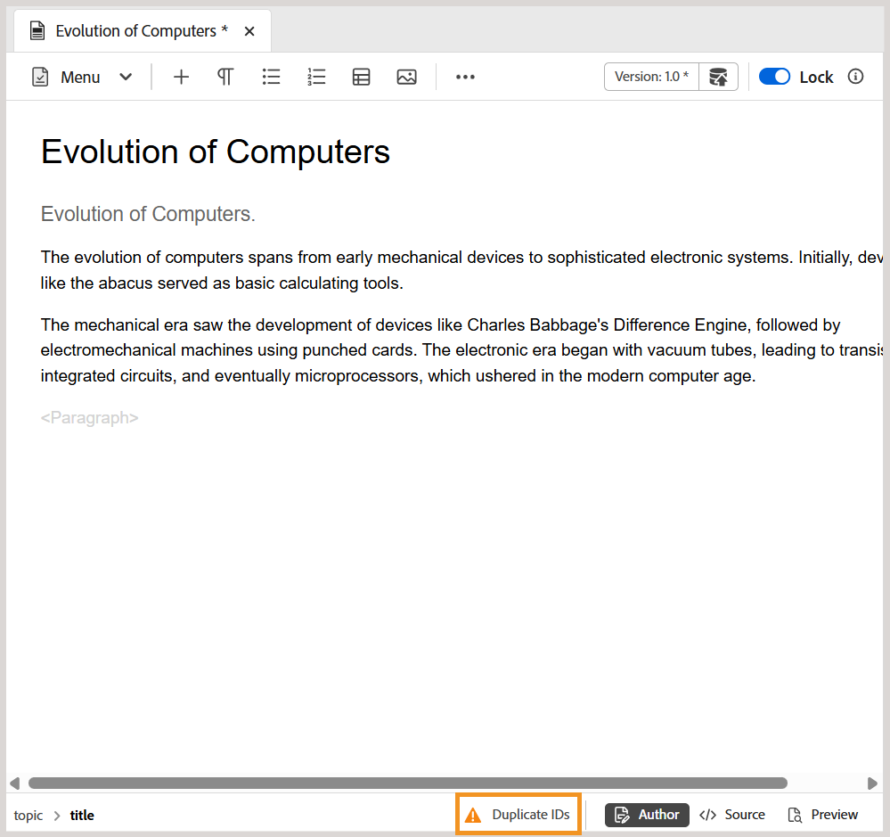

# 2025.10.0 リリースの新機能（2025 年 10 月）

この記事では、Adobe Experience Manager Guides as a Cloud Service 2025.10.0 リリースで導入された新機能と機能強化について説明します。

このリリースで修正された問題の一覧については、[2025.10.0リリースで修正された問題](fixed-issues-2025-10-0.md)を参照してください。

[2025.10.0 リリースのアップグレード手順 ](../release-info/upgrade-instructions-2025-10-0.md) について説明します。

## エディター設定の名前がWorkspace設定に変更され、ホームページからアクセスできるようになりました

ナビゲーションと操作性を向上させるために、次の機能強化が導入されました。

- Experience Manager Guidesの **Editor settings** の名前は、**Workspace settings** に変更されました。
- 以前はエディターとマップのコンソールインターフェイスでのみ使用できた **その他のアクション** メニュー（3 ドットメニュー）に、[ ホームページ ](../user-guide/intro-home-page.md) からアクセスできるようになりました。

  

## オーサービューでトピックおよびマップの重複 ID を簡単に識別して修正できます

Experience Manager Guidesのエディターに「**重複 ID**」ボタンが含まれるようになりました。このボタンを使用すると、1 つのトピックまたはマップ内に存在する重複 ID をすばやく特定して修正できます。 重複した ID が検出されると、このボタンは、**オーサー** ビューのエディターインターフェイスの左下に表示されます。 このボタンを選択すると、ID が重複するすべてのインスタンスのリストがポップオーバーに表示されます。 インスタンスを選択すると、トピックまたはマップ内の対応するコンテンツがハイライト表示され、右側のパネルから重複 ID を見つけて修正できます。

詳しくは、[ エディターのその他の機能 ](../user-guide/web-editor-other-features.md) を参照してください。

{width="350" align="left"}

## リポジトリーおよびレポートフィルターの機能強化

リポジトリの詳細フィルタの **ロック者** フィルタと、DITA マップレポートの **作成者** フィルタは、スクロールすると、一度にすべてではなく、徐々にユーザーリストを読み込むようになりました。 このページ分割された読み込みにより、速度が向上し、大規模なユーザーデータセットの操作がより効率的かつシームレスになります。

## レビューパネルからレビュータスクのステータスに直接アクセス

レビュータスクの開始者は、レビュータスクのステータスをレビューパネルから直接確認できるようになりました。 最新の機能強化では、レビューパネル内の **タスクを更新** ダイアログに、新しい **レビューステータスを確認** オプションが含まれています。 このオプションを選択すると、レビューダッシュボードに直接移動し、各レビュー担当者のタスクステータスを表示できるので、コンテキストを切り替える必要なく、タスクの進捗にすばやくアクセスできます。

詳しくは、[ 作成者としてレビュータスクを再レビューをリクエストまたは閉じる ](../user-guide/review-close-review-task.md) を参照してください。

{width="350" align="left"}

## フォルダーまたはアセットの後処理ステータスを追跡する API

個々のアセットおよびフォルダーの後処理ステータスをトラッキングする新しい API が使用できるようになりました。 これは、コンテンツが完全に処理された後でのみ公開する必要がある自動ワークフローを使用するチームで特に便利です。 この API は、準備が完了したことを確認する信頼性の高い方法を提供し、不完全な処理が原因で発生する公開エラーのリスクを軽減します。

また、この API の導入により、アセット後処理イベントは自動的には実行されません。 代わりに、管理者は、`fmdita config manager` の設定を使用してこのイベントを有効にできるようになりました。

詳しくは、以下を参照してください。

- [個々のアセットおよびフォルダーの後処理ステータスを追跡する API](../api-reference/track-post-processing-status.md)
- [fmdita 構成マネージャーの後処理イベント ハンドラー設定](../api-reference/post-process-event.md)

