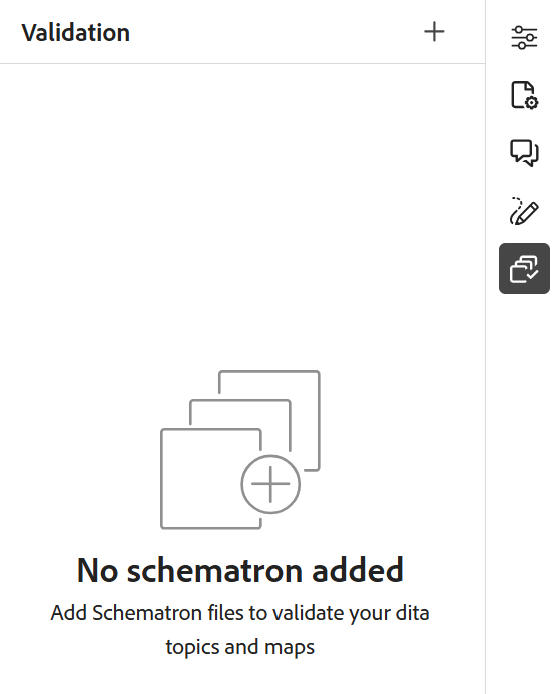

# 2026.03.0 リリース（2026年3月）の新機能

この記事では、Adobe Experience Manager Guides as a Cloud Serviceの2026.03.0 リリースで導入された新機能と強化機能について説明します。

このリリースで修正された問題の一覧については、[2026.03.0リリースで修正された問題](fixed-issues-2026-03-0.md)を参照してください。

2026.03.0 リリース [の](../release-info/upgrade-instructions-2026-03-0.md) アップグレード手順について説明します。

## Adobe Experience Manager Guidesの製品トレーニングと学習コンテンツの紹介

Experience Manager Guidesの&#x200B;**製品トレーニングと学習** コンテンツ機能を使用すると、トレーニングチームとインストラクショナルデザイナーは、Experience Manager Guides インターフェイスから直接インタラクティブなe ラーニングコースを構築できます。

テンプレート駆動型のオーサリング、インタラクティブなコースコンポーネント、評価のサポートにより、組織の目標に沿った高品質なトレーニングコンテンツを開発することができます。

>[!NOTE]
> 
> Experience Manager Guides as a Cloud Serviceのすべてのインスタンスでは、製品トレーニングと学習コンテンツ機能がデフォルトで無効のままになります。 管理者は、**Workspace settings** > **General**&#x200B;から、フォルダープロファイルレベルでこの機能を有効にできます。

主な機能は次のとおりです。

- 学習コンテンツの一元管理
- テンプレート駆動型オーサリング
- コンテンツの再利用のサポート
- 評価の作成と管理
- web ベースのレビューワークフロー
- 業界をリードする翻訳管理
- すぐに使えるSCORMおよびPDF出力フォーマットを使用したマルチチャネルパブリッシング

詳しくは、[入門ガイド &#x200B;](../learning-content/course-overview.md)および[設定ガイド &#x200B;](../lc-config-guide/introduction.md)を参照してください。

## エディターの機能強化

このリリースの一環として、次のエディターの機能強化が行われました。

### Schematron検証パネルの機能強化

Schematronのユーザーインターフェイスに次の機能強化が加えられ、より明確で使いやすく、検証結果が向上しました。

- 検証パネルでは、Schematron ファイルが追加されていないときに空の状態のメッセージが表示され、次の手順をより明確にし、方向を示します。

  {width="350" align="left"}
- 複数のSchematron ファイルを追加すると、統合アコーディオンの下に整理され、設定されたSchematron ファイルをより可視化できます。

  {width="350" align="left"}
- Schematron ファイルで定義されたロール属性に基づいて、検証結果は`Fatal`、`Error`、`Warn`、または`Info`に分類されるようになりました。 各カテゴリには、見えるカウントと、より明確な解釈のためのコンテキストのツールヒントが含まれています。

  {width="350" align="left"}

Experience Manager GuidesでのSchematron ファイルの使用について詳しくは、[Schematron ファイルのサポート &#x200B;](../user-guide/support-schematron-file.md)を参照してください。

### 翻訳言語のコピーは、エディターインターフェイスの右側のパネルで使用できるようになりました

新しい&#x200B;**翻訳** セクションが、エディターの&#x200B;*ファイルプロパティ*&#x200B;の右側のパネルで使用できるようになりました。 このセクションでは、現在開いているアセット（マップ、トピック、画像など）のすべての利用可能な言語コピーに直接アクセスできます。 これらの言語コピーを表示またはアクセスするために、Assets UIに移動する必要がなくなりました。

{width="350" align="left"}

言語コピーごとに、ファイルにカーソルを合わせてリポジトリ内のパスを見つけるか、ファイルを選択してエディターで開くことができます。 ファイルを開くだけでなく、**オプション** メニューを使用して多くのアクションを実行することもできます。 実行できるアクションには、編集、プレビュー、UUIDのコピー、パスのコピー、コレクションへの追加、プロパティなどがあります。

詳細については、[&#x200B; エディターの右側のパネル &#x200B;](../user-guide/web-editor-right-panel.md#file-properties)を参照してください。

### すべてのJournal フィールドで引用を検索する

これで、*引用を追加* ダイアログの&#x200B;*任意フィールド* オプションを使用して、*タイトル*、*ジャーナル タイトル*、*作成者*、*年*、*ボリューム*、**番号**、**ページ**&#x200B;など、すべてのジャーナル フィールドで引用を検索できるようになりました。 検索では、入力したテキストに基づいて、最も近い一致する引用が返されます。

Experience Manager Guidesでの引用の追加について詳しくは、[&#x200B; コンテンツでの引用の追加と管理](../user-guide/web-editor-apply-citations.md)を参照してください。

{width="350" align="left"}

## 機能強化を見る

このリリースのレビュー機能では、次の機能強化を利用できます。

- レビュータスクへのレビューアーの割り当てが、アクティブなプロジェクト選択に依存するようになりました。 「**レビュータスクを作成**」ページの「*割り当て*」フィールドは、アクティブなプロジェクトが選択されるまで無効のままです。 プロジェクトを選択すると、**割り当て先** フィールドが有効になり、そのプロジェクトに関連付けられているユーザーとユーザーグループのみが一覧表示されます。 これにより、レビュータスクは有効なプロジェクトメンバーにのみ割り当てられ、意図しないレビューアーの選択を防ぐことができます。

  

- 「**割り当て**」フィールドで先行検索がサポートされるようになりました。テキストを入力してユーザーまたはユーザーグループをすばやく見つけることができます。

これらの機能強化により、レビュー担当者の選択がより正確かつ効率的になり、プロジェクト固有のレビューワークフローとの連携が強化されます。

詳細については、[&#x200B; レビュー用にトピックを送信](../user-guide/review-send-topics-for-review.md)を参照してください。

## アセット管理の強化

このリリースでは、アセット管理に次の機能強化が導入されています。

### フラット化ファイル階層を使用して、元のファイル名と関連するメタデータを含むマップをダウンロードします

これで、ファイル階層を統合オプションを使用して、元のファイル名のマップをダウンロードできます。 さらに、ダウンロードされたパッケージには`metadata.json` ファイルが含まれているため、関連するメタデータにExperience Manager Guides外で簡単にアクセスして再利用できます。

Experience Manager Guidesでのファイルのダウンロードについて詳しくは、[&#x200B; ファイルのダウンロード &#x200B;](../user-guide/authoring-download-assets.md)を参照してください。

### 正規表現を使用して後処理を有効または無効にする

正規表現を使用して、フォルダーの後処理を有効または無効にできるようになりました。 この機能強化により、管理者は、個々のフォルダーパスを指定するのではなく、単一の設定を使用して、複数のフォルダーまたはフォルダー階層全体に適用される後処理ルールを定義できます。

詳細については、[正規表現を使用して後処理を有効または無効にする](../cs-install-guide/conf-folder-post-processing.md#use-regex-to-enable-or-disable-post-processing)を参照してください。
