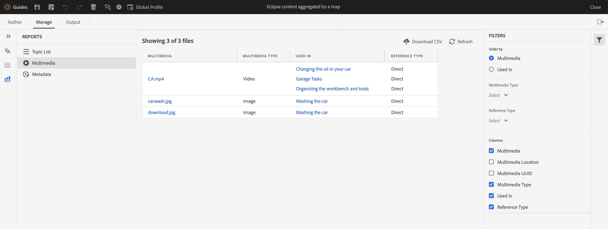

# Adobe Experience Manager Guides 4.2.1 リリースの新機能（2023 年 5 月）

この記事では、Adobe Experience Manager Guides（後で *AEM Guides* と呼ばれます）のバージョン 4.2.1 の新機能および拡張機能について説明します。

アップグレードの手順、互換性マトリックス、およびこのリリースで修正された問題について詳しくは、[&#x200B; リリースノート &#x200B;](release-notes-4-2-1.md) の記事を参照してください。

## Web エディターからAEM ホームページに移動します。

Web エディターからAEM ナビゲーションページに簡単に移動できるようになりました。

{width="800" align="left"}

* **ガイド** アイコン（）をクリックして、AEM ナビゲーション ページに戻ります。

詳しくは、[AEMのナビゲーションページ &#x200B;](../user-guide/web-editor-launch-editor.md#id2056BG00RZJ) を参照してください。

## PDF公開での高度なメタデータのサポート

AEM Guidesでは、PDF出力のメタデータにマッピングされるメタデータの高度なサポートが提供されるようになりました。 メタデータオプションには、作成者の名前、ドキュメントのタイトル、キーワード、著作権情報、その他のデータフィールドなど、ドキュメントとその内容に関する情報が含まれます。

XMP ファイルを読み込むと、AEM Guidesがファイルから情報を選択できます。 また、ドロップダウンを使用してメタデータの名前と値を指定することもできます。 名前フィールドに直接入力してカスタムメタデータを追加することもできます。

詳しくは、「**PDF出力プリセットの作成 [&#x200B; の** メタデータ &#x200B;](../web-editor/native-pdf-web-editor.md) 機能説明を参照してください。

### [ アウトライン ビューの拡張 ] パネル

AEM Guidesでは、改善されたアウトラインビューパネルが提供され、ドキュメントで使用されているエレメントの階層ビューを取得できます。

アウトライン表示では、次の機能が強化されています。

* 「表示オプション」ドロップダウンは、「アウトライン表示」パネルの上部に表示されます。 要素に ID、属性およびテキストが含まれている場合は、ドロップダウンから選択して、要素とともに表示できます。 アウトライン・ビュー・パネルに表示できる属性は、管理者が **エディタの設定** 内で構成した属性表示の設定によって決まります。

* 検索機能を使用して、名前、ID、テキスト、属性値で要素を検索できます。

詳しくは、「左パネル [&#x200B; セクションのアウトラインビュー機能の説明を参照し &#x200B;](../user-guide/web-editor-features.md#id2051EA0M0HS) ください。

## Web エディターからのマルチメディアレポートの生成

AEM Guidesは、技術ドキュメントのレポートを生成する機能を提供します。  この機能を使用して、トピックリストを表示し、ドキュメントのメタデータを管理できます。 また、現在のマップのすべての参照で使用されているマルチメディアを Web エディタの [**レポート**] タブから確認できます。

現在のマップ内の参照で使用されるマルチメディアに関する詳細情報を含むマルチメディア レポートを生成できます。 レポートに一覧表示されるマルチメディア ファイルを柔軟にフィルタ処理および並べ替えることができます。
CSV を生成して、DITA マップで使用されているマルチメディアの現在のスナップショットをダウンロードすることもできます。

詳細については、「Web エディタの [DITA マップレポート &#x200B;](../user-guide/reports-web-editor.md)」の「マルチメディアレポートの生成機能の説明」を参照してください。

## ネイティブPDF |目次に変更されたトピックを示す変更バー

AEM Guidesで、PDF出力の目次で、変更されたトピックをすばやく特定できるようになりました。  目次の変更されたトピックの左側に変更バーが表示されます。 目次のトピックをクリックすると、詳細な変更を表示できます。

詳細については、「[&#x200B; カスタム変更バーのスタイルを使用する &#x200B;](../native-pdf/change-bar-style.md)」を参照してください。

## ネイティブPDF |脚注コンポーネントのページマーカーのスタイル設定

これで、フットノートのページマーカーのスタイルを設定できます。 例えば、角括弧を追加したり、色を変更したりできます。 これらのスタイルにより、ユーザーはドキュメント内のページマーカーを簡単に識別できるようになります。

詳しくは、[&#x200B; 脚注でのカスタムスタイルの使用 &#x200B;](../native-pdf/footnote-number-style.md) を参照してください。

## Web エディターでビデオファイルまたはオーディオファイルを開いて再生する

AEM Guidesには、オーディオまたはビデオファイルを web エディターで開いて再生する機能が追加されました。 ビデオのボリュームまたはビューを変更できます。 ショートカット メニューには、**ダウンロード**、**再生速度** の変更、または **画像内の画像** を表示するオプションもあります。

詳しくは、[&#x200B; 左パネル &#x200B;](../user-guide/web-editor-features.md#id2051EA0M0HS) セクションのリポジトリビュー機能の説明を参照してください。
