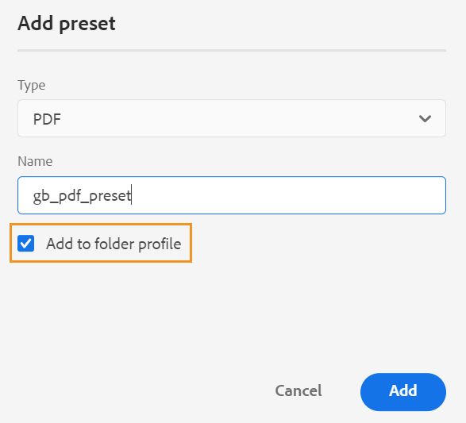
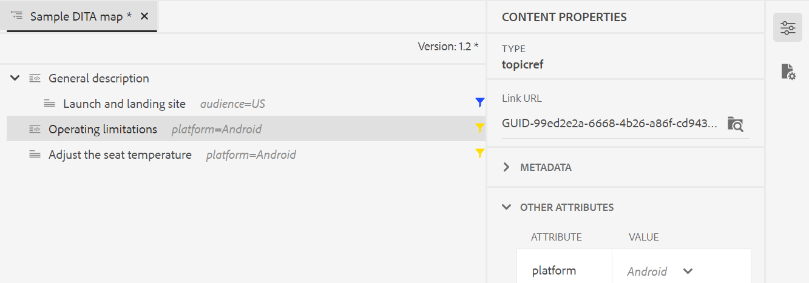

# Adobe Experience Manager Guides 4.2 リリースの新機能（2023 年 2 月）

この記事では、Adobe Experience Manager Guides バージョン 4.2 （後で *AEM Guides* と呼ばれます）の新機能および拡張機能について説明します。

アップグレードの手順、互換性マトリックス、およびこのリリースで修正された問題について詳しくは、[&#x200B; リリースノート &#x200B;](release-notes-4-2.md) の記事を参照してください。

## Web エディターからのレポートの生成

AEM Guidesには、技術文書の全体的な完全性を確認し、レポートを生成できる Web エディターの機能が付属しています。
トピック リストを表示し、現在のマップのすべての参照のメタデータを
Web エディターの「**レポート**」タブ。

**トピックリスト表示の生成**

参照タイプ、ドキュメントの状態、作成者など、トピックに関する詳細情報を提供するトピックリストを生成できます。 CSV を生成して、DITA マップ内のトピックの現在のスナップショットをダウンロードすることもできます。

**メタデータの管理とドキュメントの状態の変更**

個々のトピックにタグを適用したり、一括タグ付け機能を使用して、複数のトピック、DITA マップ、またはサブマップに複数のタグを適用できます。 選択したすべてのトピックのドキュメント状態を、次に使用可能な共通ドキュメント状態に変更することもできます。

## レビュー機能のために UX を刷新

AEM ガイドの UX が向上し、共有されているトピックをレビューするのに役立つようになりました。 最新のエクスペリエンスでは、レビュー機能に次の機能強化が行われています。

* ユーザーインターフェイスを更新しました
* トピックで使用可能な条件に従ってコンテンツをハイライト表示できる条件パネル。
* コメントパネル内の各コメントは、現在のトピック内の対応するテキストにリンクされています。 コメントされたテキストを識別するのに役立ちます。
* コメントは、ドキュメント内のコメントされたテキストの順序で表示されます。
* レビュータスクの名前は、レビューワークフローに表示されます。
* レビュータスクのルートマップを選択します。このルートマップは、レビューコンテンツで使用されるすべての主要な参照と用語集の用語を解決するために使用されます。
* テキストのハイライト表示や取り消しをすばやく行うのに役立つコンテキストツールバー。
* 独自のコメントを編集または削除するためのオプションメニュー。
* 古いコメントの場合は、前のバージョンのトピックと現在のレビューバージョンを比較するのに役立つ並列表示にアクセスできます
* フィルターを使用すると、右側のパネルのコメントが、選択した項目と
左側のパネルのコメント数は、それに応じて更新されます。

詳しくは、『Adobe Experience Manager Guidesの使用ガイド』の *トピックまたはマップのレビュー* の節を参照してください。

## 翻訳機能の強化

翻訳ダッシュボードが強化され、web エディターからドキュメントを簡単に翻訳できるようになりました。

**翻訳ダッシュボードに追加されたバージョンラベル列**

翻訳ダッシュボードには、「バージョンラベル」列も表示されます。 これにより、ソースファイルの選択したバージョンのラベルが表示されます。 これは、特定のラベルが付いているすべてのファイルを選択し、一度に翻訳するのに役立ちます。

**翻訳ダッシュボードからの非同期ファイルのバージョン違いの表示**

選択したバージョンとトピックの最後に翻訳されたソースバージョンの違いを確認できるようになりました。 また、トピックの 2 つのバージョン間で行われた変更に基づいて **非同期** ファイルを翻訳することもできます。

**ターゲットバージョンにバージョンラベルを渡す**

AEM Guidesでは、ソースファイルのラベルをターゲットファイルに渡すことができます。 これにより、翻訳済みファイルのソースバージョンを簡単に識別できます。

例えば、バージョンラベル Release 1.0 が適用されたソースファイルがある場合は、ソースラベル（Release 1.0）を翻訳済みファイルに渡すこともできます。

**非同期アセットの同期を強制**

一部のアセットに変更を加えると、AEM Guidesでは非同期とマークされます。 変更したアセットを再翻訳するか、非同期ステータスを解除するかを選択できます。 例えば、翻訳を必要としない軽微な変更を加えた場合、そのステータスを「同期中」とマークできます。

**トピックまたはマップの進行中の翻訳プロジェクトの表示**

翻訳ダッシュボード上で、一部の参照が進行中の可能性があります。 AEM Guidesには、選択した参照を含むすべての進行中の翻訳プロジェクトのリストを（ターゲット言語と共に）表示するのに役立つ機能が用意されるようになりました。

詳しくは、Adobe Experience Manager Guidesの使用ガイドの *Web エディターからドキュメントを翻訳* の節を参照してください。

## Web エディターから様々な形式の出力を生成

これで、Web エディタからトピックまたは DITA マップの出力を簡単に生成できます。 AEM Site、PDF、HTML 5 など、様々な出力プリセットを設定できます。
JSON （ヘッドレス出力形式）とカスタム出力。 これらを使用して、それぞれの出力を生成します。 DITA トピックで属性を定義し、出力の公開時に条件プリセットを使用して条件を適用できます。 ベースライン公開機能を使用して、DITA マップまたはトピックの特定のバージョンを選択的に公開することもできます。

**グローバルプロファイルおよびフォルダープロファイル出力プリセットの管理**

AEM Guidesには、グローバルプロファイルとフォルダープロファイルの出力プリセットを作成および管理する機能が用意されています。 その後、これらの出力プリセットを簡単に使用して、そのグローバルプロファイルまたはフォルダープロファイルに関連するすべてのマップの出力を生成できます。

これらのグローバルプリセットは、関連するすべてのマップの「**出力**」タブに表示されます。 これらを使用して、関連するすべてのマップの出力を生成できます。 このプリセットをデフォルトのPDFプリセットとして選択すると、PDF出力を生成できます。 **オプション** メニューから、既存の出力プリセットを **編集**、**名前変更**、**複製** または **削除** することもできます。

>[!NOTE]
>
>グローバルプロファイルプリセットとフォルダープロファイルプリセットを作成できるのは、フォルダーレベルの管理者ユーザーのみです。

## マップ レベルでテキストを検索して置換します

特定のテキストを含むマップ内のファイルを検索できるようになりました。 検索されたテキストは、ファイル内でハイライト表示されます。 検索した単語や語句を、ファイル内の別の単語や語句に置き換えることもできます。 **1 つのオカレンスを置換** アイコンを選択して現在のオカレンスを置換し、**ファイル内のすべてを置換** アイコンを選択して、選択したファイル内のすべてのオカレンスを置換します。 **すべてを置換** アイコンを選択すると、すべてのファイルで検索された用語のすべての出現箇所を置換できます。

デフォルトでは、オプション **置換前にファイルをチェックアウト** および **置換後に新しいバージョンを作成** が選択されているため、テキストを置換する前にファイルがチェックアウトされ、テキストを置換すると新しいバージョンが作成されます。 また、DITA マップ内の間接参照で文字列を検索することもできます。 デフォルトでは、これは無効になっているので、直接参照に対してのみ検索が実行されます。

## マップ エディタのレイアウト ビュー

これで、DITA マップの完全なレイアウトをマップエディタで表示できます。 編集用にマップを開くと、マップ エディタのレイアウト ビューが開きます。 このビューでは、マップ階層がツリービューで表示されます。 また、マップ内のトピックを編集、整理、または構造化することもできます。

レイアウト ビューには、マップ内に存在するトピックに関する多くのタスクを実行するのに役立つ別のツールバーが含まれています。
トピック参照、トピック グループ、キー定義をマップに挿入できます。 マップ内に存在するトピックを上下、左右に移動して再編成できます。 トピックをドラッグ&amp;ドロップして、マップ内で移動することもできます。 マップ エディタには、ファイルのロックまたはロック解除、バージョン履歴の確認、バージョン ラベル管理を行うためのアイコンもあります。

また、レイアウト ビューには、行番号の表示と非表示、チェック ボックスの表示と非表示の切り替え、マップ内のトピックのファイル名またはタイトルの表示を行うための **表示オプション** があります。
また、適用された条件付きフィルターに基づいてトピックを表示することもできます。

マップ ファイル内のトピックを整理する以外に、レイアウト ビューの要素で使用できる **オプション** メニューを使用して、参照を追加、移動、コピー、貼り付け、または削除することもできます。

右側のパネルには、マップ エディタのレイアウト ビューにコンテンツ プロパティとマップ プロパティが表示されます。 これで、トピックまたはマップのメタデータ情報を設定することもできます。 選択したトピックまたはマップのナビゲーション タイトル、リンク テキスト、簡単な説明、およびキーワードを定義できます。

詳しくは、『Adobe Experience Manager Guidesの使用ガイド』の *レイアウトビュー* 節を参照してください。

## 「クイック生成」パネル

AEM Guidesに「クイック生成」パネルが追加されました。このパネルを使用すると、DITA マップ用に作成されたプリセットの出力をすばやく生成して表示することができます。

**クイック生成** パネルに、DITA マップ用に作成されたすべての出力プリセットのリストが表示されます。 また、プリセット用に生成された出力をすばやく確認することもできます。 出力生成の完了時に、成功または失敗のメッセージが表示されます。 生成プロセスで発生したエラーの詳細を含むエラーログを表示することもできます。

## ラベルに基づく動的ベースラインの作成

AEM Guidesには、ラベルに基づいて動的なベースラインを作成する機能が用意されるようになりました。 ベースラインの生成、ベースラインのダウンロード、またはベースラインを使用した翻訳プロジェクトの作成を行うと、更新されたラベルに基づいてファイルが動的に選択されます。 この機能は、ラベルを更新するときにベースラインを変更する必要がないので便利です。

## リポジトリパネルからのファイルの削除と複製

リポジトリパネルで選択したファイルの **オプション** メニューからファイルを（一度に 1 つのファイル）簡単に削除できるようになりました。 ファイルを削除する前に確認プロンプトが表示されます。 ファイルが他のファイルから参照されていない場合、ファイルは削除され、成功メッセージが表示されます。

選択したファイルの複製またはコピーを作成することもできます。 デフォルトでは、ファイルはで作成されます。
サフィックス（filename_1.extension など）。

## その他の web エディターの機能強化

* AEM Guidesでは、コンテキストメニューを使用して、画像ファイルやメディアファイルに対する一般的な操作をいくつか実行できます。 これにより、選択した画像やメディアをリポジトリーで見つけたり、Assets UI でファイルのプレビューを表示したりすることもできます。

* 現在のフォルダープロファイルの名前は、メインツールバーのユーザー環境設定アイコンのラベルとして表示されます。 これにより、作業中のフォルダープロファイルを特定できます。

* マップ ビューでマップを開くと、現在のマップのタイトルがメイン ツールバーの中央に表示されます。 これは、現在開いているマップをユーザーに知らせるのに役立ちます。

## 選択したバージョンのファイルのパージ

コンテンツを作成して管理すると、リポジトリ内の DITA ファイルに対して多数のバージョンが作成される場合があります。 AEM Guidesを使用すると、古いバージョンの DITA ファイルをリポジトリからパージして、ディスク領域を解放できます。

AEM Guidesは、ファイルの最初のバージョン、ベースラインに含まれるバージョン、またはラベルが適用されているバージョンを削除しません。 パージ操作では、翻訳やレビューワークフローに含まれるファイルは削除されません。 保持するバージョンの数を選択し、定義された日数より古いファイルを削除することもできます。

パージ操作を開始する前に、レポートをプレビューして、パージされるバージョンを確認できます。 その後、パージ操作を開始するかキャンセルするかを決定できます。

パージ操作が完了したら、パージレポートをチェックして、パージされたファイルを確認できます。

## 酸素エディターで UUID の代わりにタイトルを表示

AEM Guidesで、「設定」から「**エディターでタイトルを使用およびマップマネージャー** オプションを選択できるようになりました。 このオプションを選択すると、エディタまたは DITA マップマネージャで開いたときに、ファイルのタイトルがファイルのタブに表示されます。 このオプションを選択しない場合、ファイルの UUID がファイルのタブに表示されます。

## PDFプリセットで使用可能なメタデータ UI

メタデータは、DITA マップの出力プリセットから設定できます。 タイトル、作成者、件名、キーワードのメタデータを設定できます。 このメタデータは、出力PDFーのファイルプロパティのメタデータにマッピングされます。 このメタデータは、ブックレベルで定義されたメタデータを上書きします。 メタデータは各出力プリセットで明確に定義し、出力PDFーに渡すことができます。

## ネイティブPDF | ドキュメントバージョン間の差異を示す変更バーを持つPDF

次に、変更バーを使用して、2 つのバージョン間のコンテンツの違いを示すPDFを作成できます。 現在のバージョンを前のバージョンのベースラインと比較するか、選択した 2 つのベースラインバージョンを比較するかを選択できます。

PDFに変更バーが表示され、変更、挿入、削除されたコンテンツが示されます。 次の操作を行うオプションもあります。
* 挿入した内容を緑色で表示し、下線付きで表示します
* 削除されたコンテンツを赤で表示し、取り消し線でマークします

## ネイティブPDF |出力パスとPDFファイル名の変数サポート

また、次の標準変数を使用して、出力パスとPDFファイルを定義することもできます。 これらのオプションは、変数の 1 つまたは組み合わせを使用して定義できます。
* `${map_filename}`
* `${map_title}`
* `${preset_name}`
* `${language_code}`
* `${map_parentpath}` （出力パスの場合のみ）
* `${path_after_langfolder}` （出力パスの場合のみ）

## ネイティブPDF | DITA マップの目次の生成とページレイアウトの並べ替え

テンプレートの高度なPDF設定を使用して、DITA マップに目次を生成できるようになりました。 様々なページレイアウトの表示を有効または無効にしたり、位置を並べ替えたりすることができます。

## ネイティブPDF | PDF出力へのカスタムブックマークの追加

最終的なPDF出力の特定のコンテンツにカスタムブックマークを追加して、簡単に移動できるようになりました。 これは、DITA マップのトピックまたはセクションタイトルから作成される目次に追加されます。

## ネイティブPDF |目次エントリとトピックコンテンツにカスタムスタイルを適用

AEM Guidesには、目次エントリやPDF出力の特定のトピックにカスタムスタイルを適用する機能があります。 例えば、目次のテキストの色や、トピックのタイトルを変更できます。 トピック内のコンテンツ全体にスタイルを適用することもできます。
