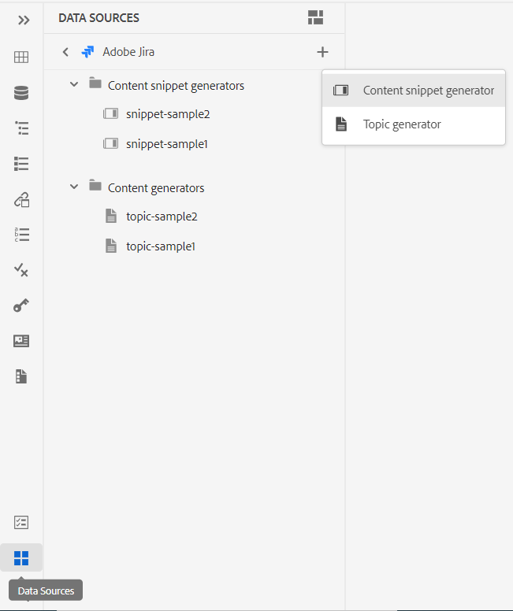
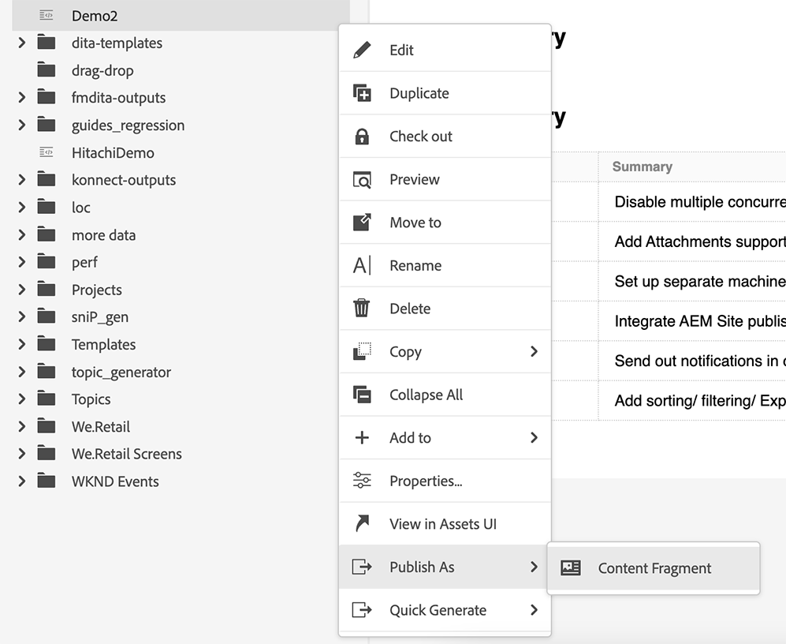
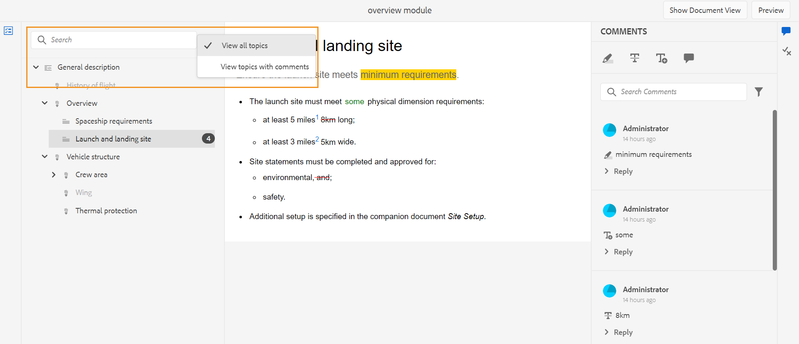
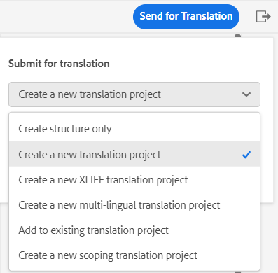

# Adobe Experience Manager Guides 4.3.0 リリース（2023年7月）の新機能

この記事では、Adobe Experience Manager Guides（後で&#x200B;*AEM Guides*&#x200B;と呼ばれます）のバージョン 4.3.0の新機能と強化機能について説明します。

アップグレード手順、互換性マトリックス、およびこのリリースで修正された問題について詳しくは、[&#x200B; リリースノート &#x200B;](./release-notes-4-3.md)を参照してください。

## データソースに接続し、トピックにデータを挿入する

AEM Guidesのすぐに使えるコネクタを使用して、データソースに素早く接続できます。 データソースに接続すると、データをソースと同期させることができます。また、データの更新は自動的に反映されるため、AEM Guidesは真のコンテンツハブとなります。 この機能により、データを手動で追加またはコピーする時間と労力を節約できます。

AEM Guidesでは、JIRAおよびSQL （MySQL、PostgreSQL、SQL Server、SQLite）データベース用のすぐに使えるコネクタを設定できます。 デフォルトのインターフェイスを拡張して、他のコネクタを追加することもできます。
追加すると、Web エディターのデータソースパネルの下に一覧表示される設定済みコネクタを表示できます。

接続されたデータソースからデータを取得するためのコンテンツスニペットを作成します。 トピックにデータを挿入して編集します。 コンテンツスニペットジェネレーターを作成したら、それを再利用して任意のトピックにデータを挿入できます。

接続されたデータソースからトピックを作成することもできます。 トピックには、表、リスト、段落など、様々な形式のデータを含めることができます。 また、すべてのトピックのDITA マップを作成することもできます。 データソースから取り出す際に、メタデータをトピックに関連付けることができます。

詳しくは、[&#x200B; データソースからのデータを使用](../user-guide/web-editor-content-snippet.md)を参照してください。

## コンテンツに引用を追加する

引用は、コンテンツに追加された情報のソースへの参照です。 引用は、信頼性を確立し、盗用を防ぐのに役立ちます。 引用は、読者がソースを見つけ、テキストに表示される情報を検証するのに役立ちます。

AEM Guidesでは、引用を追加したり、引用を読み込んでコンテンツに適用したりできます。 ブック、web サイト、ジャーナルの任意のソースからこれらの引用を追加できます。

トピックに引用を挿入した後、Web エディターで引用をプレビューできます。 また、ネイティブPDFを使用して、引用を含むコンテンツを公開することもできます。

{width="300"}

詳細については、[&#x200B; コンテンツ内の引用の追加と管理](../user-guide/web-editor-apply-citations.md)を参照してください。

## コンテンツフラグメントへの公開

コンテンツフラグメントは、AEMの個別のコンテンツです。 コンテンツモデルにもとづいた構造化コンテンツです。 コンテンツフラグメントは、デザインやレイアウトに関する情報を含まない純粋なコンテンツです。 AEMがサポートするチャネルに依存せずに作成および管理できます。 コンテンツフラグメントのモジュール性と再利用性により、柔軟性、一貫性、効率性が向上し、管理が簡素化されます。

AEM Guidesでは、トピックまたはトピック内のエレメントをコンテンツフラグメントに公開する方法が提供されています。 トピックとコンテンツフラグメントモデルの間にJSON ベースのマッピングを作成できます。 このマッピングを使用して、トピック内の一部またはすべての要素に含まれるコンテンツをコンテンツフラグメントに公開します。

AEM Guidesとコンテンツフラグメントの機能を活用し、あらゆるAEMサイトでコンテンツフラグメントを利用できます。 コンテンツフラグメントでサポートされているAPIを使用して、詳細を抽出することもできます。

{width="550"}

## 機能強化を見る

AEM Guidesでは、次の機能を使用してレビュー機能が改善されました。

### レビューパネル：レビュープロジェクトとアクティブなレビュータスクを表示します

Adobe AEM Guidesなら、レビューをよりシームレスに。 Web エディター内のレビューパネルが表示されます。 レビューパネルには、自分が属しているレビュープロジェクト内のすべてのレビュープロジェクトとアクティブなレビュータスクが表示されます。

この機能を利用すれば、レビュータスクを簡単に開いてコメントを表示し、一元的なビューでコメントにすばやく対応できます。
{width="800"}
詳細については、[左パネル &#x200B;](../user-guide/web-editor-features.md#id2051EA0M0HS) セクション内の&#x200B;**レビュー**&#x200B;機能の説明を参照してください。

### レビューのトピックを検索

レビューの実施は、AEM Guidesの重要な機能のひとつです。 レビュー担当者は、割り当てられたドキュメントを確認できます。
レビューパネルのトピックビューの検索バーに、タイトルまたはファイルパスのテキストの一部を入力して、トピックを検索できるようになりました。 すべてのトピックを表示するか、コメント付きのトピックを表示するかを選択することもできます。 デフォルトでは、レビュータスクに存在するすべてのトピックを表示できます。

{width="800"}

詳細については、[&#x200B; トピックのレビュー](../user-guide/review-topics.md)を参照してください。

## Guides拡張フレームワーク

AEM Guides上にカスタムパッケージを作成し、AEM Guides Extension Frameworkを使用して拡張性を提供します。 これらのパッケージは、開発者やコンサルタントにとって有用で、エディターのコンポーネントに拡張性を与えます。 ボタン、ダイアログ、ドロップダウンをターゲットにしたり、AEM Guides UIと簡単に相互運用できるカスタムJavaScriptを追加したりできます。

## PDFのネイティブ機能

AEM Guidesをより堅牢な製品にするため、4.3.0 リリースでは、次のネイティブ PDFの機能強化が行われました。

### 言語変数のサポート

AEM Guidesでは、言語変数をサポートしています。 言語変数を使用すると、メモ、注意、警告などの標準ラベルのローカライズ版や、PDF出力の静的テキストを定義できます。
PDF出力および出力テンプレートの適切なセクションに、言語変数またはラベルのローカライズ版を追加できます。

#### PDF出力の言語変数

言語変数を使用して、メモ、注意、警告などの要素のローカライズされたラベルを定義できます。 これらの変数の値を1つ以上の言語で更新すると、ローカライズされた値がPDF出力で自動的に選択されます。
例えば、次の方法でPDF出力にラベルノートを表示できます。

* 英語：メモ
* フランス語：Remarque
* ドイツ語：Hinweis

#### 出力テンプレートの言語変数

PDF出力を様々な言語で作成する場合は、各言語用のローカライズされたテキストを含む様々なPDF テンプレートを作成する必要がありました。 言語変数機能を使用すれば、テンプレートを一度作成するだけで済みます。 次に、ローカライズする必要がある静的テキストについて、対応する言語変数を作成し、テンプレートで使用できます。
文全体や段落など、長いテキストの言語変数を作成できます。 また、スタイルを適用し、HTML マークアップを使用してこれらの言語変数を書式設定することもできます。

詳しくは、[言語変数のサポート &#x200B;](../native-pdf/native-pdf-language-variables.md)を参照してください。

### ドラフトドキュメントのPDF出力に透かしを追加する

これで、未承認の文書のPDF出力に透かしを追加できます。 この透かしは、文書のPDFを「承認済み」状態で生成した場合には表示されません。 例えば、PDF出力に透かしドラフトを追加できます。

詳しくは、[下書きドキュメントのPDF出力に透かしを追加する](../native-pdf/use-javascript-content-style.md#watermark-draft-document)を参照してください。

### PDF レイアウトでAEM メタデータを使用する機能

メタデータとは、コンテンツの説明または定義のことです。 このメタデータは、ソース DITA マップコンテンツに保存されます。

Adobe AEM Guidesでは、アセットのメタデータプロパティを選択して、ページレイアウトに追加することもできます。 次に、AEM Guidesはアセットのこれらのメタデータプロパティを選択し、PDF出力で公開します。

{width="300"}

>[!NOTE]
>
> AEM Guidesは、DITA マップのメタデータプロパティもサポートしています。

詳細については、[&#x200B; フィールドとメタデータの追加](../native-pdf/design-page-layout.md#add-fields-metadata)を参照してください。

### PDF出力でのページの順序

PDFで次のセクションを表示または非表示にしたり、最終的なPDF出力に表示する順序を調整したりできます。

* 目次
* 章とトピック
* 図のリスト
* テーブルのリスト
* 索引
* 用語集
* 引用
* ページレイアウト

PDF出力に特定のセクションを表示したくない場合は、切り替えスイッチをオフにすることで非表示にできます。

詳細については、[&#x200B; ページの順序](../native-pdf/components-pdf-template.md#page-order)を参照してください。

### ページを結合

デフォルトでPDFのネイティブ出力では、すべてのセクションが新しいページから始まります。 セクションを前のページまたは次のページに結合できるようになりました。 これにより、PDF出力で選択したページに続くセクションが公開され、間に改ページはありません。

詳細については、「[&#x200B; ページ順序](../native-pdf/components-pdf-template.md#page-order)」セクションのページ結合機能の説明を参照してください。

### 静的ページ

また、カスタムページレイアウトを作成し、PDF出力で静的ページとして公開することもできます。 これにより、メモや空白ページなどの静的コンテンツを追加できます。

詳細については、[&#x200B; ページ順序](../native-pdf/components-pdf-template.md#page-order) セクションの静的ページ機能の説明を参照してください。

### 相互参照の変数

変数を使用して、相互参照を定義できます。 変数を使用すると、その値はプロパティから選択されます。

{figure}と{table}を使用することもできます。
{figure}を使用して、図形番号に相互参照を追加します。 Figure用に定義した自動番号スタイルからFigure番号を選択します。

{table}を使用して、テーブル番号に相互参照を追加します。 キャプション用に定義した自動番号スタイルから表番号を選択します。

詳細については、[相互参照](../native-pdf/components-pdf-template.md##cross-references)を参照してください。

### 現在のページからすべての章を開始

奇数ページまたは偶数ページから章を開始するための基本設定、目次構造、および目次エントリの引出線形式を定義できます。

現在のページから章を開始することもできます。 これを選択した場合、すべての章はページを改めることなく続けて公開されます。 例えば、章が15 ページの途中で終わる場合、次の章も15 ページ自体から始まります。

### ネイティブのPDF出力の生成中に一時HTML ファイルにアクセスする機能

AEM Guidesでは、ネイティブのPDF出力の生成中に作成された一時HTML ファイルをダウンロードできます。 出力プリセット設定で、一時ファイルをダウンロードするオプションを選択します。  AEM Guidesでは、そのプリセットを使用して出力を生成する際に作成された一時ファイルをダウンロードできます。

この機能を使用すると、暫定的なスタイルとレイアウトにアクセスして、生成プロセスをより詳細に把握できます。また、必要に応じてCSS スタイルを修正または変更できます。

{width="800"}の詳細設定ダイアログ

詳しくは、[PDF出力プリセットの作成](../web-editor/native-pdf-web-editor.md#create-output-preset)を参照してください。

### CSS エディターの再設計

現在では、CSS エディターは、セレクターとスタイルプロパティを使用したユーザーエクスペリエンスを向上させるために再設計されています。

#### スタイルを追加ダイアログの機能強化

カスタムセレクターを使用して、複雑なスタイルを追加できるようになりました。 新しいセレクターフィールドを使用すると、クラス、タグ、擬似クラスの組み合わせ以外にもカスタムセレクターを追加できます。 例えば、テーブル内のすべてのハイパーリンクに`table a.link` スタイルを作成できます。

{width="300"}

#### スタイルのプロパティをカスタマイズ

AEM Guidesでは、スタイルのプレビューセクションの下に新しいプロパティパネルが表示されます。 プロパティパネルから、スタイルのプロパティをより効率的かつ迅速に編集できます。

## リポジトリビュー内でのファイルの名前の変更と移動

リポジトリパネルからファイルの名前を変更したり、移動したりすることもできます。 この機能は便利で、リポジトリパネルからファイルを簡単に管理できます。 ファイルを選択し、選択したファイルの&#x200B;**オプション** メニューを使用して名前を変更または移動できます。 ファイルを移動または名前を変更すると、AEM Guidesに成功メッセージが表示されます。

ファイルの{width="550"}

ファイルのオプションメニューについて詳しくは、[左パネル &#x200B;](../user-guide/web-editor-features.md#id2051EA0M0HS) セクションの&#x200B;**リポジトリビュー**&#x200B;機能の説明を参照してください。

## Web エディターでの壊れたリンクのレポート

AEM Guidesを使用すると、テクニカルドキュメントの全体的な完成度を確認し、Web エディターからレポートを生成できます。 2023年6月リリースのAEM Guidesでは、破損したリンクを表示および修正する機能が提供されています。 これは、壊れたリンクを管理するのに役立つ便利なレポートです。 DITA マップに存在する壊れたリンクを簡単に表示し、修正することもできます。
{width="800"}

リンクを修正すると、壊れたリンクのリストの下に表示されません。

詳しくは、[破損したリンクの表示と修正](../user-guide/reports-web-editor.md#report-broken-links)を参照してください。

## Schematronの機能強化

### Report ステートメントを使用して、Schematronのルールを確認する

AEM Guidesは、Schematronでレポートステートメントもサポートするようになりました。 レポート文は、テスト文がtrueと評価されたときにメッセージを生成します。 例えば、短い説明を150文字以下にする場合は、レポート文を定義して、短い説明が150文字以上のトピックを確認できます。

詳細については、[&#x200B; アサートステートメントとレポートステートメントを使用してルールを確認する](../user-guide/support-schematron-file.md#schematron-assert-report)を参照してください。

### 正規表現の使用

正規表現を使用してmatches （）関数でルールを定義し、Schematron ファイルを使用して検証を実行することもできます。

詳細については、[正規表現を使用](../user-guide/support-schematron-file.md#schematron-assert-report)を参照してください。

### 抽象パターンを定義する

AEM Guidesは、Schematronの抽象パターンもサポートしています。 一般的な抽象パターンを定義して、これらの抽象パターンを再利用できます。 抽象パターンは、Schematron スキーマを簡素化し、検証ロジックの管理と更新にも役立ちます。

詳細については、[抽象パターンの定義](../user-guide/support-schematron-file.md#schematron-abstract-patterns)を参照してください。

## 翻訳でのXLIFF形式のサポート

AEM Guidesでは、XML Localization Interchange File Format （XLIFF）形式のサポートも提供されています。 また、**新しいXLIFF翻訳プロジェクトを作成**&#x200B;して、XML コンテンツをXLIFF形式に変換することもできます。 AEM GuidesはXLIFF バージョン 1.2をサポートしています。

この形式を使用すると、コンテンツを業界標準のXLIFF形式に書き出し、それを翻訳ベンダーに提供できます。詳細については、[翻訳プロジェクトの作成](../user-guide/translate-documents-web-editor.md#create-translation-project)を参照してください。

{width="350"}

## マップコレクションの機能強化

マップコレクションは、複数のマップを整理し、一括公開するのに役立ちます。 マップコレクションに多くの新しい機能強化が行われました。

* これで、ネイティブPDF出力プリセットをマップコレクションに追加し、それらを使用してPDF出力を生成できます。
* 管理者が作成したグローバルプロファイルプリセットとフォルダープロファイルプリセットを表示し、それらを使用してPDF出力を生成できます。
* これで、個々のプリセットを選択するだけでなく、DITA マップのすべてのフォルダープロファイルプリセットを一括で有効にすることもできます。
  {width="800"}

詳細については、[出力生成にマップコレクションを使用](../user-guide/generate-output-use-map-collection-output-generation.md)を参照してください。

## 一括公開ダッシュボードでのPDFのネイティブサポート

AEM Guidesのバルクアクティベーション機能を利用すれば、コンテンツのオーサリングからパブリッシングインスタンスへの移行を迅速かつ容易におこなえます。 一括アクティベーションマップでは、ネイティブ PDF出力プリセット、AEM サイト、PDF、HTML5、カスタムおよびJSON出力を含めることができます。
詳細については、[公開されたコンテンツの一括アクティベーション &#x200B;](../user-guide/conf-bulk-activation.md)を参照してください。

## 一括移動ツールの改善

管理者は、改善された一括移動ツールを使用して、多くのファイルを含むフォルダーを1つの場所から別の場所に移動できるようになりました。
ファイルを参照ダイアログを使用して、移動するソースフォルダーを選択できます。 ソースフォルダーを移動する保存先を参照して選択することもできます。 フィールドの近くの {width="25"}を選択すると、そのフィールドに関する詳細情報を表示できます。

詳細については、[&#x200B; ファイルを一括で移動](../user-guide/authoring-file-management.md#move-files-bulk)するをご覧ください。

## 改善されたお気に入りパネル

AEM Guidesを使用すると、ファイルやフォルダーのコレクションやお気に入りのリストを作成し、簡単に使用できます。 現在、**オプション** メニューは、**お気に入り** パネルでも使用できます。 選択したコレクションの名前を変更するか、**オプション** メニューから削除できます。 「**更新**」オプションを選択して、リポジトリからファイルまたはフォルダーの新しいリストを取得できます。 Assets UIでフォルダーの内容を表示することもできます。

{width="650"}

>[!NOTE]
>
> 上部の&#x200B;**更新** アイコンを使用して、リストを更新することもできます。

お気に入りコレクションの&#x200B;**オプション** メニューについて詳しくは、[左パネル &#x200B;](../user-guide/web-editor-features.md#id2051EA0M0HS) セクションの&#x200B;**お気に入り**&#x200B;機能の説明を参照してください。

## システムテーマに切り替え

デバイスのテーマを使用できるようになりました。 **ユーザー環境設定**&#x200B;を使用すると、AEM Guidesで、デバイスのテーマに基づいて明るいテーマと暗いテーマを自動的に切り替えるように設定できます。

{width="550"}

詳細については、[&#x200B; メインツールバー](../user-guide/web-editor-features.md#id2051EA0G05Z) セクションの&#x200B;**ユーザー環境設定**&#x200B;機能の説明を参照してください。
