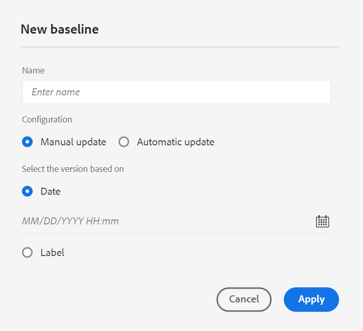
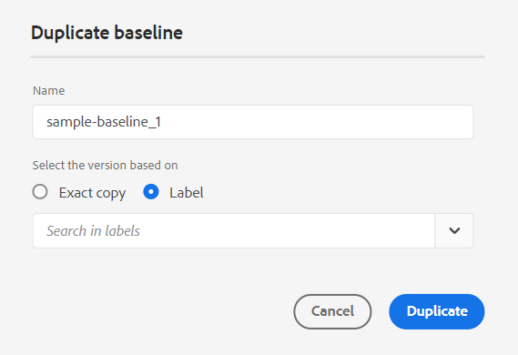
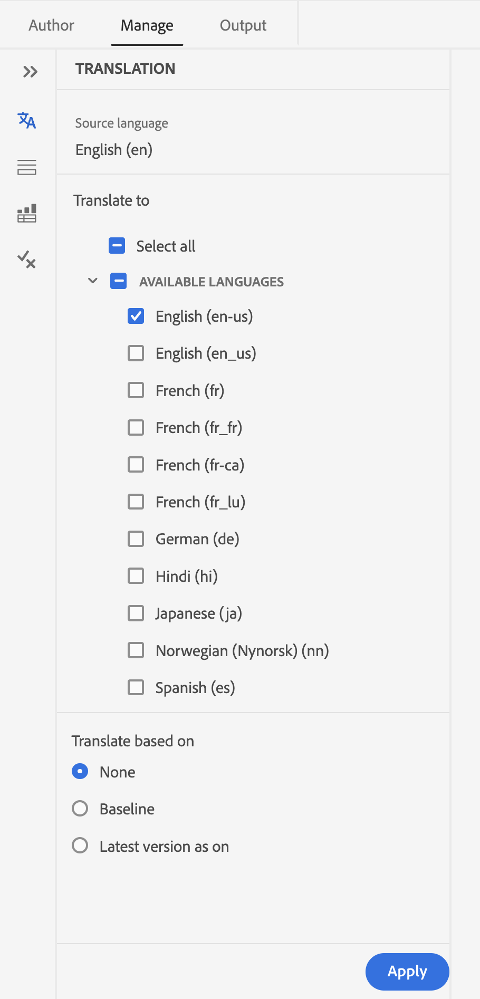
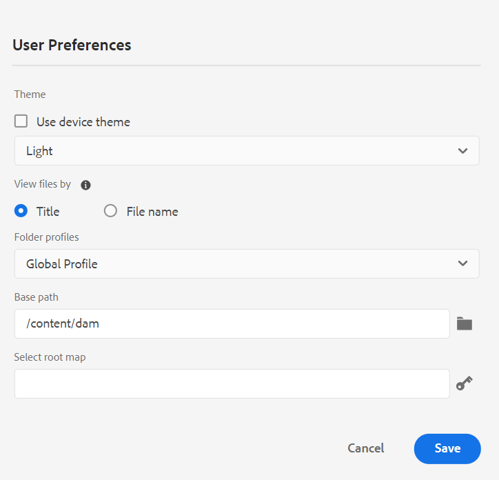
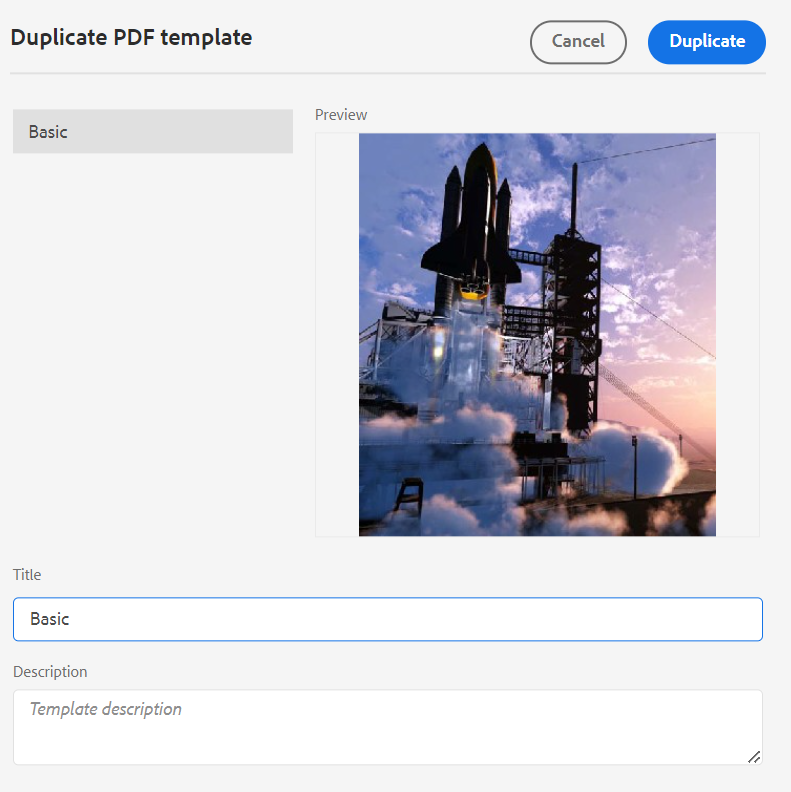

# 4.4.0 リリース（2024年1月）の新機能

この記事では、Adobe Experience Manager Guidesのバージョン 4.4.0の新機能と強化機能について説明します。

このリリースで修正された問題のリストについては、[4.4.0 リリースで修正された問題](../release-info/fixed-issues-4-4.md)を参照してください。

4.4.0 リリース ](../release-info/upgrade-instructions-4-4.md)の[ アップグレード手順について説明します。

## Web エディターのバージョン履歴機能の刷新

Experience Manager Guidesでは、ドキュメントに加えられた変更を経時的に比較できる強化されたバージョン履歴機能が提供されるようになりました。 新しいサイドバイサイド表示では、現在のバージョンのコンテンツとメタデータを同じドキュメントの以前のバージョンと簡単に比較できます。 比較したバージョンのラベルとコメントを表示することもできます。 管理者は、**バージョン履歴** ダイアログボックスに表示されるトピックのバージョンメタデータとその値を制御できます。

{width="800"}
*トピックの様々なバージョンの変更をプレビューします。*

**バージョン履歴**&#x200B;機能の説明について詳しくは、[左パネル（レガシー） ](/help/legacy-product-guide/user-guide/web-editor-features.md#id2051EA0M0HS)の節を参照してください。

## 条件プリセットの管理

DITA トピックで条件属性を定義できます。 次に、条件プリセットの条件属性を使用して、コンテンツをDITA マップで公開します。 Experience Manager Guidesでは、Web エディターでエクスペリエンスが強化され、条件プリセットをより効率的に作成および管理できるようになりました。 また、編集、複製、削除も簡単にできます。

Web エディター](assets/web-editor-manage-condition-presets.png){width="550"}の「管理」タブのを参照してください。

## 属性を編集するエクスペリエンスが刷新されました

これで、Web エディターの&#x200B;**コンテンツのプロパティ** パネルから、要素の属性を追加または編集するエクスペリエンスが刷新されました。

{width="300"}

*コンテンツのプロパティ パネルから属性を追加します。*

属性を簡単に編集および削除することもできます。
詳しくは、[右側パネル ](../user-guide/web-editor-features.md#id2051EB003YK) セクション内の&#x200B;**コンテンツのプロパティ**&#x200B;機能の説明を参照してください。

## オーサリング中にメタデータを編集

これで、オーサリング中に、右側のパネルの&#x200B;**ファイルプロパティ**&#x200B;のドロップダウンを使用して、ファイルメタデータタグを更新できるようになりました。 **さらにプロパティを編集**&#x200B;を選択して、さらにメタデータを更新することもできます。

{width="300"}

*右側のパネルからメタデータを更新し、ファイルのプロパティを編集します。*

詳しくは、[右側パネル ](../user-guide/web-editor-features.md#id2051EB003YK) セクション内の&#x200B;**ファイルプロパティ**&#x200B;機能の説明を参照してください。

## マップビューでのキー属性の表示

トピックまたはマップ参照のキー属性を定義する場合は、タイトル、対応するアイコン、および左側のパネルのキーを表示することもできます。 キーは`key=<key-name>`として表示されます。

マップビュー](assets/view-key-title-map-view.png) {width="300"}の セクションの&#x200B;**マップビュー**&#x200B;機能の説明を参照してください。

## ラベルに基づいてベースラインを複製する機能

Experience Manager Guidesでは、Web エディターからベースラインを作成するための拡張ユーザーエクスペリエンスが提供されるようになりました。
オプション **手動アップデート**&#x200B;と&#x200B;**自動アップデート**&#x200B;はより直感的で、静的なベースラインを作成するか、ラベルに従って自動的に更新するかを簡単に選択できます。

 {width="300"}
*Web エディターからベースラインを作成します。*

また、ラベルに基づいてベースラインを複製することもできます。 参照バージョンは、複製の際に指定されたラベル（存在する場合）に基づいて選択されるか、複製されたベースラインからバージョンが選択されます。

 {width="300"}を複製

*ラベルに基づいてベースラインを複製するか、正確なコピーを作成します。*

Web エディター](../user-guide/web-editor-baseline.md)からベースラインを[作成および管理する方法について詳しく説明します。

## 強化されたマップコレクションダッシュボード

Experience Manager Guidesには、強化されたマップコレクションダッシュボードが用意されています。 マップコレクションでは、DITA マップのメタデータプロパティを一括設定できます。 この機能は、各DITA マップのメタデータプロパティを個別に更新する必要がないので便利です。

これで、DITA マップのファイル名を表示できます。 ベースラインも表示できます。 これにより、プリセットに使用されているベースラインをすばやく見つけることができます。

{width="800"}

*マップ コレクション ダッシュボードの表示、編集、および出力の生成。*

出力生成](../user-guide/generate-output-use-map-collection-output-generation.md)にマップコレクションを[使用する方法について説明します。

## 拡張翻訳パネル

**翻訳** パネルが改善されました。  **使用可能な言語**&#x200B;のリストを表示し、プロジェクトを翻訳するロケールをすばやく選択できます。 1つの選択で、**すべてを選択**&#x200B;して、プロジェクトを使用可能なすべての言語に翻訳することもできます。

{width="300"}

*プロジェクトを翻訳するロケールを選択します。 翻訳するファイルの既定、ベースライン、または最新バージョンを選択してください。*

コンテンツを[翻訳](../user-guide/translation.md)する方法について詳しくは、こちらを参照してください。

## エレメントを挿入ダイアログボックスでの検索ロジックの改善

エレメントを挿入ダイアログボックスでエレメントを簡単に見つけることができるようになりました。  検索ボックスに文字列を入力すると、入力した文字列で始まるすべての有効な要素のリストを取得できます。

例えば、エレメントを挿入する段落を編集する際に、文字「t」を検索して取得できます
&#39;t&#39;で始まるすべての有効な要素。

{width="300"}

*文字を入力して、文字で始まるすべての有効な要素を検索します。*

詳細については、[左パネル ](../user-guide/web-editor-features.md#id2051EA0M0HS) セクションの&#x200B;**エレメントを挿入**&#x200B;機能の説明を参照してください。

## 同じレベルでリストを分割する機能

Web エディターで簡単にリストを分割できます。 リスト項目のコンテキストメニューから「**リストを分割**」オプションを選択して、現在のリストを分割します。 新しいリストは、分割のために選択したリスト項目から始まる同じレベルで作成されます。

{width="300"}

*現在のリストを分割するオプションを選択します。*

詳細については、[左パネル ](../user-guide/web-editor-features.md#id2051EA0M0HS) セクションの&#x200B;**リストの挿入**&#x200B;機能の説明を参照してください。

## DITA要素を簡単にラップ解除

これで、Web エディターのエレメントのコンテキストメニューのオプションを使用して、エレメントを簡単にラップ解除できるようになりました。 これにより、エレメントのテキストを親エレメントと簡単に結合できます。
詳細については、Web エディター](../user-guide/web-editor-other-features.md)の[その他の機能の&#x200B;**要素のラップ解除** セクションを参照してください。

## オーサリングのソースモードでのファイルプロパティへのアクセス

これで、右側のパネルの&#x200B;**ファイルプロパティ**&#x200B;機能に、レイアウト、作成者、Source、プレビューの4つのモードまたはビューすべてでアクセスできます。  これにより、異なるモードを切り替えても、ファイルのプロパティを表示できます。

詳細については、[右側パネル ](../user-guide/web-editor-features.md#id2051EB003YK) セクションの&#x200B;**ファイルのプロパティ**&#x200B;機能の説明を参照してください。

## タイトルまたはファイル名でファイルを表示

Web エディターでファイルを表示するデフォルトの方法を選択できるようになりました。 作成者ビューの様々なパネルから、タイトルまたはファイル名でファイルのリストを表示できます。

{width="550"}

*デフォルトの方法を変更して、**ユーザー環境設定**ダイアログからファイルを表示します。*

## ブラウザーの更新時にファイルタブを復元

ブラウザーを更新すると、Experience Manager GuidesはWeb エディターで開いているファイルタブの状態を復元します。 詳細については、[Web エディターのトピックを編集](../user-guide/web-editor-edit-topics.md)の「**ファイルの編集中にブラウザーを更新**」セクションを参照してください。

## キーボードショートカットを使用したナビゲーション機能

Experience Manager Guidesでは、キーボードショートカットを使用して、Web エディターでカーソルを移動できるようになりました。 キーボードショートカットを使用して、1つの単語を左右にすばやく移動できます。 キーボードショートカットを使用して、行の先頭または末尾に移動することもできます。
キーボードショートカットを使用して、カーソルを次の要素の先頭または前の要素の末尾に移動することもできます。
Web エディター](../user-guide/web-editor-keyboard-shortcuts.md)の[ キーボードショートカットについて詳しく説明します。

## AEM サイト出力でクロスマップリンクを解決する

AEM サイト出力でレンダリングされるクロスマップリンク（スコープピアを含むXREF）が、生成されたマップの公開コンテキストセットのファイルタイトルに従って解決されるようになりました。

## ドキュメントのタイトルを使用するように、AEM サイト出力のURLを設定します

Experience Manager Guidesを使用すると、管理者はAEM サイト出力のURLを設定できます。 ファイル名が存在しない場合、またはすべての特殊文字が含まれている場合は、AEM サイト出力のURLの区切り文字に置き換えるように設定できます。 また、最初の子トピックの名前に置き換えることもできます。 ドキュメント タイトル ](../cs-install-guide/conf-output-generation.md#configure-the-url-of-the-aem-site-output-to-use-the-document-title)を使用するように、AEM サイト出力のURLを[設定する方法について説明します。

## 複数の出力プリセットを並行して公開する

Experience Managerには、適用されたラベルに従ってトピックを自動的に選択して、ベースラインを作成する機能が用意されています。 また、同じDITA マップの自動ベースラインを使用して、複数の出力プリセットをシームレスに公開することもできます。 一度に1つのプリセットのみを公開する必要はありませんが、複数の出力プリセットを並行して簡単に公開できます。

Web エディター](../user-guide/web-editor-baseline.md)からベースラインを[作成および管理する方法について詳しく説明します。

## PDFのネイティブ機能

4.4.0 リリースでは、次のネイティブ PDFの機能強化が行われました。

### PDF出力での変数の使用

変数を使用して、再利用可能な情報を動的に挿入および管理できます。 Experience Manager Guidesは、PDF出力を生成する際に、変数を作成、編集、プレビューするのに役立ちます。 変数の値をすばやく変更し、ドキュメントをポータブルで簡単に更新できます。

{width="800"}

*Web エディターで変数を作成および管理します。*

また、デフォルト値を上書きする変数セットを作成し、変数に代替値を割り当てることもできます。 これらの変数をページレイアウト内に挿入し、同じPDF レイアウトを使用します。値のセットごとに個別のレイアウトを作成する必要はありません。 例えば、製品リリースごとに変数セットを作成できます。 この変数セットは、製品名、バージョン番号、リリース日など、製品の詳細ごとに異なる変数で構成できます。 次に、これらの変数に異なる値を追加できます。

**変数セット 1: Adobe-set1**

* 製品名：Experience Manager Guides
* バージョン番号：2311
* リリース日：2023年2月11日（PT）

**変数セット 2: Adobe-set2**

* 製品名：Experience Manager Guides
* バージョン番号：2310
* リリース日：2023年9月27日（PT）

*PDF レイアウトの変数を使用してPDF出力を生成します。*

スタイルを適用し、HTML マークアップを使用して変数を書式設定できます。  必要に応じて任意の変数の値をすばやく更新し、出力を再生成することもできます。 例えば、バージョンの詳細を更新する必要がある場合は、VersionNumber変数でバージョンの値を編集し、出力を再生成できます。

PDF出力](../native-pdf/native-pdf-variables.md)で[変数を使用する方法について詳しく説明します。

### PDF出力へのアセットメタデータの伝達

Experience Managerでは、アセットのメタデータプロパティをDITA マップからPDF出力に転送できるようになりました。
PDFのネイティブ出力プリセットから、PDFの公開プロセスに反映するメタデータを選択できます。 カスタムプロパティとデフォルトプロパティの両方を選択できます。  選択したメタデータプロパティは、ネイティブPDFを使用して生成されたPDF ファイルに転送されます。

この機能は、作成者、作成日、ドキュメントタイトルなどのアセットプロパティの一貫性を保つのに役立ちます。 これにより、ドキュメントの整理、検索、分類が簡単になります。

詳細については、[PDF出力の公開](../web-editor/native-pdf-web-editor.md)の&#x200B;**詳細**&#x200B;設定を参照してください。

### PDF出力に`topicmeta`要素に追加されたメタデータを使用

ネイティブPDFパブリッシングのメタデータ機能は、コンテンツ管理に役立ち、インターネット上のファイルを検索するのに役立ちます。

*メタデータオプションを追加およびカスタマイズするオプションを選択します。*

現在、Experience Manager Guidesには、DITA マップの`topicmeta`要素に追加したメタデータを使用して、PDF出力のメタデータフィールドに入力するオプションが用意されています。 このオプションはデフォルトで選択されています。

これにより、ドキュメントの管理を改善し、一貫性を確保して、ドキュメントを検索しやすくなります。

詳しくは、[PDF出力](../web-editor/native-pdf-web-editor.md)の「**メタデータ**」タブを参照してください。

### すぐに使用できるPDFテンプレートの使用と複製

Experience Manager Guidesには、すぐに使用できるPDF テンプレートや、出荷時に使用できるテンプレートが用意されています。 工場出荷時のPDF テンプレートを複製して、カスタムのPDF テンプレートを作成します。

テンプレートを作成および複製する際に、テンプレートのサムネール画像をプレビューすることもできます。 この画像は、編集または削除することもできます。 この機能は、同じ名前のテンプレートをブランディングまたは区別するのに便利です。
[PDF テンプレート ](../native-pdf/pdf-template.md)について詳しく説明します。

{width="550"}

*既存のPDF テンプレートを複製します。*

### ページの順序を変更し、シートごとに複数のページを公開する

ソース文書に従ってページを公開するだけでなく、複数ページの文書を公開する際に、PDFでページの順序を変更することもできます。  これにより、奇数ページや偶数ページなど、さまざまな順序でページを柔軟に公開できます。 小冊子として公開したり、本のようにページを読むこともできます。 また、1枚の用紙に公開するページの数を決めることもできます。 詳細については、「[ ページ組織](../native-pdf/components-pdf-template.md#page-organization)」セクションを参照してください。

### 並べ替えキーに基づく用語集の用語の並べ替え

ソートキーに基づいて用語集の用語をソートすることもできます。 タグ「sort-as」を使用して、用語集の用語のソートキーを定義できます。 次に、用語の代わりにソートキーに基づいてソートできます。 これにより、様々な言語で使用される用語に従って用語集の用語を並べ替えることができます。 語句または単語のグループを含む用語集の用語に対して、単一の並べ替えキーを定義することもできます。
詳しくは、[PDFの詳細設定](../native-pdf/components-pdf-template.md#advanced-pdf-settings)を参照してください。

### PDFのネイティブテンプレートのリソース管理を改善

Experience Manager Guidesでは、ネイティブ PDF テンプレートのリソース管理が改善されました。 画像、CSS ファイル、フォントファイルなどのリソースを、複数のネイティブPDFテンプレートで共有および再利用できるようになりました。 この改善により、大規模なテンプレート セットのリソースの管理がはるかに容易になります。 テンプレートごとに重複するリソースを作成する必要がなく、共有フォルダーに保存し、すべてのネイティブPDF テンプレートで使用できます。
詳しくは、[PDF テンプレート ](../native-pdf/pdf-template.md)を参照してください。
