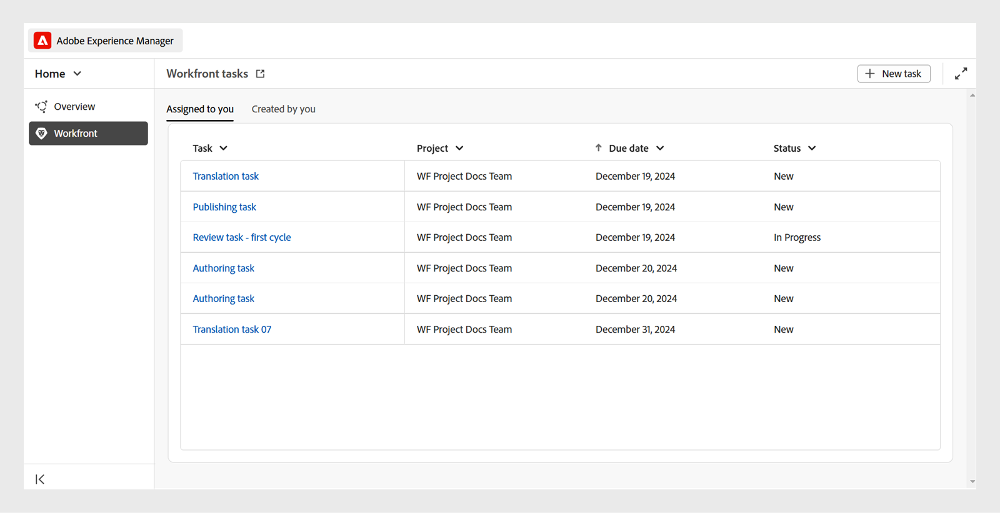
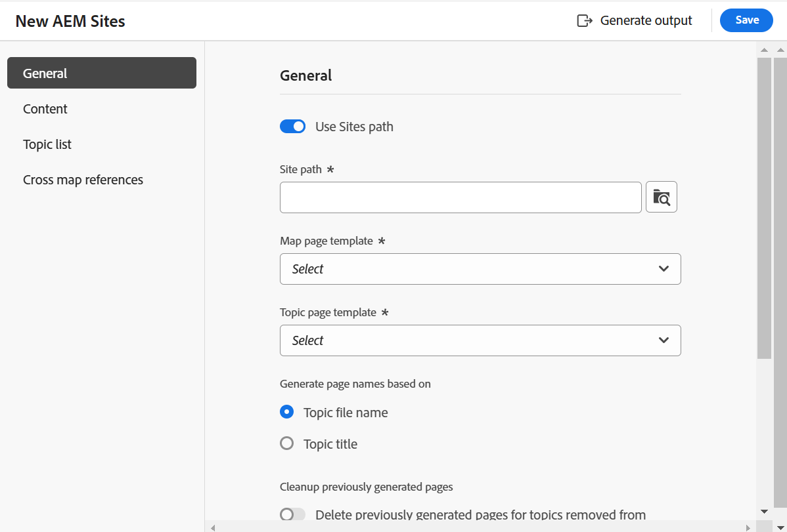

# 5.0.0 リリースの新機能（2025 年 3 月）

この記事では、Adobe Experience Manager Guidesのバージョン 5.0.0 で導入された新機能と機能強化について説明します。

このリリースで修正された問題のリストについては、[5.0.0 リリースで修正された問題 &#x200B;](../release-info/fixed-issues-5-0-0.md) を参照してください。

[5.0.0 リリースのアップグレード手順 &#x200B;](../release-info/upgrade-instructions-5-0-0.md) について説明します。

## Experience Manager Guides UI が改訂され、生産性とエクスペリエンスが向上しました

Adobe Experience Manager Guidesのデザインと機能が刷新され、以前よりも迅速かつ効率的に作業できるようになりました。 新しい UI は、新しいホームページ、よりクリーンで整理されたエディターツールバー、専用のマップコンソール、強化された機能により、直感的で強化されたユーザーエクスペリエンスをもたらします。

主なハイライトは次のとおりです。

- **ホームページの概要**:Experience Manager Guidesに、最近アクセスしたファイルやコレクションなどのクイックビューを含む、直感的なスタートアップスクリーンエクスペリエンスを提供するホームページが追加されました。

  詳しくは、[Adobe Experience Manager Guidesのホームページエクスペリエンス &#x200B;](../user-guide/intro-home-page.md) を参照してください。

  {width="800" align="left"}

- **新しいエディターのエクスペリエンス**：エディターの新しいルックアンドフィールを体験してください。 刷新されたエディターインターフェイスは、よりクリーンで整理されたツールバー、シームレスなナビゲーション、全体的な直感的なエクスペリエンスを備えており、ドキュメントをより迅速かつ効率的に作成するのに役立ちます。

  [&#x200B; エディターの機能について &#x200B;](../user-guide/web-editor-features.md) 説明します。

  {width="800" align="left"}

- **専用マップコンソール**：すべてのマップ管理および公開機能をまとめた専用コンソールであるマップコンソールが導入されました。 出力の生成、コンテンツの翻訳、レポートの作成などのオプションをすべて 1 つのインターフェイス内で利用できるようになりました。

  詳しくは、[&#x200B; マップ管理と公開 &#x200B;](../user-guide/map-console-overview.md) を参照してください。

  {width="800" align="left"}

## Adobe Workfrontとの統合による堅牢な作業管理機能

Experience Manager GuidesはAdobe Workfrontとシームレスに統合されるようになり、Experience Manager Guidesのコア CCMS 機能に加えて、堅牢なプロジェクト管理機能にもアクセスできるようになりました。

この統合を使用すると、Experience Manager Guidesから直接Adobe Workfront タスクを作成および管理できます。 例えば、作成者はレビュータスクを（1 つ以上の DITA トピックまたはマップが追加された状態で）Experience Manager Guides インタフェース内で直接作成し、それをレビュー担当者に割り当てることができます。 レビュー担当者は、Experience Manager Guides レビュー UI で割り当てられたタスクを作業し、コメントを付けて作成者に返すことができます。 同様に、公開タスクと翻訳タスクを作成し、そのタスクを作業する必要があるユーザーに割り当てることができます。

また、統合により、作業キューを監視して、整理された状態を維持し、すべてのタスク（割り当てられたタスク）を常に把握できるようになります。 また、プロジェクト管理者は、Adobe Workfrontの機能を活用して、Experience Manager Guides内の詳細なプロジェクト管理を行うこともできます。

詳しくは、[Workfrontの統合 &#x200B;](../user-guide/workfront-integration.md) を参照してください。

{width="800" align="left"}

## より高速でスケーラブルな新しいAEM Sites パブリッシングエンジン

新しいパブリッシングエンジンは、ページの作成とレンダリングを高速化する複合コンポーネントマッピングで最適化されており、AEM Sitesへのより迅速でスケーラブルなパブリッシングを実現します。 すぐに使用できる編集可能な新しいテンプレートが用意されており、AEM テンプレートエディターを使用して要件に応じてカスタマイズできます。 テンプレートでは、WCM コアコンポーネントと専用のガイドコンポーネントを組み合わせて使用し、エンドユーザーがAEM Sites ページで最高のエクスペリエンスを得られるようにします。 また、この新しい公開エンジンの機能を活用するように既存のテンプレートをカスタマイズすることもできます。

[AEM Sitesの公開の詳細 &#x200B;](../user-guide/generate-output-aem-site-web-editor.md)。

{width="500" align="left"}

## 1 つのトピックを公開するだけで、スタンドアロンコンテンツをAEM Sitesにシームレスに公開できます

AEM Sites ページへの単一トピックの公開を導入しました。これにより、マップ全体を公開する必要なく、個々のトピックをAEM Sites ページに直接公開できます。  これにより、公開プロセスが合理化され、マーケティングコンテンツ、技術速報、その他のスタンドアロンコンテンツなど、スタンドアロンコンテンツを操作する際の効率が向上します。 また、単一のトピックを公開するためのマップを作成する必要がなくなるので、コンテンツのメンテナンスも簡単になります。

詳しくは、[AEM Sitesページの公開 &#x200B;](../user-guide/publish-aem-sites.md) を参照してください。

{width="500" align="left"}

## 豊富なオーサリングエクスペリエンス向けの新しい Markdown エディター

これで、Markdown トピックをオーサリングする、よりクリーンで効率的かつ強力な方法を体験できます。 Experience Manager Guidesでは、よく整理されたツールバーと、コンテンツを同時に作成およびプレビューするための **並べて表示** のビューなどの高度な機能を備えた、新しい Markdown エディターインターフェイスを導入しました。 また、マップの一部である Markdown トピックを複数のチャネルにシームレスに公開できます。

詳しくは、[Markdown オーサリング &#x200B;](../user-guide/web-editor-markdown-topic.md) を参照してください。

{width="800" align="left"}

## エディターの機能強化

新しいリリースの一環として、エディターが次のように強化されました。

**テーブル挿入の機能強化**

- テーブルまたはシンプルな挿入ダイアログで、ヘッダー行、ボディ行および列のデフォルト値を設定できます。
- テーブル設定を設定して、外部ソースからコピーしたテーブルを簡略表またはテーブルとして貼り付ける機能。

  詳しくは、[&#x200B; エディターの機能について &#x200B;](../user-guide/web-editor-features.md#content-insertion-options) のテーブルの節を参照してください。

**DITA エレメントのフレンドリ名機能の拡張**

DITA エレメントのフレンドリ名機能が改善されました。 わかりやすい名前を要素に割り当てても、デフォルトの列挙値が保持されるようになりました。また、更新された名前は、パンくず、コンテンツのプロパティ、再利用可能なコンテンツパネル、用語集パネルおよびその他の関連する場所に反映されます。

**フィルタリングされた検索の強化されたエクスペリエンス**

Adobe Experience Manager Guides リポジトリー内のフィルター適用済み検索結果に対するアセット表示制限が増加しました。 検索結果として、検索条件に一致する関連アセットまたはファイルがすべて返されるようになりました。 リストをスクロールしてより多くの結果を読み込むことができるため、必要なアセットを見つけるために繰り返し検索を実行する必要はありません。

**要素として追加された画像の代替テキスト**

最新の DITA 標準に従って、画像は代替テキストに `<alt>` 要素を使用するようになりました。 代替テキスト `@alt` 属性の使用は廃止されましたが、以前の DITA バージョンでも引き続きサポートされます。

**エディターツールバーでの相互参照のカスタマイズ**

次に、**相互参照** 用のカスタムツールバーボタンを作成して、メニューオプションの 1 つに直接アクセスします。 例えば、web リンク、メールリンク、ファイル参照、または要件に応じてその他の使用可能なオプションに直接ジャンプするように、このオプションを設定できます。

詳しくは、[&#x200B; トップバーとツールバーのカスタマイズ &#x200B;](../guides-ui-extensions/customisations/toolbar-topbar.md) を参照してください。

## 機能強化の確認

新しいリリースの一部として、レビューが次のように強化されました。

- これで、レビュータスクを作成する際に、プロジェクト名を入力すると、「プロジェクト」ドロップダウンリストですばやく見つけて選択できます。 この機能強化により、長いプロジェクトリストをスクロールする必要がなくなるので、特に複数のプロジェクトを管理する場合に、レビュータスクを割り当てるのが速く、より効率的になります。

- エディターとレビューの UI で、レビュー **返信** ボックスが複数行のエントリをサポートするようになりました。 **Shift**+**Enter** を使用すると、次の行に移動できます。 コメントの書き込み中にコメントボックスを展開することもできます。

  詳しくは、「トピックを確認 [&#x200B; を参照してください &#x200B;](../user-guide/review-topics.md)。

- これで、作成者は、レビュータスクがクローズドとマークされている場合でも、エディターでレビューコメントにアクセスできるようになりました。 最新の機能強化では、レビューパネルには、エディター内の各プロジェクトのアクティブなレビュータスクと閉じられたレビュータスクの両方が含まれています。 閉じられたレビュータスクを選択すると、対応するコメントが右側のコメントパネルに表示され、タスクが閉じた後も重要なレビュータスクに継続的にアクセスできるようになります。

  詳しくは、[&#x200B; エディターの機能について &#x200B;](../user-guide/web-editor-features.md) のレビューの節を参照してください。

## 公開機能の強化

新しいリリースの一部として、次の公開機能が強化されました。

**ネイティブPDFの機能強化**

- Native PDF出力の生成時に、トピックの `prolog` 要素（著作権、作成者、その他の詳細など）のメタデータをページレイアウトに含める機能。 これにより、生成される PDF がより詳細になり、重要なコンテキストが提供されるので、読者にとって情報が多くなります。

  詳しくは、[&#x200B; ページレイアウトへのフィールドやメタデータの追加 &#x200B;](../native-pdf/design-page-layout.md#add-fields-and-metadata-add-fields-metadata) を参照してください。

  {width="300" align="left"}

- ネイティブ PDF出力用の DITA-OT 前処理を有効または無効にするオプションが導入されました。 コンテンツの処理中に DITA-OT ベースの正規化またはカスタム DITA-OT プラグインが必要な場合は、このオプションを有効にします。 これにより、PDF生成に向けたコンテンツの処理方法をより詳細に制御できます。 デフォルトでは、この設定は **有効** に設定されています。

  詳しくは、「PDF出力プリセットの操作 [&#x200B; を参照してください &#x200B;](../user-guide/generate-output-pdf.md)

  {width="500" align="left"}

- ネイティブPDF出力生成の印刷設定が、使いやすくするために **テンプレート** 設定から **ネイティブPDF出力プリセット** に変更されました。 カラープロファイルなど、異なる印刷設定を持つオンライン PDF と印刷 PDF に同じテンプレートを使用できるようになりました。

  詳しくは、[&#x200B; ネイティブのPDF出力プリセット &#x200B;](../web-editor/native-pdf-web-editor.md) を参照してください

- 特に長い PDF で、シームレスなページナビゲーションを行うために、ネイティブ PDF出力に TOC ページのブックマークを追加する機能。

  詳しくは、[PDF出力へのカスタムブックマークの追加 &#x200B;](../native-pdf/add-custom-bookmark.md) を参照してください。

## コンテンツ管理の機能強化

新しいリリースの一環として、コンテンツ管理が次のように強化されました。

**レポートのカスタムメタデータフィールド**

この機能を使用すると、**設定** を通じて、レポートのカスタムメタデータフィールドを設定できます。 設定が完了すると、これらのフィールドは、レポートのフィルターパネルの **列** の下に表示されます。ここで選択または選択解除して、表示を制御できます。

詳細は、[Map Console の DITA マップレポート &#x200B;](../user-guide/reports-web-editor.md) を参照してください。

**翻訳 UI の更新ボタン**

翻訳 UI に「更新」ボタンが導入され、更新されたファイルとステータスで翻訳ダッシュボードを更新できるようになりました。

**アセット後処理ワークフローの強化**

Asset の後処理のサポートは、REST API および API SDKを介して提供されています。 これで、アセット処理イベントがトリガーされ、リッスンして詳細なワークフローを定義できるようになります。

詳しくは、[&#x200B; 後処理イベントハンドラー &#x200B;](../api-reference/post-process-event.md) を参照してください。

## 廃止される機能

**クイック生成**

Experience Manager Guidesでは、リポジトリビューまたはマップビューから直接出力を生成する **クイック生成** 機能がサポートされなくなりました。

この機能は、リポジトリとマップの表示パネルの両方から削除されています。 すべてのマップ管理および公開関連のアクションに **マップコンソール** を使用することをお勧めします。

詳しくは、[&#x200B; マップの管理と公開 &#x200B;](../user-guide/map-console-overview.md) を参照してください。

**ルートマップメタデータ引数を DITA-OT コマンドラインに渡す**

DITA-OT コマンドラインを使用してルートマップメタデータ引数を渡す機能は、リリースの一部として非推奨（廃止予定）になりました。 必要な DITA-OT メタデータを渡すには、プリセットの **File プロパティ** または **Metadata** フィールドを使用することをお勧めします。

DITA-OT コマンドラインでメタデータを引き続き渡すには、`Config.Manager` でメタデー `pass.metadata.args.cmd.line` を更新する必要があります。

詳しくは、[&#x200B; 出力生成設定の指定 &#x200B;](../cs-install-guide/conf-output-generation.md#configure-the-dita-ot-command-line-argument-field-to-accept-root-map-metadata) を参照してください。
