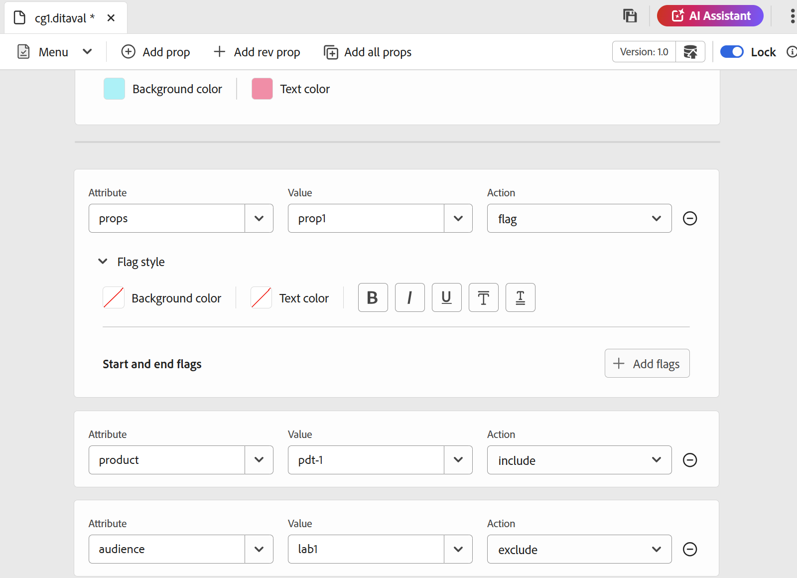

# 5.1.0 リリースの新機能（2025 年 9 月）

この記事では、Adobe Experience Manager Guides バージョン 5.1.0 で導入された新機能と機能強化について説明します。

このリリースで修正された問題のリストについては、[5.1.0 リリースで修正された問題 &#x200B;](fixed-issues-5-1-0.md) を参照してください。

[5.1.0 リリースのアップグレード手順 &#x200B;](../release-info/upgrade-instructions-5-1-0.md) について説明します。

## レビューワークフローの強化

このリリースでは、作成者とレビュー担当者間のシームレスな通信をサポートできるように、レビューワークフローが大幅に強化されました。 主なアップデートは次のとおりです。

- アクションにつながる通知を含むタスク管理ワークフロー
- ユーザーにタグ付けして即座に対応する機能
- 使いやすくするために、レビューパネルからプロジェクトおよびタスクの詳細にアクセスする

これらの機能強化により、次のことが可能になりました。

- 効率的でタイムリーなレビューサイクル
- フィードバック交換の際の手作業の削減

詳しくは、「レビューの概要 [&#x200B; を参照してください &#x200B;](../user-guide/review.md)

## DITAVAL ファイルの作成と使用の操作性が向上しました。

この更新では、DITAVAL ファイルの作成、管理、適用を簡素化するいくつかの機能強化が導入されており、条件付きコンテンツと出力間のスタイル設定をより詳細に制御できます。

主なハイライトは次のとおりです。

- **DITAVAL ファイルのオーサリングにおける強化されたフラグ設定のサポート：** Experience Manager Guidesでは、DITAVAL ファイルでの強化されたフラグ設定のサポートを通じて、コンテンツの公開をカスタマイズする新機能を提供します。 画像などの特定のコンテンツに関する開始フラグと終了フラグを適用したり、フラグの付いたセクションを太字、斜体などの書式設定オプションで強化したりできるようになりました。 条件の重複を処理するには、デフォルトの背景色やテキスト色の設定など、**スタイルの競合** を設定し、出力を明確にし一貫性を保つことができます。 これらのフラグは、Native PDFの生成で完全にサポートされており、結果の出力は、適用されているすべてのスタイル設定要素を正確かつ包括的に反映します。
詳細については、[DITAVAL エディタの使用 &#x200B;](../user-guide/ditaval-editor.md) を参照してください。

  {width="350" align="left"}

- **複数の DITAVAL ファイルでネイティブPDFPDFをサポート：** 複数の DITAVAL ファイルを追加した場合、それぞれのファイルがタグ付けされたエントリとして表示され、識別と削除が容易になり、PDF出力で条件付きコンテンツをより柔軟に制御できるようになりました

  さらに、この更新により、複数の形式をまたいで編集可能な DITAVAL フィールドが有効になり、ユーザーが DITAVAL パスを手動で指定できるようになり、出力プリセットの作成が強化されます。

  詳しくは、Experience Manager Guidesの [&#x200B; 出力プリセットについて &#x200B;](../user-guide/generate-output-understand-presets.md) を参照してください。

## 公開機能の強化

新しいリリースの一部として、次の公開機能が強化されました。

### 出力生成ログのフィルタリングの改善

このリリースでは、出力生成ログのフィルタリング機能に対する UI の改善が行われています。 出力生成ログを 4 つの異なるレベル（**Info**、**Warn**、**Error** （エラーと例外の両方を含む）、**Fatal**）すべてでより適切にフィルタリングできるようになりました。改善された直感的な色分けされたインジケーターにより、分析が簡素化され、ログストリーム全体での表示が鮮明になります。 この機能強化により、ログをより効率的に移動し、重要な問題を正確に特定できるようになります。

詳しくは、[&#x200B; 基本トラブルシューティング &#x200B;](../user-guide/generate-output-basic-troubleshooting.md) を参照してください。

{align="left"}

### 公開済み出力用の一時ファイルに、オーサー URL とパブリッシュ URL が新しい設定ファイルに含まれるようになりました

Experience Manager Guidesの最新の公開機能強化により、DITA-OT を使用してHTML、PDF、JSON 出力を公開する際に生成された一時ファイルと、ネイティブのPDF出力に、新しい `system_config.xml` ファイルが追加されるようになりました。 このファイルは公開ジョブに自動的に含まれ、プリセットの **一時ファイルを保持** オプションを有効にして出力を生成すると、一時ファイルを通じてアクセスすることもできます。

`system_config.xml` ファイルには、オーサー URL、ローカル URL、公開 URL など、AEM インスタンスの詳細が含まれています。これにより、コンテキストが明確になり、ダウンロードした URL のトレーサビリティが向上します。

詳しくは、[&#x200B; 出力プリセットについて &#x200B;](../user-guide/generate-output-understand-presets.md) を参照してください。

### 出力生成用の新しい出力パス変数のサポート

この更新では、Native PDF、DITA-OT PDF、JSON、HTML5、Custom などの出力プリセットの動的な `output path` 設定が導入されました。 固定パスを使用する代わりに、インストール時に `${base_output_path}` 変数を使用して出力場所を定義できるようになり、柔軟性が向上しました。 以前のデフォルトパス `/content/dam/fmdita-outputs` は必須ではなくなりました。

グローバルフォルダープロファイルプリセットに関連付けられているすべての出力パスは、新しいベース出力パス変数を利用するように自動的に移行されます。 ただし、カスタムフォルダープロファイルの場合は、移行は自動的には行われないので、カスタマーサクセスチームにお問い合わせください。

詳しくは、[&#x200B; 出力プリセットについて &#x200B;](../user-guide/generate-output-understand-presets.md) を参照してください。

### エクスポートされたベースラインにドキュメントの状態が含まれるようになりました

ベースラインの書き出し機能に、ベースラインスナップショットのタイトル、ファイル名、ファイルタイプ、バージョン番号などの重要な詳細と共に **ドキュメントの状態** が含まれるようになりました。 この機能強化により、ベースラインの概要をより包括的に提供することで、ベースライン管理が向上します。

詳しくは、[&#x200B; マップコンソールからのベースラインの作成と管理 &#x200B;](../user-guide/web-editor-baseline.md#manage-baselines) を参照してください。

### 従来のコンポーネントマッピングを使用したAEM Sites出力のマップダッシュボードを介したベースライン駆動型の増分公開のサポート

増分出力生成プロセスが強化され、レガシーコンポーネントマッピングを使用してAEM Sites 用に選択したベースラインで定義されたトピックの特定のバージョンを公開できるようになり、出力に含まれるコンテンツが正確に反映されるようになりました。

詳しくは、[&#x200B; 増分出力の生成 &#x200B;](../user-guide/generate-output-aem-site.md) を参照してください。

## エディターの機能強化

新しいリリースの一環として、エディターが次のように強化されました。

### 再利用可能なコンテンツパネルの検索エクスペリエンスの強化

Experience Manager Guidesでは、再利用可能なコンテンツパネルの検索エクスペリエンスが強化されました。 この更新により、キーワードを検索する際に、開いているコンテンツだけでなく、再利用可能なコンテンツとして追加されたすべてのファイルをスキャンするようになり、コンテナが開いているか折りたたまれているかに関わらず、すべてのオカレンスにわたるキーワードの正確な位置を確実に見つけることができます。 さらに、検索バーをクリアしても、すべてのコンテナの元の状態が保持されるので、より効率的で使いやすい検索機能が提供されます。

詳しくは、[&#x200B; 再利用可能なコンテンツ &#x200B;](../user-guide/web-editor-features.md#reusable-content) を参照してください。

### 参照リンクに「Format」属性が追加されました

Adobe Experience Manager Guidesに、エディター内の参照リンクの **format** 属性が追加されるようになりました。 この属性は **Source ビューに表示され** ファイルの種類を明確に示します。例：

- 拡張子が **.pdf** のファイルの場合、形式は **pdf** に設定されます
- 拡張子が **.html** のファイルの場合、形式は **html** に設定されます
- **.dita** または **.ditamap** ファイルを含むファイルの場合、フォーマットは **dita** に設定されます

また、拡張子が **.xml** のファイルのフォーマットも **dita** に設定されます。 拡張子のないファイルの場合、形式は空白のままになります。 さらに、スコープが **external** に設定されている参照リンクの場合、参照リンクのファイル拡張子にかかわらず、形式は **html** に設定されます。

### エディターの強化されたマップダウンロードオプション

Experience Manager Guidesの **マップをダウンロード** ダイアログに、新しい **実際のファイル名を使用** オプションが導入されました。 マップ ファイルをダウンロードするときに、既定の UUID の代わりに元のファイル名を保持するように選択できるようになりました。これにより、ファイルの認識と管理がはるかに容易になります。 このオプションは、[**ファイル階層を保持**] を選択した場合にのみ使用でき、[**ファイル階層をフラット化**] を選択した場合は使用できません。これにより、ダウンロードしたマップをより柔軟に編成できます。

詳しくは、[&#x200B; ファイルのダウンロード &#x200B;](../user-guide/authoring-download-assets.md#download-a-dita-map-file-from-the-editor) を参照してください。

{width="300" align="left"}

### コンテンツが誤って失われるのを防ぐためのセッションタイムアウトプロンプト

Adobe Experience Manager セッションの有効期限が切れ、無操作状態が原因でログアウトされたことを知らせるポップアップメッセージが表示されるようになりました。 このメッセージは、セッションが終了した後に、Experience Manager Guidesでコンテンツを編集しようとするとトリガーされます。 この機能により、未保存の作業が失われるリスクが軽減され、操作がない期間でもエクスペリエンスの全体的な信頼性と流動性が向上します。

詳しくは、Experience Manager Guidesの [&#x200B; セッションタイムアウトプロンプト &#x200B;](../user-guide/session-timeout-prompt.md) を参照してください。

### エディターでの `navref` 処理の強化

エディタの最新の機能強化により、DITA マップ内のエレメント `navref` 処理が改善されました。 `navref` 要素をマップに追加すると、&lbrack;**パスを選択** ダイアログが開き、マップにナビゲーション リンクとして含めるマップ参照を簡単に選択できます。 追加されたマップのタイトルは、オーサービューとレイアウトビューの両方に表示されるため、オーサリング中に含まれるナビゲーションをより明確に把握できます。  さらに、追加された `navref` 要素は自動的に解決され、エディターに参照マップが表示されます。

詳しくは、[&#x200B; ナビゲーション参照を追加 &#x200B;](../user-guide/map-editor-other-features.md#add-navigation-references) を参照してください。

### エディターツールバーとユーザーの環境設定の UI の改善

このリリースでは、[ ホーム ] ページの [ 一般 ] タブと [ 外観 ] タブの **ユーザ環境設定** 内の設定が再構成されました。 これには、ラベルの名前の変更 **マップの環境設定を開く** や、非改行スペースの切り替えをエディターツールバーに移動する作業が含まれます。

さらに、エディターツールバーで、変更履歴、タグ、改行なしスペースを有効または無効にするためのクイックアクセス切り替えのいくつかが、メニューのドロップダウン内の **表示** オプションの下にグループ化され、使いやすくなりました。

詳しくは、[&#x200B; エディターのツールバー &#x200B;](../user-guide/web-editor-toolbar.md#menu-dropdown) を参照してください。

