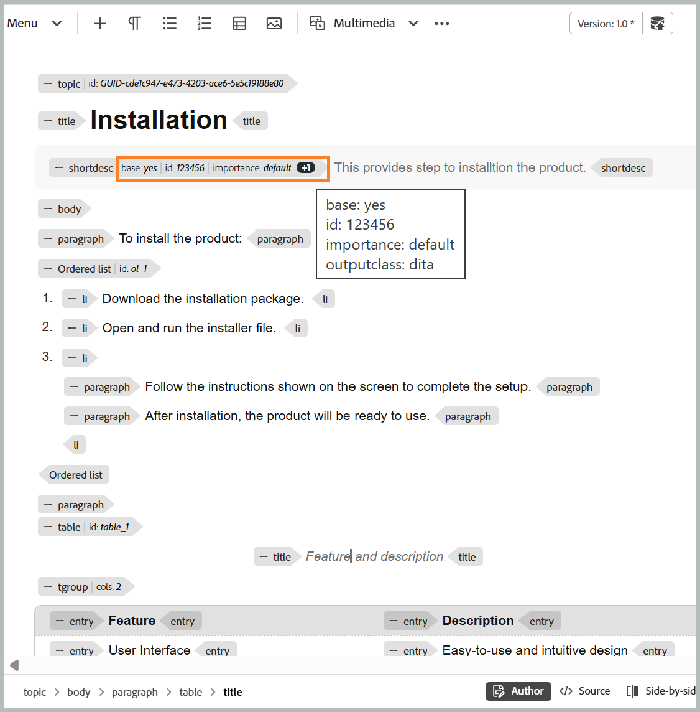
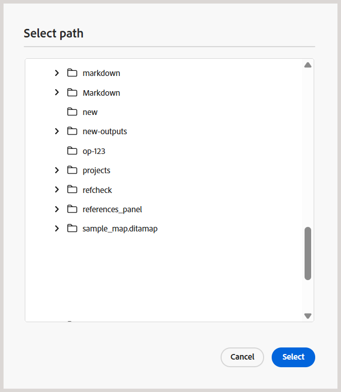
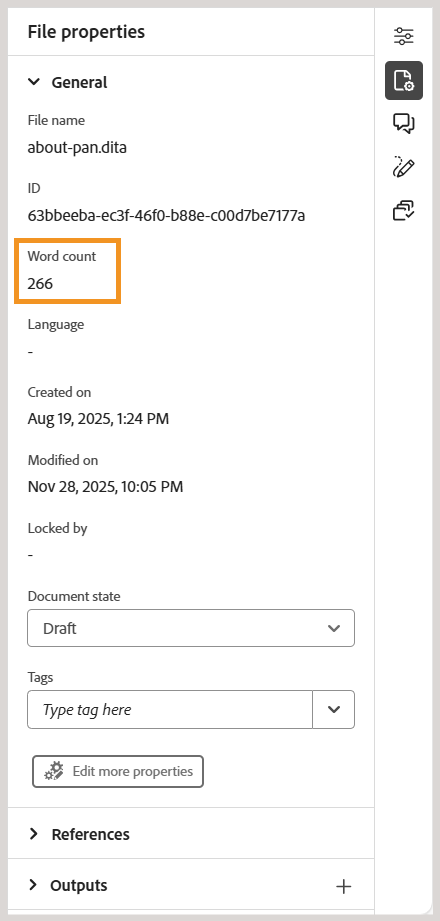
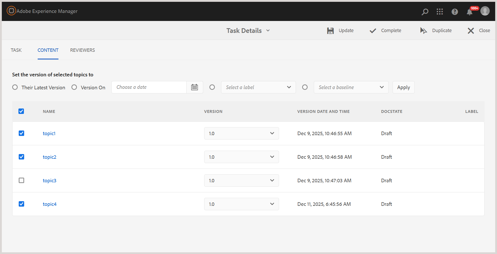
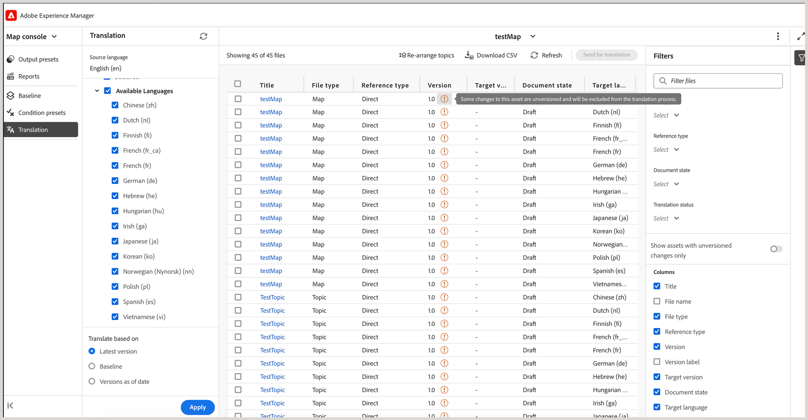

# 5.2.0 リリース（2026年5月）の新機能

この記事では、Adobe Experience Manager Guides as a Cloud Serviceの5.2.0 リリースで導入された新機能と強化機能について説明します。

このリリースで修正された問題のリストについては、[5.2.0 リリースで修正された問題](../release-info/fixed-issues-5-2-0.md)を参照してください。

5.2.0 リリース [&#128279;](../release-info/upgrade-instructions-5-2-0.md)の アップグレード手順について説明します。

## Editor 2.0の概要

エディター2.0 （別名：新しいエディター）は、オーサリングを簡素化し、より直感的なエクスペリエンスを通じて、タグと非タグの両方のモードでより効率的にコンテンツを作成できるようにします。 このリリースでは、ページの読み込みが高速化され、大規模で複雑なトピックでもスムーズに編集できるようになり、パフォーマンスが向上しました。 また、ナビゲーションやカーソルの動作などの主要なオーサリングギャップに対処することで、安定性を向上できます。 さらに、モダンなインターフェイスにより、リフレッシュされたユーザーフレンドリーなUIを提供し、使いやすさと機能性のバランスを取ることができます。 詳しくは、[&#x200B; エディターの概要](../user-guide/web-editor.md)を参照してください。

エディター2.0の機能を紹介する概要動画です。

>[!VIDEO](https://video.tv.adobe.com/v/3484007)

以下に、オーサリングをより簡単かつ効率的にする機能強化を示します。

### ユーザーインターフェイスとエクスペリエンスの再設計

更新されたインターフェイスは、全体的な使いやすさを向上させ、ナビゲーションとコンテンツのオーサリングをより直感的で一貫性のあるものにします。

- **オーサーおよびプレビューモードの要素のCSSが充実**：要素のデフォルト CSSが強化され、オーサリングモードとプレビューモードの両方でスタイルが改善され、視覚的な一貫性が向上しました。

  {width="650"}

- **ダークテーマのサポート**: コンテンツ編集領域でダークテーマをサポートすると、ダークインターフェイスを使った作業を好むユーザーのオーサリングエクスペリエンスが向上します。

  {width="650"}

- **統合されたユーザーレベルのエディター設定**：作成者がエディターの動作をより適切に制御できる新しい一元化された設定パネルにより、ユーザーは単一の場所からより簡単に環境設定を管理できます。 設定オプションには、有効/無効にする機能が含まれます。

   - 作成者モードの非改行スペース
   - 属性を使用するか、属性を使用しない表示設定にタグ付け
   - 作成者モードでのXML コメント
   - エディターでのエレメント挿入用のクイック挿入メニュー

  {width="350"}

  エディター設定の設定方法について詳しくは、[&#x200B; エディター設定](../user-guide/config-editor-settings.md)を参照してください。

- **作成者モードでのコンディショナルコンテンツの表現を改善**：コンディショナルコンテンツが作成者モードでより明確に表示され、作成者がより効果的にバリエーションを特定および管理できるようになります。 詳しくは、エディターの左パネルの[条件](../user-guide/web-editor-left-panel.md#conditions)を参照してください。

  {width="650"}

### オーサリング機能の強化

コンテンツの制作と編集のワークフローを合理化するための改善されたツールと柔軟性を提供します。

- **属性と要素をタグモードで表示**：作成者は、タグモードで要素の属性を表示できるようになり、構造化コンテンツの可視性と制御が向上しました。 この機能を設定するには、[&#x200B; エディター設定](../user-guide/config-editor-settings.md)を表示します。

  {width="650"}

- **クイック挿入メニュー**: ツールバーに移動することなく、作成者モードでカーソル位置で編集中にエレメントを直接追加できるようにします。 頻繁に使用される要素は、「お気に入り」セクションでエディター設定を使用して設定し、すばやくアクセスできます。 詳しくは、[&#x200B; トピックの編集](../user-guide/web-editor-edit-topics.md)を参照してください。

  {width="650"}

- **作成者モードでXML コメントを表示、編集、挿入する機能**：作成者が作成者モードでXML コメントを直接表示、編集、挿入できるようにして、コンテンツ内の可視性を向上させます。 この機能を設定するには、[&#x200B; エディター設定](../user-guide/config-editor-settings.md)を表示します。

  {width="650"}

- **並べて表示**：作成者モードとSource モードを同時に表示でき、両方のビューが完全に同期しているため、コンテンツの変更を簡単に比較、編集、検証できます。 詳しくは、[&#x200B; エディタービュー](../user-guide/web-editor-views.md)を参照してください。

  {width="650"}

- **テーブルのオーサリングを改善**：テーブルの作成と管理をより直感的で効率的な操作で行うことで、テーブルのオーサリング全体のエクスペリエンスを向上させます。

   - 柔軟で直感的なインタラクション：行や列の挿入が簡単で、行や列の並べ替えにドラッグ&amp;ドロップで対応します。
   - コンテキストツールバー：テーブル内で、書式設定、整列、結合、その他の追加アクションなど、テーブル固有のアクションに直接アクセスできます。
   - テーブルの設定：1回のアクションで複数の行または列を追加することで、繰り返しのステップを減らし、効率を向上させます。

  {width="650"}

  詳細については、[&#x200B; テーブルの操作](../user-guide/web-editor-other-features.md#work-with-tables-in-the-new-editor)を参照してください。

### 大きなトピックのパフォーマンスの向上

新しいエディターでは、コンテンツのレンダリング速度の向上、信頼性の高い取り消しとやり直し機能、未保存の変更を明確に示す汚れたマーカーが提供され、大規模で複雑なトピックを操作する際のエクスペリエンスが向上しました。

## ホームページに新しいリポジトリを導入し、検索体験を強化

ホームページから直接アクセスできるようになったこのリポジトリは、フォルダーとファイルの見つけやすさを向上させるための一元化されたスペースとして機能します。 専用の&#x200B;**フォルダーナビゲーションパネル**&#x200B;と、カスタマイズ可能な&#x200B;**リポジトリの表形式表示**&#x200B;を備えています。 刷新された検索とフィルターのエクスペリエンスにより、ファイルの検索と検索が大幅に簡単になりました。 詳しくは、[&#x200B; リポジトリインターフェイスについて](../user-guide/home-page-repository-view.md)を参照してください。

エディター内で、ファイルの検索とフィルターのエクスペリエンスがホームページと一致するようになりました。 エディターインターフェイスの下部にある新しい[検索パネル &#x200B;](../user-guide/search-panel-explorer.md)が導入され、検索結果が表示されます。 さらに、エディターでリポジトリーの名前が&#x200B;**Explorer**&#x200B;に変更され、以前と同じようにフォルダーとファイルを参照できるようになりました。

### ドキュメント状態フィルターのサポート

ファイルの現在のドキュメント状態に基づいて、リポジトリの検索結果をフィルタリングすることもできます。 ドキュメントの状態フィルターを使用すると、フォルダープロファイル内の`ui_config.json` ファイルで定義されている使用可能なフィルター値を使用して検索を絞り込むことができます。

ドキュメントの状態で使用できるデフォルトのフィルター値は、ドラフト、編集、レビュー中、承認済み、レビュー済みおよび完了です。

<!-- For details on customizing the default document state filters values, view [Configure document state filters](../install-conf-guide/conf-doc-state-filters.md).  -->

>[!NOTE]
>
> `ui_config.json`のカスタム設定を使用している場合は、アップグレードする前にそれらの設定をバックアップしてください。 更新後、最新バージョンで導入された変更に合わせて、設定を確認して調整します。

### マルチメディアのサムネールアイコン

すべてのマルチメディアファイルにはサムネールアイコンが表示されるため、**リポジトリ**&#x200B;内の画像を視覚的に識別して見つけやすくなります。 この機能強化は、**検索パネル**&#x200B;でファイルを検索する際にも適用され、マルチメディアアセットを他のファイルタイプと素早く区別するのに役立ちます。

## 検索と置換でのSource モード検索の概要

Experience Manager Guidesでは、エディターインターフェイスの左パネルで使用できる「検索と置換」機能に対して、いくつかの機能強化が導入されました。 ユーザービリティを向上させるUIの改善に加え、このリリースでは、**検索と置換** パネルに新しい&#x200B;**ソースモードを使用** トグルが導入されました。

このモードを有効にすると、表示されているコンテンツだけでなく、検索された文字列の基になるソースコンテンツ（要素、タグ、属性値を含むXML構造）に対してもグローバル検索を実行できます。 このモードでは、コンテンツ全体で包括的な検索が可能です。

{width="650"}

このモードでは、フィルターを適用して、ファイルタイプ、ドキュメントの状態、最終更新日などで検索を絞り込むことができます。 また、「すべてを置換」操作を実行した後に詳細なCSV レポートをダウンロードするオプションもあります。これにより、実行したすべての置換アクションのスナップショットと、その成功と失敗のステータスが表示されます。

詳細については、_エディターの左パネル_&#x200B;の[検索と置換](../user-guide/web-editor-left-panel.md#find-and-replace) セクションを参照してください。

>[!NOTE]
>
> 検索と置換パネルの&#x200B;**ソースモード**&#x200B;機能を使用するには、最初にインデックス再作成を完了する必要があります。

## ファイルとフォルダーのブラウジング体験の向上

このリリースでは、Experience Manager Guidesでファイルとフォルダーパスを参照するための、よりクリーンで直感的なインターフェイスが導入されました。

ファイルを参照する際に、刷新された&#x200B;**ファイルを選択** ダイアログに、コンテンツリポジトリー全体を表形式でナビゲートするための&#x200B;**リポジトリー**&#x200B;と、頻繁に使用されるトピック、マップ、画像にすばやくアクセスするための&#x200B;**コレクション**&#x200B;の2つのビューを持つタブ付きレイアウトが追加されました。

{width="650"}

主な機能強化は次のとおりです。

- 整理されたナビゲーション用のファイルとフォルダーの表形式ビュー。
- パンくずリストとフォルダーナビゲーションパネルを使用して、フォルダー内を簡単に移動できます。
- 再利用可能なコンテンツ、トピック参照、Schematron、出力プリセット（DITAVALを使用）、Workfrontのマルチファイル選択をサポートします。
- 選択したファイルをプレビューして簡単にレビューできます。複数の選択の場合は、すべてのファイルをプレビューし、必要に応じてプレビューパネルから任意のファイルを削除します。
- 検索とフィルタリングのオプションにより、名前、タイトル、ファイルタイプ、ドキュメントの状態、タグごとに結果を絞り込むことができます。

**パスを選択** ダイアログでは、フォルダーナビゲーション用のツリー構造化ビューも改善され、コンテンツリポジトリー全体のパスをより整理して効率的に選択できるようになりました。

{width="350"}

詳しくは、_エディターのその他の機能_&#x200B;の「[Experience Manager Guides](../user-guide/web-editor-other-features.md#browse-files-and-folders-in-experience-manager-guides)」セクションのファイルとフォルダーの参照を参照してください。

## オーサリング機能

このリリースの一部として、次のオーサリングの機能強化が行われました。

### コンテンツプロパティパネルからファイル内の参照のパスとUUIDにアクセスします

これで、**リンクパス**&#x200B;を使用して選択した参照の相対パスを表示し、**リンク UUID**&#x200B;を使用してコンテンツプロパティパネルから一意の識別子を表示できます。 また、「リンクパス」と「リンク UUID」の横にあるアイコンを使用して、インターフェイスから完全な絶対パスと関連するUUIDを直接コピーできるため、リンクされたアセットを簡単に追跡して再利用できます。

詳しくは、[&#x200B; コンテンツのプロパティ &#x200B;](../user-guide/web-editor-right-panel.md#content-properties)を参照してください。

### メタデータ変更の作業用コピーインジケーター

**ファイルプロパティ**&#x200B;で使用可能なメタデータフィールドへの変更、またはバックエンドで適用されたメタデータフィールドへの変更は、ドキュメントバージョンのアスタリスク （*）もトリガーします。 デフォルトまたはカスタムのメタデータフィールドを追加、削除、または変更すると、ドキュメントのバージョンが_dirty （*）_としてマークされます。 システム生成のメタデータ更新がこのインジケーターに影響を与えるのを防ぐために、管理者はメタデータプロパティの無視リストを設定できます。 メタデータプロパティの設定方法について詳しくは、[&#x200B; メタデータプロパティの無視リストの設定](../install-conf-guide/conf-metadata-prop.md)を参照してください。

### Schematron検証パネルの機能強化

Schematronのユーザーインターフェイスに次の機能強化が加えられ、より明確で使いやすく、検証結果が向上しました。

- 検証パネルでは、Schematron ファイルが追加されていないときに空の状態のメッセージが表示され、次の手順をより明確にし、方向を示します。

  {width="350"}

- 複数のSchematron ファイルを追加すると、統合アコーディオンの下に整理され、設定されたSchematron ファイルをより可視化できます。

  {width="350"}

- Schematron ファイルで定義されたロール属性に基づいて、検証結果は`Fatal`、`Error`、`Warn`、または`Info`に分類されるようになりました。 各カテゴリには、見えるカウントと、より明確な解釈のためのコンテキストのツールヒントが含まれています。

  {width="350"}

Experience Manager GuidesでのSchematron ファイルの使用について詳しくは、[Schematron ファイルのサポート &#x200B;](../user-guide/support-schematron-file.md)を参照してください。

### 翻訳言語のコピーは、エディターインターフェイスの右側のパネルで使用できるようになりました

新しい&#x200B;**翻訳** セクションが、エディターの&#x200B;*ファイルプロパティ*&#x200B;の右側のパネルで使用できるようになりました。 このセクションでは、現在開いているアセット（マップ、トピック、画像など）のすべての利用可能な言語コピーに直接アクセスできます。 これらの言語コピーを表示またはアクセスするために、Assets UIに移動する必要がなくなりました。

{width="350"}

言語コピーごとに、ファイルにカーソルを合わせてリポジトリ内のパスを見つけるか、ファイルを選択してエディターで開くことができます。 ファイルを開くだけでなく、**オプション** メニューを使用して多くのアクションを実行することもできます。 実行できるアクションには、編集、プレビュー、UUIDのコピー、パスのコピー、コレクションへの追加、プロパティなどがあります。

詳細については、[&#x200B; エディターの右側のパネル &#x200B;](../user-guide/web-editor-right-panel.md#file-properties)を参照してください。

### プレビューモードでのトピックまたはマップの更新

>[!NOTE]
>
>この動作は、古いエディターにのみ適用されます。 新しいエディターで、プレビューコンテンツが自動的に更新されます。

プレビューモードで既に開かれているマップの新しい&#x200B;**更新**&#x200B;機能の紹介。 この新機能を使用すると、マップ全体またはマップ内に存在する個々のトピックのコンテンツを簡単に更新できます。

- マップ全体（すべてのトピックを含む）を更新するには、エディターの左上隅に新しい「**更新**」ボタンが表示されます。

  {width="600"}

- 個々のトピックのコンテンツを更新するには、新しい&#x200B;**トピックを更新** オプションがコンテキストメニューに導入されます。

  {width="600"}

詳しくは、[&#x200B; マップエディター機能](../user-guide/map-editor-advanced-map-editor.md)を参照してください。

### トピックとマップの単語数

マップまたはトピックファイル内に存在する単語数を追跡できるようになりました。 右側パネルの新しい&#x200B;**文字数** フィールドには、トピック（またはマップ）内に存在する単語の合計数が表示されます。この場合、スペースで区切られた単語は個々の単語としてカウントされます。 変更を保存するたびに自動的に更新されます。 相互参照の場合は、表示テキストのみが含まれ、キーは除外されます。

{width="350"}

詳しくは、[&#x200B; エディターの右側のパネル &#x200B;](../user-guide/web-editor-right-panel.md#file-properties)を参照してください。

### 作成者ビューで、トピックやマップ内の重複するIDを簡単に識別して修正できます

Experience Manager Guidesでは、エディターに「**重複ID**」ボタンが追加され、1つのトピックまたはマップ内に存在する重複IDをすばやく特定して修正できるようになりました。 重複したIDが検出されると、このボタンは&#x200B;**作成者** ビューのエディターインターフェイスの左下隅に表示されます。 ボタンを選択すると、重複IDを持つすべてのインスタンスのリストがポップオーバーに表示されます。 インスタンスを選択すると、トピックまたはマップ内の対応するコンテンツがハイライト表示され、右側のパネルから重複するIDを見つけて修正できます。

詳細については、[&#x200B; エディターの追加機能](../user-guide/web-editor-other-features.md)を参照してください。

{width="350"}

### リポジトリおよびレポートフィルターの機能強化

リポジトリの詳細フィルターの下にある&#x200B;**Locked by** フィルターと、DITA マップの&#x200B;**Author** フィルターでは、一度にすべてを一度に読み込むのではなく、スクロールするとユーザーリストが徐々に読み込まれるようになりました。 ページ分割された読み込みにより、速度が向上し、大規模なユーザーデータセットをより効率的かつシームレスに操作できるようになります。

### すべてのJournal フィールドで引用を検索する

これで、**引用を追加** ダイアログの&#x200B;**任意フィールド** オプションを使用して、*タイトル*、*ジャーナル タイトル*、*作成者*、*年*、*ボリューム*、*番号*、*ページ*&#x200B;など、すべてのジャーナル フィールドで引用を検索できるようになりました。 検索では、入力したテキストに基づいて、最も近い一致する引用が返されます。

Experience Manager Guidesでの引用の追加について詳しくは、[&#x200B; コンテンツでの引用の追加と管理](../user-guide/web-editor-apply-citations.md)を参照してください。

{width="350"}

### Workspaceの設定に名前が変更され、ホームページからアクセスできるようになりました

ナビゲーションと使いやすさを向上させるために、次の機能強化が導入されました。

- エディターの「**その他のアクション**」メニューの「**設定**」の名前が&#x200B;**Workspace設定**&#x200B;に変更されました。
- 以前はエディターとマップコンソールのインターフェイスでのみ使用していた&#x200B;**詳細アクション** メニュー（3点メニュー）に、[&#x200B; ホームページ &#x200B;](../user-guide/intro-home-page.md)からアクセスできるようになりました。

  

### AI アシスタントのスマートな提案のインデックス作成を強化

AI アシスタントのスマート提案の各インデックス作成の試みのステータスを、新しいステータスインジケーター（インデックス作成が完了、同期中でない、処理中、インデックス作成に失敗）で簡単に追跡できるようになりました。 最後のインデックスタイムスタンプは、トレーサビリティを向上させるために、フォルダープロファイルレベルで記録されるようになりました。 さらに、インデックス作成のフォルダーまたはファイルパスを指定する場合は、親と子のフォルダーの制限が適用されます。

詳しくは、[&#x200B; スマートヘルプとオーサリング用のAI アシスタントの設定](../install-conf-guide/conf-profiles.md#configure-ai-assistant-for-smart-help-and-authoring-only-for-cloud-service)を参照してください。

## 機能強化を見る

このリリースの一部として、次のレビューの機能強化が行われました。

### レビュータスクの自動リマインダー

レビュータスクの期日の前と期限切れになった後の両方で、**自動リマインダー**&#x200B;を有効にして、レビューアーに対するAEM通知とメールリマインダーをスケジュールできるようになりました。 それぞれのケースで複数のリマインダーを設定できます。事前定義済みのリマインダーは定義された順序で送信され、期限切れのリマインダーは設定されたリマインダースケジュールに基づいて、タスクが期限切れとマークされた後にトリガーされます。 詳細については、[&#x200B; レビュー用にトピックを送信](../user-guide/review-send-topics-for-review.md)を参照してください。

### バージョン履歴

レビュー担当者は、レビュー中のトピックのバージョン履歴にアクセスできるようになりました。これにより、以前にレビューしたトピックと更新されたバージョンを、以前のレビュータスクで表示して比較できます。 これにより、レビュー担当者は、以前のレビューサイクル以降に行われた変更を検証し、現在のレビューコンテキスト内でコメント、ラベル、その他の関連する詳細をレビューすることで、継続性を維持できます。 詳しくは、「[&#x200B; レビュー担当者](../user-guide/review-topics.md#version-history-for-the-reviewer)」のバージョン履歴を参照してください。

### レビューパネルからレビュータスクのステータスに直接アクセス

レビュータスクの開始者として、レビューパネルからレビュータスクのステータスを直接確認できるようになりました。 最新の機能強化では、レビューパネル内の&#x200B;**更新タスク** ダイアログに、新しい&#x200B;**レビューステータスを確認** オプションが含まれています。 このオプションを選択すると、レビューダッシュボードに直接アクセスできます。このダッシュボードでは、レビューアーごとにタスクのステータスを表示でき、コンテキストを切り替えることなく、タスクの進捗状況にすばやくアクセスできます。

詳細については、[&#x200B; レビューの依頼または作成者としてのレビュータスクの終了](../user-guide/review-close-review-task.md)を参照してください。

{width="350"}

### アクティブなプロジェクト選択に基づくレビュー担当者の割り当て

- レビュータスクへのレビューアーの割り当てが、アクティブなプロジェクト選択に依存するようになりました。 「*レビュータスクを作成*」ページの「**割り当て**」フィールドは、アクティブなプロジェクトが選択されるまで無効のままです。 プロジェクトを選択すると、**割り当て先** フィールドが有効になり、そのプロジェクトに関連付けられているユーザーとユーザーグループのみが一覧表示されます。 これにより、レビュータスクは有効なプロジェクトメンバーにのみ割り当てられ、意図しないレビューアーの選択を防ぐことができます。

  

- 「**割り当て**」フィールドで先行検索がサポートされるようになりました。テキストを入力してユーザーまたはユーザーグループをすばやく見つけることができます。

これらの機能強化により、レビュー担当者の選択がより正確かつ効率的になり、プロジェクト固有のレビューワークフローとの連携が強化されます。

詳細については、[&#x200B; レビュー用にトピックを送信](../user-guide/review-send-topics-for-review.md)を参照してください。

### 進行中のレビュータスクの変更

新しいトピックを進行中のレビュータスクに追加したり（以前にレビュー用に送信されていない場合）、レビューワークフローに影響を与えずに進行中のレビュータスクからトピックを削除したりできます。 「**タスクの詳細**」ページでは、トピックを選択または選択解除するだけで、トピックリストを変更できます。 レビュー担当者には、割り当てられたトピックの変更に関する通知が、（AEMおよび電子メールを介して）AEMおよび電子メールで送信されます。 詳細については、[&#x200B; レビュー用にトピックを送信](../user-guide/review-send-topics-for-review.md)を参照してください。

{width="650"}

## 翻訳の機能強化

このリリースの一部として、次の翻訳の機能強化が行われました。

### 翻訳用に送信されたバージョンなしアセットのインジケーター

翻訳を管理する際は、処理のために翻訳を送信する前に、あらゆるコンテンツがバージョン管理されていることを確認することが重要です。 Experience Manager Guidesでは、この問題に対応するために、変更内容が保存されているものの、まだバージョンが設定されていないトピックに対して、明確な指標が提供されるようになりました。

ファイルにバージョンなし変更が含まれている場合（マップに新しいバージョンとして保存されていない場合）、ファイルの横に&#x200B;_info_ アイコンが表示され、更新が存在することを示します。 これらのファイルにすばやくフォーカスするには、フィルターパネルで「**バージョンのない変更を含むアセットのみを表示**」オプションを有効にします。

詳細については、[&#x200B; マップコンソールからのドキュメントの翻訳](../user-guide/translate-documents-web-editor.md)を参照してください。

{width="650"}

## アセット管理の強化

このリリースでは、アセット管理に次の機能強化が導入されています。

### フラット化ファイル階層を使用して、元のファイル名と関連するメタデータを含むマップをダウンロードします

これで、ファイル階層を統合オプションを使用して、元のファイル名のマップをダウンロードできます。 さらに、ダウンロードされたパッケージには`metadata.json` ファイルが含まれているため、関連するメタデータにExperience Manager Guides外で簡単にアクセスして再利用できます。

Experience Manager Guidesでのファイルのダウンロードについて詳しくは、[&#x200B; ファイルのダウンロード &#x200B;](../user-guide/authoring-download-assets.md)を参照してください。

### 読み取り専用ファイルのメタデータプロパティを編集できなくなりました

このリリースでは、`Disable edit without locking the file`設定が有効になっている場合、ファイルが&#x200B;**読み取り専用** モードの場合、ファイルのプロパティを編集できなくなります。

この制限は、DITAおよびMarkdown ファイルのプロパティを変更できるすべてのエントリポイントに適用されます。次の項目を含みます。

- エディターインターフェイスの&#x200B;**右側パネル**
- ファイルのコンテキストメニューの&#x200B;**プロパティ** オプション
- マップのメタデータレポート
- AssetsのUI

DITA以外のアセット（画像やマルチメディアなど）の場合、メタデータプロパティは読み取り専用モードでも編集可能です。

ファイルが読み取り専用の場合は、最初にファイルをチェックアウトしてから、プロパティを変更する必要があります。 この変更により、より厳密な権限管理が実施され、プロパティの更新がコンテンツ編集と同じチェックアウトとロックのルールに従うようになります。

### 正規表現を使用して後処理を有効または無効にする

正規表現を使用して、フォルダーの後処理を有効または無効にできるようになりました。 この機能強化により、管理者は、個々のフォルダーパスを指定するのではなく、単一の設定を使用して、複数のフォルダーまたはフォルダー階層全体に適用される後処理ルールを定義できます。

詳細については、[正規表現を使用して後処理を有効または無効にする](../install-conf-guide/conf-folder-post-processing.md)を参照してください。

### 最適なパフォーマンスを実現するための自動化されたB ツリー・クリーンアップ

システムの効率性を維持し、リソースの過密を防ぐために、新しいバックグラウンドプロセスでは、システムレベルのB ツリーを定期的にクリーンアップします。 これにより、不要になったアセットや一時的に追加されたアセットが、不要なスペースを占有することがなくなります。

このシステムは、クリーンアップの候補をインテリジェントに識別し、自動削除を実行します。 さらに、この機能は設定可能で、管理者は運用上のニーズに基づいて動作を制御できます。

詳細については、[B ツリークリーンアップの設定](../install-conf-guide/conf-btree-cleanup.md)を参照してください。

### 多数のキーを持つDITA マップの処理を改善

多数のキーを含むDITA マップをシームレスに操作できるようになりました。 この機能強化により、読み込みが高速化され、パフォーマンスが向上し、複雑なマップを中断することなく簡単に管理できます。

ビルドのアップグレード後、システムの負荷が一時的に増加し、新しくアップロードされたデータの後処理が遅れる可能性があります。 これは、バックグラウンドで実行されている自動ワンタイムスクリプト（OTS）が原因です。 スクリプトが完了すると、システムのパフォーマンスは通常に戻ります。

### アセット処理の改善

- `/content/dam`内のアセットを最新の状態に保つために、自動化されたプロセスが導入されました。 システムは15分ごとにアセットを再処理することをトリガーします。 各サイクルで、新しく追加されたアセットや、最新の15分以内に未処理のままになったアセットをピックアップして再処理することで、コンテンツリポジトリ全体の効率と一貫性を向上させます。
- フォルダーおよび個別のファイルレベルの両方でアセット処理を実行
- トピック、マップ、マークダウン、HTML/CSS、DITAVAL、その他のサポートされているファイルなど、特定のアセットタイプを選択してアセットをフィルタリングし、必要なファイルのみを処理できます。
- 日付ベースのフィルターを適用して、指定された期間の処理スコープを制限します。
- リポジトリビューとエクスプローラーパネル内のファイルとフォルダーのコンテキストメニューで使用できる新しいオプション（**アセットを再処理**）を使用して、アセットを直接再処理します。

アセットの処理について詳しくは、[&#x200B; アセットの処理](../user-guide/asset-processor.md)を参照してください。

## 公開の機能強化

このリリースの一環として、次の公開機能強化が行われました。

### 特定の出力プリセット用のカスタム画像レンディションの設定

`renditionmapping.xml`の`outputName`属性を使用して、同じ出力タイプの個々の出力プリセットに異なる画像レンディションを設定できるようになりました。 この機能強化により、様々なシナリオに対して様々な画像解像度を必要とするコンテンツを公開する際の柔軟性が向上します。 例えば、HTML5のメイン出力に高解像度の画像を使用し、サムネールを小さくすると軽量なプリセットを作成できます。

詳細については、[出力生成](../install-conf-guide/conf-output-generation.md#handle-image-rendition-during-output-generation)での画像レンディションの処理を参照してください。

### 生成された出力のログのダウンロード

出力を生成してログを表示する際に、新しい「**ログをダウンロード**」ボタンが使用できるようになりました。これにより、ローカル デバイスにログをダウンロードして、簡単にアクセスおよびレビューできるようになりました。

### ネイティブ PDF出力での相互参照の言語変数

ネイティブ PDF出力を公開する場合、[言語変数](../native-pdf/native-pdf-language-variables.md)を使用して、静的な相互参照テキスト（_章_&#x200B;を参照）または&#x200B;_ページ_&#x200B;を参照）を翻訳できます。 変数は、`xml:lang`属性を通じてトピックで定義された言語を使用します。

ネイティブ PDF出力プリセットと相互参照の設定について詳しくは、[&#x200B; ネイティブ PDF出力プリセット &#x200B;](../web-editor/native-pdf-web-editor.md)を参照してください。

### AEM Sitesでのエレメントレベルのコンポーネントマッピングのサポート（複合コンポーネントマッピングを使用） パブリッシング

Experience Manager Guidesでは、（複合コンポーネントマッピングを使用して）AEM Sites出力でエレメントレベルのコンポーネントマッピングがサポートされるようになりました。これにより、チームは`componentmapping.json`を使用してDITA エレメントをレンダリングする方法を正確に制御できるようになりました。 `topicref`、タイトル、画像、テーブルなどを適切なAEM コアコンポーネントにマッピングすることで、テキストコンポーネントにデフォルトで設定されるすべてのものではなく、よりクリーンな構造を得ることができます。 その結果、パフォーマンスが向上し、より豊かでモダンなサイト体験を実現できます。

詳しくは、[AEM Sites](../install-conf-guide/component-mapping.md)のコンポーネントマッピングを参照してください。

## Experience Manager Guidesに新しいベースラインエクスペリエンスが導入された

再設計されたベースラインアーキテクチャに基づいて構築された&#x200B;**新しいベースラインエクスペリエンス**&#x200B;により、大規模で複雑なベースラインの管理が迅速かつ安定し、容易に拡張できるようになりました。 このアップデートは、既存のワークフローを維持しながら、長期的なパフォーマンスと信頼性の課題に対処します。

ベータ版の機能強化として利用可能なこのアップデートは、自動化と大規模なベースライン操作のサポートを追加し、読み込みが遅い、ベースラインの状態に一貫性がなく、より迅速で安定した、より予測可能なベースライン体験を提供することで、管理の制限などの一般的な課題に対するソリューションを提供します。 主な改善点は次のとおりです。

- パフォーマンスと拡張性の向上
- 強力なUIとバックエンドの一貫性
- フィルタリング、ナビゲーション、依存関係の可視化の拡大

詳しくは、[Experience Manager Guidesの新しいベースラインエクスペリエンス（Beta）を参照してください](../user-guide/web-editor-baseline-v2.md)。

## APIの機能強化

このリリースの一環として、次のAPIの機能強化が行われました。

- 新しい翻訳プロジェクトを作成し、そのステータスを追跡するための新しいAPIが導入されました。 これらのAPIは、翻訳プロセスの自動化、手作業の削減、効率性の向上に役立ちます。 詳細については、[翻訳プロジェクトの作成](../api-reference/translation-project.md)を参照してください
- ファイルとフォルダーのフィルタリング機能が改善され、アセット処理APIが強化されました。 詳しくは、[&#x200B; アセットの処理](../api-reference/bulk-assets-processing.md)を参照してください。
- 新しいAPIを使用して、個々のアセットとフォルダーの後処理ステータスを追跡できます。これは、コンテンツが完全に処理された後にのみ公開する必要がある、自動化されたワークフローを使用するチームにとって特に有用です。APIは、準備状況を確認するための信頼性の高い方法を提供し、不完全な処理によって引き起こされる公開エラーのリスクを軽減します。また、このAPIの導入により、アセット後処理イベントが自動的に実行されなくなります。代わりに、管理者は`fmdita config manager`の設定を通じてこのイベントを有効にできるようになりました。
詳細については、[APIを参照して、fmdita config manager](../api-reference/post-process-event.md)の個々のアセットとフォルダー[&#128279;](../api-reference/track-post-processing-status.md)および後処理イベントハンドラー設定の後処理ステータスを追跡します

## Adobe Experience Manager Guidesの製品トレーニングと学習コンテンツの紹介

Experience Manager Guidesの&#x200B;**製品トレーニングと学習** コンテンツ機能を使用すると、トレーニングチームとインストラクショナルデザイナーは、Experience Manager Guides インターフェイスから直接インタラクティブなe ラーニングコースを構築できます。

テンプレート駆動型のオーサリング、インタラクティブなコースコンポーネント、評価のサポートにより、組織の目標に沿った高品質なトレーニングコンテンツを開発することができます。

>[!NOTE]
> 
> Experience Manager Guides as a Cloud Serviceのすべてのインスタンスでは、製品トレーニングと学習コンテンツ機能がデフォルトで無効のままになります。 管理者は、**Workspace settings** > **General**&#x200B;から、フォルダープロファイルレベルでこの機能を有効にできます。

主な機能は次のとおりです。

- 学習コンテンツの一元管理
- テンプレート駆動型オーサリング
- コンテンツの再利用のサポート
- 評価の作成と管理
- web ベースのレビューワークフロー
- 業界をリードする翻訳管理
- すぐに使えるSCORMおよびPDF出力フォーマットを使用したマルチチャネルパブリッシング

詳しくは、[入門ガイド &#x200B;](../learning-content/course-overview.md)および[設定ガイド &#x200B;](../lc-config-guide/introduction.md)を参照してください。