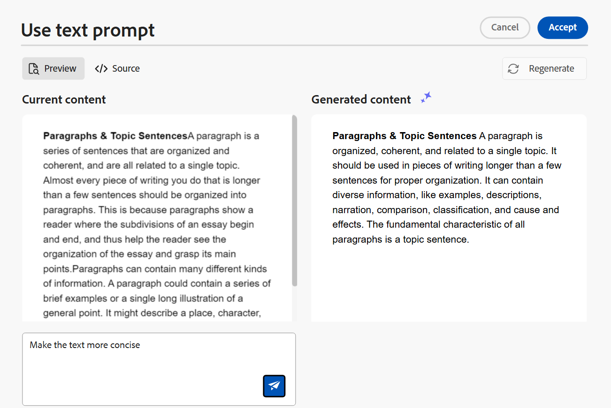
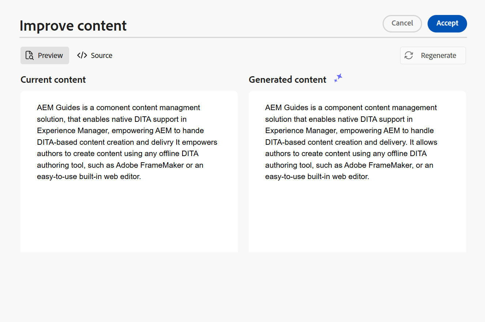
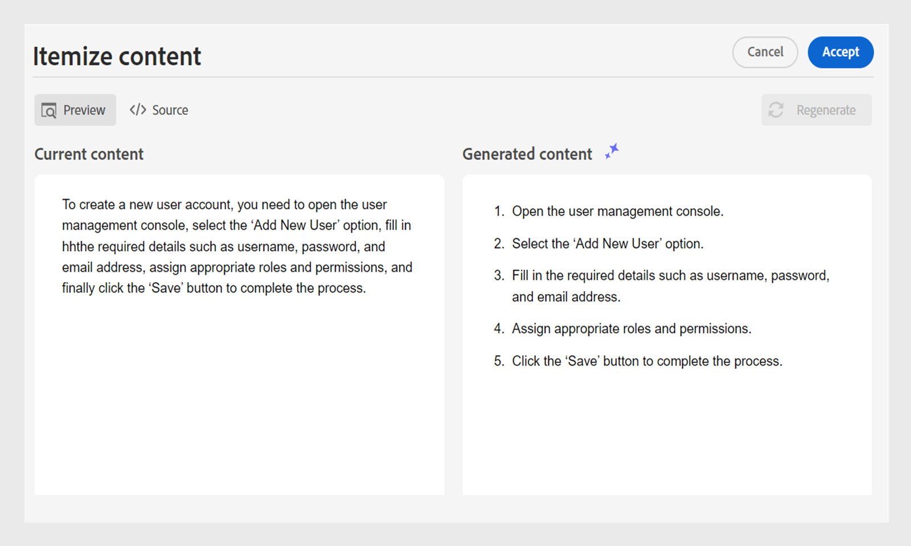

# AI アシスタントを使用してスマートにドキュメントを作成（Beta）

Adobe Experience Manager Guidesには、オーサリングをよりスマートかつ迅速におこなうためのAI アシスタントツールが用意されています。 このツールを使用して、既存のコンテンツリポジトリからコンテンツを再利用するためのスマート提案を表示します。 テキストプロンプト機能を使用してプロンプトを表示し、必要に応じてコンテンツを変更します。 AI アシスタントを使用して、段落をリストにスマートに変換します。 選択したコンテンツに基づいて、現在のトピックの簡単な説明を作成できます。 また、この機能は、選択したコンテンツを簡単に改善および翻訳するのにも役立ちます。

>[!NOTE]
>
> このオーサリング機能はDITA トピックでのみ使用でき、エディターインターフェイスからのみアクセスできます。 ホームページとマップコンソールには、**ヘルプ** パネルのみが表示されます。 オーサリング機能で使用できるオプションは、管理者がWorkspace設定を使用してフォルダープロファイルレベルで設定します。

トピック内のテキストを選択したら、AI アシスタントのアクションのいずれかを実行できます。

{width="300"}

## 再利用可能なコンテンツを提案

**再利用可能なコンテンツを提案** 機能を提案して、一貫した正確なコンテンツのオーサリングを行います。 コンテンツを選択できます。Experience Manager Guidesには、リポジトリ内の既存のコンテンツを再利用する方法に関する推奨事項が表示されます。
[AIを活用したスマート提案を使用してコンテンツを作成する方法について詳しくは、](authoring-ai-based-smart-suggestions.md)を参照してください。

## テキストプロンプトを使用

テキストプロンプトとは、AI アシスタントが特定の回答を生成するための指針となる指示、質問、またはステートメントのことです。

テキストプロンプトを使用してコンテンツを変更できます。 例えば、現在のトピックのコンテンツを選択し、プロンプト *テキストをより簡潔にする*&#x200B;を使用できます。 同様に、テキストプロンプトを使用して、選択したコンテンツで使用されるタグに属性を追加できます。

1. テキストプロンプトを使用するテキストを選択します。
1. **オーサリング** パネルから&#x200B;**テキストプロンプトを使用** を選択します。
1. 次のいずれかの方法でプロンプトを入力します。

   - プロンプト候補からプロンプトを選択します。
   - 必要に応じて、提案されたプロンプトを修正または編集し、カスタムプロンプトを作成します。

     >[!NOTE]
     >
     > 提案されたプロンプトは、管理者が`ui_config.json`で設定します。

   - テキストボックスにプロンプトを入力します。

1. プロンプトに基づいた別の応答または出力については、**再生成** を選択します。

1. （オプション）「**展開** 」を選択して、**テキストプロンプトを使用** エディターを開きます。 現在のコンテンツと生成されたコンテンツが表示されます。 ソースレイアウトのコンテンツを編集し、プレビューを確認できます。

   

   >[!NOTE]
   >
   > 応答は、選択したコンテンツに基づいて生成されます。

1. また、エディターでプロンプトを編集し、応答を再生成することもできます。 例えば、プロンプトを変更して、テキストを約40語に簡潔にします。

1. 生成されたコンテンツのソースを確認し、必要に応じて編集できます。

1. トピックで選択したコンテンツを生成されたコンテンツに置き換えるには、**同意**&#x200B;を選択します。
1. **キャンセル**: テキストプロンプトのアクションをキャンセルします。 オーサリングパネルに戻ります。

   >[!NOTE]
   >
   > オーサリングパネルで「**閉じる**」アイコンを選択すると、AI アシスタントの初期状態に戻ります。

## コンテンツの改善

**コンテンツの改善**&#x200B;機能を使用して、現在のトピックで選択したコンテンツの品質を向上させます。 コンテンツを選択して、スペル、言語、文法構造をチェックし、より適切なバージョンのコンテンツを提案できます。 また、文章の品質を向上させることができます。

1. コンテンツを選択します。
1. **コンテンツの改善** を選択して、改善されたコンテンツの提案を見つけます。
1. 改善されたコンテンツの別の提案については、**再生成**&#x200B;を選択してください。

1. （オプション）改善されたコンテンツエディターを開くには、**展開**&#x200B;を選択します。 現在のコンテンツと生成されたコンテンツが表示されます。 ソースレイアウトのコンテンツを編集し、プレビューを確認することもできます。

   

提案を受け入れるか、受け入れる前にソースビューで応答を編集するか、別の応答を再生成するか、アクションをキャンセルして前の状態に戻します。

## ショートデスクを作成

選択したコンテンツに基づいて、トピックの簡単な説明を約30～50語で作成します。 短い説明は、オーディエンスが関連性の高いコンテンツを検索し、見つけるのに役立ちます。
例えば、必要システム構成をリスト化し、それに応じて簡単な説明を生成できます。

1. コンテンツを選択します。
1. **ショートデスクを作成** を選択して、現在のトピックの短い説明を作成します。
1. 短い説明がまだ存在しない場合は、**受け入れる**&#x200B;を選択して、新しい短い説明を作成します。 短い説明が存在する場合は、新しい短い説明に置き換える前に確認する必要があります。

次のアクションを実行することもできます。

- 「**再生成**」を選択して、トピックの別の簡単な説明を生成します。
- **展開**&#x200B;を選択して、**ショートデスクを作成** エディターを開きます。

  

## コンテンツを列挙

この機能は、選択した段落をインテリジェントにリストに変換します。  コンテンツを分析し、アイテムの論理リストを作成します。 手作業でアイテムを作成する必要はありません。 例えば、ユーザーアカウントを作成する手順を詳細に説明する段落がある場合、ツールはこれをステップバイステップのリストに変換し、アイテムを手動で1つずつ作成する必要がなくなります。

1. コンテンツを選択します。
1. 「**コンテンツを列挙** 」を選択して、選択したコンテンツをリストに変換します。
AI アシスタントパネルのオーサリングツールを使用すると、コンテンツをアイテムのリストにスマートに変換できます。
1. （オプション）「**展開**」を選択して、**コンテンツのアイテム化** エディターを開きます。
1. リストの準備ができたら、生成されたコンテンツの変更を承認します。 生成されたコンテンツは、選択したコンテンツに置き換えられます。

## コンテンツの翻訳

このインテリジェントな機能を使用して、選択したコンテンツをターゲット言語に翻訳し、異なる言語でメモを追加する際に非常に便利になります。 例えば、コンテンツを英語で追加し、すばやくアラビア語に翻訳できます。

コンテンツを翻訳するには、次の手順を実行します。

1. 翻訳するコンテンツを選択します。
1. **オーサリング** パネルから&#x200B;**コンテンツの翻訳** を選択します。
1. ドロップダウンからターゲット言語を選択します。 翻訳されたコンテンツがAI アシスタントパネルに表示されます。

1. （オプション）「**展開**」を選択して、**コンテンツの翻訳** エディターを開きます。
1. ドロップダウンメニューから別の言語を選択し、選択した言語でコンテンツを再生成することもできます。 例えば、「フランス語」を選択してから「**再生成**」を選択すると、コンテンツはフランス語に翻訳されます。

