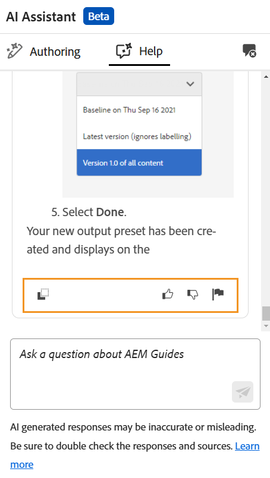

# AI アシスタント（Beta）のスマートヘルプで効率を向上

Experience Manager Guidesは、[Adobe Experience Manager Guides ドキュメント ](https://experienceleague.adobe.com/en/docs/experience-manager-guides/using/overview) から関連コンテンツを見つけるのに役立つ会話型検索機能である、GenAI ベースのスマートヘルプを提供します。

あなたはあなたの質問をし、有益な方法で答えを得ることができます。 クエリに対する回答は、製品ドキュメントのコンテンツに基づいています。 この検索は完全に対話型です。 Experience Manager Guidesの様々な機能について質問したり、トラブルシューティングの質問をしたりできます。 回答に基づいて、さらに質問することもできます。 応答には、ソースドキュメントへのリンクも含まれています。詳しくは、ソースドキュメントを参照してください。

例えば、*マップを公開するにはどうすればよいですか？* 返信と関連記事のリンクが表示されます。 次に、特定の方法を使用して出力を公開する方法を学びたい場合は、その方法について質問できます。 例えば、*PDFにマップを公開するにはどうすればよいですか？* などです。

ホームページ、マップコンソール、またはエディターで **AI アシスタント** を開くと、右側に **ヘルプ** パネルが開きます。 エディターの場合は、オーサリング パネルも表示され、スマートオーサリング機能を利用できます。 詳しくは、[AI アシスタントを使用してスマートにドキュメントを作成する ](./ai-assistant-right-panel.md) を参照してください。

{width="300" align="left"}

***ヘルプ**パネルを表示します。*

次の手順を実行してヘルプパネルを使用し、適切なコンテンツを見つけてクエリを解決します。

1. **AI アシスタント** を選択して、ヘルプパネルを開きます。

   >[!NOTE]
   >
   > [ グローバルプロファイルまたはフォルダーレベルのプロファイル ](../cs-install-guide/conf-folder-level.md#conf-ai-guides-assistant) では、管理者がパネルに表示されるデフォルトの質問を定義する必要があります。

1. 質問を入力して、Experience Manager Guides ドキュメントで関連コンテンツを検索します。 パネルでデフォルトの質問を選択するか、テキストボックスに質問を入力できます。

1. **送信** を選択するか、**Enter** キーを押して、質問に対する回答を表示します。

   質問に応じて、コンテンツ、適用可能な画像、記事へのリンクを表示できます。

   {width="300" align="left"}

   *サンプルの質問を選択し、応答してコンテンツと画像を表示します。*

1. 最後の記事へのリンクを選択し、質問に対する回答に関する詳細情報を表示します。

1. **会話をクリア** を選択して、パネルから会話履歴を削除します。 その後、新しい会話を開始し、関連するコンテンツを見つけることができます。

ユーザーガイドやリファレンスドキュメントを検索する代わりに、**ヘルプ** 機能を使用して、クエリに対して関連性の高い回答をすばやく見つけることができます。 これにより、時間を節約し、コンテンツの作成に集中できるので、生産性と効率が向上します。

## AI アシスタントのヘルプ応答に使用できるオプション

**ヘルプ** パネルで AI アシスタントから応答を受け取ると、操作したり、フィードバックを提供したりして、精度と信頼性を高めることができます。 Experience Manager Guides チームが AI アシスタントの応答の精度と関連性を高め、時間の経過と共にパフォーマンスを向上させるのに役立ちます。

次のオプションを使用して、AI アシスタント **ヘルプ** パネルの回答に関与したり、回答に関するフィードバックを提供したりできます。

{width="300" align="left"}

- **コピー**：ドキュメントで使用するために応答をコピーします。
- **例**：応答が役に立ったまたは正確だったことを示します。 「いいね！」アイコンを選択して応答を高評価し、「**詳細を教える**」オプションを使用して詳細なフィードバックを提供します。
- **嫌い**：応答を「役に立たない」または「間違っている」とマークします。 「いいね！」アイコンを選択して応答を高評価し、「詳細を教える **オプションを使用して詳細なフィードバックを提供します。**
- **レポート**：エラーや不正確なコンテンツが含まれている場合は、レビューのために応答にフラグを付けます。 フラグアイコンを選択して、**結果を報告** ダイアログを開きます。 使用可能なオプションから選択するか、カスタムフィードバックを提供します。