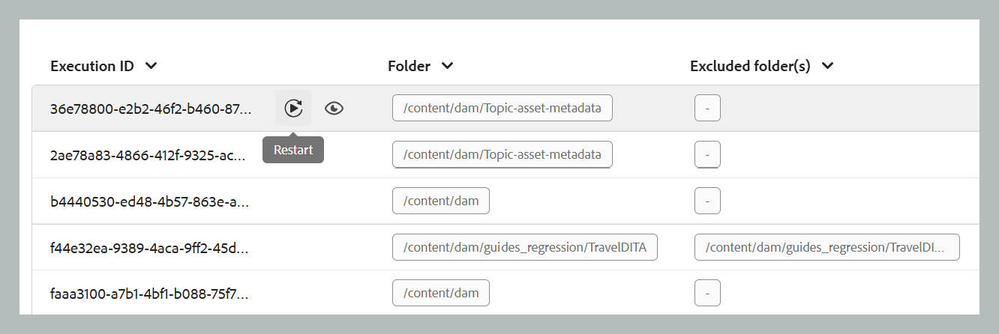

# アセットの処理

公開などのデータ集約型のワークフローでは、パフォーマンスと信頼性を維持するために効率的なアセット管理が不可欠です。 アセット処理ワークフローは、集中的なデータ操作を必要とするユーザー固有のアセットを管理するように設計されています。 これは主に、エラーが原因で初期処理が失敗した場合と、アセット処理トリガーが開始されていないためにファイルが未処理のままである場合の 2 つの場合に対応します。 ターゲットを絞ったフォルダーレベルの処理を有効にすることで、ユーザーは必要なアセットのみを分離して処理できるので、不要な計算のオーバーヘッドを回避できます。 この選択的なアプローチにより、パフォーマンスが大幅に向上し、公開やレポートの生成などの重要な操作に必要な時間が短縮されます。 全体的に、複雑なデータタスクの処理の効率と速度の向上に貢献します。

>[!NOTE]
>
> - 大規模なデータセットでは、システムのパフォーマンスに影響を与えないように、処理はピーク時を避けて実行することをお勧めします。 処理タスクが完了したら、詳細を確認して結果を分析できます。 
>- `/content/dam` フォルダーのアセット処理は 15 分ごとにトリガーされます。 各サイクルで、最新の 15 分以内に新しく追加されたアセットや未処理のままだったアセットが取得され、再処理されます。 自動アセット処理機能ビューを設定するには、[&#x200B; アセット処理機能を設定 &#x200B;](../cs-install-guide/configure-asset-processing-cs.md) します。

## アセットの処理

アセットを処理するには、以下の前述の手順に従います。

1. 上部のAdobe Experience Manager ロゴを選択し、「**ツール**」を選択します。
1. **ツール** パネルで「**ガイド**」を選択します。
1. **バルクプロセッサー** タイルを選択します。

   {align="left"}

1. Guides Bulk Processor ウィンドウが開き、次のような詳細が表示されます。 また、このウィンドウには、最後の 5 つの移行に関する情報のみが表示されます。

   - **機能タイプ**：実行中のプロセスの機能を表示します。

   - **実行 ID**：実行する各処理タスクの一意の ID です。

   - **フォルダー**：処理対象として選択したフォルダーを表示します。

   - **除外フォルダー**：処理から除外されるフォルダーを表示します。

   - **作成者**：タスクまたはプロセスを作成したユーザーを表示します。 システムだけでなく、あなたでもかまいません。

   - **開始時刻：** 処理プロセスが開始された日時を表示します。

   - **終了時間**：処理プロセスが終了した日時を表示します。

   - **ステータス**：処理のステータスを処理中、完了またはキャンセルとして表示します。

   {align="left"}

1. ウィンドウの右上隅にある「**新しいプロセス**」タブを選択して、新しい処理タスクを開始します。

   {width="350" align="left"}

1. 処理するフォルダーを選択します。 また、（選択した親フォルダー内で）除外または無視するフォルダーを選択することもできます。

   >[!NOTE]
   >
   >処理に選択できるフォルダーは、一度に 1 つだけです。 特定の操作に対して、複数のフォルダーを除外できます。

1. 「**作成**」を選択します。スニペットに示すように、「成功 **とプロセスが正常にトリガーされました** を示すポップアップが表示されます。 同じことがリストに反映されます。 ウィンドウで処理タスクのステータスを確認できます。

   {width="350" align="left"}

## 処理タスクのその他のオプション

処理タスクが開始されると、そのタスクに追加のオプションを使用できます。 これらのオプションにアクセスするには、タスクの実行 ID の上にマウスポインターを置きます。 これらのオプションの詳細を以下に示します。

- **再起動**：以前に成功したアセット処理タスクを再開します。

  {width="650" align="left"}

- **再開**：以前にキャンセルされた、または失敗したアセット処理タスクを再開します。

  {width="650" align="left"}

- **キャンセル**：現在進行中のアセット処理タスクをキャンセルします。

  {width="650" align="left"}

- **ログを表示**：アセット処理タスクのログを表示します。 進行中のタスクの場合、ログには、推定残り時間やアセットのステータスなどの詳細な処理情報が表示されます。 このログリストには、最新の 500 エントリまで表示されます。 完全なログをダウンロードできます。

  {width="650" align="left"}
