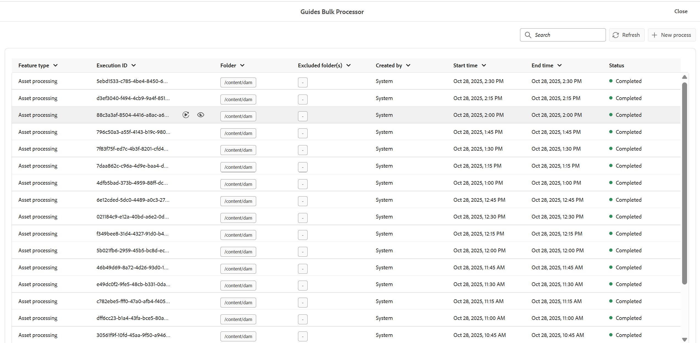
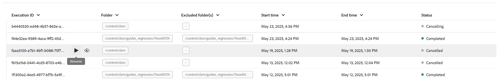
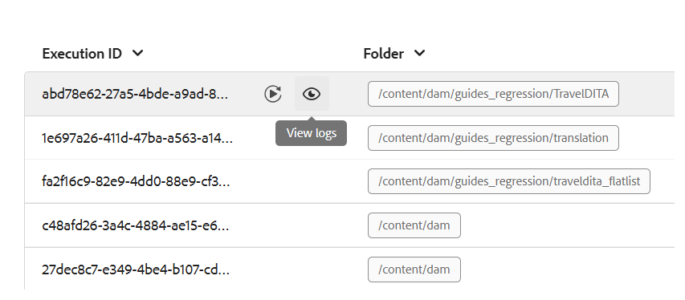

# アセットの処理

公開のようなデータ集約的なワークフローでは、効率的なアセット管理はパフォーマンスと信頼性を維持するために不可欠です。 アセット処理ワークフローは、集中的なデータ運用を必要とするユーザー固有のアセットを管理するように設計されています。 主に、エラーが原因で初期処理が失敗した場合と、アセット処理トリガーが開始されなかったためにファイルが未処理のままになった場合の2つのケースに対応します。 ターゲットを絞ったフォルダーレベルの処理を可能にすることで、必要なアセットのみを分離して処理できるため、不要な計算のオーバーヘッドを回避できます。 この選択的なアプローチにより、パフォーマンスが大幅に向上し、公開やレポート生成のような重要な作業に必要な時間が短縮されます。 全体として、複雑なデータタスクを処理する際の効率性とスピードの向上に貢献します。

>[!NOTE]
>
> - 大規模なデータセットの場合、システムのパフォーマンスに影響を与えないように、オフピーク時間中に処理を実行することをお勧めします。 処理タスクが完了したら、詳細を確認して結果を分析できます。 
>- システムは、15分ごとに`/content/dam` フォルダーのアセット処理をトリガーします。 各サイクルで、新しく追加されたアセットや、最新の15分以内に未処理のままになったアセットは、ピックアップして再処理されます。 自動アセット処理機能ビューを設定するには、[ アセット処理機能を設定](../cs-install-guide/configure-asset-processing-cs.md)します。

## アセットの処理

アセットを処理するには、次の手順に従います。

1. 上部のAdobe Experience Manager ロゴを選択し、**ツール**&#x200B;を選択します。
1. **ツール** パネルで、**ガイド**&#x200B;を選択します。
1. **Bulk Processor** タイルを選択します。

   

1. Guides Bulk Processor ウィンドウが開き、以下の詳細が表示されます。 また、このウィンドウには、最後の5つの移行に関する情報のみが表示されます。

   - **機能タイプ**：実行中のプロセスの機能を表示します。

   - **実行ID**：実行する各処理タスクの一意のIDです。

   - **フォルダー**：処理用に選択されたフォルダーを表示します。

   - **除外されたフォルダー**：処理から除外されたフォルダーを表示します。

   - **作成者**: タスクまたはプロセスを作成したユーザーを表示します。 システムと同じようにあなたにもできます。

   - **開始時間：**&#x200B;処理プロセスが開始された日時を表示します。

   - **終了時間**：処理プロセスが終了した日時を表示します。

   - **ステータス**：処理中、完了済みまたはキャンセル済みとして処理のステータスを表示します。

   

1. ウィンドウの右上隅にある「**新しいプロセス**」タブを選択して、新しい処理タスクを開始します。

   **新しいプロセス** ダイアログが開きます。

   {width="350"}

1. ダイアログに次の詳細を入力します。

   1. **機能タイプ**: ドロップダウンから&#x200B;**アセット処理**&#x200B;を選択します。
   1. **フォルダーとファイルを選択**：移動して、処理する1つまたは複数のフォルダーとファイルを選択します。
   1. **無視するフォルダーを選択**：オプションで、選択した親フォルダー内のサブフォルダーを選択して、処理から除外します。
   1. **Asset Type**: ドロップダウンから、処理する特定のアセットタイプ（DITA Topic、DITA Map、Markdown、HTML/CSS、DITAVAL、その他のファイルなど）を選択します。 選択したアセットタイプのみが、先ほど指定したフォルダーから処理されます。
例：DITA トピックを選択すると、選択したフォルダー内のDITA トピックのみが処理され、ターゲットフィルタリングが有効になります。
   1. **作成後/作成前**：日付フィルターを適用して、指定した期間内に作成されたアセットを処理します。

   >[!NOTE]
   >
   > フォルダーに対してプロセスが既に実行されている場合、現在のタスクが完了するまで、同じフォルダーに対して新しいプロセスを開始することはできません。

1. 「**作成**」を選択します。 **成功とプロセスが正常にトリガーされたことを示すポップアップが表示されます**。 処理タスクのステータスは、ウィンドウで確認できます。

   {width="350"}

## アセット処理タスクの追加オプション

処理タスクが開始されると、追加のオプションを使用できます。 これらのオプションにアクセスするには、タスクの実行IDにカーソルを合わせます。 これらのオプションの詳細は次のとおりです。

- **再起動**：以前に成功したアセット処理タスクを再起動します。

  {width="650"}

- **再開**：以前にキャンセルまたは失敗したアセット処理タスクを再開します。

  {width="650"}

- **キャンセル**：現在進行中のアセット処理タスクをキャンセルします。

  {width="650"}

- **ログを表示**: アセット処理タスクのログを表示します。 進行中のタスクの場合、ログには、推定残り時間やアセットステータスなどの詳細な処理情報が表示されます。 このログリストには、最新の500件のエントリが表示されます。 完全なログをダウンロードできます。

  {width="650"}
