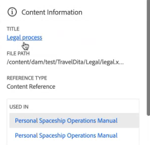

# AI を利用したコンテンツ作成のスマートサクション

Experience Managerガイドでは、 **スマート候補** 一貫性のある正確なコンテンツを作成するのに役立つ機能を提供します。

コンテンツを作成する際に、 **スマート候補** 機能では、AI を使用して検索し、コンテンツと意味的に類似した既存のコンテンツを表示できます。 その後、現在のトピックに参照として含める最適なコンテンツを選択できます。

これにより、ドキュメントリポジトリの既存のコンテンツを再利用し、一貫性のあるコンテンツを作成できます。 例えば、次の情報を含むドキュメントを作成するとします。 **Adobe Firefly**（次に関する段落を含む） **Adobe**. その場合、別のトピック（例： ）からコンテンツ参照をすばやく表示して追加できます。 **Adobe Photoshop**（同じ段落を含む）

Web エディタでトピックを開くと、 **スマート候補** パネルが右側に表示されます。

>[!NOTE]
>
> 管理者が **スマート候補** 機能。 詳しくは、 [AI を利用したオーサリング用のスマート候補の設定](../cs-install-guide/conf-smart-suggestions.md) の節を参照してください。

{width="300" align="left"}

*次を表示：**スマート候補**パネル。*

次の手順を実行して、トピックに適切なコンテンツ参照を追加するためのスマート候補を表示します。

1. 選択 **スマート候補**  をクリックして、パネルを開きます。

   >[!NOTE]
   >
   > Adobe Analytics の [グローバルまたはフォルダーレベルのプロファイル](../cs-install-guide/conf-folder-level.md#conf-ai-smart-suggestions)の場合、管理者は、スマート候補のインデックスを作成するファイルまたはフォルダー、候補を表示するために入力する必要のある最小文字数、リストに表示できる候補の最大数を定義する必要があります。

1. トピックの内容を入力して、関連する提案を表示します。 コンテンツの文字の長さが、管理者がフォルダープロファイルで設定したコンテンツ候補を表示するための長さを超えていることを確認します。

1. 選択 **現在のタグの提案**  をクリックすると、現在のタグのマウスポインタを置いた位置に対するオーサリング候補が表示されます。  インデックス付きのファイルからコンテンツ参照を表示および追加する候補は、現在のタグ内のコンテンツに基づいて表示されます。

   キーボードショートカット： **Windows** (*Ctrl* + *K*),  **macOS** (*コマンド* + *K*)
1. 選択 **完全なドキュメントの候補**   ：ドキュメント全体に存在するコンテンツに基づいて提案を表示します。  スマートな提案 適切な一致が見つかったコンテンツの横にアイコンが表示されます。

   キーボードショートカット： **Windows** ( *Ctrl* + *Shift* +  *K* ),  **macOS** (*コマンド* + *Shift* + *K* )

   >[!NOTE]
   >
   > 現在のビューポートの候補（画面に表示されるコンテンツ）のみを表示できます。 ドキュメント内の他のコンテンツの候補を表示するには、上下にスクロールしてビューポートに表示し、  アイコン。

1. を選択します。 **スマート候補**  スマート候補を表示するための、ドキュメントに追加したタグの近くにあるアイコン。
1. スマート候補は、 **コンテンツの再利用** 候補ボックスを使用します。  Experience Managerガイドは、同じ意味を持つコンテンツとコンテンツを正確に一致させるための提案を提供します。 例えば、「リリースバージョン2023.03.12」のように、正確なバージョン番号を含むトピックを検索できます。 また、「Adobeはカリフォルニア州サンノゼに本社を置いています」を検索し、「サンノゼにはAdobeを好む多くのソフトウェア企業の四半期がある」のような類似のコンテンツを見つけることもできます。
1. 選択 **コンテンツ情報**  をクリックして詳細を表示します。
   {width="300" align="left"}

   *コンテンツ参照に関する詳細情報を表示します。*

   1. コンテンツ参照を含むトピックのタイトルは、ハイパーリンクとして表示されます。
   1. コンテンツ参照を含むファイルのパス。
   1. コンテンツが参照される参照のタイプ。
   1. トピックが参照されている DITA ファイルの名前がハイパーリンクとして表示されます。
1. 選択 **推奨コンテンツプレビュー**  現在のコンテンツを推奨コンテンツと比較します。 これにより、違いを比較し、提案されたコンテンツのコンテンツ参照を追加するかどうかを決定し、一貫性を保つか、現在のコンテンツを保持するかを決定できます。

   {width="800" align="left"}

   *現在のコンテンツと提案されたコンテンツの比較をプレビューします。*

1. クリック **確定** 候補のコンテンツ参照を **推奨コンテンツプレビュー** ダイアログボックス。
1. また、 **確定** または **拒否** （内） **コンテンツの再利用** 適切なレコメンデーションの「提案」ボックス。

このインテリジェント機能は便利で、手動でのコンテンツ検索の労力を最小限に抑え、新しいコンテンツの生成に集中できます。 また、より優れたチームコラボレーションを促進し、様々な作成者が作成したコンテンツの一貫性を維持するのに役立ちます。

