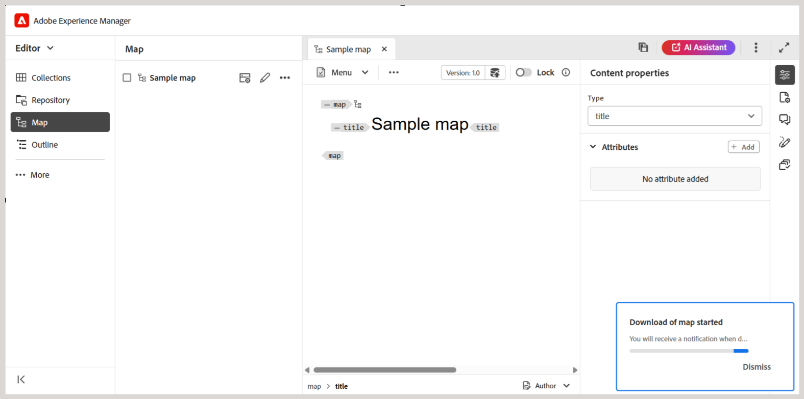

# ファイルをダウンロード {#id216MC0H0BE8}

DITA ファイルと非 DITA ファイルを含むアセットをダウンロードできます。 アセットをダウンロードする方法は複数あります。Adobe Experience Managerにネイティブな方法もあれば、Adobe Experience Manager Guidesでサポートされている方法もあります。 Adobe Experience Managerのネイティブなアセットのダウンロード情報については、Adobe Experience Manager ドキュメントの [Adobe Experience Managerからのアセットのダウンロード ](https://experienceleague.adobe.com/docs/experience-manager-cloud-service/assets/manage/download-assets-from-aem.html) を参照してください。 次の節では、Experience Manager Guidesでのファイルのダウンロードのしくみについて説明します。

## エディタから DITA マップファイルをダウンロードします

エディタから DITA マップファイルをダウンロードするには、次の手順を実行します。

1. ダウンロードする DITA マップに移動します。
1. DITA マップを選択して、エディタで開きます。

1. マップビューで「**オプション**」アイコンを選択し、リストから「**マップをダウンロード**」を選択します。

   

   **マップをダウンロード** ダイアログが表示されます。

   {width="300" align="left"}

1. マップをダウンロード ダイアログでは、次のオプションを選択できます。

   - **ベースラインを使用**:DITA マップ用に作成されたベースラインのリストを取得するには、このオプションを選択します。 特定のベースラインに基づいてマップ・ファイルとそのコンテンツをダウンロードする場合は、ドロップダウン・リストから「ベースライン」を選択します。 ベースラインの操作の詳細については、「[ ベースラインの操作 ](generate-output-use-baseline-for-publishing.md#)」を参照してください。

   - **ファイル階層オプション**: ファイル階層ドロップダウンを使用して、ダウンロードしたマップファイルのフォルダー構造を処理する方法を選択することもできます。 使用できるオプションは以下のとおりです。

      - **ファイル階層を保持**：ダウンロードしたファイルの既存のフォルダー構造を保持するには、ドロップダウンからこのオプションを選択します。
      - **ファイル階層を統合**：参照されるすべてのトピックおよびメディアファイルを 1 つのフォルダーにダウンロードするには、ドロップダウンからこのオプションを選択します。

     各オプションについて、ダウンロードしたファイルのファイル名の処理方法をさらに指定できます。 次のファイル名オプションを使用できます。

      - **GUID ファイル名を使用**: GUID をファイル名としてマップ ファイルをダウンロードします。
      - **実際のファイル名を使用**：マップ ファイルを元のファイル名でダウンロードします。 Flatten ファイル階層でこのオプションを使用すると、マップ内の重複したファイル名は、一意のファイル名を確保するために数字のサフィックス（_2、_3 など）を追加することによって自動的に解決されます。

   >[!NOTE]
   >
   > オプションを選択せずにマップ ファイルをダウンロードすることもできます。 その場合、参照されるトピックおよびメディア ファイルの最後の永続バージョンがダウンロードされます。

1. 「**ダウンロード**」を選択します。

   マップのダウンロード要求はキューに入れられます。

   

   マップをダウンロードする準備が整うと、次の通知が届きます。

   {width="550" align="left"}

1. 「**ダウンロード**」を選択して、`.zip` 形式のマップファイルをダウンロードします。 または、後でAEM インボックスからダウンロードします。

   >[!NOTE]
   >
   > デフォルトでは、ダウンロードされたマップはAdobe Experience Managerの通知インボックスに 5 日間残ります。

マップがダウンロードされたら、マップを選択し、上部の「開く」アイコンを使用して、ダウンロードされたコンテンツを開くことができます。 ダウンロードされたマップの関連メタデータを表示するには、ダウンロードされたコンテンツに含まれている `metdata.json` ファイルを開きます。 このファイルは、*ファイル階層* オプション – ファイル階層を統合およびファイル階層を保持の両方で使用できます。

## Map ダッシュボードから DITA マップファイルをダウンロードします

DITA マップファイルをAdobe Experience Manager リポジトリに格納したら、マップファイルとその依存ファイルをダウンロードできます。 これにより、オフラインでの編集、検証、レビュー、または単にバックアップを作成するために、完全なマップ ファイルを柔軟に共有できます。

次の手順を実行して、DITA マップファイルとその依存ファイルをダウンロードします。

1. Assets UI で、ダウンロードする DITA マップに移動します。

1. DITA マップを選択して、DITA マップコンソールで開きます。

1. 「**トピック**」タブを選択して、DITA マップで使用可能なトピックのリストを表示します。

1. メインツールバーで、「**マップをダウンロード**」を選択します。

   マップをダウンロード ダイアログが表示されます。

   {width="300" align="left"}

1. 「**ダウンロード**」を選択します。 マップをダウンロード ダイアログでは、次のオプションを選択できます。

   - **ベースラインを使用**:DITA マップ用に作成されたベースラインのリストを取得するには、このオプションを選択します。 特定のベースラインに基づいてマップ・ファイルとそのコンテンツをダウンロードする場合は、ドロップダウン・リストから「ベースライン」を選択します。 ベースラインの操作の詳細については、「[ ベースラインの操作 ](generate-output-use-baseline-for-publishing.md#)」を参照してください。

   - **ファイル階層を統合**：参照されるすべてのトピックおよびメディアファイルを 1 つのフォルダーに保存するには、このオプションを選択します。

   >[!NOTE]
   >
   > オプションを選択せずにマップ ファイルをダウンロードすることもできます。 その場合、参照されるトピックおよびメディア ファイルの最後の永続バージョンがダウンロードされます。

1. 「**ダウンロード**」ボタンを選択すると、マップのダウンロードリクエストはキューに入れられます。 マップをダウンロードする準備が整うと、次の通知が届きます。

   {width="550" align="left"}

   - 「**ダウンロード**」を選択して、マップファイルを.zip 形式でダウンロードします。

   - 後でマップファイルをダウンロードするには、「**後でダウンロード**」を選択します。 ダウンロードリンクには、Adobe Experience Manager通知インボックスからアクセスできます。 生成されたマップ通知をインボックスで選択し、.zip 形式でマップをダウンロードします。

   >[!NOTE]
   >
   > デフォルトでは、ダウンロードされたマップはAdobe Experience Managerの通知インボックスに 5 日間残ります。

{width="300" align="left"}

マップがダウンロードされたら、マップを選択し、上部の「開く」アイコンを使用して、ダウンロードされたコンテンツを開くことができます。

**親トピック：**[ コンテンツの管理 ](authoring.md)
