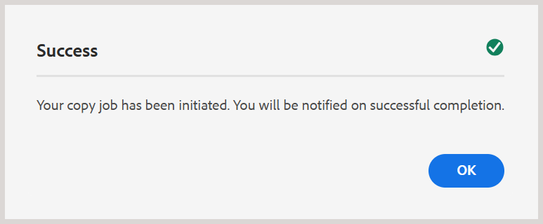
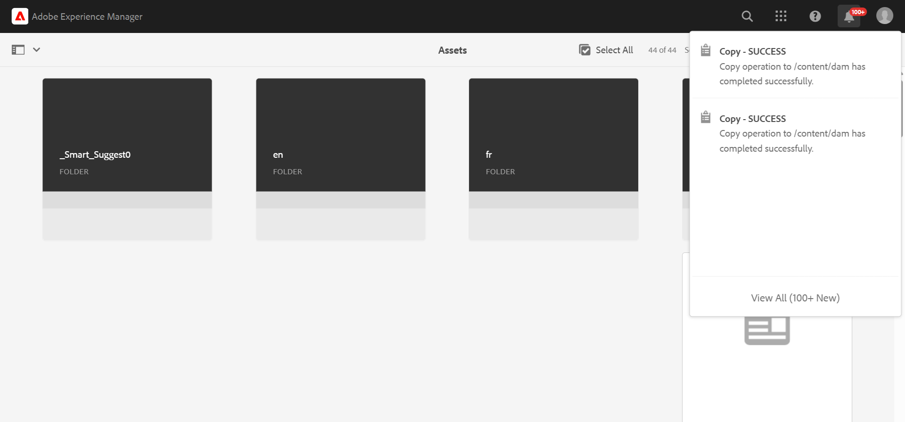
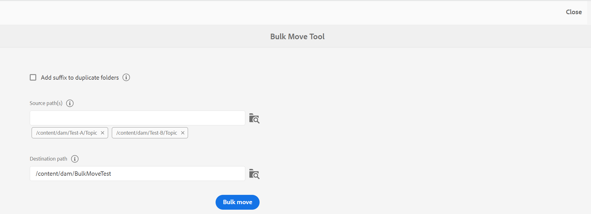
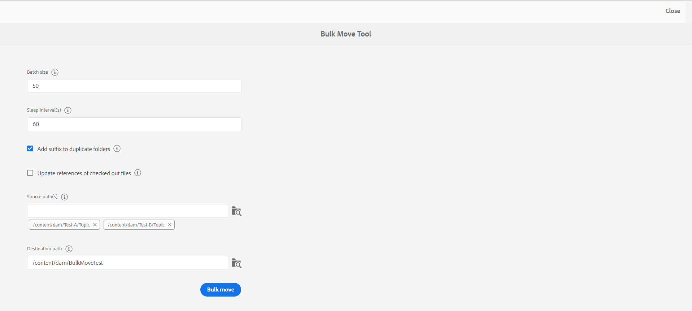
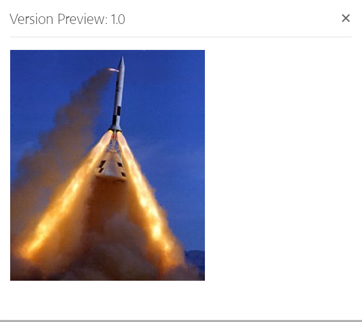

# ファイルとフォルダーの管理 {#id2116G0L08XA}

この節では、Adobe Experience Manager Guidesでファイルのコピー、貼り付け、ドラッグ&amp;ドロップ、削除などの基本的なファイル操作を処理する方法について説明します。 次のシナリオが可能です。

## ファイルのコピーとペースト

**ファイルに人間が読み取れるファイル名がある場合**

- *同じ名前のファイルが保存先フォルダー*&#x200B;に存在しない場合：ファイルの新しいコピーが作成され、UUIDも割り当てられます。 ここでは、ファイル名は元のファイル名と同じです。
- *同じ名前のファイルが宛先フォルダー*&#x200B;に既に存在する場合：ファイルの新しいコピーがサフィックス \（filename0.extension\）を付けて作成されます。 新しく作成したファイルにもUUIDが割り当てられます。

**ファイル名がUUID パターンに基づいている場合**

- *同じ名前のファイルが保存先フォルダー*&#x200B;に存在しない場合：ファイルの新しいコピーが作成され、新しいUUIDも新しい場所に割り当てられます。 ここでは、ファイル名はUUIDと同じです。
- *同じ名前のファイルが宛先フォルダー*&#x200B;に既に存在する場合：ファイルの新しいコピーが作成され、新しいUUIDも割り当てられます。 ファイル名はUUIDと同じです。

## フォルダーのコピーとペースト

**同じ場所にフォルダーをコピーして貼り付ける**

- *フォルダーには、人間が読み取り可能なファイル名を持つファイルがあります*: フォルダーの新しいコピーが、接尾辞\（foldername0\）を付けて作成されます。 新しいUUIDは、フォルダー内のファイルにも割り当てられます。 ただし、ファイル名に変更はありません。

- *フォルダーには、UUID パターン*&#x200B;に基づくファイル名が付いたファイルがあります。フォルダーの新しいコピーは、接尾辞\（foldername0\）を付けて作成されます。 新しいUUIDは、新しいフォルダー内のすべてのファイルにも割り当てられます。 ファイル名も変更されます。ファイル名は新しいUUIDと同じです。

**別の場所にフォルダーをコピーして貼り付ける**

- *フォルダーには、人間が読み取り可能なファイル名を持つファイルが含まれています*: フォルダーの新しいコピーが作成され、新しい場所にあるフォルダー内のすべてのファイルにも新しいUUIDが割り当てられます。 ここでは、フォルダー名やファイル名に変更はありません。

- *フォルダーには、UUID パターン*&#x200B;に基づくファイル名が付いたファイルがあります。フォルダーの新しいコピーが、元のフォルダーと同じ名前で作成されます。 新しいUUIDは、新しいフォルダー内のすべてのファイルにも割り当てられます。 ファイル名も変更されます。ファイル名は新しいUUIDと同じです。

**成功メッセージと通知**

Assets UIのフォルダーのコピー&amp;ペースト操作は、バックグラウンドで非同期で実行されます。これにより、システムがリクエストを処理している間も作業を続けることができます。 プロセスが開始されたことを示すポップアップメッセージが表示されます。

{width="350"}

操作が完了すると、成功または失敗の通知がトリガーされ、操作が成功したか失敗したかを示します。

{width="650"}

## ファイルをドラッグ&amp;ドロップ

**人間が読めるファイル名を使用したドラッグ&amp;ドロップ**

- *同じ場所にドラッグ&amp;ドロップ*：既存のファイルを&#x200B;**上書き**、**両方のファイルを保持\（s\）**&#x200B;するオプションと、既存の作業コピーのバージョンを作成するオプションが与えられます。

  {width="650" align="center"}

  「**既存ファイルを上書き**」オプションを選択した場合、アップロード中のファイルは、元の場所にある既存ファイルの現在の作業バージョンに置き換わります。 UUIDが作成または変更されていません。

  「**両方のファイルを保持\（s\）**」オプションを選択すると、ファイルの新しいコピーがサフィックス \（filename0.extension\）を付けて作成されます。 新しいUUIDは、新しくコピーしたファイルにも割り当てられます。

  「既存のファイルを上書き」オプションを使用して、既存の作業コピーからバージョンを作成するオプションを選択すると、ドキュメントの作業コピーから新しいバージョンも作成されます。

  >[!NOTE]
  >
  > **アップロードされたファイルの新しいバージョンを作成**&#x200B;機能は、管理者が有効にする必要があります。 この機能が有効になっている場合は、アップロードしたファイルの新しいバージョンが作成されます。 オプションの選択を解除すると、アップロードしたファイルのバージョンは作成されません。 詳しくは、「Adobe Experience Manager Guides as a Cloud Serviceのインストールと設定」の「*アップロード済みファイルの新しいバージョンを作成*」セクションを参照してください。

  ファイルが別のユーザーによって既にチェックアウトされており、既存のファイルをアップロードして上書きしようとすると、エラーが表示されます。

  >[!NOTE]
  >
  >アップロード **上のチェックアウト済みファイルの上書き機能は、管理者が無効にする必要があります。**&#x200B;この機能が有効になっている場合は、チェックアウトしたファイルを上書きできます。 この機能が有効になっていない場合、チェックアウトしたファイルが上書きされるのを防ぎます。 詳しくは、「Adobe Experience Manager Guides as a Cloud Serviceのインストールと設定」の「*アップロード時にチェックアウトファイルを上書き*」セクションを参照してください。

- *ファイルを別の場所にドラッグ&amp;ドロップ*：ファイルの新しいコピーが作成され、新しいUUIDも新しい場所でファイルに割り当てられます。 ここでは、ファイル名は元のファイル名と同じです。

**UUID パターンに基づくファイル名をドラッグ&amp;ドロップ**

*同じ場所にファイルをドラッグ&amp;ドロップ*：既存の作業コピーのバージョンを作成するオプションと共に、**既存のファイルを上書き**&#x200B;するオプションが与えられます。

{width="650" align="center"}

ファイルが上書きされた場合、ファイル名またはそのUUIDに変更はありません。

「既存の作業コピー&#x200B;**のバージョンを作成」オプションを選択すると、ドキュメントの作業コピーから新しいバージョンが作成され、新しいファイルがアップロードされ、ファイルの新しいバージョンも作成され、ドキュメントの作業コピーとして作成されます。**

**アップロードされたファイルの新しいバージョンを作成**&#x200B;機能は、管理者が有効にする必要があります。 この機能が有効になっている場合は、アップロードしたファイルの新しいバージョンが作成されます。 オプションの選択を解除すると、アップロードしたファイルのバージョンは作成されません。 詳しくは、「Adobe Experience Manager Guides as a Cloud Serviceのインストールと設定」の「*アップロード済みファイルの新しいバージョンを作成*」セクションを参照してください。

*別の場所にあるファイルをドラッグ&amp;ドロップ*：既存のファイルを&#x200B;**上書き**、**ファイルを新しい場所**&#x200B;に移動するオプションと、既存の作業コピーのバージョンを作成するオプションが与えられます。

{width="650" align="center"}

「**既存のファイルを上書き**」オプションを選択すると、アップロード中のファイルが元の場所の既存のファイルに置き換わります。 UUIDが作成または変更されていません。

「**ファイルを新しい場所**&#x200B;に移動」オプションを選択した場合、既存のファイルは現在の場所に移動され、アップロードされたファイルで上書きされます。 ファイルを新しい場所に移動しても、ファイルとの間の既存の参照が壊れることはありません。

ファイルを置換または移動する場合、既存のコピーからバージョンを作成するオプションを選択すると、ドキュメントの作業コピーから新しいバージョンが作成されます。新しいファイルは、既存の場所で置換されるか、新しい場所に移動されます。

## ファイルを一括移動 {#move-files-bulk}

Experience Manager Guidesには一括移動ツールが付属しており、管理者は多数のファイルを持つフォルダーを別の場所に移動できます。 このツールを使用すると、1つまたは複数のフォルダー内のファイルを、Adobe Experience Manager リポジトリー内の別のフォルダーに簡単に移動できます。 このツールの主な機能の1つは、多数のファイルを移動するだけでなく、移動するファイルとの間の参照を維持することです。 オーサリングタスクと公開タスクを妨げることなく、一括で移動できるファイルの数を調整できます。

>[!NOTE]
>
> 一括移動ツールは、フォルダーレベルでのみ機能します。 個々のトピックファイルまたはマップファイルを移動する場合は、Adobe Experience ManagerのAssets UIから通常の移動ツールを使用します。

一括移動ツールの機能の一部を以下に示します。

- 各バッチで処理するファイルの数を調整できます。 そのためには、システムが容易に処理できる最適な数値に達する前に、いくつかのテストを実施する必要がある場合があります。
- オーサリングサービスと公開サービスは、移動操作を中断することなくスムーズに実行できます。
- 後続の\（実行の\）バッチプロセス間の時間間隔を完全に制御できます。 この時間間隔は、次のファイルのバッチを開始する前に、後処理操作が完了することを保証します。

- 同じ名前のフォルダーの自動処理。 この機能により、同じ名前のフォルダーが移動されていても、それらのフォルダーが上書きされなくなります。

- 移動するファイルとの間の参照を自動処理します。

バッチプロセスを実行する前に、次の点を考慮する必要があります。

- 現在レビュー中のトピックを移動する場合は、移動する前にそのすべてのトピックのレビュープロセスを終了する必要があります。 レビュータスクを閉じないと、レビュープロセスが壊れます。
- 一度にシステム上で実行する一括移動操作は、1回のみです。 これにより、移動するトピックとの間の参照を適切に処理できます。

ファイルを一括で移動するには、次の手順を実行します。

1. 上部のAdobe Experience Manager ロゴを選択し、**ツール**&#x200B;を選択します。
1. ツールのリストから「**ガイド**」を選択します。
1. **一括移動ツール** タイルを選択します。
1. 一括移動ツール ページは、設定に基づいて表示されます。 **一括移動ツール** ページに次の詳細を入力します。

   

   
 クラウドサービスとオンプレミス UUID ベースのファイルシステム 

   {width="650" align="center"}

   >[!TIP]
   >
   > 選択 任意のフィールドの近くにを配置すると、そのフィールドに関する詳細が表示されます。

   - **重複フォルダーにサフィックスを追加**：同じ名前のフォルダーを移動する場合は、このオプションを選択する必要があります。 例えば、前のスクリーンショットでは、**Source path**&#x200B;に移動するフォルダーの名前が含まれています。 topicという名前のフォルダーは、test-Aとtest-Bの2つの異なる場所に存在します。このオプションを選択すると、フォルダーが正常に移動します。 最初に移動されたフォルダーにはtopicという名前が付けられ、2番目のフォルダーにはtopic0という名前が付けられます。 移動操作では、同じ名前のフォルダーに連続した系列\（0、1、2など\）の接尾辞が追加されます。

     このオプションを選択せずに同じ名前のフォルダーを移動する場合、操作はメッセージで中止されます。

   - **Source path\（s\）**：移動するフォルダーの場所を指定します。

      - **フォルダーを参照**&#x200B;を選択  : **パスを選択** ダイアログを開きます。 移動するフォルダーを選択し、**選択**&#x200B;を選択してプロセスを完了します。 パスブラウザーの異なる場所に配置された複数のフォルダーを選択できます。 選択したフォルダーのパスは保持され、ダイアログを再度開いたときに簡単に確認または変更できます。

      - ソースの場所を入力またはコピーして貼り付けることもできます。 Enter キーを押して、フォルダーをリストに追加します。

        選択したフォルダーがパスと共に一覧表示されます。 フォルダタグにカーソルを合わせると、パス全体が表示されます。
      - **削除**&#x200B;を選択して、任意のフォルダーを削除することもできます フォルダーの近くの。

   - **宛先パス**：ソースフォルダーを移動する場所を指定します。

      - **フォルダーを参照**&#x200B;を選択 でファイルを参照ダイアログを開きます。 ソースフォルダーを移動する場所を選択します。 「選択」を選択してプロセスを完了します。
      - また、コピー先のパスを入力またはコピーして貼り付けることもできます。

     選択したフォルダーが、テキストボックスにパスとともに表示されます。

   - **一括移動**&#x200B;を選択します。

     システムは、ソースから宛先の場所へのファイルの移動を開始します。 プロセスが完了すると、移動プロセスの概要がページの右側に表示されます。

     {width="650" align="center"}

   

   

   
 オンプレミスの非UUID ベースのファイルシステム 

   {width="650" align="center"}

   >[!TIP]
   >
   > 選択 任意のフィールドの近くにを配置すると、そのフィールドに関する詳細が表示されます。

   - **バッチサイズ**:1回のバッチで移動するファイルの数を指定します。 50 ファイルの場合のデフォルト値。
   - **スリープ間隔（秒）**: プロセスが次のバッチを開始する前に待機する時間を秒単位で指定します。 このスリープ時間間隔の間、システムは移動されたファイルとの間の参照を修正します。 デフォルトのスリープ間隔は60秒です。

   - **重複フォルダーにサフィックスを追加**：同じ名前のフォルダーを移動する場合は、このオプションを選択する必要があります。 例えば、前のスクリーンショットでは、**Source Path**&#x200B;に移動するフォルダーの名前が含まれています。 topicという名前のフォルダーは、test-Aとtest-Bの2つの異なる場所に存在します。このオプションを選択すると、フォルダーが正常に移動します。 最初に移動されたフォルダーにはtopicという名前が付けられ、2番目のフォルダーにはtopic0という名前が付けられます。 移動操作では、同じ名前のフォルダーに連続した系列\（0、1、2など\）の接尾辞が追加されます。

     このオプションを選択せずに同じ名前のフォルダーを移動する場合、操作はメッセージで中止されます。

   - **チェックアウト済みファイルの参照を更新**：チェックアウト済みファイルを含むフォルダーを移動する場合は、このオプションを選択することをお勧めします。 このオプションを選択すると、チェックアウトされたすべてのファイルが保存され、新しいリビジョンでチェックインされます。 次に、この新しいリビジョンを移動先の場所に移動します。

     このオプションを選択しない場合、チェックアウトされたファイルは、同じチェックアウト済みステータスで宛先フォルダーに移動されます。 しかし、この移行プロセスではデータが失われる可能性があります。

   - **Source path\（s\）**：移動するフォルダーの場所を指定します。

      - **フォルダーを参照**&#x200B;を選択  : **パスを選択** ダイアログを開きます。 移動するフォルダーを選択し、**選択**&#x200B;を選択してプロセスを完了します。 パスブラウザーの異なる場所に配置された複数のフォルダーを選択できます。 選択したフォルダーのパスは保持され、ダイアログを再度開いたときに簡単に確認または変更できます。

      - ソースの場所を入力またはコピーして貼り付けることもできます。 Enter キーを押して、フォルダーをリストに追加します。

        選択したフォルダーがパスと共に一覧表示されます。 フォルダタグにカーソルを合わせると、パス全体が表示されます。
      - **削除**&#x200B;を選択して、任意のフォルダーを削除することもできます フォルダーの近くの。

   - **宛先パス**：ソースフォルダーを移動する場所を指定します。

      - **フォルダーを参照**&#x200B;を選択 でファイルを参照ダイアログを開きます。 ソースフォルダーを移動する場所を選択します。 「選択」を選択してプロセスを完了します。
      - また、コピー先のパスを入力またはコピーして貼り付けることもできます。

        選択したフォルダーが、テキストボックスにパスとともに表示されます。

   - **一括移動**&#x200B;を選択します。

     システムは、ソースから宛先の場所へのファイルの移動を開始します。 プロセスが完了すると、移動プロセスの概要がページの右側に表示されます。
     {width="650" align="center"}

## DITA コンテンツの検索

デフォルトでは、Adobe Experience ManagerはDITA コンテンツを認識しないため、リポジトリ内のDITA コンテンツを検索する仕組みは提供されません。 Experience Manager Guidesでは、Adobe Experience Managerの上にレイヤーが追加され、Adobe Experience ManagerでDITA コンテンツを理解および処理できるようになります。 Experience Manager GuidesのDITA コンテンツ検索機能を使用すると、Adobe Experience Manager リポジトリ内でDITA コンテンツを検索できます。

>[!NOTE]
>
>システム管理者は&#x200B;**DITA Element**&#x200B;検索コンポーネントを設定し、Adobe Experience Manager Assets UIからこの機能を使用できます。 詳細については、「*Assets UIにDITA Element検索コンポーネントを追加*」の「Adobe Experience Manager Guides as a Cloud Serviceのインストールと設定」セクションを参照してください。

検索機能を使用すると、次のことが可能になります。

- エレメント値に基づいてDITA コンテンツを検索します。例：`author`= xml
- 属性値に基づいてDITA コンテンツを検索します。例：`@platform`= windows
- DITA要素と属性値を組み合わせて使用します。例：`author`= xml `AND` `@platform`= windows

Adobe Experience Manager リポジトリ内でDITA コンテンツを検索するには、次の手順を実行します。

1. Assets UIを開きます。

1. 左側のパネルで、「**フィルター**」を選択します。

   {width="450" align="center"}

   コンテンツフィルタリングオプションは、左側のパネルに表示されます。 また、フィルタリングオプション（DITA コンテンツのフィルタリングに使用されるDITA エレメント）もあります。

   {width="450" align="center"}

1. *\（Optional\）* 「**検索ディレクトリを選択**」フィールドで、検索する場所を参照します。

1. **DITA要素** フィルターで、**要素名**、**属性**、および検索する値を指定します。 例えば、`@type`作成者の`author`要素を持つドキュメントを検索するには、次のスクリーンショットに示すように、情報を提供する必要があります。

   {width="650" align="center"}

   **DITA要素** フィルターに入力された検索条件は、検索バーの上部に表示されます。 検索条件に一致するファイルは、**検索結果**&#x200B;領域に表示されます。

   検索条件を指定する際には、次の点を考慮してください。

   - 正確なフレーズを検索するには、引用符`"` フレーズ検索`"`内の「値」フィールドにフレーズを入力します。
   - DITA エレメントの検索条件は、最大3つまで追加できます。
   - 複数の検索条件を指定した場合は、そのすべてがAND ロジックを使用して組み合わされます。
   - 検索条件にワイルドカード文字を使用することはできません。 例えば、Windowsの値を持つplatform \（attribute\）を検索する場合、\*formまたはWindows?sを指定することはできません。

**検索時のチェックアウト状態フィルター**

DITA エレメントフィルターに加えて、Experience Manager Guidesでは、チェックアウトステータスに基づいてコンテンツを検索することもできます。 これは、現在チェックアウトされているファイルをすばやく除外し、再びチェックインする場合に便利です。

チェックアウトステータスに基づいてファイルを検索するには、次の手順を実行します。

1. Assets UIを開きます。

1. 左側のパネルで「**フィルター**」を選択します。
1. 検索バーに検索キーワードを入力します。
1. 左側のパネルから必要なフィルターを適用します。

   例えば、**チェックアウトステータス** フィルターを適用して、チェックアウト済みまたはチェックイン済みのトピックを表示できます。 チェックアウト別リストからユーザーまたはグループを選択して、このリストをさらに絞り込むことができます。

   検索結果が表示されます。

## ファイルの削除

Adobe Experience Manager リポジトリからのファイルの削除は、システム管理者が制御する制限付き機能です。 設定に基づいて、次のような場合にファイルの削除を制限することができます。

- チェックアウト
- 受信または送信の参照がある

また、ファイルを削除する権限を持つ特定のユーザーグループに属している場合にのみ、ファイルを削除することもできます。

>[!NOTE]
>
> ファイル管理に関する設定について詳しくは、「*チェックアウト済みファイルの削除を防止*」および「*参照ファイルの削除を防止*」の「Adobe Experience Manager Guides as a Cloud Serviceのインストールと設定」セクションを参照してください。

管理者がすべてのユーザーにファイル削除権限を付与している場合、参照を含むファイルを削除すると、次のメッセージが表示されます。

{width="650" align="center"}

このシナリオでは、ファイルから着信または発信の参照を削除せずに、ファイルを強制的に削除できます。

特定のユーザーグループに対して削除権限が付与されている場合は、そのグループに属するユーザーに対しても上記のメッセージが表示されます。 ただし、他のユーザーの場合は、次のメッセージが表示されます。

{width="650" align="center"}

このシナリオでは、すべての受信および送信の参照が削除されるまで、ユーザーはファイルを削除できません。

## メディアファイルの操作

画像や動画などのメディアファイルは、コンテンツに不可欠な要素です。 コンテンツをアップロードおよび管理する際に、メディアファイルを操作することもできます。

メディアファイルに変更が加えられた場合は、**バージョン履歴**&#x200B;でファイルを検索してプレビューできます。メディアファイルの様々なバージョンの変更を確認するには、次の手順を実行します。

1. **Assets UI**&#x200B;のファイルにアクセスします。
1. バージョン履歴を表示するファイルを選択します。
1. 左側のパネルで、**バージョン履歴**&#x200B;を選択し、バージョンを選択します。
1. バージョン履歴の下に、様々なバージョンのサムネールを表示することもできます。

   {align="center"}

1. リストされたバージョンから、基本バージョンとして使用するバージョンを選択し、**バージョンのプレビュー**&#x200B;を選択します。 選択したバージョンのプレビューがバージョンプレビューウィンドウに表示されます。

   {width="650" align="center"}

**親トピック：**[ コンテンツの管理](authoring.md)
