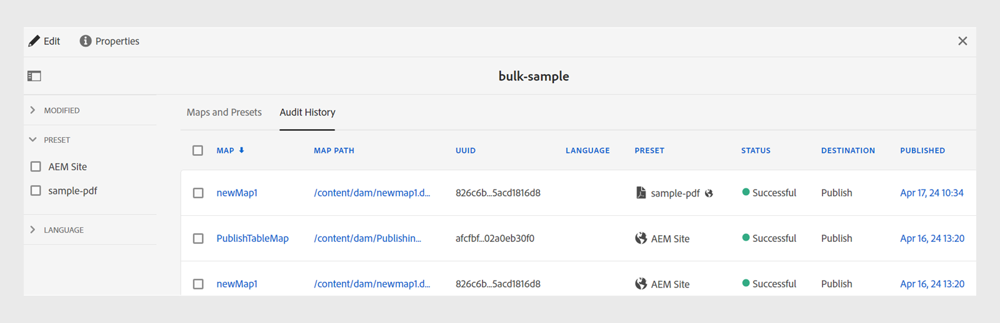

# 一括アクティベーションマップコレクションの作成 {#id214GG0E90EV}

一括アクティベーションマップコレクションを作成するには、次の手順を実行します。

1. を選択 **ガイド** ツールのリストから。

1. 上部の「Adobe Experience Manager」リンクを選択し、 **ツール**.

1. 「」を選択します **一括公開ダッシュボード** タイル。

   初めて、空のコレクションページが表示されます。 以前に一括アクティベーションコレクションを作成した場合は、このページに表示されます。

1. 「**作成**」をクリックします。

1. 一括有効化マップのコレクションのタイトルを入力し、 **作成**.

   一括アクティベーションマップコレクションの作成時に成功メッセージが表示されます。

1. クリック **開く** 成功メッセージで。

1. を選択 **編集** を選択してから、 **マップの追加**.

1. 一括有効化マップコレクションに追加する DITA マップを探して追加します。

   デフォルトでは、マップに関連付けられているすべてのプリセットとロケールが自動的に追加されます。

1. スライド ボタンのオン/オフを切り替えて、目的の出力を選択します。

   使用可能なロケール間で複数の出力プリセットを選択できます。

1. 「**完了**」をクリックします。

DITA マップファイルが一括有効化マップコレクションに追加されます。

{width="800" align="left"}

## 「マップとプリセット」タブ

この **マップとプリセット** タブには、次の列に情報が表示されます。

- **マップ**:DITA マップファイルのタイトルを表示します。
- **マップ パス**:DITA マップファイルの完全パスを表示します。

- **UUID**：ファイルに関連付けられている一意の ID を表示します。

- **言語**:DITA マップの言語コードを表示します。
- **プリセット**：マップファイルに設定された出力プリセットのタイトルを表示します。 また、出力プリセットのタイプに基づいてアイコンも表示されます。

  >[!NOTE]
  >
  > 小  アイコンは、フォルダープロファイルレベルのプリセットを示します。

- **変更日**：最後の公開後に DITA マップが更新されるかどうかを示します。 この情報に基づいて、この DITA マップの出力を有効にするかどうかを指定できます。
- **生成済み**：最後に生成された出力の日時を表示します。
- **公開済み**：最後に公開（またはアクティブ化）された出力の日時を表示します。 リンクを選択すると、 **アクティベーションの結果** コンテンツがアクティベートされるルートパスに関する情報を含んだログを含むページが表示されます。

## 「監査履歴」タブ

この **監査履歴** タブには、アクティブ化されたマップ出力に関する情報が次の列に表示されます。
- **マップ**:DITA マップファイルのタイトルを表示します。
- **マップ パス**:DITA マップファイルの完全パスを表示します。
- **UUID** ：ファイルに関連付けられている一意の ID を表示します。
- **言語**:DITA マップの言語コードを表示します。
- **プリセット**：マップファイルに設定された出力プリセットのタイトルを表示します。 また、出力プリセットのタイプに基づいてアイコンも表示されます。
- **ステータス**：アクティベーションのステータスが成功または失敗として表示されます。
- **宛先**:Experience Managerガイドにas a Cloud Serviceして出力を生成する場合、出力の出力先をパブリッシュまたはプレビューとして表示できます。

  >[!NOTE]
  >
  > 小  アイコンは、フォルダープロファイルレベルのプリセットを示します。

- **変更日**：最後の公開の後に DITA マップが更新されたかどうかを示します。 この情報に基づいて、この DITA マップの出力を有効にするかどうかを指定できます。
- **公開済み**：最後に公開（またはアクティブ化）された出力の日時を表示します。 リンクを選択すると、アクティベーションの結果ページが表示されます。このページには、コンテンツがアクティベートされたルートパスに関する情報を含むログが表示されます。
  {width="800" align="left"}

  *で、アクティブ化されたマップ出力に関する情報を表示します。**監査履歴**タブ。*

  >[!NOTE]
  >
  > の出力 **監査履歴** タブは、に基づいて並べ替えられます **公開済み** 列。

## 左パネル

左側のパネルでは、次のフィルタリングオプションを使用できます。

- **変更日**:「はい」または「いいえ」を選択できます。 「はい」を選択すると、修正された DITA マップのみが表示されます。 変更されたマップは、最後に公開されてから生成されたマップです。
- **プリセット**：マップファイルを除外するプリセットを選択します。 この列には、マップファイルに設定された出力プリセットのタイトルが表示されます。 例えば、 *AEM サイト* をプリセットすると、を持つマップのみが表示されます *AEM サイト* それらに出力プリセットが設定されています。
- **言語**：使用可能な任意の言語コードを選択し、選択した言語のみを「マップとプリセット」タブに表示することができます。

から切り替えると、フィルターが更新されます。 **マップとプリセット** tab キーを押して「」に移動 **監査履歴** tab キーと tab キーを同時に使用すると、その逆も同様です。

**親トピック：**[公開済みコンテンツの一括アクティベーション](conf-bulk-activation.md)
