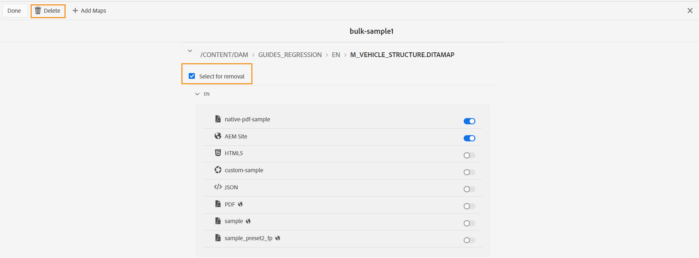

# 一括アクティベーションマップコレクションの編集 {#id214GI40B0XA}

一括アクティベーションマップコレクションを編集するには、マップファイルまたはプリセットをコレクションから追加または削除します。 一括アクティベーションマップコレクションを編集するには、次の手順を実行します。

1. 上部のAdobe Experience Manager ロゴを選択し、**ツール**&#x200B;を選択します。

1. **ツール** パネルで、**ガイド**&#x200B;を選択します。

1. **一括公開ダッシュボード** タイルを選択します。

   一括公開ダッシュボードには、一括アクティベーションマップコレクションのリストが表示されます。 このダッシュボードには、[Adobe Experience Manager Guides ホームページ ](intro-home-page.md)の左側のパネルからアクセスすることもできます。

1. 編集するコレクションを選択し、**開く**&#x200B;を選択します。

1. 「**編集**」を選択します。

   一括アクティベーションマップ収集ページが表示され、利用可能な各ロケールの事前設定されたプリセットと共にマップが表示されます。
   様々な種類の出力プリセットを、AEM サイト、PDF、ネイティブPDF、HTML5、カスタム、JSON出力などのアイコンとともに表示できます
   .

   >[!NOTE]
   >
   > 小さな アイコンは、フォルダープロファイルレベルのプリセットを示します。

1. スライダーを使用して、アクティベートまたはアクティベート解除する目的の出力プリセットをオフにします。

1. コレクションからマップを削除する場合は、マップを展開し、**削除を選択** オプションを選択します。

1. 「**削除**」を選択します。

   {width="600"}

   選択したマップは、一括アクティベーションマップコレクションから削除されます。

1. 「**完了**」を選択します。

**親トピック：**[&#x200B;公開コンテンツの一括アクティベーション ](conf-bulk-activation.md)
