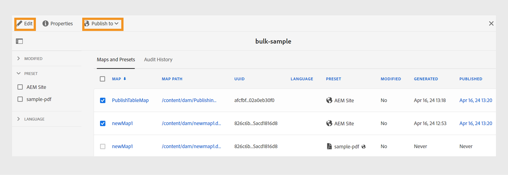

# 出力を有効化 {#id214GGF00V5U}

一括アクティベーション用のマップコレクションを作成したら、次にパブリッシュインスタンスでコンテンツをアクティベートします。 コンテンツをアクティベートするには、次の手順を実行します。

1. を選択 **ガイド** ツールのリストから。

1. 上部の「Adobe Experience Manager」リンクをクリックし、次を選択します。 **ツール**.

1. 「」をクリック **一括公開ダッシュボード** タイル。

   一括アクティベーションマップコレクションのリストが表示されます。

1. 公開するコレクションを選択し、 **開く**.

   {width="800" align="left"}

1. \（*オプション*\）変更された\（status\）、出力プリセット、または言語に基づいて、フィルターマップに必要なフィルターを左側のパネルから適用します。

   >[!NOTE]
   >
   >出力プリセットを使用してマップの出力を生成してから、マップ コレクションで出力プリセットをアクティブにします。

設定に応じて、コレクションをアクティベートする様々な方法を表示します。

 Cloud Services 

{width="650" align="left"}

に対する出力を有効にできます **プレビュー** または **公開** インスタンス。

**プレビュー**

* 選択したマップの出力をアクティブにするには、事前に生成されたマップ出力を選択し、 **公開先** > **プレビュー**.
* すべての DITA マップの出力を設定済みのプリセットでアクティブにするには、の横にあるチェックボックスをオンにします **マップ** 列を選択してから、 **公開先** > **公開**.

**公開**

* 選択したマップの出力をアクティブにするには、事前に生成されたマップ出力を選択し、 **公開先** > **公開**.

* すべての DITA マップの出力を設定済みのプリセットでアクティブにするには、マップ（列）の横にあるチェックボックスを選択し、 **公開先** > **公開**.

>[!NOTE]
> 
> マップ出力のチェックボックスは、マップの出力を生成した場合にのみ有効になります。

マップ出力がパブリッシュ用のキューに入ると、成功メッセージが表示されます。

選択したマップ ファイルに対して出力がアクティブ化されると、[ 監査履歴 ] タブが更新され、最新のアクティブ化された出力が一番上に表示されます。 この **公開済み** 列は、公開日時で更新されます。

    

  オンプレミスソフトウェア 

次のいずれかの操作を行います。

* 選択したマップの出力をアクティブにするには、事前に生成されたマップ出力を選択し、 **クイック公開**.
* すべての DITA マップの出力を設定済みのプリセットでアクティブにするには、マップ（列）の横にあるチェックボックスを選択し、 **クイック公開。**
  {width="650" align="left"}

  >[!NOTE]
  > 
  >マップ出力のチェックボックスは、マップの出力を生成した場合にのみ有効になります。

マップ出力がパブリッシュ用のキューに入ると、成功メッセージが表示されます。

選択したマップ ファイルに対して出力がアクティブ化されると、[ 監査履歴 ] タブが更新され、最新のアクティブ化された出力が一番上に表示されます。 この **公開済み** 列は、公開日時で更新されます。

**親トピック：**[公開済みコンテンツの一括アクティベーション](conf-bulk-activation.md)
