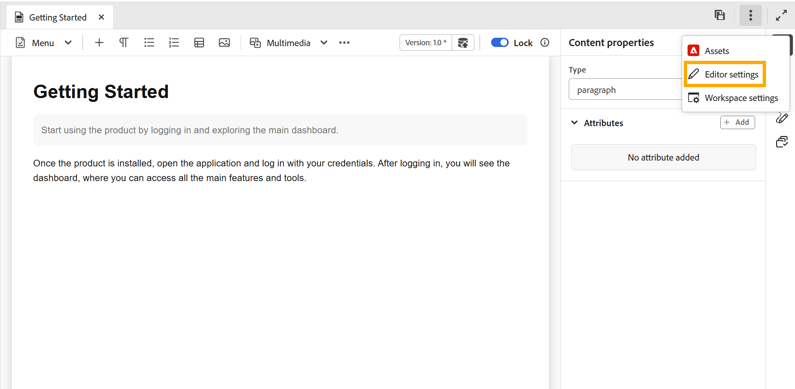
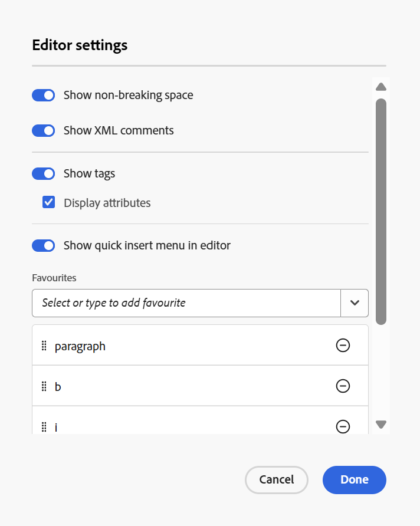
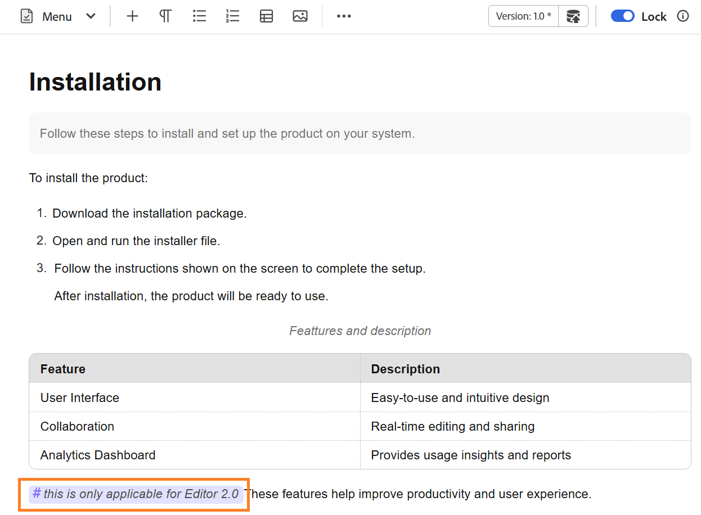
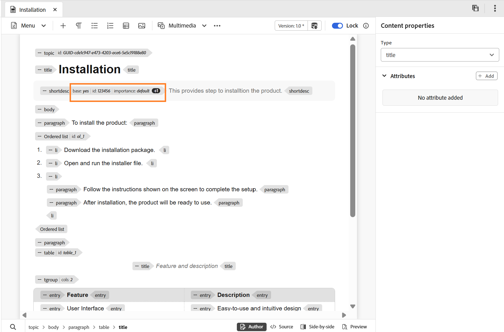
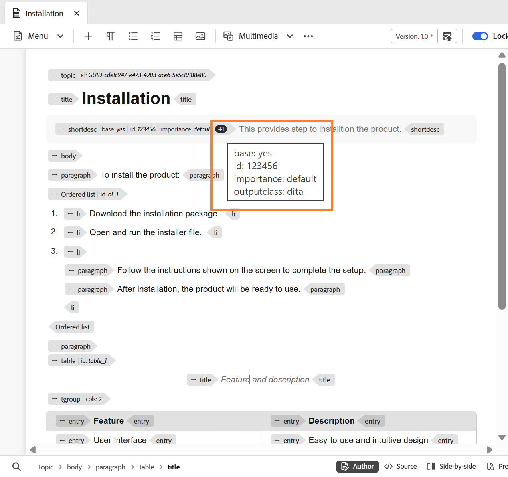
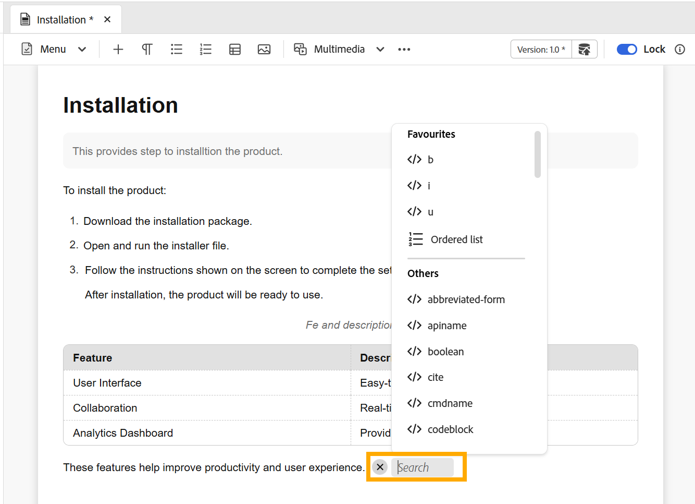

# エディター設定

>[!NOTE]
>
> この記事は新しいエディターにのみ適用されます。 お客様の環境でこの機能を有効にするには、AEM Guides カスタマーサクセス チームにお問い合わせください。

エディター設定には、個々の作成者レベルでエディターの動作をカスタマイズできる一元化された設定パネルが用意されています。 オーサリングプロセス中の柔軟性、一貫性、管理を向上できます。

この一元管理された設定パネルを使用すると、主要なエディターの環境設定を一元的に管理でき、分散した設定や手作業による設定の必要性を減らすことができます。 エディターの設定には、タブバーの&#x200B;**その他のアクション**&#x200B;からアクセスできます。

{width="650"}

## サポートされる設定オプション

環境設定に基づいて、次のオプションを有効または無効にできます。

{width="350"}

- **区切り以外のスペース**：このオプションを有効にすると、エディターで編集中に区切り以外のスペースのインジケーターが表示されます。 DITA トピックとDITA マップの作成者ビューでのみ表示されます
- **XML コメント**：作成者が作成者モードでXML コメントを直接表示、編集および挿入できるようにして、コンテンツ内の可視性を向上させます。 有効にすると、作成者は、作成者モード自体のコンテンツ内でXML コメントを直接表示、挿入、編集、削除できるようになり、共同作業者のコンテキストノートを簡単に追加できます。 無効にすると、XML コメントは作成者モードで非表示になり、作成者モードから挿入または変更できなくなり、必要のないユーザーに対してよりクリーンなオーサリングエクスペリエンスが提供されます。 `<!-- test comment -->`構文を使用して、引き続きソースモードでXML コメントを表示および作成できます。

  {width="650"}

- **タグ**: エディターでのタグの表示を制御します。 有効にすると、構造化タグがコンテンツ内に表示され、作成者は基礎となるDITA構造を表示および管理できます。 無効にすると、これらのタグは非表示になり、よりクリーンで集中的なオーサリング体験が提供されます。

  {width="650"}

  **タグを表示**&#x200B;設定が有効になっている場合は、**表示属性**&#x200B;を有効にして、要素に関連付けられた属性を表示および検証することもできます。 エレメントに3つ以上の属性が関連付けられている場合は、カウントインジケーターが表示されます。 インジケーターの上にマウスポインターを置くと、その要素に適用された属性の完全なリストが表示されます。

   {width="650"}

- **エディターのクイック挿入メニュー**: ツールバーに移動することなく、作成者モードで編集中に要素を直接カーソル位置に追加できるようにします。 頻繁に使用される要素は、**お気に入り**&#x200B;で設定して、すばやくアクセスすることもできます。 クイック挿入メニューは、Windowsで&#x200B;**Control + /**、macOSで&#x200B;**Command + /**&#x200B;を押すと、エディターで直接使用できます。

  {width="650"}

  お気に入りに要素を検索して追加したり、以前に追加した要素を削除したり、シンプルなドラッグ&amp;ドロップを使用して並べ替えたりできます。 お気に入りには、最も頻繁に使用する要素が含まれます。ここで設定した順序は、エディターからアクセスすると、クイック挿入メニューに反映されます。

  ここでは、新規エディターのクイック挿入メニューの操作方法に関する短いビデオを紹介します。

  >[!VIDEO](https://video.tv.adobe.com/v/3491343)

