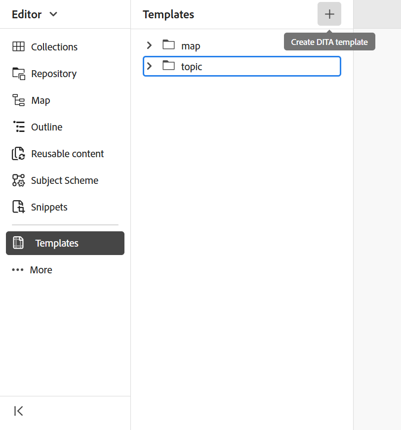
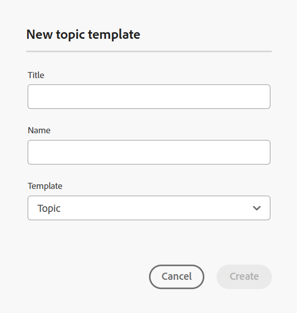
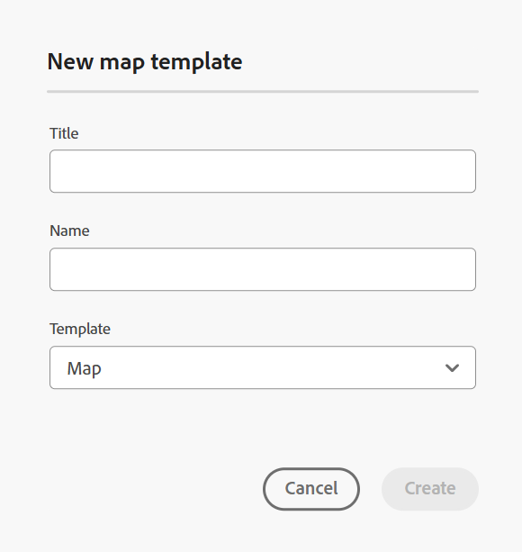
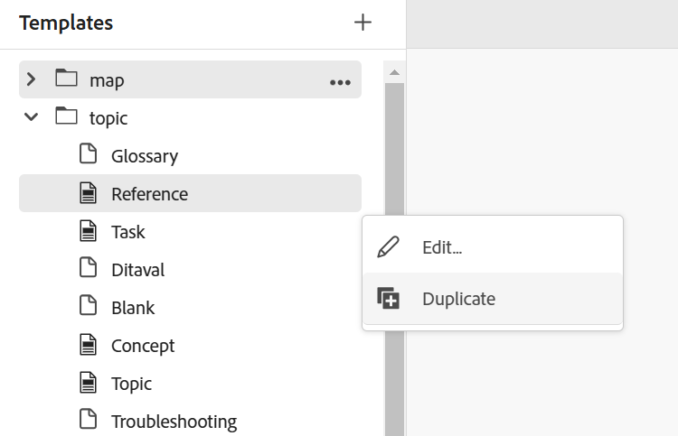
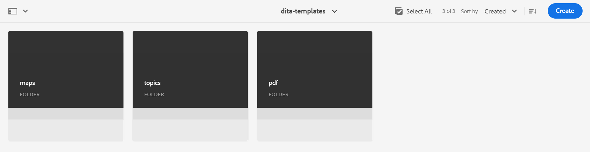
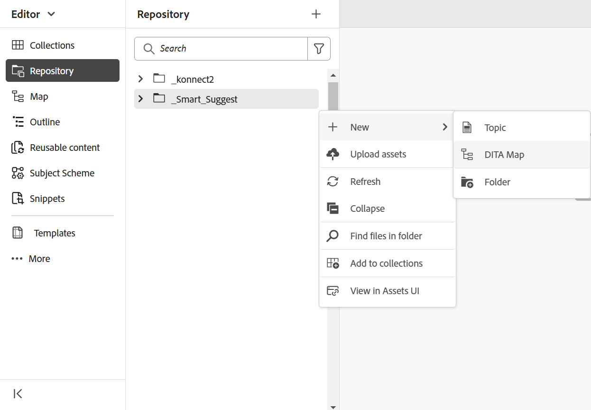

# カスタマイズされたテンプレートに基づくマップの作成 {#id225VF0808MP}

カスタマイズされたマップテンプレートを作成し、それらを使用して、マップテンプレートで参照されるトピックテンプレートおよびマップテンプレートと共にDITA マップを作成できます

カスタマイズされたマップテンプレートから、他のマップテンプレートやトピックテンプレートを参照できます。 参照されるマップテンプレートは、様々なマップテンプレート、トピックテンプレート、トピック、マップ、画像、ビデオ、その他のアセットを参照できます。 カスタマイズされたマップテンプレートを使用すると、マップテンプレートと参照フォルダー構造全体を簡単に複製できます。 これらのカスタマイズされたテンプレートは、再帰的な構造と参照を持つ複数のマップを作成および再作成するのに特に便利です。

>[!NOTE]
>
> トピックテンプレートは繰り返し作成されません。 マップテンプレート内に直接配置されたトピックテンプレートのみが生成され、トピックテンプレート内のトピックテンプレートは親から直接参照されます。

## カスタマイズされたテンプレートの作成

Adobe Experience Manager Guidesでは、dita-templates フォルダーからカスタマイズされたマップとトピックを作成できます。 これらのカスタマイズされたテンプレートを使用して、マップとトピックを作成できます。 これらのテンプレートを作成者と共有して、作成者がファイルを作成できるようにすることもできます。 これらのテンプレートを使用すると、作成者はテンプレートフォルダー内にある特定のリソースの個別コピーを保持できます。

>[!NOTE]
>
> 参照して管理するだけのリソースは、テンプレートフォルダー外に保持する必要があります。


マップテンプレートとトピックテンプレートは、次の方法で作成できます。
- [エディターからカスタマイズされたテンプレートを作成](#create-customized-templates-from-the-editor)
- [Assets UIからカスタマイズされたテンプレートを作成する](#create-customized-templates-from-the-assets-ui)


### エディターからカスタマイズされたテンプレートを作成

**テンプレート**&#x200B;機能は、エディター](./web-editor-left-panel.md) インターフェイスの[左パネルにあり、管理者のみが使用できます。 管理者は、このパネルを使用して、作成者が使用できるテンプレートを簡単に作成および管理できます。 デフォルトでは、テンプレートは&#x200B;*map*&#x200B;および&#x200B;*topic* タイプのテンプレートに分類されます。

{width="300"}

デフォルトでは、タイトルでファイルを表示できます。 テンプレートにカーソルを合わせると、ファイルのタイトルとファイル名がツールチップとして表示されます。

>[!NOTE]
>
> 管理者は、エディターでファイルのリストを表示することもできます。 **ユーザー設定**&#x200B;の「**エディターファイル表示設定**」セクションの「**ファイル名**」オプションを選択します。

エディターからトピックまたはマップテンプレートを作成するには、次の手順を実行します。

1. エディターで&#x200B;**テンプレート** パネルを開き、**DITA テンプレートを作成** アイコンを選択します。

   {width="500"}

1. 作成するテンプレートのタイプに基づいて、ドロップダウンメニューから「**トピックテンプレート**」または「**テンプレートをマッピング**」を選択します。
1. **トピックテンプレート**&#x200B;を選択すると、**新しいトピックテンプレート** ダイアログボックスが表示されます。

   {width="300"}

   **マップテンプレート**&#x200B;を選択すると、**新しいマップテンプレート** ダイアログボックスが表示されます。

   {width="300"}

   最初に&#x200B;**topic**&#x200B;または&#x200B;**map** フォルダー内にフォルダーを作成する場合は、ドロップダウンリストから&#x200B;**フォルダー**&#x200B;を選択することもできます。

1. **新しいトピックテンプレート**/**新しいマップテンプレート** ダイアログで、**テンプレート** パネルに表示される&#x200B;**タイトル**&#x200B;を入力します。 テンプレートの&#x200B;**名前**は、タイトルに基づいて自動的に提案されますが、別のファイル名を指定することもできます。
また、**テンプレート** ドロップダウンリストから、作成するテンプレートのタイプを選択します。

   >[!NOTE]
   >
   > 管理者がUUID設定に基づいて自動ファイル名を有効にしている場合、「名前」フィールドは表示されません。

1. 「**作成**」を選択します。

テンプレートを作成したら、グローバルレベルまたはフォルダーレベルのプロファイルに追加する必要があります。 テンプレートが追加されると、作成者はトピック/マップ作成プロセスで新しいテンプレートの表示を開始します。

既存のテンプレートの&#x200B;**オプション** メニューを使用して、**編集**&#x200B;または&#x200B;**複製**&#x200B;を選択できます。 複製の場合、テンプレートの構造とタイプ \（of document\）は保持され、再利用してテンプレートから別のテンプレートを作成できます。

{width="500"}

### Assets UIからカスタマイズされたテンプレートを作成する

Assets UIからマップまたはトピックテンプレートを作成するには、次の手順を実行します。

1. **Assets UI**&#x200B;で、dita-templates フォルダーに移動します。

   

1. **トピック** テンプレートを作成する場合は、**トピック** フォルダーを開きます。 **Map** テンプレートを作成する場合は、**maps** フォルダーを開きます。
1. **作成\> DITA テンプレート**&#x200B;を選択します。

   {width="300"}
1. ブループリントページで、**トピック \>次へ**&#x200B;を選択して、トピックテンプレートを作成します。 または、**マップ \>次**&#x200B;を選択してマップテンプレートを作成します。
1. プロパティ ページで、テンプレート **タイトル**&#x200B;を指定します。
1. ファイル **名前**&#x200B;を指定します。

   >[!NOTE]
   >
   > ファイル名には.dita拡張子が必要です。

1. \（オプション\）説明を追加します。
1. 「**作成**」を選択します。

   トピックテンプレート作成メッセージが表示されます。 テンプレートを開いて編集します。 マップテンプレートの場合、トピックテンプレート、マップテンプレート、およびその他のアセットの参照をマップテンプレートに追加することもできます。


Assets UI **の** オプション メニュー

Assets UIの「オプション」メニューを使用して、マップまたはトピックテンプレートを作成するには、次の手順を実行します。

1. 現在のテンプレートフォルダーの&#x200B;**Map**&#x200B;または&#x200B;**Topic** フォルダーを選択します。 例：`dita-templates` フォルダー。
1. **オプション** メニューから、**マップテンプレートの作成**&#x200B;または&#x200B;**トピックテンプレートの作成**&#x200B;を選択します。

   **新しいマップテンプレートの作成**&#x200B;または&#x200B;**新しいトピックテンプレートの作成** ダイアログが開きます。
1. 新しいテンプレートのタイトルと名前を入力します。
1. 作成するテンプレートのタイプを&#x200B;**テンプレート** ドロップダウンリストから選択します。

マップテンプレート作成メッセージが表示されます。 テンプレートをグローバルレベルまたはフォルダーレベルのプロファイルに追加できます。 新しいテンプレートがトピックまたはマップ作成プロセスに表示され、それを使用してマップまたはトピックを作成できます。

管理者は、フォルダーを作成し、テンプレートを作成して保存できるフォルダーに設定することもできます。

設定に基づいて、カスタム DITA テンプレートフォルダーパスを設定する方法について説明します。
<details>
    <summary> クラウドサービス </summary>

カスタム DITA テンプレートフォルダーのパス ](../install-guide/conf-template-tags-custom-dita-topic-template.md#configure-custom-dita-template-folder-path-id191lcf0095z)を[設定する方法については、Cloud Services インストールおよび設定ガイドを参照してください。
</details>

<details>
    <summary> オンプレミスソフトウェア</summary>

カスタム DITA テンプレートフォルダーのパス ](../cs-install-guide/conf-template-tags-custom-dita-topic-template.md#configure-custom-dita-template-folder-path-id191lcf0095z)を[設定する方法については、オンプレミスのインストールおよび設定ガイドを参照してください。
</details>

## テンプレートで定義されたタイトルを渡します

テンプレート内で使用されているトピックまたはマップのタイトルを、そのテンプレートを使用して作成されたDITA マップに渡す場合は、タイトルの周りに中括弧を使用します。

例

```XML
<pubtitle>
   <mainpubtitle outputclass="booktitle">
   {title}
   </mainpubtitle>
   <subtitle>Subtitle</subtitle>
</pubtitle>

The resultant DITA map with title "Rootmap1" will look like as follows:
<pubtitle>
   <mainpubtitle outputclass="booktitle">Rootmap1
   </mainpubtitle>
   <subtitle>Subtitle</subtitle>
</pubtitle>
```

>[!NOTE]
> 中括弧の最初の出現のみがタイトルに置き換えられます。

タイトルの周りに中括弧を使用しない場合、結果のDITA マップは最初の要素のみが選択され、タイトルのネストはテンプレートから選択されず、次のようになります。

```XML
<pubtitle> Rootmap1 </pubtitle>
```

>[!NOTE]
> また、テキストの周りの中括弧を使用して、カスタムテンプレートからDITA マップにネストされた構造を渡すこともできます。

例

```XML
<title>    
    <sub>        
        <b>{title}</b>    
    </sub>
</title>
```

## マップテンプレートを使用した新しいマップの作成

>[!NOTE]
>
> マップテンプレートは、管理者が設定し、オーサリングで利用できるようにする必要があります。 詳しくは、「Adobe Experience Manager Guides as a Cloud Serviceのインストールと設定」の「*オーサリングテンプレートの設定*」セクションを参照してください。

**エディター**&#x200B;で、次の手順を実行して、カスタムマップテンプレートを使用してマップを作成します。

1. **エディター**&#x200B;で、マップを作成するフォルダーに移動します。
1. フォルダーのオプションメニューから、**新規\> DITA マップ**&#x200B;を選択します。

   {width="500"}
1. **新しいマップ** ダイアログが表示されます。
1. **新しいマップ** ダイアログで、マップ **タイトル**、ファイル **名前**&#x200B;を指定し、使用するマップテンプレートを選択します。

   例えば、マップテンプレート「test-template」を作成した場合は、そのマップテンプレートを選択します。

1. 「**作成**」を選択します。

   マップ作成メッセージが表示されます。

**Assets UI**&#x200B;で、次の手順を実行して、カスタムマップテンプレートを使用してマップを作成します。

1. **Assets UIで、**&#x200B;はマップを作成するフォルダーに移動します。
1. 「**作成\> DITA マップ**」を選択します。
1. ブループリントページで、使用するマップテンプレートを選択し、**次へ**&#x200B;を選択します。 例えば、マップテンプレート「test-template」を作成した場合は、そのマップテンプレートを選択します。
1. プロパティ ページで、マップ **タイトル**&#x200B;を指定します。
1. ファイル **名前**&#x200B;を指定します。

   >[!NOTE]
   >
   > ファイル名には.ditamap拡張子が必要です。

1. 「**作成**」を選択します。 マップ作成メッセージが表示されます。

## カスタムテンプレートを使用して作成されたDITA マップに関する追加メモ


マップは、テンプレートフォルダー内で参照されるすべてのアセットを生成します。 マップで参照されるアセットには、次のようなものがあります。

- マップにトピックテンプレートへの参照が含まれている場合、そのコピーは`dita-templates` フォルダーのtopics フォルダーと同じ階層のフォルダー内に作成されます。
- マップにマップテンプレートへの参照が含まれている場合、そのコピーは、`dita-templates` フォルダーのマップフォルダーと同じ階層のフォルダー内に作成されます。
- マップに`dita-templates/topics`または`dita-templates/maps` フォルダー外のトピックまたはマップへの汎用参照が含まれている場合、同じもののみが参照され、コピーは作成されません。

  >[!NOTE]
  >
  > `dita-templates/topics`と`dita-templates/maps`はGuidesのデフォルトのパスであり、設定可能です。


  マップテンプレート内にトピックテンプレートキー定義がある場合、新しいキー\（したがって、新しいトピック\）が作成され、マップ内で参照されます。

- フォルダー内の同じレベルで別のマップまたはトピックが作成された場合、新しく作成されたアセットの名前には0、1、2などが追加されます。 マップを開いて編集するか、マップファイルをリポジトリに保存するかを選択できます。

**親トピック：**[ マップエディターの概要](map-editor.md)
