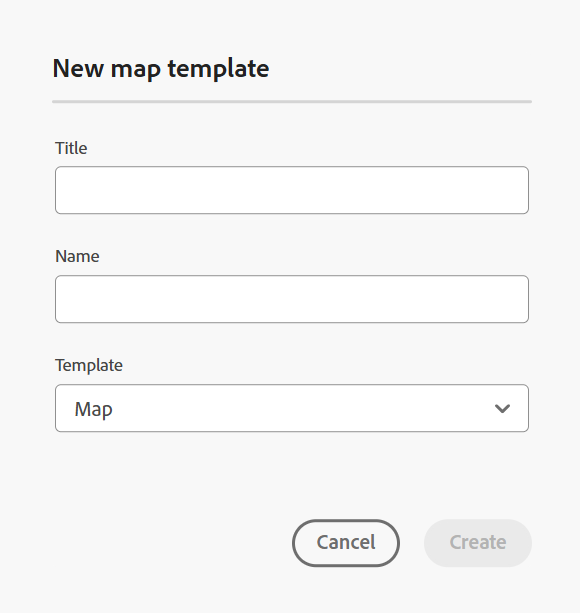

# カスタマイズしたテンプレートに基づいてマップを作成する {#id225VF0808MP}

カスタマイズしたマップ テンプレートを作成し、それを使用して、マップ テンプレートで参照されるトピック テンプレートおよびマップ テンプレートとともに DITA マップを作成できます

カスタマイズされたマップ テンプレートから、他のマップ テンプレートおよびトピック テンプレートを参照できます。 参照されるマップ テンプレートは、さまざまなマップ テンプレート、トピック テンプレート、トピック、マップ、イメージ、ビデオ、およびその他のアセットを参照できます。 カスタマイズされたマップ テンプレートを使用すると、マップ テンプレートおよび参照されているフォルダ構造全体を非常に簡単に複製できます。 これらのカスタマイズされたテンプレートは、再帰構造と参照を持つ複数のマップを作成および再作成する場合に特に便利です。

>[!NOTE]
>
> トピックテンプレートが再帰的に作成されない。 マップ テンプレート内に直接存在するトピック テンプレートのみが生成され、トピック テンプレート内のトピック テンプレートは単に親で直接参照されます。

## カスタマイズしたテンプレートの作成

Adobe Experience Manager Guidesでは、dita-templates フォルダからカスタマイズされたマップとトピックを作成できます。 これらのカスタマイズされたテンプレートを使用して、マップとトピックを作成できます。 また、これらのテンプレートを作成者と共有し、作成者がテンプレートを使用してファイルを作成することもできます。 これらのテンプレートを使用すると、作成者は、templates フォルダー内にある特定のリソースのコピーを個別に保持できます。

>[!NOTE]
>
> 間でのみ参照および管理するリソースは、templates フォルダーの外部に保持する必要があります。


マップとトピックのテンプレートは、次の方法で作成できます。
- [エディターからのカスタマイズされたテンプレートの作成](#create-customized-templates-from-the-editor)
- [Assets UI からのカスタマイズされたテンプレートの作成](#create-customized-templates-from-the-assets-ui)


### エディターからのカスタマイズされたテンプレートの作成

**テンプレート** 機能は、エディター [ インターフェイスの左側のパネルにあり ](./web-editor-features.md#left-panel) 管理者のみが使用できます。 このパネルを使用すると、管理者は、作成者が使用できるテンプレートを簡単に作成および管理できます。 デフォルトでは、テンプレートは *map* タイプと *topic* タイプのテンプレートに分類されます。

{width="300" align="left"}

デフォルトでは、タイトル別にファイルを表示できます。 テンプレートの上にマウスポインターを置くと、ファイルのタイトルとファイル名がツールチップとして表示されます。

>[!NOTE]
>
> 管理者は、エディターでファイルのリストを表示することもできます。 **ユーザー環境設定** の **エディターファイル表示設定** セクションの **ファイル名オプションを選択します**。

エディターからトピックまたはマップのテンプレートを作成するには、次の手順を実行します。

1. エディタで **テンプレート** パネルを開き、「**DITA テンプレートを作成**」アイコンを選択します。

   {width="500" align="left"}

1. 作成するテンプレートのタイプに基づいて、ドロップダウンメニューから **トピックテンプレート** または **マップテンプレート** を選択します。
1. **トピック テンプレート** を選択した場合は、**新規トピック テンプレート** ダイアログ ボックスが表示されます。

   {width="300" align="left"}

   **マップ テンプレート** を選択すると、[**マップ テンプレートを新規作成**] ダイアログ ボックスが表示されます。

   {width="300" align="left"}

   最初に **topic** または **map** フォルダー内にフォルダーを作成する場合は、ドロップダウンリストから **フォルダー** を選択することもできます。

1. **新規トピックテンプレート**/**新規マップテンプレート** ダイアログで、**タイトル** を指定します。このタイトルは、**テンプレート** パネルに表示されます。 テンプレートの **名前** は、タイトルに基づいて自動的に提案されますが、別のファイル名を指定することもできます。
また、「**テンプレート**」ドロップダウンリストから、作成するテンプレートのタイプを選択します。

   >[!NOTE]
   >
   > 管理者が UUID 設定に基づく自動ファイル名を有効にしている場合、「名前」フィールドは表示されません。

1. 「**作成**」を選択します。

テンプレートを作成したら、グローバルプロファイルまたはフォルダーレベルのプロファイルに追加する必要があります。 テンプレートが追加されると、作成者は、トピック/マップの作成プロセスで新しいテンプレートの表示を開始します。

既存のテンプレートの **オプション** メニューを使用して、テンプレートを **編集** または **複製** 選択できます。 複製の場合、テンプレートの構造とタイプ \（ドキュメントの\）は保持され、それを再利用して別のテンプレートを作成できます。

{width="500" align="left"}

### Assets UI からのカスタマイズされたテンプレートの作成

Assets UI からマップまたはトピックのテンプレートを作成するには、次の手順を実行します。

1. **Assets UI** で、dita-templates フォルダーに移動します。

   {align="left"}

1. **トピック** テンプレートを作成する場合は、**topics** フォルダーを開きます。 **マップ** テンプレートを作成する場合は、**マップ** フォルダーを開きます。
1. **作成\> DITA テンプレート** を選択します。

   {width="300" align="left"}
1. ブループリントページで「**トピック \> 次へ**」を選択して、トピックテンプレートを作成します。 それ以外の場合は、「**マップ \> 次へ**」を選択してマップ・テンプレートを作成します。
1. プロパティページで、テンプレート **タイトル** を指定します。
1. ファイル **名前** を指定します。

   >[!NOTE]
   >
   > ファイル名の拡張子は.dita である必要があります。

1. \（オプション\）説明を追加します。
1. 「**作成**」を選択します。

   トピックテンプレートが作成されましたメッセージが表示されます。 その後、テンプレートを開いて編集できます。 マップ テンプレートの場合、トピック テンプレート、マップ テンプレート、およびマップ テンプレート内の他のアセットの参照を追加することもできます。


**Assets UI のオプションメニュー**

Assets UI のオプションメニューを使用してマップまたはトピックのテンプレートを作成するには、次の手順を実行します。

1. 現在のテンプレートフォルダーで **Map** または **Topic** フォルダーを選択します。 例：`dita-templates` フォルダー。
1. **オプション** メニューから **マップ テンプレートを作成** または **トピック テンプレートを作成** を選択します。

   **新しいマップ テンプレートを作成** または **新しいトピック テンプレートを作成** ダイアログが開きます。
1. 新しいテンプレートのタイトルと名前を入力します。
1. **テンプレート** ドロップダウンリストから、作成するテンプレートのタイプを選択します。

マップテンプレートが作成されましたメッセージが表示されます。 グローバルプロファイルまたはフォルダーレベルのプロファイルにテンプレートを追加できます。 新しいテンプレートがトピックまたはマップの作成プロセスに表示され、マップまたはトピックを作成できます。

管理者は、フォルダーを作成し、テンプレートを作成して保存できるフォルダーに設定することもできます。

設定に基づいて、カスタム DITA テンプレートフォルダーパスの設定方法を説明します。
<details>
    <summary> クラウドサービス </summary>

[ カスタム DITA テンプレートフォルダーパスの設定 ](../install-guide/conf-template-tags-custom-dita-topic-template.md#configure-custom-dita-template-folder-path-id191lcf0095z) 方法については、Cloud Services インストールおよび設定ガイドを参照してください。
</details>

<details>
    <summary> オンプレミスソフトウェア</summary>

[ カスタム DITA テンプレートフォルダーパスを設定する ](../cs-install-guide/conf-template-tags-custom-dita-topic-template.md#configure-custom-dita-template-folder-path-id191lcf0095z) 方法については、『オンプレミスインストールおよび設定ガイド』を参照してください。
</details>

## テンプレートで定義されたタイトルを渡します

テンプレート内で使用されているトピックまたはマップのタイトルを、そのテンプレートを使用して作成された DITA マップに渡す場合は、タイトルの周りに中括弧を使用します。

例

```XML
<pubtitle>
   <mainpubtitle outputclass="booktitle">
   {title}
   </mainpubtitle>
   <subtitle>Subtitle</subtitle>
</pubtitle>

The resultant DITA map with title "Rootmap1" will look like as follows:
<pubtitle>
   <mainpubtitle outputclass="booktitle">Rootmap1
   </mainpubtitle>
   <subtitle>Subtitle</subtitle>
</pubtitle>
```

>[!NOTE]
> 中括弧が最初に現れる箇所のみが title に置き換えられます。

タイトルに中括弧を使用しない場合、結果の DITA マップは最初の要素だけが選択され、タイトルのネストはテンプレートから選択されず、次のように表示されます。

```XML
<pubtitle> Rootmap1 </pubtitle>
```

>[!NOTE]
> テキストの中カッコを使用して、ネストされた構造をカスタム・テンプレートから DITA マップに渡すこともできます。

例

```XML
<title>    
    <sub>        
        <b>{title}</b>    
    </sub>
</title>
```

## マップ テンプレートを使用して新しいマップを作成します

>[!NOTE]
>
> マップテンプレートを設定し、管理者がオーサリングできるようにする必要があります。 詳しくは、「Adobe Experience Manager Guides as a Cloud Serviceのインストールと設定」の「*オーサリングテンプレートの設定* 節を参照してください。

**エディター** で、次の手順を実行してカスタムマップテンプレートを使用してマップを作成します。

1. **エディター** で、マップを作成するフォルダーに移動します。
1. フォルダの「オプション」メニューから、「**新規\> DITA マップ**」を選択します。

   {width="500" align="left"}
1. **新しいマップ** ダイアログが表示されます。
1. **新規マップ** ダイアログで、マップ **タイトル**、ファイル **名前** を指定し、使用するマップテンプレートを選択します。

   たとえば、マップ テンプレート「test-template」を作成した場合は、それを選択します。

1. 「**作成**」を選択します。

   マップが作成されたことを示すメッセージが表示されます。

**Assets UI** でカスタムマップテンプレートを使用してマップを作成するには、次の手順を実行します。

1. **Assets UI で** マップを作成するフォルダーに移動します。
1. **作成\> DITA マップ** を選択します。
1. ブループリントページで、使用するマップテンプレートを選択し、「**次へ**」を選択します。 たとえば、マップ テンプレート「test-template」を作成した場合は、それを選択します。
1. プロパティページで、マップ **タイトル** を指定します。
1. ファイル **名前** を指定します。

   >[!NOTE]
   >
   > ファイル名の拡張子は.ditamap である必要があります。

1. 「**作成**」を選択します。マップが作成されたことを示すメッセージが表示されます。

## カスタムテンプレートを使用して作成された DITA マップの追加の注記


マップは、テンプレートフォルダー内で参照されるすべてのアセットを生成します。 マップで参照されるアセットには、次のようなタイプがあります。

- マップにトピック テンプレートへの参照が含まれている場合、そのコピーがフォルダ内に作成されます。これは、`dita-templates` フォルダ内のトピック フォルダと同じ階層にあります。
- マップにマップ テンプレートへの参照が含まれている場合は、そのコピーがフォルダ内に作成されます。これは、`dita-templates` フォルダ内の maps フォルダと同じ階層にあります。
- マップに、`dita-templates/topics` またはフォルダの外部にあるトピックまたはマップへの汎用参照が含まれている場合、同じトピックまたはマップ `dita-templates/maps` 参照されるだけで、コピーは作成されません。

  >[!NOTE]
  >
  > ガイドのデフォルトパスは `dita-templates/topics` と `dita-templates/maps` で、設定可能です。


  マップ テンプレート内にトピック テンプレート キー定義がある場合、新しいキー\（したがって新しいトピック\）が作成され、マップ内で参照されます。

- フォルダー内の同じレベルに別のマップまたはトピックを作成した場合は、新しく作成されたアセットの名前に 0、1、2 などが追加されます。 編集のためにマップを開くか、マップ ファイルをリポジトリに保存するかを選択できます。

**親トピック：**&#x200B;[ マップ エディタの概要 ](map-editor.md)
