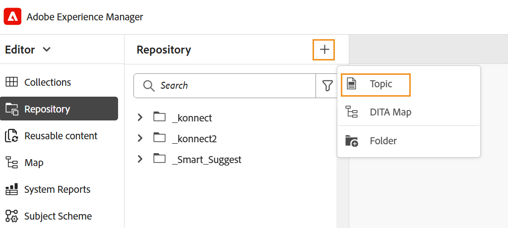

# DITAVAL エディター {#ditaval-editor}

DITAVAL ファイルは、条件付き出力の生成に使用されます。 単一のトピックで、要素の属性を使用してコンテンツの条件を設定する条件を追加できます。 次に、DITAVAL ファイルを作成します。このファイルでは、コンテンツを生成するために取得する必要がある条件と、最終的な出力から除外する必要がある条件を指定します。

Adobe Experience Manager Guidesでは、DITAVAL エディタを使用して DITAVAL ファイルを簡単に作成および編集できます。 DITAVAL エディタは、システムで定義されている属性\（またはタグ\）を取得し、それらを使用して DITAVAL ファイルを作成または編集できます。 Adobe Experience Managerでのタグの作成と管理について詳しくは、Adobe Experience Manager ドキュメントの [ タグの管理 ](https://experienceleague.adobe.com/docs/experience-manager-cloud-service/sites/authoring/features/tags.html?lang=en) の節を参照してください。

以下の節では、Experience Manager Guidesの DITAVAL ファイルで使用できるオプションについて説明します。

- [DITAVAL ファイルの作成](#create-ditaval-file)
- [DITAVAL ファイルの編集](#edit-ditaval-file)
- [DITAVAl ファイル エディタ ビュー](#ditaval-editor-views)
- [Assets UI での DITAVAL ファイルの操作](#working-with-ditaval-files-in-the-assets-ui)

## DITAVAL ファイルの作成

DITAVAL ファイルを作成するには、以下の手順を実行します。

1. リポジトリパネルで「**新規ファイル**」アイコンを選択し、ドロップダウンメニューから「**トピック**」を選択します。

   {align="left"}

   このオプションには、[Experience Manager Guidesのホームページ ](./intro-home-page.md) およびリポジトリビューのフォルダーのオプションメニューからもアクセスできます。

2. **新規トピック** ダイアログボックスが表示されます。

3. **新規トピック** ダイアログボックスで、次の詳細を入力します。
   - トピックのタイトル。
   - \（オプション\）* トピックのファイル名。 ファイル名は、トピックのタイトルに基づいて自動的に提示されます。 管理者が UUID 設定に基づく自動ファイル名を有効にしている場合、「名前」フィールドは表示されません。
   - トピックの基になるテンプレート。 DITAVAL ファイルの場合は、ドロップダウンリストから「**Ditaval**」を選択します。
   - トピック ファイルを保存するパス。 デフォルトでは、リポジトリで現在選択されているフォルダーのパスが「パス」フィールドに表示されます。

   {width="300" align="left"}

4. 「**作成**」を選択します。

指定したパスにトピックが作成されます。 また、エディターでトピックが開いて編集できます。

{align="left"}

## DITAVAL ファイルの編集

DITAVAL トピックを作成すると、エディタで開いて編集できます。 既存の DITAVAL トピックを編集するには、DITAVAL トピックが存在するフォルダまたはマップに移動し、**オプション** メニューから **編集** を選択します。

DITAVAL エディタでは、次のタスクを実行できます。

- 左パネルを切り替え

  左側のパネルビューを切り替えます。 DITA マップを使用して DITAVAL ファイルを開いた場合、マップとリポジトリがこのパネルに表示されます。 DITA マップを使用してファイルを開く方法の詳細については、[DITA マップを使用してトピックを編集 ](map-editor-advanced-map-editor.md#id17ACJ0F0FHS) を参照してください。

- 保存

  ファイルへの変更を保存します。 すべての変更は、ファイルの現在のバージョンに保存されます。

- Prop を追加

  DITAVAL ファイルに 1 つのプロパティを追加します。

  

  最初のドロップダウンには、DITAVAL ファイルで使用できる DITA 属性が表示されます。 サポートされている属性は、`audience`、`platform`、`product`、`props` および `otherprops` の 5 つです。

  2 つ目のドロップダウンリストには、選択した属性に設定された値が表示されます。 次に、選択した属性に対して設定できるアクションが次のドロップダウンリストに表示されます。 アクションドロップダウンで使用できる値は、`include`、`exclude`、`passthrough`、`flag` です。 これらの値について詳しくは、OASIS DITA 文書の [prop](http://docs.oasis-open.org/dita/dita/v1.3/errata01/os/complete/part3-all-inclusive/langRef/ditaval/ditaval-prop.html#ditaval-prop) 要素の定義を参照してください

- すべてのプロパティを追加

  システム内で定義されているすべての条件付きプロパティまたは属性を 1 回のクリックで追加する場合は、「すべてのプロパティを追加」機能を使用します。

  >[!NOTE]
  >
  > 定義済みの条件付きプロパティがすべて DITAVAL ファイルに存在する場合、プロパティを追加することはできません。 このシナリオでは、エラーメッセージが表示されます。

  

DITAVAL ファイルの編集が完了したら、「**保存**」を選択します。

>[!NOTE]
>
> 保存せずにファイルを閉じると、変更内容は失われます。 変更内容をAdobe Experience Manager リポジトリにコミットしない場合は、「**未保存の変更内容** ダイアログで「**&#x200B;** 閉じる **」を選択したあと、「保存せずに閉じる** を選択します。

## DITAVAL エディタ ビュー

Adobe Experience Manager Guidesの DITAVAL Editor では、次の 2 つの異なるモードまたはビューでの DITAVAL ファイルの表示がサポートされています。

**オーサー**:   これは、DITAVAL エディタの What You See が What You Get \（WYSISYG\） ビューを表示する典型的なものです。 プロパティ、値、アクションをドロップダウンリストに表示するシンプルなユーザーインターフェイスを使用して、プロパティを追加または削除できます。 オーサービューには、個々のプロパティを挿入し、1 回のクリックですべてのプロパティを挿入するオプションがあります。

また、ファイル名の上にカーソルを置くと、現在作業中の DITAVAL ファイルのバージョンを見つけることができます。

**Source**:   Source ビューには、DITAVAL ファイルを構成する基になる XML が表示されます。 作成者は、このビューで通常のテキスト編集を行うだけでなく、スマートカタログを使用してプロパティを追加または編集することもできます。

スマートカタログを呼び出すには、任意のプロパティ定義の末尾にカーソルを置いて、「&lt;」と入力します。 エディターには、その場所に挿入できるすべての有効な XML 要素のリストが表示されます。

## Assets UI での DITAVAL ファイルの操作

Assets UI から DITAVAL ファイルを作成することもできます。 新しい DITAVAL トピックを作成する手順は次のとおりです。

1. Assets UI で、DITAVAL ファイルを作成する場所に移動します。

1. **作成** \> **DITA トピック** を選択します。

1. ブループリントページで、「DITAVAL ファイルテンプレート」を選択し、「**次へ**」を選択します。

1. プロパティ ページで、DITAVAL ファイルの **タイトル** と **名前** を指定します。

   >[!NOTE]
   >
   > ファイルのタイトルに基づいて、名前が自動的に提案されます。 ファイル名を手動で指定する場合は、名前にスペース、アポストロフィ、または中括弧が含まれず、.ditaval で終わっていることを確認してください。

1. 「**作成**」を選択します。

   「トピックを作成しました」のメッセージが表示されます。

DITAVAL エディタで編集するために DITAVAL ファイルを開くか、またはAdobe Experience Manager リポジトリにトピック ファイルを保存するかを選択できます。

既存の DITAVAL ファイルを編集するには、以下の手順を実行します。

1. Assets UI で、編集する DITAVAL ファイルに移動します。

1. ファイルを排他的にロックするには、ファイルを選択して「**チェックアウト**」を選択します。

1. ファイルを選択し、「**編集**」を選択してAdobe Experience Manager Guides DITAVAL エディターでファイルを開きます。

