# DITAVAL エディター {#ditaval-editor}

DITAVAL ファイルは、条件付き出力の生成に使用されます。 1つのトピックで、要素の属性を使用して条件を追加し、コンテンツをコンディショナライズできます。 次に、DITAVAL ファイルを作成します。このファイルでは、コンテンツを生成するために取得する必要がある条件と、最終的な出力から除外する条件を指定します。

Adobe Experience Manager Guidesでは、DITAVAL エディターを使用してDITAVAL ファイルを簡単に作成および編集できます。 DITAVAL エディターは、システムで定義されている属性（条件として使用できます）を取得し、それらを使用してDITAVAL ファイルを作成または編集できます。 Adobe Experience Managerでの条件の作成と管理について詳しくは、Adobe Experience Manager ドキュメントの「[ タグの管理](https://experienceleague.adobe.com/docs/experience-manager-cloud-service/sites/authoring/features/tags.html?lang=en)」の節を参照してください。

次の節では、Experience Manager GuidesのDITAVAL ファイルで使用できるオプションについて説明します。

- [DITAVAL ファイルを作成](#create-ditaval-file)
- [DITAVAL ファイルを編集](#edit-ditaval-file)
- [DITAVAl ファイルエディタービュー](#ditaval-editor-views)
- [Assets UIでのDITAVAL ファイルの操作](#working-with-ditaval-files-in-the-assets-ui)

## DITAVAL ファイルを作成

DITAVAL ファイルを作成するには、次の手順を実行します。

1. リポジトリパネルで、**新規ファイル** アイコンを選択し、ドロップダウンメニューから&#x200B;**トピック**&#x200B;を選択します。

   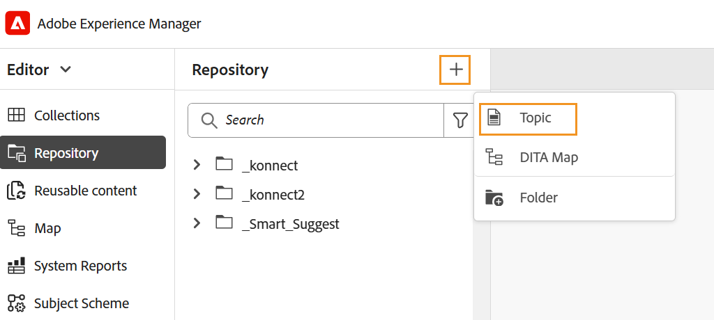{width="350"}

   このオプションには、[Experience Manager Guidesのホームページ ](./intro-home-page.md)と、リポジトリビューのフォルダーのオプションメニューからアクセスすることもできます。

2. **新しいトピック** ダイアログボックスが表示されます。

3. **新しいトピック** ダイアログボックスで、次の詳細を入力します。
   - トピックのタイトル。
   - \（Optional\）* トピックのファイル名。 ファイル名は、トピックタイトルに基づいて自動的に提案されます。 管理者がUUID設定に基づいて自動ファイル名を有効にしている場合、「名前」フィールドは表示されません。
   - トピックのベースとなるテンプレート。 Ditaval ファイルの場合は、ドロップダウンリストから&#x200B;**Ditaval**&#x200B;を選択します。
   - トピックファイルを保存するパス。 デフォルトでは、リポジトリで現在選択されているフォルダーのパスが「パス」フィールドに表示されます。

   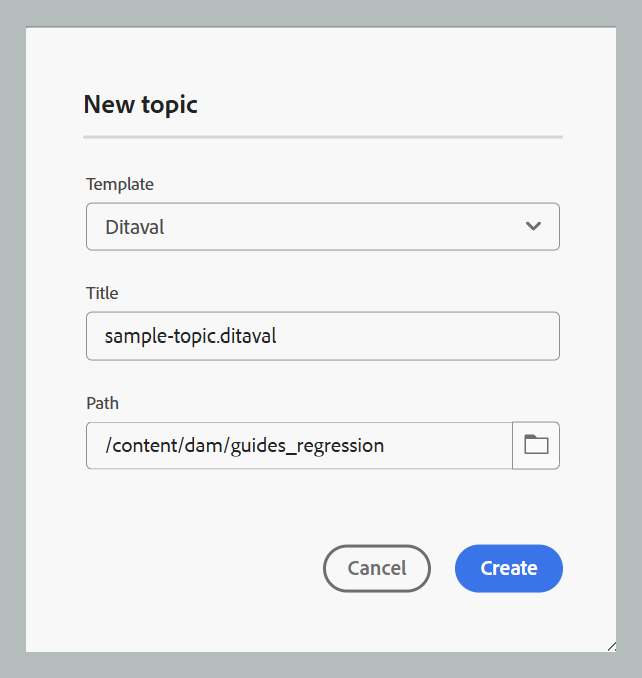{width="350"}

4. 「**作成**」を選択します。

トピックは、指定したパスで作成されます。 また、トピックは編集のためにエディターで開かれます。

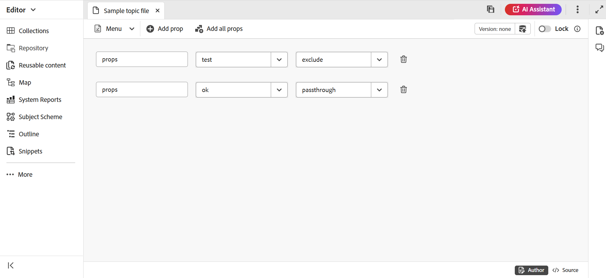

## DITAVAL ファイルを編集

DITAVAL トピックを作成すると、編集用にエディターが開きます。 既存のDITAVAL トピックを編集するには、DITAVAL トピックがあるフォルダーまたはマップに移動し、**オプション** メニューから&#x200B;**編集**&#x200B;を選択します。

DITAVAL エディターでは、エディターツールバーのオプションを使用して、以下に示す複数のタスクを実行できます。

### エディターツールバーのオプション

#### メニュードロップダウン

メニュードロップダウンでは、編集アクション、検索と置換、バージョン履歴、バージョンラベル、結合、レビュータスクの作成、変更の追跡、タグ機能にアクセスできます。
詳しくは、[ メニュードロップダウンオプション ](./web-editor-toolbar.md#menu-dropdown)を参照してください

#### Propを追加

DITAVAL ファイルに1つのプロパティを追加します。

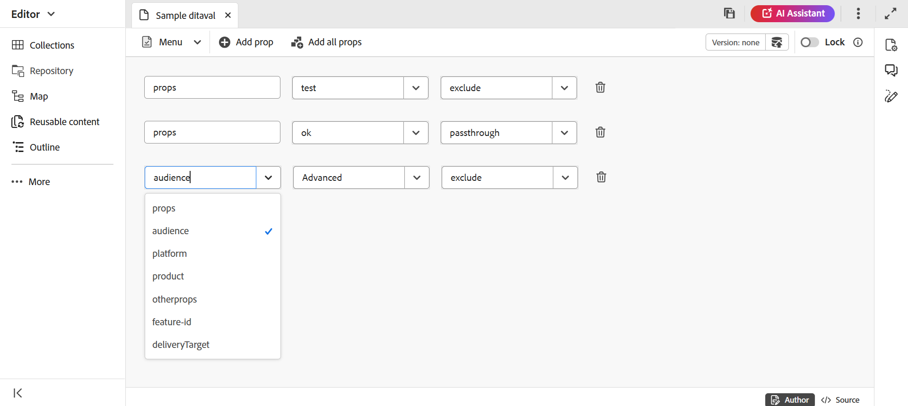{width="650"}

最初のドロップダウンには、DITAVAL ファイルで使用できる許可されたDITA属性が一覧表示されます。

2番目のドロップダウンリストには、選択した属性に設定された値が表示されます。 次のドロップダウンリストには、選択した属性に対して設定できるアクションが表示されます。 アクション ドロップダウンで使用できる値は、`include`、`exclude`、`passthrough`、および`flag`です。 これらの値の詳細については、[prop](http://docs.oasis-open.org/dita/dita/v1.3/errata01/os/complete/part3-all-inclusive/langRef/ditaval/ditaval-prop.html#ditaval-prop)要素の定義をOASIS DITA ドキュメントでご確認ください。 属性に追加されたプロパティのアクションについて詳しくは、[ プロパティのアクション ](#actions-for-property)を参照してください。

#### Rev Propを追加

XMLのタグに特定のリビジョン番号を追加するには、「rev propを追加」オプションを使用します。 これにより、タグにrev属性が追加され、「値」フィールドに値が定義され、プロパティに対して選択したアクションが設定されます。 このリビジョン属性は、後で出力を生成するときに、指定したリビジョン番号に基づいて関連するXML コンテンツをフィルタリングするために使用できます。

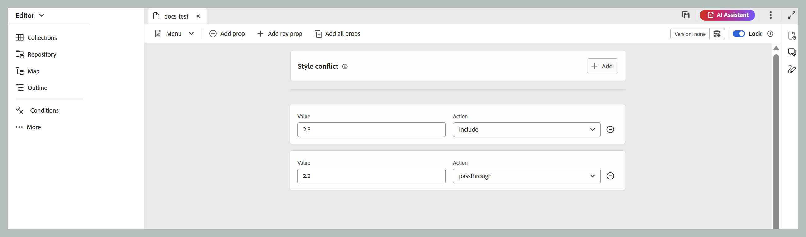{width="650"}

#### すべての小道具を追加

システムで定義されているすべてのコンディショナルプロパティまたは属性をワンクリックで追加する場合は、「すべてのプロパティを追加」機能を使用します。 アクション ドロップダウンで使用できる値は、`include`、`exclude`、`passthrough`、`flag`です。 以下、それぞれの具体的な取組について述べる。

>[!NOTE]
>
> 定義済みのすべてのコンディショナルプロパティがDITAVAL ファイルに既に存在する場合、それ以上のプロパティを追加することはできません。 このシナリオでは、エラーメッセージが表示されます。

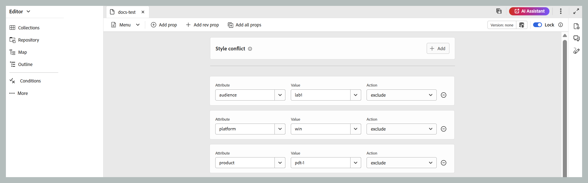{width="650"}

##### プロパティのアクション

特定のプロパティで使用できるアクションは、主に4つあります。次に示します。

**含める：** コンテンツを出力に含めます。 特に指定しない限り、これはデフォルトの動作です。

**除外：** コンテンツを出力から除外します（特定の属性内のすべての値を除外する場合）。

**パススルー：**&#x200B;出力にコンテンツを含め、ランタイムエンジンでさらに処理するために、出力ストリームの一部として属性値を保持します（個々のユーザー設定に基づくランタイムフィルタリングなど）。

**フラグを追加：**&#x200B;出力のコンテンツにフラグを付けるには、ファイル内の目的の属性のアクションとしてフラグを設定できます。 下のスニペットに示すように、**フラグスタイル** ドロップダウンを使用して、様々なフラグスタイルを適用することもできます。

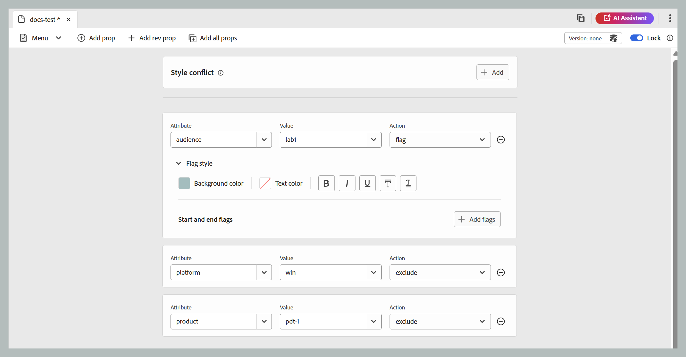{width="650"}

- **背景色**：背景色から色相、彩度、コントラストを選択します。 対応する16進数の値は、選択内容に基づいて自動的に更新されます。 ドロップダウンを使用してカラースペースのフォーマットを切り替え、HEX、RGB、HSBのいずれかを選択することもできます。

  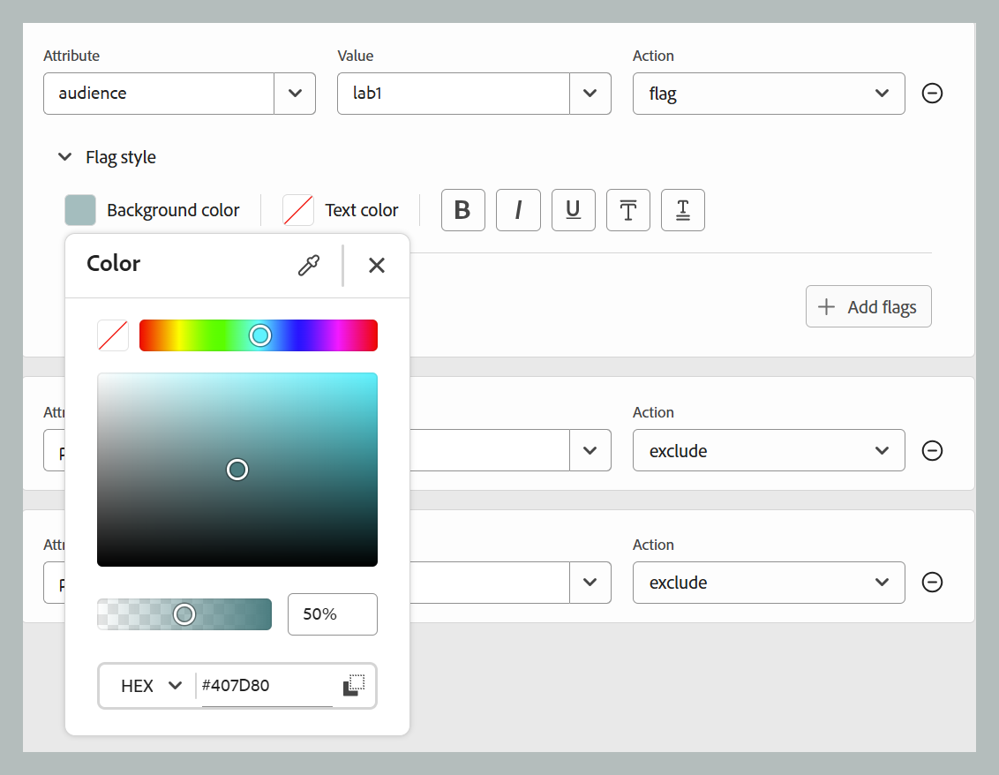{width="350"}

- **テキストの色**: テキストの色から色相、彩度、コントラストを選択します。 対応する16進数の値は、選択内容に基づいて自動的に更新されます。 ドロップダウンを使用してカラースペースのフォーマットを切り替え、HEX、RGB、HSBのいずれかを選択することもできます。

  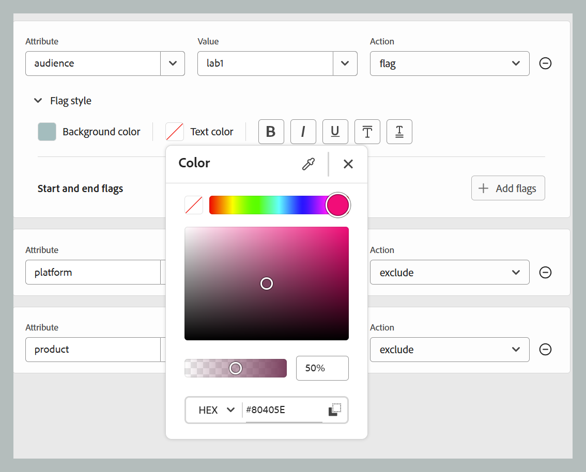{width="350"}

- **スタイル設定オプション**：太字、斜体、下線、上線、二重下線など、一部のスタイル設定オプションを追加できます。

  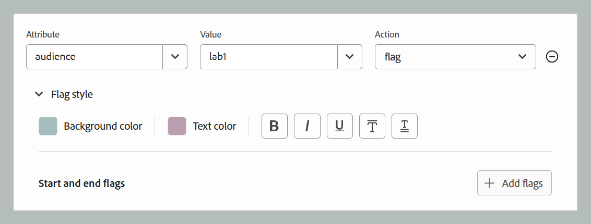{width="350"}

- **開始フラグと終了フラグ**: **フラグを追加** ボタンを使用して、画像を開始フラグと終了フラグとして挿入できます。 画像を選択するには、**Assetsを参照**&#x200B;してGuides リポジトリから選択するか、**ファイルを追加**&#x200B;してローカルシステムからアップロードします。 さらに、画像の代替テキストを指定することもできます。

  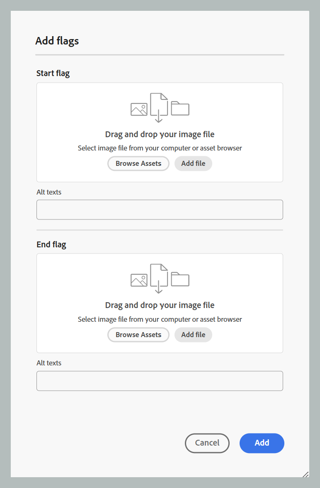{width="350"}

- **スタイルの競合**:1つの要素に異なるフラグスタイルを持つ複数のプロパティが含まれている場合に発生する競合を解決します。 このような場合、スタイルの競合プロパティで定義された値が選択され、事実上、背景色とテキスト色のデフォルト値ピッカーとして機能します。

  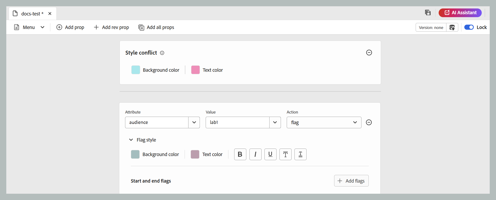{width="650"}

#### バージョン情報と新しいバージョンとして保存

バージョン情報と新しいバージョンとして保存の機能は、バージョンの追跡とコンテンツの保存を単一の機能に統合します。
詳細については、[新しいバージョンとして保存](./web-editor-toolbar.md#version-information-and-save-as-new-version)を参照してください

#### ロック/ロック解除

現在のファイルをロックまたはロック解除します。 ファイルをロックすると、ファイルへの排他的な書き込みアクセス権が付与されます。
詳細については、[ ファイルのロック解除](./web-editor-toolbar.md#lockunlock)を参照してください。

### コンテンツを保存

DITAVAL ファイルの編集が完了したら、タブバーで「**保存**」を選択します。

>[!NOTE]
>
> 保存せずにファイルを閉じると、変更は失われます。 Adobe Experience Manager リポジトリに変更をコミットしない場合は、**未保存の変更** ダイアログで&#x200B;**閉じる**&#x200B;を選択し、**保存せずに閉じる**&#x200B;を選択します。

## DITAVAL エディタービュー

Adobe Experience Manager GuidesのDITAVAL エディターでは、DITAVAL ファイルを2つの異なるモードまたはビューで表示できます。

**作成者**：これは、DITAVAL エディターの一般的な表示です。表示される内容は、\（WYSISYG\）です。 プロパティを追加または削除するには、プロパティ、その値、およびアクションをドロップダウンリストで表示するシンプルなユーザーインターフェイスを使用します。 作成者ビューでは、個々のプロパティを挿入し、すべてのプロパティをワンクリックで挿入するオプションがあります。

また、ファイル名にポインターを置くと、現在作業しているDITAVAL ファイルのバージョンを確認できます。

**Source**: Source ビューには、DITAVAL ファイルを構成する基になるXMLが表示されます。 作成者は、このビューで通常のテキスト編集を行うだけでなく、スマートカタログを使用してプロパティを追加または編集することもできます。

スマートカタログを呼び出すには、プロパティ定義の最後にカーソルを置き、「&lt;」と入力します。 エディターには、その場所に挿入できるすべての有効なXML要素のリストが表示されます。

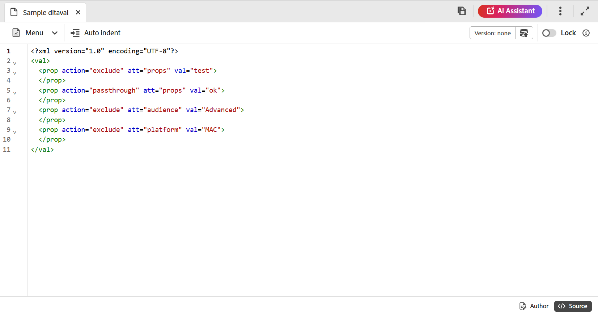

## Assets UIでのDITAVAL ファイルの操作

Assets UIからDITAVAL ファイルを作成することもできます。 新しいDITAVAL トピックを作成する手順は次のとおりです。

1. Assets UIで、DITAVAL ファイルを作成する場所に移動します。

1. **Create** \> **DITA トピック**&#x200B;を選択します。

1. ブループリントページで、「DITAVAL ファイルテンプレート」を選択し、「**次へ**」を選択します。

1. プロパティ ページで、DITAVAL ファイルの&#x200B;**タイトル**&#x200B;と&#x200B;**名前**&#x200B;を指定します。

   >[!NOTE]
   >
   > 名前は、ファイルのタイトルに基づいて自動的に提案されます。 ファイル名を手動で指定する場合は、「名前」にスペース、アポストロフィ、または中括弧が含まれておらず、.ditavalで終わっていることを確認します。

1. 「**作成**」を選択します。

   トピック作成メッセージが表示されます。

DITAVAL エディターでDITAVAL ファイルを開くか、Adobe Experience Manager リポジトリでトピックファイルを保存するかを選択できます。

既存のDITAVAL ファイルを編集するには、次の手順を実行します。

1. Assets UIで、編集するDITAVAL ファイルに移動します。

1. ファイルの排他的ロックを取得するには、ファイルを選択し、**チェックアウト**&#x200B;を選択します。

1. ファイルを選択し、**編集**&#x200B;を選択して、Adobe Experience Manager Guides DITAVAL エディターでファイルを開きます。

