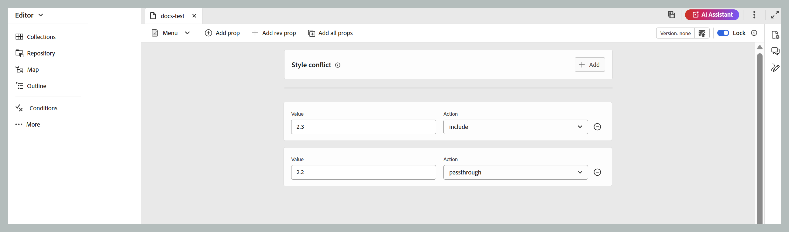
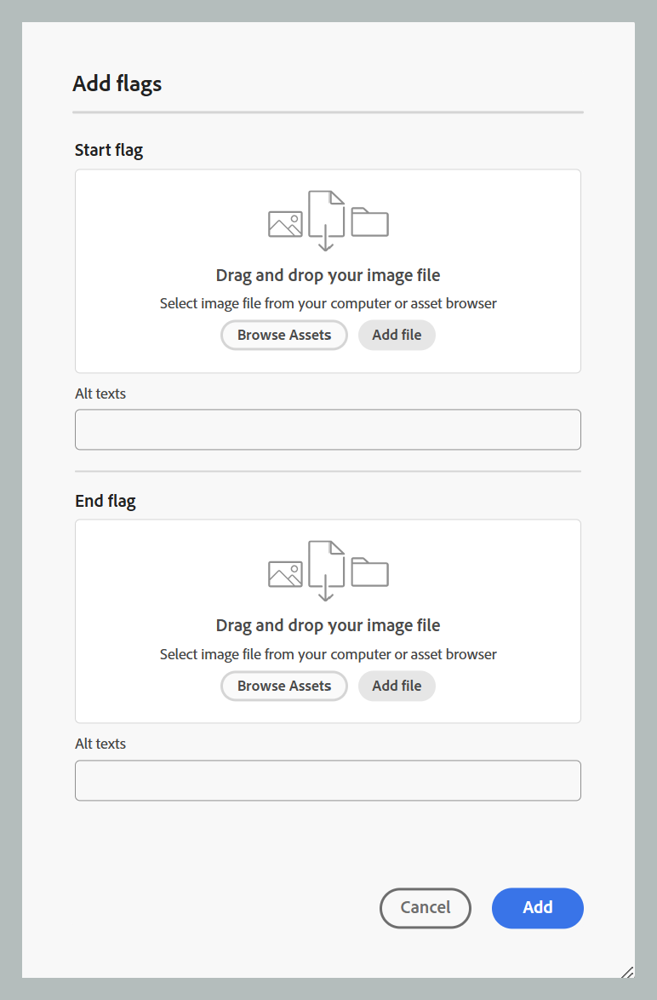

# DITAVAL エディター {#ditaval-editor}

DITAVAL ファイルは、条件付き出力の生成に使用されます。 単一のトピックで、要素の属性を使用してコンテンツの条件を設定する条件を追加できます。 次に、DITAVAL ファイルを作成します。このファイルでは、コンテンツを生成するために取得する必要がある条件と、最終的な出力から除外する必要がある条件を指定します。

Adobe Experience Manager Guidesでは、DITAVAL エディタを使用して DITAVAL ファイルを簡単に作成および編集できます。 DITAVAL エディタは、システムで定義されている属性（条件として使用できる）を取得し、これらを使用して DITAVAL ファイルを作成または編集できます。 Adobe Experience Managerでの条件の作成と管理について詳しくは、Adobe Experience Manager ドキュメントの [&#x200B; タグの管理 &#x200B;](https://experienceleague.adobe.com/docs/experience-manager-cloud-service/sites/authoring/features/tags.html?lang=ja) の節を参照してください。

以下の節では、Experience Manager Guidesの DITAVAL ファイルで使用できるオプションについて説明します。

- [DITAVAL ファイルの作成](#create-ditaval-file)
- [DITAVAL ファイルの編集](#edit-ditaval-file)
- [DITAVAl ファイル エディタ ビュー](#ditaval-editor-views)
- [Assets UI での DITAVAL ファイルの操作](#working-with-ditaval-files-in-the-assets-ui)

## DITAVAL ファイルの作成

DITAVAL ファイルを作成するには、以下の手順を実行します。

1. リポジトリパネルで「**新規ファイル**」アイコンを選択し、ドロップダウンメニューから「**トピック**」を選択します。

   {width="350" align="left"}

   このオプションには、[Experience Manager Guidesのホームページ &#x200B;](./intro-home-page.md) およびリポジトリビューのフォルダーのオプションメニューからもアクセスできます。

2. **新規トピック** ダイアログボックスが表示されます。

3. **新規トピック** ダイアログボックスで、次の詳細を入力します。
   - トピックのタイトル。
   - \（オプション\）* トピックのファイル名。 ファイル名は、トピックのタイトルに基づいて自動的に提示されます。 管理者が UUID 設定に基づく自動ファイル名を有効にしている場合、「名前」フィールドは表示されません。
   - トピックの基になるテンプレート。 DITAVAL ファイルの場合は、ドロップダウンリストから「**Ditaval**」を選択します。
   - トピック ファイルを保存するパス。 デフォルトでは、リポジトリで現在選択されているフォルダーのパスが「パス」フィールドに表示されます。

   {width="350" align="left"}

4. 「**作成**」を選択します。

指定したパスにトピックが作成されます。 また、エディターでトピックが開いて編集できます。

{align="left"}

## DITAVAL ファイルの編集

DITAVAL トピックを作成すると、エディタで開いて編集できます。 既存の DITAVAL トピックを編集するには、DITAVAL トピックが存在するフォルダまたはマップに移動し、**オプション** メニューから **編集** を選択します。

DITAVAL エディタでは、エディタのツールバーのオプションを使用して、以下に示すように複数のタスクを実行できます。

### エディターツールバーオプション

#### メニュードロップダウン

メニュードロップダウンから、編集アクション、検索と置換、バージョン履歴、バージョンラベル、結合、レビュータスクの作成、変更の追跡、タグ機能にアクセスできます。
詳しくは、「[&#x200B; メニュー」ドロップダウンオプション &#x200B;](./web-editor-toolbar.md#menu-dropdown) を参照してください。

#### Prop を追加

DITAVAL ファイルに 1 つのプロパティを追加します。

{width="650" align="left"}

最初のドロップダウンには、DITAVAL ファイルで使用できる DITA 属性が表示されます。

2 つ目のドロップダウンリストには、選択した属性に設定された値が表示されます。 次に、選択した属性に対して設定できるアクションが次のドロップダウンリストに表示されます。 アクションドロップダウンで使用できる値は、`include`、`exclude`、`passthrough`、`flag` です。 これらの値について詳しくは、OASIS DITA 文書の [prop](http://docs.oasis-open.org/dita/dita/v1.3/errata01/os/complete/part3-all-inclusive/langRef/ditaval/ditaval-prop.html#ditaval-prop) 要素の定義を参照してください。 属性に追加されたプロパティのアクションの詳細については、[&#x200B; プロパティのアクション &#x200B;](#actions-for-property) を参照してください。

#### 収益プロパティを追加

XML のタグに特定のリビジョン番号を追加するには、Add rev prop オプションを使用します。 rev 属性がタグに追加され、その値は、プロパティに対して選択したアクションと共に、「値」フィールドで定義された値となります。 このリビジョン属性は、後で出力の生成時に、指定されたリビジョン番号に基づいて関連する XML コンテンツをフィルタリングするために使用できます。

{width="650" align="left"}

#### すべての Prop を追加

システムで定義されているすべての条件付きプロパティまたは属性を 1 回のクリックで追加する場合は、すべての prop の追加機能を使用します。 アクションドロップダウンで使用できる値は、`include`、`exclude`、`passthrough`、`flag` です。 これらのアクションの詳細については、以下で説明します。

>[!NOTE]
>
> 定義済みの条件付きプロパティがすべて DITAVAL ファイルに存在する場合、プロパティを追加することはできません。 このシナリオでは、エラーメッセージが表示されます。

{width="650" align="left"}

##### プロパティのアクション

特定のプロパティで使用できるアクションは主に 4 つあり、次のようにリストされています。

**Include:** 出力にコンテンツを含めます。 特に設定しない限り、これはデフォルトの動作です。

**除外：** コンテンツを出力から除外します（特定の属性のすべての値が除外される場合）。

**パススルー：** 出力に内容を含め、属性値を出力ストリームの一部として保持して、実行時エンジンによるさらに処理（個々のユーザー設定に基づく実行時フィルタリングなど）を行います。

**フラグの追加：** 出力内のコンテンツにフラグを立てるには、ファイル内の目的の属性のアクションとしてフラグを設定します。 また、以下のスニペットに示すように、**フラグスタイル** ドロップダウンを使用して、様々なフラグスタイルを適用することもできます。

{width="650" align="left"}

- **背景色**：背景色から色相、彩度、コントラストを選択します。 対応する 16 進数値は、選択に基づいて自動的に更新されます。 また、ドロップダウンを使用してカラースペースの形式を切り替え、16 進数、RGB、HSB から選択することもできます。

  {width="350" align="left"}

- **テキストカラー**：テキストのカラーから、色相、彩度、コントラストを選択します。 対応する 16 進数値は、選択に基づいて自動的に更新されます。 また、ドロップダウンを使用してカラースペースの形式を切り替え、16 進数、RGB、HSB から選択することもできます。

  {width="350" align="left"}

- **スタイル設定オプション**：太字、斜体、下線、上線、二重下線など、いくつかのスタイル設定オプションを追加できます。

  {width="350" align="left"}

- **開始フラグと終了フラグ**:「**フラグの追加** ボタンを使用して、開始フラグと終了フラグとして画像を挿入できます。 画像を選択するには、**Assetsを参照** を使用して Guides リポジトリーから選択するか、**ファイルを追加** を使用してローカルシステムからアップロードします。 さらに、画像の代替テキストを指定できます。

  {width="350" align="left"}

- **スタイルの競合**:1 つの要素に、異なるフラグスタイルを持つ複数のプロパティが含まれている場合に発生する競合を解決します。 このような場合、スタイルの競合プロパティで定義された値が選択され、背景色とテキストカラーのデフォルト値ピッカーとして効果的に機能します。

  {width="650" align="left"}

#### バージョン情報と新しいバージョンとして保存

バージョン情報と新しいバージョンとして保存機能は、バージョントラッキングとコンテンツ保存を 1 つの機能に統合したものです。
詳しくは、「新しいバージョンとして保存 [&#x200B; を参照してください &#x200B;](./web-editor-toolbar.md#version-information-and-save-as-new-version)

#### ロック/ロック解除

現在のファイルをロックまたはロック解除します。 ファイルをロックすると、そのファイルへの排他的な書き込みアクセスが可能になります。
詳しくは、[&#x200B; ファイルのロック解除 &#x200B;](./web-editor-toolbar.md#lockunlock) を参照してください

### コンテンツを保存

DITAVAL ファイルの編集が完了したら、タブバーの **保存** を選択します。

>[!NOTE]
>
> 保存せずにファイルを閉じると、変更内容は失われます。 変更内容をAdobe Experience Manager リポジトリにコミットしない場合は、「**未保存の変更内容** ダイアログで「**&#x200B;** 閉じる **」を選択したあと、「保存せずに閉じる** を選択します。

## DITAVAL エディタ ビュー

Adobe Experience Manager Guidesの DITAVAL Editor では、次の 2 つの異なるモードまたはビューでの DITAVAL ファイルの表示がサポートされています。

**オーサー**:   これは、DITAVAL エディタの What You See が What You Get \（WYSISYG\） ビューを表示する典型的なものです。 プロパティ、値、アクションをドロップダウンリストに表示するシンプルなユーザーインターフェイスを使用して、プロパティを追加または削除できます。 オーサービューには、個々のプロパティを挿入し、1 回のクリックですべてのプロパティを挿入するオプションがあります。

また、ファイル名の上にカーソルを置くと、現在作業中の DITAVAL ファイルのバージョンを見つけることができます。

**Source**:   Source ビューには、DITAVAL ファイルを構成する基になる XML が表示されます。 作成者は、このビューで通常のテキスト編集を行うだけでなく、スマートカタログを使用してプロパティを追加または編集することもできます。

スマートカタログを呼び出すには、任意のプロパティ定義の末尾にカーソルを置いて、「&lt;」と入力します。 エディターには、その場所に挿入できるすべての有効な XML 要素のリストが表示されます。

## Assets UI での DITAVAL ファイルの操作

Assets UI から DITAVAL ファイルを作成することもできます。 新しい DITAVAL トピックを作成する手順は次のとおりです。

1. Assets UI で、DITAVAL ファイルを作成する場所に移動します。

1. **作成** \> **DITA トピック** を選択します。

1. ブループリントページで、「DITAVAL ファイルテンプレート」を選択し、「**次へ**」を選択します。

1. プロパティ ページで、DITAVAL ファイルの **タイトル** と **名前** を指定します。

   >[!NOTE]
   >
   > ファイルのタイトルに基づいて、名前が自動的に提案されます。 ファイル名を手動で指定する場合は、名前にスペース、アポストロフィ、または中括弧が含まれず、.ditaval で終わっていることを確認してください。

1. 「**作成**」を選択します。

   「トピックを作成しました」のメッセージが表示されます。

DITAVAL エディタで編集するために DITAVAL ファイルを開くか、またはAdobe Experience Manager リポジトリにトピック ファイルを保存するかを選択できます。

既存の DITAVAL ファイルを編集するには、以下の手順を実行します。

1. Assets UI で、編集する DITAVAL ファイルに移動します。

1. ファイルを排他的にロックするには、ファイルを選択して「**チェックアウト**」を選択します。

1. ファイルを選択し、「**編集**」を選択してAdobe Experience Manager Guides DITAVAL エディターでファイルを開きます。

