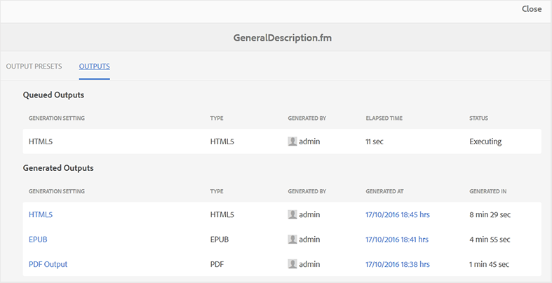

# 出力生成タスクのステータスの表示 {#viewing_output_history}

FrameMaker ドキュメントの出力生成タスクを開始すると、Adobe Experience Manager Guidesはこのタスクを出力生成キューに送信します。 このキューはリアルタイムで更新され、キュー内の各出力生成タスクのステータスを示します。

出力生成キューを表示するには、次の手順を実行します。

1. Assets UI で、出力生成ステータスを確認するFrameMaker ドキュメントに移動して選択します。

1. 「出力」を選択します。

   {align="left"}

1. 出力ページは、次の 2 つの部分に分かれています。

   - **キュー内の出力：**

     生成待ちまたは生成処理中の出力が一覧表示されます。 また、キューに登録されたタスクに使用する出力生成設定やプリセット、タイプ、タスクを開始したユーザー、タスクがキューに登録されてからの経過時間、現在のステータスも確認できます。

   - **生成された出力**

     完了済みの出力タスクを一覧表示します。 この例で示されている情報は、出力の生成時間の唯一の違いを除いて、「キューイングされた出力」セクションに似ています。

     このリストには、正常に実行されたタスクまたは失敗したタスクが表示されます。 正常に完了したタスクについて、公開プロセスによってログファイル \（logs.txt\）が作成されます。このログファイルにアクセスするには、「生成場所」列のリンクを選択します。

**親トピック：**&#x200B;[&#x200B; FrameMaker ドキュメントの出力を生成 &#x200B;](fm-output-generatation.md)
