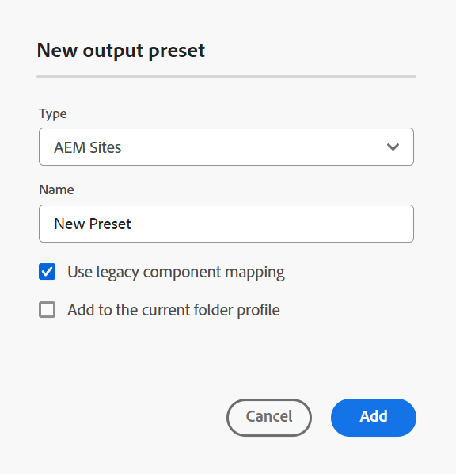

# マップ コンソールのAEM Sites プリセット

マップ コンソールからAEM Sites プリセットを作成し、AEM Sites出力を生成するように設定できます。 AEM Sites出力を作成する方法は 2 つあります。

- [&#x200B; 複合コンポーネントマッピングの使用 &#x200B;](#use-composite-component-mapping)
- [従来のコンポーネントマッピングの使用](#use-legacy-component-mapping)

>[!TIP]
>
> パフォーマンスを向上させるために、Experience Manager Guides 2502 リリース以降で利用可能な複合コンポーネントマッピングを使用することをお勧めします。

## 複合コンポーネントマッピングの使用

複合コンポーネントマッピングは、従来のコンポーネントマッピングと比較して、AEM Sitesへの公開を迅速かつスケーラブルに行えます。 標準の編集可能なテンプレートが付属しており、AEM テンプレートエディターを使用して要件に応じてカスタマイズできます。 テンプレートでは、WCM コアコンポーネントと専用 `guides-components` ンポーネントを組み合わせて使用し、エンドユーザーがAEM Sites ページで最高のエクスペリエンスを得られるようにします。 複合コンポーネントマッピングメソッドを使用して、既存のテンプレートをカスタマイズすることもできます。

Experience Manager Guidesには、AEM Sitesを作成するための事前定義済みのテンプレートが用意されています。 これらのテンプレートにより、コンテンツのレイアウトと構造の一貫性を確保できます。
- これらの定義済みテンプレートに基づいて [&#x200B; ホームページを作成 &#x200B;](../cs-install-guide/download-install-aem-sites-templates-cs.md#create-a-home-page-using-the-template) します。
- 必要に応じて、[&#x200B; トピックテンプレートを編集 &#x200B;](../cs-install-guide/download-install-aem-sites-templates-cs.md#package-installation) し、スタイルを適用できます。
- また、[&#x200B; 既存のAEM Sites テンプレートをカスタマイズする &#x200B;](../cs-install-guide/download-install-aem-sites-templates-cs.md#customize-existing-aem-sites-templates) こともできます。

**AEM Sites プリセットの作成**

複合コンポーネントマッピングを使用してAEM Sites プリセットを作成するには、次の手順を実行します。

1. [&#x200B; マップコンソールで DITA マップファイルを開きます &#x200B;](./open-files-map-console.md)。
1. **出力プリセット** パネルで、「+」アイコンを選択して出力プリセットを作成します。
1. **新規出力プリセット** ダイアログボックスの **タイプ** ドロップダウンから **&#x200B;**&#x200B;AEM Sites&rbrace; を選択します。
1. 「**レガシーコンポーネントマッピングを使用** オプションの選択を解除します。
1. 「**現在のフォルダープロファイルに追加**」オプションを選択して、現在のフォルダープロファイル内に出力プリセットを作成します。  は、フォルダープロファイルレベルのプリセットを示します。

   詳しくは、[&#x200B; グローバルプロファイルおよびフォルダープロファイル出力プリセットの管理 &#x200B;](./web-editor-manage-output-presets.md) を参照してください。

1. 「**追加**」を選択します。

   AEM Sitesのプリセットが作成されます。

   {width="300" align="left"}

<!-----------------------
### Generate the AEM Sites output using the templates

Once, the preset is created, you can configure the various options available for AEM Sites output generation. Experience Manager Guides allows you to use the out of the box templates or add your own AEM Sites templates.

You can configure the Out-of-the-box Sites template  in two ways:

- In the **Sites** field, select the AEM sites where you want to publish your output.  For example, `AEMG Docs`.

    The **Publish path** and the **Topic page template** options are automatically set in the dropdown.  For example,  `AEMG-Docs-Site/en/docs/product1` and `Topic page` are set respectively. You can also choose the other options from the dropdown.

- Or, Select the **Use Sites path** option to select the complete Sites path, and then select a **Map page template**. 

    You can browse a predefined Sites path or specify a custom path even if the specified path has not been pre-created within the AEM Sites structure. In such cases, the system creates the necessary structure during the publishing process by using the selected map homepage template.

   For example, you can specify the path `/content/AEMG-Docs-Site/en/docs/product4` where the `product4`does not exist in the strcuture. In this case, the system automatically creates `product4` using the selected **Map page template** and publish the output within this newly created page. 
   
   The **Topic page template** is automatically set as `Topic Page`. However, you can choose to select other available options in the dropdown.

--->

### 複合コンポーネントマッピング用のAEM Sites プリセット設定

>[!NOTE]
>
> 管理者は、Experience Manager GuidesのAEM Sites プリセットを設定する前に、テンプレートを使用してAEM Sites構造を作成する必要があります。

- **オンプレミスソフトウェア**：オンプレミスソフトウェアの [AEM Sites テンプレートをダウンロードしてインストール &#x200B;](../install-guide/download-install-aem-sites-templates.md) する方法の詳細を説明します。
- **Cloud Service**: Cloud Service用の [AEM Sites テンプレートのダウンロードとインストール &#x200B;](../cs-install-guide/download-install-aem-sites-templates-cs.md) 方法について説明します。

マップコンソールでは、複合コンポーネントマッピングのプリセット設定オプションは次のタブの下に整理されます。

- 一般
- コンテンツ
- トピックリスト
- クロスマップ参照

{width="650" align="left"}

**一般**

**一般** タブには、次の設定オプションがあります。

| AEM Sitesオプション | 説明 |
| --- | --- |
| サイトパスを使用 | Experience Manager サイトにコンテンツを公開するには、このオプションを使用します。 |
| サイトパス | **このオプションは、「** サイトパスを使用 **」オプションを選択した場合に表示されます**。 事前定義済みのExperience Manager サイトのパスを参照するか、出力を公開するカスタムパスを指定します。 **サイトを使用** オプションを使用すると、指定したパスがAEM Sites構造内に事前に作成されていない場合でも、公開パス全体を指定できます。 その場合、システムは、選択されたマップホームページテンプレートを使用して、公開プロセス中に必要な構造を作成します。   サイトパスを設定する際に変数を使用することもできます。 詳しくは、[&#x200B; 宛先パス、サイト名、ファイル名のオプションを設定するための変数を使用 &#x200B;](./generate-output-use-variables.md) を参照してください |
| ページテンプレートをマップ | **このオプションは、「** サイトパスを使用 **」オプションを選択した場合に表示されます**。 マップのホームページに適用するテンプレートを選択します。 |
| サイト | コンテンツの公開先Experience Manager Sitesの名前。 ドロップダウンのオプションは、AEM Sitesで使用可能なサイトのリストに基づいて入力されます。   「**更新** 」アイコンを選択して、オプションの新しいリストを取得し、更新されたデータを反映します。 |
| 公開パス | 出力が保存されるAEM リポジトリ内のパス。 パブリッシュパスには、ホームページテンプレートに基づいて作成されたページを含むすべてのパスが入力されます。 DITA マップのAEM Sites出力はこのパスの下に生成されます。  例えば、サイトを `AEMG-Docs`、パブリッシュパスを `aemg-docs-en/docs/product-abc.` に指定すると、AEM Sitesの出力は `aemg-docs-en/docs/product-abc/` の `crx/de` ノードの下に生成されます。 |
| トピックページテンプレート | すべての出力トピックに適用するテンプレートを選択します。 |
| に基づいてページ名を生成 | **トピック ファイル名**: DITA トピックのファイル名を使用してサイト URL を作成します。  **トピックタイトル**: DITA トピックのタイトルを使用して、Experience Manager サイト名を作成します。 |
| 以前に生成したページのクリーンアップ | - **マップから削除されたトピックに対して以前に生成されたページを削除**: DTIA マップの構造が変更された場合は、このオプションを使用して、削除されたトピックに対して以前に生成されたページを削除できます。 この機能は、完全なマップのパブリッシュでのみ使用できます。   トピック a.dita、b.dita、および c.dita を含む DITA マップをパブリッシュしたとします。 マップを再度公開する前に、マップから b.dita トピックを削除しました。 ここで、このオプションを選択した場合、b.dita に関連するすべてのコンテンツがAEM Sites出力から削除され、a.dita と c.dita のみが公開されます。  **注意**：削除されたページに関する情報も、出力生成ログに取り込まれます。 ログファイルへのアクセスについて詳しくは、[&#x200B; ログファイルを表示して確認する &#x200B;](generate-output-basic-troubleshooting.md#id1821I0Y0G0A__id1822G0P0CHS) を参照してください。   **注意**：トピックを削除すると、公開済みサイトからページが使用できなくなります。 したがって、トピックが削除される前に、警告が表示されます。 これらを削除するには、確認する必要があります。  - **このパスで他のソースによって作成されたすべてのページを削除する**：このオプションを選択すると、他のマップ、個々のトピック、またはその他のソースからこのパスで公開されたすべてのページが削除されます。 また、ページは、公開されたサイトからも使用できなくなります。 したがって、トピックが削除される前に、警告が表示されます。 これらを削除するには、確認する必要があります。 |
| 生成後のワークフロー | このオプションを選択すると、新しいポスト生成ワークフローのドロップダウンリストが表示され、AEMで設定されたすべてのワークフローが表示されます。 出力生成ワークフローの完了後に実行するワークフローを選択する必要があります。 |

**コンテンツ**

「**コンテンツ**」タブには、次の設定オプションが含まれます。

| AEM Sitesオプション | 説明 |
| --- | --- |
| ベースラインの使用 | 選択した DITA マップにベースラインを作成した場合、このオプションを選択して、公開するバージョンを指定します。   詳細については、「[&#x200B; ベースラインの使用 &#x200B;](generate-output-use-baseline-for-publishing.md#id1825FI0J0PF) を参照してください。 |
| 条件付きフィルター | 次のいずれかのオプションを選択します。  **なし**：公開済みの出力に条件を適用しない場合は、このオプションを選択します。 **DITAVAL の使用**：条件付きコンテンツを生成する DITAVal ファイルを選択します。 参照ダイアログを使用するか、ファイルパスを入力して、複数の DITAVal ファイルを選択できます。 削除するには、ファイル名の近くにある十字のアイコンを使用します。 DITAVal ファイルは指定された順序で評価されるため、最初のファイルで指定された条件は、後のファイルで指定された一致条件よりも優先されます。 ファイルを追加または削除することで、ファイルの順序を維持できます。 DITAVal ファイルが他の場所に移動された場合や削除された場合は、マップ ダッシュボードから自動的には削除されません。 ファイルが移動または削除された場合は、場所を更新する必要があります。 ファイル名の上にマウスポインターを置くと、AEM リポジトリー内でファイルが格納されているパスが表示されます。 DITAVal ファイルのみを選択できます。他のファイル タイプを選択すると、エラーが表示されます。 **条件プリセット**：出力の公開中に条件を適用する条件プリセットをドロップダウンから選択します。 このオプションは、DITA マップファイルに条件を追加した場合に表示されます。 条件付き設定は、DITA マップコンソールの「条件プリセット」タブで使用できます。 条件プリセットについて詳しくは、「[&#x200B; 条件プリセットの使用 &#x200B;](generate-output-use-condition-presets.md#id1825FL004PN)」を参照してください。 |
| 追加の DITA-OT コマンドライン引数 | 出力の生成時に DITA-OT で処理する追加の引数を指定します。 DITA-OT でサポートされるコマンドライン引数の詳細については、[DITA-OT documentation](https://www.dita-ot.org/) を参照してください。 |
| メタデータ     ファイル（Assets）のプロパティ | メタデータとして処理するプロパティを選択します。 これらのプロパティは、DITA マップまたはブックマップファイルの「プロパティ」 ページから設定されます。 ドロップダウンリストから選択したプロパティが **ファイルプロパティ** フィールドの下に表示されます。 プロパティを削除するには、プロパティの横にある十字アイコンを選択します。   **メモ**：メタデータプロパティでは大文字と小文字が区別されます。  *ベースラインを選択した場合、プロパティの値は選択したベースラインのバージョンに基づきます。 * ベースラインを選択していない場合、プロパティの値は最新バージョンに基づきます。  DITA-OT パブリッシングを使用して、出力にメタデータを渡すこともできます。 詳細ビューについては、[DITA-OT を使用してメタデータを出力に渡す &#x200B;](pass-metadata-dita-ot.md#id21BJ00QD0XA) を参照してください。  **注意**: 「プロパティ」オプションで `cq:tags` を定義していない場合、公開用に「ベースライン」を選択していても、`cq:tags` の値は現在の作業コピーから取得されます。 |
| メタデータ     フォールバックとしてのマップ プロパティの使用 | 選択すると、マップ ファイルに対して定義されたプロパティも、これらのプロパティが定義されていないトピックにコピーされます。 このオプションを使用する際は、次の点を考慮してください。  *文字列、日付、または長い（単一および複数値）プロパティのみをAEM サイトのページに渡すことができます。 * 文字列タイプのプロパティのメタデータ値は、特殊文字（`@, #, " "` など）をサポートしていません。 *このオプションは、`Properties` オプションと一緒に使用する必要があります。 |

**トピックリスト**

「**トピックリスト**」タブには、DITA マップの現在の作業コピーに存在するトピックのリストが表示されます。 デフォルトでは、すべてのトピックが含まれています。 特定のトピックを選択し、そのトピックに対してのみAEM Sites出力を生成できます。 たとえば、一部のトピックを更新した場合、DITA マップ全体を公開するのではなく、それらのトピックのみを公開できます。

 {align="left"}

>[!NOTE]
>
> 「**コンテンツ**」タブでベースラインを選択すると、「トピック」リストに、添付されたベースラインのトピックとそのバージョンが表示されます。 また、トピック リストからの増分公開は、マップの構造に変更がない場合にのみ使用してください。 マップの構造や目次に変更がある場合は、マップ全体を 1 回パブリッシュして目次を更新する必要があります。

**クロスマップ参照**

このリストには、`scope ="peer"` を使用したクロスマップ参照を含むトピックが含まれています。 他の DITA マップで使用可能なトピックに `scope="peer"` して、クロスマップ参照のリストの公開コンテキストを指定できます。 このタブは、Experience Manager Guides（UUID）版を使用している場合に表示されます。

詳しくは、以下の [&#x200B; リンクされたトピックの操作 &#x200B;](#working-with-linked-topics) の節を参照してください。

設定が完了したら、プリセットに加えた変更を保存し、**生成** を選択して、対応するマップのAEM Sitesを生成します。

>[!NOTE]
>
> 初めてAEM サイトにコンテンツを公開する場合は、サイトレベルでページを公開することをお勧めします。 これにより、CSS が中断されることなく、出力が **パブリッシュ** インスタンス上で正しく表示されます。

## 従来のコンポーネントマッピングの使用

従来のコンポーネントマッピングを使用してAEM Sites プリセットを作成する手順は、前述の [&#x200B; 複合コンポーネントマッピング &#x200B;](#use-composite-component-mapping) の節で説明した手順と同じです。 ただし、プリセットを作成する際には、「新しい出力プリセット **ダイアログで** 従来のコンポーネントマッピングを使用 **オプションを選択していることを確認し** ください。

 {width="300" align="left"}

マップコンソールでは、従来のコンポーネントマッピングのプリセット設定オプションは次のタブの下に整理されます。

- 一般
- コンテンツ
- クロスマップ参照

{width="500" align="left"}

**一般**

**一般** タブには、次の設定オプションがあります。

| AEM Sitesオプション | 説明 |
| --- | --- |
| サイト名 | 出力がAEM リポジトリに保存されるサイト名。  AEM リポジトリ内のノードは、ここで指定した名前で作成されます。 サイト名を指定しない場合は、DITA マップファイル名を使用してサイトノードが作成されます。   ここで指定するサイト名は、ブラウザータブのタイトルとしても使用されます。   サイト名を設定する際に変数を使用することもできます。 詳しくは、[&#x200B; 宛先パス、サイト名、ファイル名のオプションを設定するための変数を使用 &#x200B;](./generate-output-use-variables.md) を参照してください |
| 出力パス | 出力が保存されるAEM リポジトリ内のパス。 最終的な出力を生成する際に、サイト名と出力パスが結合されます。 例えば、サイト名を `user-guide`、「出力パス」を `/content/output/aem-guides` に指定すると、最終的な出力は `/content/output/aem-guides/user-guide` ノードの下に生成されます。   出力パスの設定時に変数を使用することもできます。 詳しくは、[&#x200B; 宛先パス、サイト名、ファイル名のオプションを設定するための変数を使用 &#x200B;](./generate-output-use-variables.md) を参照してください |
| 既存の出力ページ | 既存のページのコンテンツを上書きするには、「**コンテンツを上書き**」オプションを選択します。 このオプションで上書きされるのは、ページのコンテンツノードとヘッドノードの下に存在するコンテンツのみです。 このオプションを使用すると、コンテンツを混在させて公開できます。 このオプションを選択すると、公開済み出力から孤立したページの削除を選択できます。 これは、AEM Sites出力を作成するための *デフォルト* オプションでもあります。   「**削除して作成**」オプションを選択して、公開中に既存のページを強制的に削除します。 このオプションは、ページノードとそのコンテンツ、およびその下にあるすべての子ページを削除します。 出力プリセットのデザインテンプレートを変更した場合や、宛先に既に存在する追加のページを削除したい場合は、このオプションを使用します。 |
| マップから削除されたトピックについて、以前に生成したページを削除します | DTIA マップの構造が変更された場合は、このオプションを使用して、以前に生成したページを削除して削除したトピックを削除できます。 この機能は、完全なマップのパブリッシュでのみ使用できます。   トピック a.dita、b.dita、および c.dita を含む DITA マップをパブリッシュしたとします。 マップを再度公開する前に、マップから b.dita トピックを削除しました。 ここで、このオプションを選択した場合、b.dita に関連するすべてのコンテンツがAEM Sites出力から削除され、a.dita と c.dita のみが公開されます。  **注意**：削除されたページに関する情報も、出力生成ログに取り込まれます。 ログファイルへのアクセスについて詳しくは、[&#x200B; ログファイルを表示して確認する &#x200B;](generate-output-basic-troubleshooting.md#id1821I0Y0G0A__id1822G0P0CHS) を参照してください。   **注意**：トピックを削除すると、公開済みサイトからページが使用できなくなります。 したがって、トピックが削除される前に、警告が表示されます。 これらを削除するには、確認する必要があります。 |
| デザイン | 出力の生成に使用するデザインテンプレートを選択します。   カスタムデザインテンプレートを使用して出力を生成する方法について詳しくは、公開管理者にお問い合わせください。 |
| 生成後のワークフロー | このオプションを選択すると、新しいポスト生成ワークフローのドロップダウンリストが表示され、AEMで設定されたすべてのワークフローが表示されます。 出力生成ワークフローの完了後に実行するワークフローを選択する必要があります。 |
| 一時ファイルを保持 | このオプションを選択すると、DITA-OT によって生成された一時ファイルが保持されます。 DITA-OT 経由で出力を生成するときにエラーが発生した場合は、このオプションを選択して一時ファイルを保持します。 その後、これらのファイルを使用して、出力生成エラーのトラブルシューティングを行うことができます。    出力を生成したら、「**一時ファイルをダウンロード** アイコンを選択して、一時ファイルを含む ZIP フォルダーをダウンロードします。   **メモ**：生成中にファイルプロパティが追加された場合、出力一時ファイルには、それらのプロパティを含む *metadata.xml* ファイルも含まれます。 |

**コンテンツ**

{width="650" align="left"}

「**コンテンツ**」タブには、次の設定オプションが含まれます。

| AEM Sitesオプション | 説明 |
| --- | --- |
| ベースラインの使用 | 選択した DITA マップにベースラインを作成した場合、このオプションを選択して、公開するバージョンを指定します。   詳細については、「[&#x200B; ベースラインの使用 &#x200B;](./web-editor-baseline.md) を参照してください。 |
| 条件付きフィルター | 次のいずれかのオプションを選択します。  **なし**：公開済みの出力に条件を適用しない場合は、このオプションを選択します。 **DITAVAL の使用**：条件付きコンテンツを生成する DITAVal ファイルを選択します。 参照ダイアログを使用するか、ファイルパスを入力して、複数の DITAVal ファイルを選択できます。 削除するには、ファイル名の近くにある十字のアイコンを使用します。 DITAVal ファイルは指定された順序で評価されるため、最初のファイルで指定された条件は、後のファイルで指定された一致条件よりも優先されます。 ファイルを追加または削除することで、ファイルの順序を維持できます。 DITAVal ファイルが他の場所に移動された場合や削除された場合は、マップ ダッシュボードから自動的には削除されません。 ファイルが移動または削除された場合は、場所を更新する必要があります。 ファイル名の上にマウスポインターを置くと、AEM リポジトリー内でファイルが格納されているパスが表示されます。 DITAVal ファイルのみを選択できます。他のファイル タイプを選択すると、エラーが表示されます。 **条件プリセット**：出力の公開中に条件を適用する条件プリセットをドロップダウンから選択します。 このオプションは、DITA マップファイルに条件を追加した場合に表示されます。 条件付き設定は、DITA マップコンソールの「条件プリセット」タブで使用できます。 条件プリセットについて詳しくは、「[&#x200B; 条件プリセットの使用 &#x200B;](generate-output-use-condition-presets.md#id1825FL004PN)」を参照してください。 |
| メタデータ     ファイル（Assets）のプロパティ | メタデータとして処理するプロパティを選択します。 これらのプロパティは、DITA マップまたはブックマップファイルの「プロパティ」 ページから設定されます。 ドロップダウンリストから選択したプロパティが **ファイルプロパティ** フィールドの下に表示されます。 プロパティを削除するには、プロパティの横にある十字アイコンを選択します。   **メモ**：メタデータプロパティでは大文字と小文字が区別されます。  *ベースラインを選択した場合、プロパティの値は選択したベースラインのバージョンに基づきます。 * ベースラインを選択していない場合、プロパティの値は最新バージョンに基づきます。  DITA-OT パブリッシングを使用して、出力にメタデータを渡すこともできます。 詳細ビューについては、[DITA-OT を使用してメタデータを出力に渡す &#x200B;](pass-metadata-dita-ot.md#id21BJ00QD0XA) を参照してください。  **注意**: 「プロパティ」オプションで `cq:tags` を定義していない場合、公開用に「ベースライン」を選択していても、`cq:tags` の値は現在の作業コピーから取得されます。 |
| メタデータ     フォールバックとしてのマップ プロパティの使用 | 選択すると、マップ ファイルに対して定義されたプロパティも、これらのプロパティが定義されていないトピックにコピーされます。 このオプションを使用する際は、次の点を考慮してください。  *文字列、日付、または長い（単一および複数値）プロパティのみをAEM サイトのページに渡すことができます。 * 文字列タイプのプロパティのメタデータ値は、特殊文字（`@, #, " "` など）をサポートしていません。 *このオプションは、`Properties` オプションと一緒に使用する必要があります。 |

**クロスマップ参照**

このリストには、`scope ="peer"` を使用したクロスマップ参照を含むトピックが含まれています。 他の DITA マップで使用可能なトピックに `scope="peer"` して、クロスマップ参照のリストの公開コンテキストを指定できます。 このタブは、Experience Manager Guides（UUID）版を使用している場合に表示されます。

詳しくは、以下の [&#x200B; リンクされたトピックの操作 &#x200B;](#working-with-linked-topics) の節を参照してください。

## リンクされたトピックの操作

Experience Manager Guidesでは、`peer @scope` を使用してトピック参照を作成できます。 その後、AEM Sites プリセットからこれらの参照の公開コンテキストを定義し、最後にリンクされたトピックの出力を生成できます。

詳細については、「[&#x200B; 他のマップからリンク トピックの出力を生成する &#x200B;](../user-guide/generate-output-aem-site.md#generate-output-linking-topics-from-other-maps) を参照してください。

クロスリンクされたファイルの公開コンテキストを指定するには、次の手順を実行します。

1. 「**クロスマップ参照**」タブを開きます。 このタブを表示するには、`<xrefs>` に一意の ID があることを確認します。 `<xrefs>` の一意の ID は、その ID が存在しない場合、古いコンテンツの編集または保存時に自動的に生成されます。

   次の場合は、クロスマップリンクを表示できません。
   - 4.6 リリースより前に作成されたプリセットの場合は、「相互参照」タブが無効になり、ツールヒント **マップダッシュボードを参照** が表示されます。
   - マップダッシュボードから作成したプリセットの場合は、**マップダッシュボードを参照** ツールチップが表示されます。
   - OOTB プリセットの場合は **マップダッシュボードを参照** ツールヒントが表示されます。
   - グローバルプリセットの場合は、このグローバルプリセットのローカルコピーを作成して、クロスマップ参照を設定します。

1. トピックとその参照のリストが表示されます

   >[!NOTE]
   >
   >**クロスマップ参照** タブには、`scope="peer"` を使用してのみリンクされたトピックが表示されます。 `scope="local"` を含むリンクの場合は、公開コンテキストを指定する必要はありません。

   リンクされているすべてのトピックでは、最新の出力プリセットとマップがデフォルトで選択されています。 リンクされているすべてのトピックの公開コンテキストは、デフォルトで `<Most recently generated>` マップに設定されています。

   

1. マップ内の各依存ファイルの最終公開出力を使用する場合は、[**生成された最新のコンテキストを使用**] を選択します。
リンクされたトピックを含むマップをパブリッシュする前に、親マップとして選択したマップをパブリッシュする必要があります。 リンクされたトピックを含むマップが公開されていない場合、AEM Sites出力ではハイパーリンクではなく通常のテキストとしてリンクが表示されます。
リンクされたトピックに対して、同じタイプのAEM Sites プリセットを選択する必要があります。 例えば、現在のAEM Sites プリセットで従来のコンポーネントマッピングを使用している場合は、リンクされているトピックの類似のAEM Sites プリセットを選択します。
1. [ 親マップ ] ドロップダウン リストで、現在のマップの出力にリンクする出力を持つマップ ファイルを選択します。
マップ ファイルを選択すると、[ 親マップ UUID] 列にマップの UUID が表示されます。 選択したマップに関連付けられている出力プリセットは、親マップのプリセット リストに表示されます。 例えば、マップ A のトピック 1 には、トピック 2 への参照が含まれています。 トピック 2 は、1 つまたは複数のマップに存在できます。 各リンクの親マップと、特定のプリセットまたは最近公開された出力を選択できます。

1. 同じトピックがファイル内で複数回参照される場合は、インスタンスごとに異なる公開コンテキストを追加できます。 これにより、コンテンツの柔軟性と制御が向上します。 たとえば、Topic 3 は Map B と Map C の両方に存在します。Topic 1 には、Topic 3 への 2 つの参照が含まれています。 最初のリンクの親マップとしてマップ B を選択し、2 番目のリンクの親としてマップ C を選択できます。

1. 親マップのプリセット ドロップダウンリストで、現在のマップの出力をリンクする出力プリセットを選択します。
   >[!NOTE]
   >
   > ドロップダウンリストには、現在のマップの様々なAEM Sites プリセットが表示されます。 プリセットを選択しないと、警告アイコンが表示され、出力の生成に失敗します。

1. すべてのソーストピックで必要なマップとその出力プリセットを選択して、「**生成**」を選択します。

**親トピック：**&#x200B;[&#x200B; 出力プリセットについて &#x200B;](generate-output-understand-presets.md)