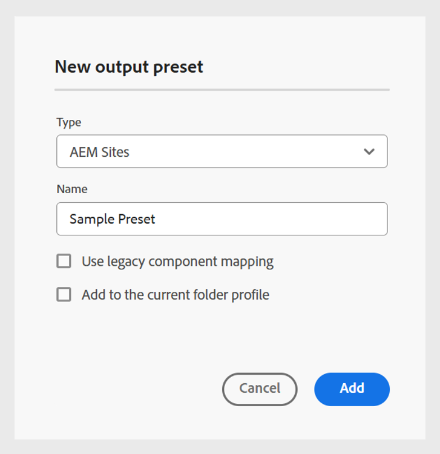
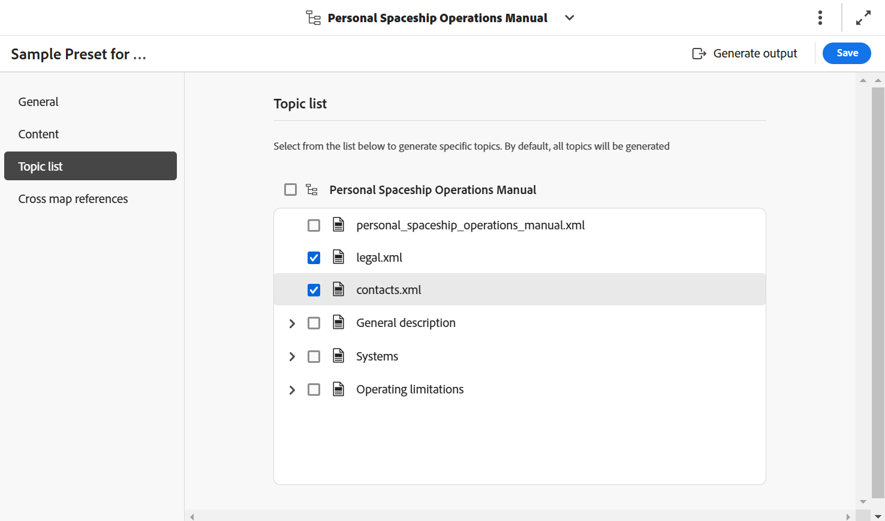
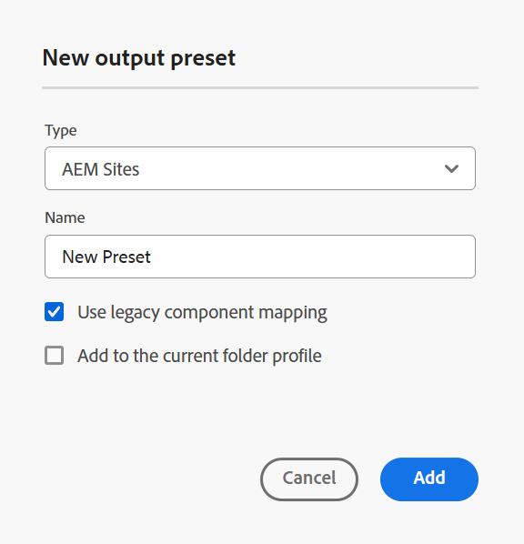
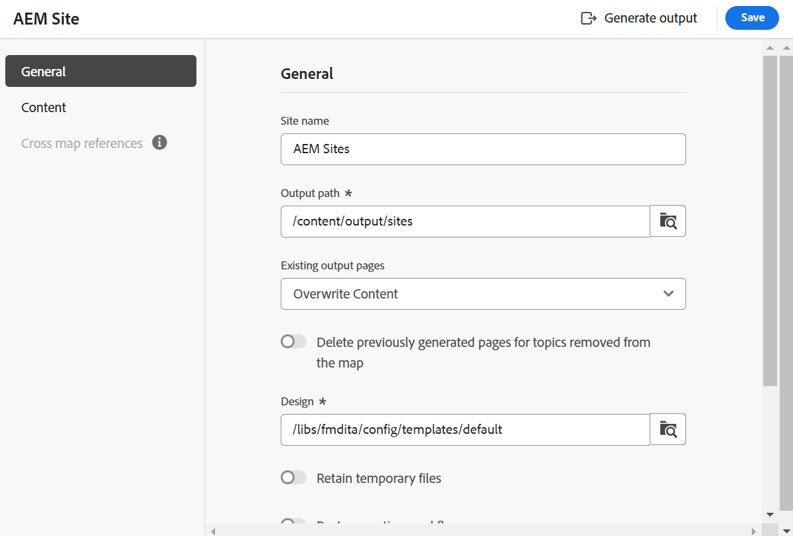
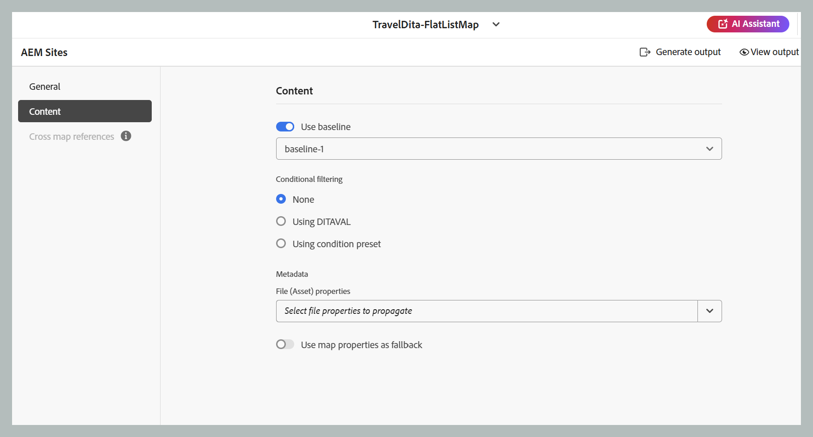
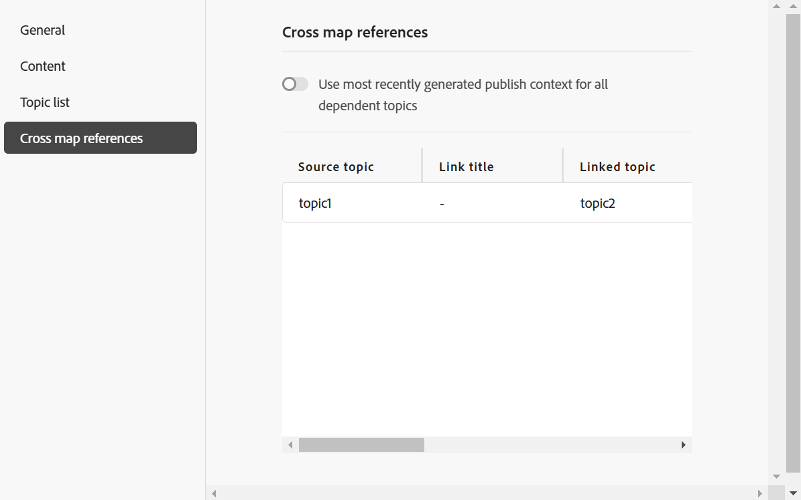

# マップコンソールでのAEM Sites プリセット

マップコンソールからAEM Sites プリセットを作成し、AEM Sites出力を生成するように設定できます。 AEM Sites出力を作成するには、次の2つの方法があります。

- [複合コンポーネントマッピングを使用](#use-composite-component-mapping)
- [従来のコンポーネントマッピングの使用](#use-legacy-component-mapping)

>[!TIP]
>
> パフォーマンスを向上させるには、Experience Manager Guides 2502 リリース以降で使用可能な複合コンポーネントマッピングを使用することをお勧めします。

## 複合コンポーネントマッピングの使用

複合コンポーネントマッピングでは、従来のコンポーネントマッピングと比較して、AEM Sitesへの公開をより迅速かつスケーラブルに行うことができます。 AEMのテンプレートエディターを使用して、必要に応じてカスタマイズできる、すぐに使用できる編集可能なテンプレートが付属しています。 テンプレートでは、WCM コアコンポーネントと専用の`guides-components`を組み合わせて使用することで、エンドユーザーがAEM Sites ページで最高のエクスペリエンスを得られるようにします。 また、複合コンポーネントマッピング方式を使用して、既存のテンプレートをカスタマイズすることもできます。

Experience Manager Guidesには、AEM Sitesを作成するための定義済みテンプレートが用意されています。 これらのテンプレートは、コンテンツのレイアウトと構造の一貫性を確保するのに役立ちます。
- これらの定義済みテンプレートに基づいて[ ホームページ ](../cs-install-guide/download-install-aem-sites-templates-cs.md#create-a-home-page-using-the-template)を作成します。
- [ トピックテンプレート ](../cs-install-guide/download-install-aem-sites-templates-cs.md#package-installation)を編集し、要件に応じてスタイルを適用できます。
- また、既存のAEM Sites テンプレートを[ カスタマイズすることもできます](../cs-install-guide/download-install-aem-sites-templates-cs.md#customize-existing-aem-sites-templates)。

**AEM Sites プリセットの作成**

複合コンポーネントマッピングを使用してAEM Sites プリセットを作成するには、次の手順を実行します。

1. [ マップコンソールでDITA マップファイルを開きます](./open-files-map-console.md)。
1. **出力プリセット** パネルで、「+」アイコンを選択して出力プリセットを作成します。
1. **新しい出力プリセット** ダイアログボックスの&#x200B;**Type** ドロップダウンから&#x200B;**AEM Sites**&#x200B;を選択します。
1. 「**レガシーコンポーネントマッピングを使用**」オプションの選択を解除します。
1. 「**現在のフォルダープロファイルに追加**」オプションを選択して、現在のフォルダープロファイル内に出力プリセットを作成します。 は、フォルダープロファイルレベルのプリセットを示します。

   [ グローバルおよびフォルダープロファイル出力プリセットの管理](./web-editor-manage-output-presets.md)の詳細をご覧ください。

1. 「**追加**」を選択します。

   AEM Sitesのプリセットが作成されます。

   {width="300" align="left"}

<!--
### Generate the AEM Sites output using the templates

Once, the preset is created, you can configure the various options available for AEM Sites output generation. Experience Manager Guides allows you to use the out of the box templates or add your own AEM Sites templates.

You can configure the Out-of-the-box Sites template  in two ways:

- In the **Sites** field, select the AEM sites where you want to publish your output.  For example, `AEMG Docs`.

    The **Publish path** and the **Topic page template** options are automatically set in the dropdown.  For example,  `AEMG-Docs-Site/en/docs/product1` and `Topic page` are set respectively. You can also choose the other options from the dropdown.

- Or, Select the **Use Sites path** option to select the complete Sites path, and then select a **Map page template**. 

    You can browse a predefined Sites path or specify a custom path even if the specified path has not been pre-created within the AEM Sites structure. In such cases, the system creates the necessary structure during the publishing process by using the selected map homepage template.

   For example, you can specify the path `/content/AEMG-Docs-Site/en/docs/product4` where the `product4`does not exist in the strcuture. In this case, the system automatically creates `product4` using the selected **Map page template** and publish the output within this newly created page. 
   
   The **Topic page template** is automatically set as `Topic Page`. However, you can choose to select other available options in the dropdown.

-->

### 複合コンポーネントマッピング用のAEM Sites プリセット設定

>[!NOTE]
>
> Experience Manager Guides用のAEM Sites プリセットを設定する前に、管理者はテンプレートを使用してAEM Sites構造を作成する必要があります。

- **オンプレミスソフトウェア**: オンプレミスソフトウェア用のAEM Sites テンプレート [を](../install-guide/download-install-aem-sites-templates.md) ダウンロードしてインストールする方法について詳しく説明します。
- **Cloud Service**: [Cloud Service用AEM Sites テンプレート ](../cs-install-guide/download-install-aem-sites-templates-cs.md)をダウンロードしてインストールする方法について詳しく説明します。

マップコンソールでは、複合コンポーネントマッピングのプリセット設定オプションが次のタブに整理されています。

- 一般
- コンテンツ
- トピックリスト
- クロスマップ参照

{width="650" align="left"}

**一般**

「**一般**」タブには、次の設定オプションが含まれています。

| AEM Sitesオプション | 説明 |
| --- | --- |
| サイトパスを使用 | Experience Manager サイトにコンテンツを公開するには、このオプションを使用します。 |
| サイトパス | **このオプションは、** サイトパスを使用&#x200B;**オプション**&#x200B;を選択した場合に表示されます。 定義済みのExperience Manager サイトパスを参照するか、出力を公開するカスタムパスを指定します。 「**サイトを使用」オプション**&#x200B;を使用すると、指定したパスがAEM Sites構造内で事前に作成されていない場合でも、公開パス全体を指定できます。 このような場合、選択したマップホームページのテンプレートを使用して、公開プロセス中に必要な構造がシステムによって作成されます。   サイトパスの設定時に変数を使用することもできます。 詳細については、[宛先パス、サイト名、またはファイル名のオプションを設定するための変数の使用](./generate-output-use-variables.md)を参照してください |
| マップページテンプレート | **このオプションは、** サイトパスを使用&#x200B;**オプション**&#x200B;を選択した場合に表示されます。 マップホームページに適用するテンプレートを選択します。 |
| サイト | コンテンツを公開するExperience Manager Sitesの名前。 ドロップダウンのオプションは、AEM Sitesで使用可能なサイトのリストに基づいて設定されます。   「**更新** 」を選択して、オプションの新しいリストを取得し、更新されたデータを反映します。 |
| パスを公開 | 出力が保存されるAEM リポジトリ内のパス。 公開パスには、ホームページ テンプレートに基づいて作成されたページを含むすべてのパスが入力されます。 DITA マップのAEM Sites出力は、このパスの下に生成されます。  例えば、サイトを`AEMG-Docs`に、公開パスを`aemg-docs-en/docs/product-abc.`に指定した場合、AEM Sites出力は`aemg-docs-en/docs/product-abc/`の`crx/de` ノードの下に生成されます。 |
| トピックページテンプレート | すべての出力トピックに適用するテンプレートを選択します。 |
| に基づいたページ名の生成 | **トピックファイル名**: DITA トピックのファイル名を使用して、サイト URLを作成します。  **トピックタイトル**: DITA トピックのタイトルを使用して、Experience Manager サイト名を作成します。 |
| 以前に生成したページのクリーンアップ | - **マップから削除されたトピックの以前に生成されたページを削除**: DTIA マップの構造が変更された場合、このオプションを使用して、削除されたトピックの以前に生成されたページを削除できます。 この機能は、完全なマップ公開でのみ使用できます。   トピック a.dita、b.dita、およびc.ditaを含むDITA マップを公開したとします。 マップを再度公開する前に、マップからb.dita トピックを削除しました。 これで、このオプションを選択した場合、b.ditaに関連するすべてのコンテンツがAEM Sites出力から削除され、a.ditaとc.ditaのみが公開されます。  **メモ**：削除されたページに関する情報も、出力生成ログに取り込まれます。 ログファイルへのアクセスについて詳しくは、[ ログファイルを表示して確認してください](generate-output-basic-troubleshooting.md#id1821I0Y0G0A__id1822G0P0CHS)。   **注意**：トピックを削除すると、公開されたサイトからページを使用できなくなります。 トピックが削除される前に、警告が表示されます。 削除することを確認してください。  - **このパスで他のソースによって作成されたすべてのページを削除**：このオプションを選択すると、他のマップ、個々のトピック、またはその他のソースからこのパスに公開されているすべてのページが削除されます。 ページは、公開されたサイトからも利用できなくなります。 トピックが削除される前に、警告が表示されます。 削除することを確認してください。 |
| 生成後のワークフロー | このオプションを選択すると、AEMで設定されたすべてのワークフローを含む新しいポストジェネレーションワークフローのドロップダウンリストが表示されます。 出力生成ワークフローの完了後に実行するワークフローを選択する必要があります。 |

**コンテンツ**

「**コンテンツ**」タブには、次の設定オプションが含まれています。

| AEM Sitesオプション | 説明 |
| --- | --- |
| ベースラインを使用 | 選択したDITA マップのベースラインを作成した場合は、このオプションを選択して、公開するバージョンを指定します。  詳細については、[ ベースラインの操作](generate-output-use-baseline-for-publishing.md#id1825FI0J0PF)を参照してください。 |
| 条件付きフィルタリング | 次のいずれかのオプションを選択します。  **なし**：公開された出力に条件を適用しない場合は、このオプションを選択します。 **DITAVALの使用**：条件付きコンテンツを生成するには、DITAVAL ファイルを選択します。 参照ダイアログまたはファイルパスを入力して、複数のDITAVal ファイルを選択できます。 ファイル名の近くにある十字アイコンを使用して削除します。 DITAVal ファイルは指定された順序で評価されるので、最初のファイルで指定された条件は、後のファイルで指定された一致する条件よりも優先されます。 ファイルを追加または削除することで、ファイルの順序を維持できます。 DITAVal ファイルが別の場所に移動されたり、削除されたりした場合、マップダッシュボードから自動的に削除されることはありません。 ファイルが移動または削除された場合は、場所を更新する必要があります。 ファイル名にカーソルを合わせると、ファイルが保存されているAEM リポジトリ内のパスを表示できます。 DITAVal ファイルのみを選択でき、他のファイルタイプを選択した場合はエラーが表示されます。 **条件プリセット**：出力の公開中に条件を適用するには、ドロップダウンから条件プリセットを選択します。 このオプションは、DITA マップファイルの条件を追加した場合に表示されます。 条件設定は、DITA マップコンソールの「条件プリセット」タブで使用できます。 条件プリセットについて詳しくは、[条件プリセットの使用](generate-output-use-condition-presets.md#id1825FL004PN)を参照してください。 |
| 追加のDITA-OT コマンドライン引数 | 出力の生成時にDITA-OTで処理する追加の引数を指定します。 DITA-OTでサポートされているコマンドライン引数について詳しくは、[DITA-OT ドキュメント ](https://www.dita-ot.org/)を参照してください。 |
| メタデータ     ファイル（Assets）のプロパティ | メタデータとして処理するプロパティを選択します。 これらのプロパティは、DITA マップまたはブックマップファイルのプロパティページから設定します。 ドロップダウンリストから選択したプロパティは、**ファイルプロパティ** フィールドの下に表示されます。 プロパティの横にある十字アイコンを選択して削除します。   **注**: メタデータのプロパティでは、大文字と小文字が区別されます。  *ベースラインを選択した場合、プロパティの値は、選択したベースラインのバージョンに基づきます。 * ベースラインを選択していない場合、プロパティの値は最新バージョンに基づいています。  DITA-OT パブリッシングを使用して、メタデータを出力に渡すこともできます。 詳細については、[DITA-OT](pass-metadata-dita-ot.md#id21BJ00QD0XA)を使用してメタデータを出力に渡します。  **注意**: 「プロパティ」オプションで`cq:tags`を定義していない場合、公開用のベースラインを選択した場合でも、`cq:tags`の値が現在の作業コピーから選択されます。 |
| メタデータ     マッププロパティをフォールバックとして使用 | 選択すると、マップファイルに定義されたプロパティも、プロパティが定義されていないトピックにコピーされます。 このオプションを使用する際は、次の点を考慮してください。  *文字列、日付、または長い（1つの値と複数値の）プロパティのみをAEM サイトページに渡すことができます。 * String タイプ プロパティのメタデータ値は、特殊文字（`@, #, " "`など）をサポートしていません。 *このオプションは、`Properties` オプションと共に使用する必要があります。 |

**トピックリスト**

「**トピックリスト**」タブには、DITA マップの現在の作業コピーに存在するトピックのリストが表示されます。 デフォルトでは、すべてのトピックが含まれています。 特定のトピックを選択し、そのトピックに対してのみAEM Sites出力を生成できます。 例えば、一部のトピックを更新して、DITA マップ全体を公開するのではなく、それらのトピックのみを公開できるようにします。

 {align="left"}

>[!NOTE]
>
> 「**コンテンツ**」タブでベースラインを選択すると、トピックリストに、添付されたベースラインのトピックとそのバージョンが表示されます。 また、トピックリストからの増分公開は、マップの構造に変更がない場合にのみ使用する必要があります。 マップ構造/目次に変更がある場合は、マップ全体を1回公開して目次を更新する必要があります。

**クロスマップ参照**

このリストには、`scope ="peer"`とのクロスマップ参照を含むトピックが含まれています。 他のDITA マップで使用可能なトピックに`scope="peer"`を含むクロスマップ参照のリストに対して、公開コンテキストを指定できます。 このタブは、Experience Manager Guides（UUID）バージョンを使用している場合に表示されます。

詳細については、以下の「[ リンクされたトピックの操作](#working-with-linked-topics)」セクションを参照してください。

設定が完了したら、変更をプリセットに保存し、**生成**&#x200B;を選択して、対応するマップのAEM Sitesを生成します。

>[!NOTE]
>
> 初めてAEM サイトにコンテンツを公開する場合は、サイトレベルでページを公開することをお勧めします。 これにより、出力が&#x200B;**Publish** インスタンスでCSSの中断を受けることなく正しく表示されるようになります。

## 従来のコンポーネントマッピングの使用

従来のコンポーネントマッピングを使用してAEM Sites プリセットを作成する手順は、上記の[ コンポーネントマッピング ](#use-composite-component-mapping) セクションで説明した手順と同じです。 ただし、プリセットの作成中は、**新規出力プリセット** ダイアログで「**レガシーコンポーネントマッピングを使用**」オプションを選択していることを確認してください。

 {width="300" align="left"}

マップコンソールでは、従来のコンポーネントマッピングのプリセット設定オプションが次のタブに整理されています。

- 一般
- コンテンツ
- クロスマップ参照

{width="500" align="left"}

**一般**

「**一般**」タブには、次の設定オプションが含まれています。

| AEM Sitesオプション | 説明 |
| --- | --- |
| サイト名 | 出力がAEM リポジトリに保存されるサイト名。  ここで指定した名前のAEM リポジトリ内のノードが作成されます。 サイト名を指定しない場合、サイトノードはDITA マップファイル名で作成されます。  ここで指定したサイト名は、ブラウザータブのタイトルとしても使用されます。   サイト名の設定時に変数を使用することもできます。 詳細については、[宛先パス、サイト名、またはファイル名のオプションを設定するための変数の使用](./generate-output-use-variables.md)を参照してください |
| 出力パス | 出力が保存されるAEM リポジトリ内のパス。 最終的な出力を生成する際に、サイト名と出力パスが組み合わされます。 例えば、サイト名を`user-guide`、出力パスを`/content/output/aem-guides`に指定した場合、最終的な出力は`/content/output/aem-guides/user-guide` ノードの下に生成されます。  出力パスの設定時に変数を使用することもできます。 詳細については、[宛先パス、サイト名、またはファイル名のオプションを設定するための変数の使用](./generate-output-use-variables.md)を参照してください |
| 既存の出力ページ | 既存のページのコンテンツを上書きするには、「**コンテンツを上書き**」オプションを選択します。 このオプションは、ページのコンテンツノードとヘッドノードの下にあるコンテンツのみを上書きします。 このオプションを使用すると、コンテンツのブレンド公開が有効になります。 このオプションを選択すると、公開された出力から孤立したページを削除するオプションが表示されます。 これは、AEM Sites出力を作成するための&#x200B;*default* オプションでもあります。  公開中に既存のページを強制的に削除するには、**削除および作成** オプションを選択します。 このオプションは、ページノードとそのコンテンツおよびその下のすべての子ページを削除します。 出力プリセットのデザインテンプレートを変更した場合、または出力先に既に存在する追加ページを削除する場合は、このオプションを使用します。 |
| マップから削除されたトピックの以前に生成されたページの削除 | DTIA マップの構造が変更された場合は、このオプションを使用して、削除したトピックに対して以前に生成したページを削除できます。 この機能は、完全なマップ公開でのみ使用できます。   トピック a.dita、b.dita、およびc.ditaを含むDITA マップを公開したとします。 マップを再度公開する前に、マップからb.dita トピックを削除しました。 これで、このオプションを選択した場合、b.ditaに関連するすべてのコンテンツがAEM Sites出力から削除され、a.ditaとc.ditaのみが公開されます。  **メモ**：削除されたページに関する情報も、出力生成ログに取り込まれます。 ログファイルへのアクセスについて詳しくは、[ ログファイルを表示して確認してください](generate-output-basic-troubleshooting.md#id1821I0Y0G0A__id1822G0P0CHS)。   **注意**：トピックを削除すると、公開されたサイトからページを使用できなくなります。 トピックが削除される前に、警告が表示されます。 削除することを確認してください。 |
| デザイン | 出力の生成に使用するデザインテンプレートを選択します。   カスタムデザインテンプレートを使用して出力を生成する方法について詳しくは、公開管理者にお問い合わせください。 |
| 生成後のワークフロー | このオプションを選択すると、AEMで設定されたすべてのワークフローを含む新しいポストジェネレーションワークフローのドロップダウンリストが表示されます。 出力生成ワークフローの完了後に実行するワークフローを選択する必要があります。 |
| 一時ファイルの保持 | DITA-OTで生成された一時ファイルを保持するには、このオプションを選択します。 DITA-OTを使用して出力を生成する際にエラーが発生した場合は、一時ファイルを保持するためにこのオプションを選択します。 その後、これらのファイルを使用して、出力生成エラーのトラブルシューティングを行うことができます。   出力を生成したら、**一時ファイルをダウンロード**  アイコンを選択して、一時ファイルを含むZIP フォルダーをダウンロードします。   **メモ**: ファイルのプロパティが生成中に追加された場合、出力された一時ファイルには、それらのプロパティを含む&#x200B;*metadata.xml* ファイルも含まれます。 |

**コンテンツ**

{width="650" align="left"}

「**コンテンツ**」タブには、次の設定オプションが含まれています。

| AEM Sitesオプション | 説明 |
| --- | --- |
| ベースラインを使用 | 選択したDITA マップのベースラインを作成した場合は、このオプションを選択して、公開するバージョンを指定します。  詳細については、[ ベースラインの操作](./web-editor-baseline.md)を参照してください。 |
| 条件付きフィルタリング | 次のいずれかのオプションを選択します。  **なし**：公開された出力に条件を適用しない場合は、このオプションを選択します。 **DITAVALの使用**：条件付きコンテンツを生成するには、DITAVAL ファイルを選択します。 参照ダイアログまたはファイルパスを入力して、複数のDITAVal ファイルを選択できます。 ファイル名の近くにある十字アイコンを使用して削除します。 DITAVal ファイルは指定された順序で評価されるので、最初のファイルで指定された条件は、後のファイルで指定された一致する条件よりも優先されます。 ファイルを追加または削除することで、ファイルの順序を維持できます。 DITAVal ファイルが別の場所に移動されたり、削除されたりした場合、マップダッシュボードから自動的に削除されることはありません。 ファイルが移動または削除された場合は、場所を更新する必要があります。 ファイル名にカーソルを合わせると、ファイルが保存されているAEM リポジトリ内のパスを表示できます。 DITAVal ファイルのみを選択でき、他のファイルタイプを選択した場合はエラーが表示されます。 **条件プリセット**：出力の公開中に条件を適用するには、ドロップダウンから条件プリセットを選択します。 このオプションは、DITA マップファイルの条件を追加した場合に表示されます。 条件設定は、DITA マップコンソールの「条件プリセット」タブで使用できます。 条件プリセットについて詳しくは、[条件プリセットの使用](generate-output-use-condition-presets.md#id1825FL004PN)を参照してください。 |
| メタデータ     ファイル（Assets）のプロパティ | メタデータとして処理するプロパティを選択します。 これらのプロパティは、DITA マップまたはブックマップファイルのプロパティページから設定します。 ドロップダウンリストから選択したプロパティは、**ファイルプロパティ** フィールドの下に表示されます。 プロパティの横にある十字アイコンを選択して削除します。   **注**: メタデータのプロパティでは、大文字と小文字が区別されます。  *ベースラインを選択した場合、プロパティの値は、選択したベースラインのバージョンに基づきます。 * ベースラインを選択していない場合、プロパティの値は最新バージョンに基づいています。  DITA-OT パブリッシングを使用して、メタデータを出力に渡すこともできます。 詳細については、[DITA-OT](pass-metadata-dita-ot.md#id21BJ00QD0XA)を使用してメタデータを出力に渡します。  **注意**: 「プロパティ」オプションで`cq:tags`を定義していない場合、公開用のベースラインを選択した場合でも、`cq:tags`の値が現在の作業コピーから選択されます。 |
| メタデータ     マッププロパティをフォールバックとして使用 | 選択すると、マップファイルに定義されたプロパティも、プロパティが定義されていないトピックにコピーされます。 このオプションを使用する際は、次の点を考慮してください。  *文字列、日付、または長い（1つの値と複数値の）プロパティのみをAEM サイトページに渡すことができます。 * String タイプ プロパティのメタデータ値は、特殊文字（`@, #, " "`など）をサポートしていません。 *このオプションは、`Properties` オプションと共に使用する必要があります。 |

**クロスマップ参照**

このリストには、`scope ="peer"`とのクロスマップ参照を含むトピックが含まれています。 他のDITA マップで使用可能なトピックに`scope="peer"`を含むクロスマップ参照のリストに対して、公開コンテキストを指定できます。 このタブは、Experience Manager Guides（UUID）バージョンを使用している場合に表示されます。

詳細については、以下の「[ リンクされたトピックの操作](#working-with-linked-topics)」セクションを参照してください。

## リンクされたトピックの操作

Experience Manager Guidesでは、`peer @scope`を使用してトピック参照を作成できます。 次に、AEM Sites プリセットからこれらの参照の公開コンテキストを定義し、リンクされたトピックの出力を最終的に生成できます。

詳細については、[他のマップからトピックをリンクする出力を生成](../user-guide/generate-output-aem-site.md#generate-output-linking-topics-from-other-maps)を参照してください。

次の手順を実行して、相互リンクされたファイルの公開コンテキストを指定します。

1. 「**クロスマップ参照**」タブを開きます。 このタブを表示するには、`<xrefs>`に一意のIDがあることを確認してください。 `<xrefs>`の一意のIDは、IDがない場合、古いコンテンツの編集または保存時に自動的に生成されます。

   次の場合、クロスマップリンクを表示できません。
   - 4.6 リリースより前に作成されたプリセットについては、「相互参照」タブが無効になり、「**マップダッシュボードを参照**」というツールヒントが表示されます。
   - マップダッシュボードから作成されたプリセットについては、**マップダッシュボード** ツールヒントを参照してください。
   - OOTB プリセットについては、**マップダッシュボード**&#x200B;のツールヒントを参照してください。
   - グローバルプリセットの場合は、このグローバルプリセットのローカルコピーを作成して、クロスマップ参照を設定します。

1. トピックとその参照のリストが表示されます

   >[!NOTE]
   >
   >「**クロスマップ参照**」タブには、`scope="peer"`のみを使用してリンクされているトピックが表示されます。 `scope="local"`のリンクの場合、公開コンテキストを指定する必要はありません。

   リンクされたすべてのトピックには、最新の出力プリセットとマップがデフォルトで選択されています。 リンクされたすべてのトピックの公開コンテキストは、デフォルトで`<Most recently generated>` マップに設定されています。

   

1. マップ内の各依存ファイルの最近公開された出力を使用する場合は、**すべての依存トピックに対して最近生成された**公開コンテキストを使用するを選択します。
リンクされたトピックを含むマップを公開する前に、親マップとして選択したマップを公開する必要があります。 リンクされたトピックを含むマップが公開されていない場合、リンクはAEM Sites出力にハイパーリンクではなく通常のテキストとして表示されます。
リンクされたトピックに対して、同じ種類のAEM Sites プリセットを選択する必要があります。 例えば、現在のAEM Sites プリセットで従来のコンポーネントマッピングを使用している場合は、リンクされたトピックの同様のAEM Sites プリセットを選択します。
1. 親マップ ドロップダウンリストで、現在のマップの出力をリンクする出力を含むマップファイルを選択します。
マップファイルを選択すると、親マップ UUID列にマップのUUIDが表示されます。 選択したマップに関連付けられている出力プリセットは、親マップのプリセットリストにリストされます。 例えば、マップ Aのトピック 1には、トピック 2への参照が含まれています。 トピック 2は、単一または複数のマップで使用できます。 親マップと、各リンクに対して特定のプリセットまたは最近公開された出力を選択できます。

1. 同じトピックがファイル内で複数回参照される場合は、各インスタンスに対して異なる公開コンテキストを追加できます。 これにより、コンテンツに対する柔軟性と制御が向上します。 例えば、トピック 3はマップ Bとマップ Cの両方に存在します。トピック 1には、トピック 3への2つの参照が含まれています。 最初のリンクの親マップとしてマップ Bを選択し、2番目のリンクの親としてマップ Cを選択できます。

1. 親マップのプリセット ドロップダウンリストで、現在のマップの出力をリンクする出力プリセットを選択します。
   >[!NOTE]
   >
   > 現在のマップの様々なAEM Sites プリセットがドロップダウンリストに表示されます。 プリセットを選択しないと、警告アイコンが表示され、出力生成が失敗します。

1. すべてのソーストピックに必要なマップとその出力プリセットを選択し、**生成**&#x200B;を選択します。

**親トピック：** [出力プリセットについて](generate-output-understand-presets.md)