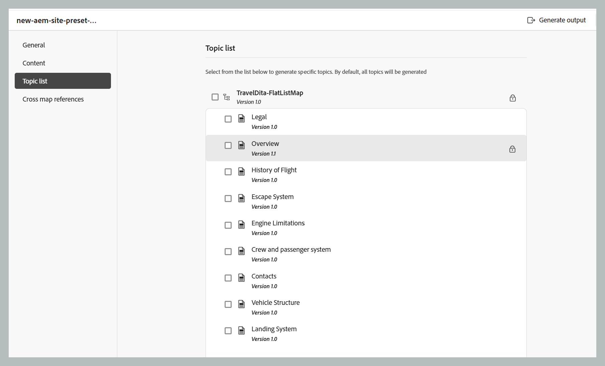

# 増分出力の生成

>[!NOTE]
>
> 増分出力の生成は、AEM Sites出力にのみ適用されます。 また、DITA \（.dita/.xml\） トピックは、DITA マップまたはサブマップからのみ再生成できます。 DITA マップ、サブマップ、トピックグループ、またはトピックを `@processing-role="resource-only"` で選択した場合、再生成オプションは使用できません。

DITA マップの一部のトピックのみを更新し、更新されたトピックのみをライブにプッシュする場合があります。 このようなシナリオを処理するために、Experience Manager Guidesでは増分出力を作成できます。 いくつかのトピックを更新した場合は、DITA マップ全体を再生成する必要はありません。 更新されたトピックのみを選択して再生成できます。

マップがチャンクされ、そのマップ内の 1 つのトピックを更新した場合、更新されたトピックまたはコンテンツが出力に反映されるようにマップ全体を再生成する必要があります。 トピックレベルでは出力再生オプションは得られず、\（chunked\） マップレベルでのみ使用できます。 これは、親マップとすべてのサブマップに適用できます。

特定のトピックまたはトピックのグループの出力を再生成するには、次の手順を実行します。

## マップコンソールから増分出力を生成する（複合コンポーネントマッピングを使用するAEM サイトの場合）

次の手順を実行し、マップコンソールを使用してAEM Sitesの増分出力を生成します。

1. [DITA マップファイルをマップコンソールで開きます ](./open-files-map-console.md)。
1. 増分出力を生成するAEM Sites プリセットを選択します。
1. 「**トピック**」タブで、公開するトピックを選択します。

   - ベースラインなし

      {align="left"}

   - ベースラインを使用

      {align="left"}

   >[!NOTE]
   >
   > 「**コンテンツ**」タブでベースラインを選択すると、「トピック」リストには、添付されたベースラインのトピックとそのバージョンが表示されます。  
   > トピック リストからの増分公開は、マップの構造に変更がない場合にのみ使用してください。 マップの構造や目次に変更がある場合は、マップ全体を 1 回パブリッシュして目次を更新する必要があります。

1. 「**保存**」を選択して、変更を保存します。
1. 「**出力を生成**」を選択して、出力を生成します。

## マップダッシュボードから増分出力を生成する（従来のコンポーネントマッピングを使用するAEM Sites の場合）

次の手順を実行し、マップダッシュボードを使用してAEM Sitesの増分出力を生成します。

1. Assets UI で、DITA マップファイルに移動して選択します。

   出力の生成に使用できる出力プリセットのリストが表示された DITA マップコンソールが表示されます。

1. 「**トピック**」タブを選択します。

   DITA マップで使用可能なトピックのリストが表示されます。

1. 再生成するトピックを選択します。

   >[!NOTE]
   >
   > DITA マップに新しいトピックを追加した場合、ここから新しいトピックを生成することはできません。 最初に、DITA マップ公開機能を使用して、新しく追加されたトピックを公開する必要があります。

   {align="left"}

1. 「**再生成**」を選択します。

   **選択したトピックを再生成** ページが表示されます。

1. 選択したトピックを再生成するために使用する出力プリセットを選択します。

   従来のコンポーネントマッピングを使用するAEM Sites出力プリセットの場合、ベースラインを選択すると、選択したベースラインに含まれるトピックバージョンが出力の生成に使用されます。 また、トピック リストからの増分公開は、マップ構造に変更がない場合にのみ使用してください。 マップの構造や目次に変更がある場合は、マップ全体を 1 回パブリッシュして目次を更新する必要があります。 AEM サイトプリセットの使用について詳しくは、マップダッシュボードの [AEM Sites プリセット ](./generate-output-aem-site-map-dashboard.md) を参照してください。

1. 「**再生成**」を選択して、出力生成プロセスを開始します。

>[!IMPORTANT]
>
> トピックタイトルの名前を変更してトピックを再生成した場合、更新されたトピックタイトルは DITA マップの目次に反映されません。 目次のトピックタイトルを更新するには、DITA マップ全体を生成する必要があります。

出力生成リクエストの現在のステータスは、「**出力**」タブに表示されます。 詳しくは、[ 出力生成タスクのステータスを表示 ](#view-the-status-of-the-output-generation-task) を参照してください。

**親トピック：**[ 出力プリセットについて ](generate-output-understand-presets.md)
