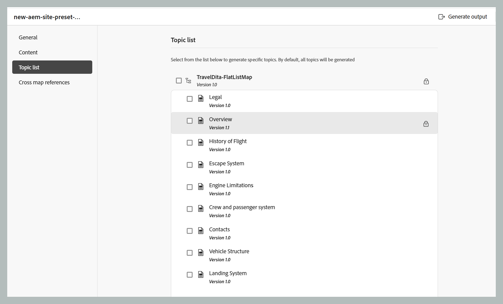
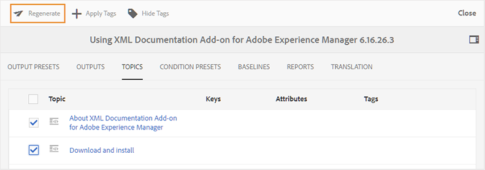

# 増分出力生成

>[!NOTE]
>
> 増分出力の生成は、AEM Sites出力にのみ適用されます。 また、DITA マップまたはサブマップからDITA \（.dita/.xml\）トピックのみを再生成できます。 DITA マップ、サブマップ、トピックグループ、または`@processing-role="resource-only"`のトピックを選択した場合、再生成オプションは使用できません。

DITA マップ内の少数のトピックのみを更新し、更新されたトピックのみを公開するインスタンスが多数ある場合があります。 このような状況に対応するために、Experience Manager Guidesでは増分出力を作成できます。 いくつかのトピックを更新した場合は、DITA マップ全体を再生成する必要はありません。 更新されたトピックのみを選択して再生成できます。

マップがチャンク化され、そのマップ内の1つのトピックを更新した場合は、更新されたトピックまたはコンテンツを出力に反映するために、マップ全体を再生成する必要があります。 出力の再生成オプションはトピックレベルでは取得されず、\（chunked\） マップレベルでのみ使用できます。 これは、親マップとすべてのサブマップに適用されます。

特定のトピックまたはトピックのグループの出力を再生成するには、次の手順を実行します。

## マップコンソールから増分出力を生成（複合コンポーネントマッピングを使用してAEM サイトの場合）

マップコンソールを使用してAEM Sitesの増分出力を生成するには、次の手順を実行します。

1. [&#x200B; マップコンソール &#x200B;](./open-files-map-console.md)でDITA マップファイルを開きます。
1. 増分出力を生成するAEM Sites プリセットを選択します。
1. 「**トピック**」タブで、公開するトピックを選択します。

   - ベースラインなし

     

   - ベースラインあり

     ベースライン を持つaem sites トピックリスト

   >[!NOTE]
   >
   > 「**コンテンツ**」タブでベースラインを選択すると、トピックリストに、添付されたベースラインのトピックとそのバージョンが表示されます。  
   > トピックリストからの増分公開は、マップの構造に変更がない場合にのみ使用する必要があります。 マップ構造/目次に変更がある場合は、マップ全体を1回公開して目次を更新する必要があります。

1. 「**保存**」を選択して、変更を保存します。
1. 「**出力を生成**」を選択して、出力を生成します。

## マップダッシュボードから増分出力を生成（従来のコンポーネントマッピングを使用してAEM サイトの場合）

マップダッシュボードを使用してAEM Sitesの増分出力を生成するには、次の手順を実行します。

1. Assets UIで、DITA マップファイルに移動して選択します。

   DITA マップコンソールに、出力の生成に使用できる出力プリセットのリストが表示されます。

1. 「**トピック**」タブを選択します。

   DITA マップで使用可能なトピックのリストが表示されます。

1. 再生成するトピックを選択します。

   >[!NOTE]
   >
   > DITA マップに新しいトピックを追加した場合、ここから新しいトピックを生成することはできません。 最初に、新しく追加したトピックをDITA マップ公開機能を使用して公開する必要があります。

   

1. 「**再生成**」を選択します。

   「**選択したトピックを再生成**」ページが表示されます。

1. 選択したトピックの再生成に使用する出力プリセットを選択します。

   従来のコンポーネントマッピングを使用したAEM Sites出力プリセットの場合、ベースラインを選択すると、選択したベースラインに含まれるトピックバージョンが出力生成に使用されます。 さらに、トピックリストからの増分公開は、マップ構造に変更がない場合にのみ使用する必要があります。 マップ構造/目次に変更がある場合は、マップ全体を1回公開して目次を更新する必要があります。 AEM サイトプリセットの使用について詳しくは、マップダッシュボードで[AEM Sites プリセットを表示してください](./generate-output-aem-site-map-dashboard.md)。

1. **再生成**&#x200B;を選択して、出力生成プロセスを開始します。

>[!IMPORTANT]
>
> トピックタイトルの名前を変更してトピックを再生成した場合、更新されたトピックタイトルはDITA マップの目次に反映されません。 目次のトピックタイトルを更新するには、DITA マップ全体を生成する必要があります。

出力生成リクエストの現在のステータスは、**出力** タブで確認できます。 詳細については、[出力生成タスクのステータスを表示](#view-the-status-of-the-output-generation-task)するを参照してください。

**親トピック：** [出力プリセットについて](generate-output-understand-presets.md)
