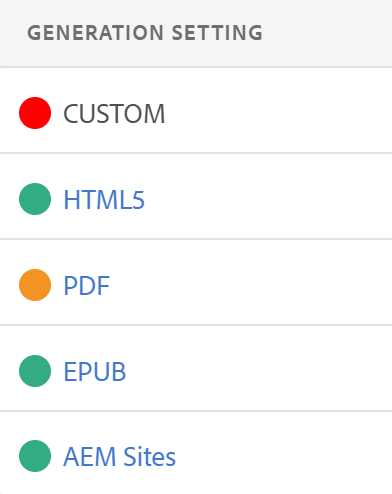
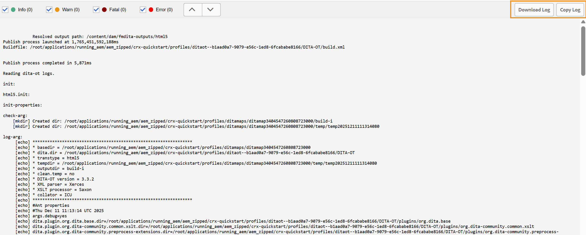

# 基本的なトラブルシューティング {#id1821I0Y0G0A}

Adobe Experience Manager Guidesの操作中に、ドキュメントを公開または開く際にエラーが発生する可能性があります。 このようなエラーは、DITA マップ、トピック、またはExperience Manager Guides プロセス自体で発生する可能性があります。 この節では、出力生成ログファイルの情報にアクセスして解析する方法について説明します。 また、DITA トピックが大きすぎる場合は、JSP コンパイルエラーが表示される可能性があります。 この節では、JSP コンパイルエラーの解決方法についても説明します。

## ログファイルの表示と確認 {#id1822G0P0CHS}

出力生成ログファイルを表示して確認するには、次の手順を実行します。

1. 出力生成プロセスを開始したら、DITA マップコンソールで「**出力**」を選択します。

   **生成出力**&#x200B;の&#x200B;**生成設定**&#x200B;列には、異なる出力プリセットの出力生成の成功または失敗を視覚的に示す色が表示されます。

   {width="300"}

   上のスクリーンショットでは：

   - 赤は、出力の生成に失敗したことを示します。
   - 緑は、出力が正常に生成されたことを示します。
   - アンバーは、エラーが発生した出力生成が成功したことを示します。

   >[!NOTE]
   >
   > 様々な出力結果のステータスを示す&#x200B;**出力** タブの色は、ログファイル内の様々な種類のエラーを分類するために使用される色とは異なります。

1. ジョブの完了後、**生成日時**&#x200B;列のリンクを選択します。

   ログファイルが新しいタブで開きます。

   

1. 次のフィルターを適用して、ログファイル内のテキストを強調表示します。
   - **致命的**: ログファイルの致命的なエラーを濃い赤色で強調表示します。
   - **エラー**: ログファイルのエラーを赤色で強調表示します。 例外はエラーとして扱われ、同様に赤色で強調表示されます。
   - **警告**: ログ ファイル内の警告をオレンジ色で強調表示します。
   - **情報**: ログファイル内の情報メッセージを緑色で強調表示します。

1. 上下のナビゲーションボタンを使用して、ログファイル内のハイライト表示されたテキストにジャンプします。 または、ログファイルをスクロールしてメッセージを確認します。

1. ログファイルに対して次のアクションを実行できます。

   - **ログをダウンロード**: ログのリストが広範な場合は、**ログをダウンロード**&#x200B;を選択して、簡単にアクセスおよびレビューできるようにログファイルをデバイスにダウンロードします。
   - **ログをコピー**: ログのリストをクリップボードにコピーして、一部のテキストエディターにすばやく貼り付けることができます。

## テキストエディターでログファイルをコピーして確認する

テキストエディターで出力生成ログファイルをコピーして確認するには、次の手順を実行します。

1. 出力生成プロセスを開始したら、DITA マップコンソールで「**出力**」を選択します。

1. ジョブの完了後、**生成日時**&#x200B;列のリンクを選択します。

   ログファイルが新しいタブで開きます。

1. 「**ログをコピー**」ボタンを選択します。 ログファイルがクリップボードにコピーされます。
1. テキストエディターを開き、ログファイルをエディターに貼り付けます。

1. ログファイルをスクロールして、メッセージを確認します。

   次の情報は、DITA ファイルまたはExperience Manager Guides プロセスにエラーがあるかどうかを判断するのに役立ちます。

   - *DITA マップファイル関連エラー*: DITA マップファイルまたはDITA マップに含まれているその他のファイルでエラーが見つかった場合、ログファイルには「BUILD FAILED」という文字列が含まれます。 ログファイルで指定された情報を確認して、誤ったファイルを見つけ、問題を修正できます。

   次のサンプルログファイルスニペットでは、エラーの理由と共に`BUILD FAILED` メッセージを表示できます。

   {width="650"}

   - *Experience Manager Guides関連のエラー*: ログファイルで特定できる他の種類のエラーは、Experience Manager Guides プロセス自体に関連しています。 この場合、DITA マップファイルは正常に解析されますが、Experience Manager Guidesの内部エラーにより、出力生成プロセスは失敗します。 このようなエラーの場合は、テクニカルサポートチームに助けを求める必要があります。

   次のサンプルログファイルスニペットでは、`BUILD SUCCESSFUL` メッセージを表示し、その後に他のテクニカルエラーを表示できます。

   {width="650"}

## JSP コンパイルエラーの解決

DITA トピックが大きすぎる場合は、ブラウザーでJSP コンパイルエラー\（`org.apache.sling.api.request.TooManyCallsException`\）が表示される可能性があります。 このエラーは、編集、レビュー、または公開のためにトピックを開いたときに表示される場合があります。

この問題を解決するには、次の手順を実行します。

1. グローバルナビゲーションから、「ツール」を選択し、「操作」/「Web コンソール」を選択します。

   Adobe Experience Manager Web コンソール設定ページが表示されます。

1. *Apache Sling Main Servlet* コンポーネントを検索して選択します。

   Apache Sling Main Servletの設定可能なオプションが表示されます。

1. 要件に従って、*リクエストごとの呼び出し数* パラメーターの値を増やします。

**親トピック：**&#x200B;[&#x200B;出力生成](generate-output.md)
