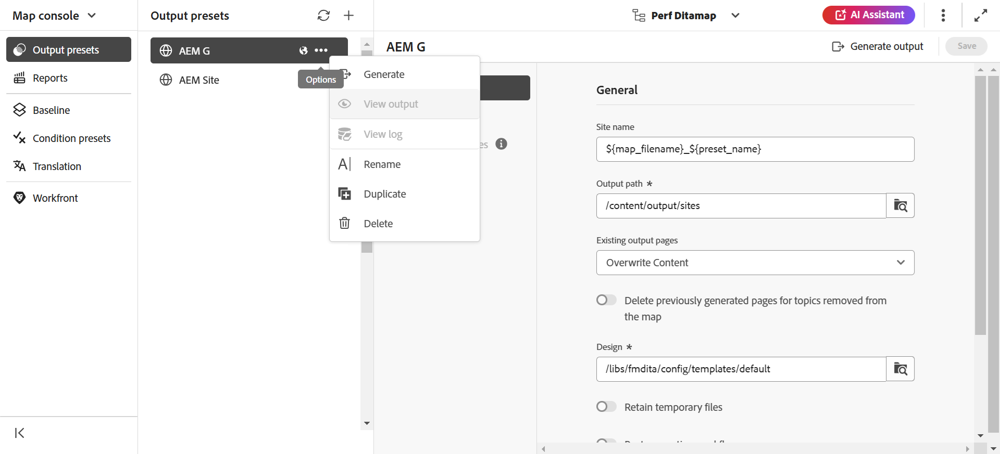
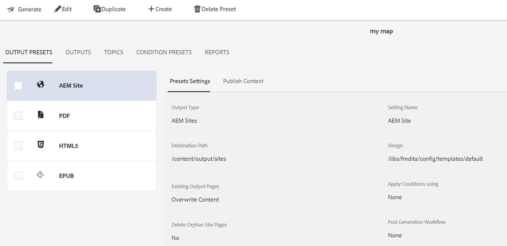

# 出力プリセットの編集、複製、削除 {#id205BEH0K09Z}

出力プリセットは、マップコンソールとマップダッシュボードから管理できます。 どちらの方法でも、次の節に示すように、出力プリセットを編集、複製、削除するオプションが表示されます。

## マップコンソールの使用

必要なプリセット設定に必須フィールドを直接変更することで、選択した出力プリセットを編集できます。

さらに、次に示すように、**オプション** ドロップダウンメニューを使用して、出力プリセットを複製または削除できます。

>[!NOTE]
>
>テンプレートプリセットは編集、複製、削除できません。 これらのアクションは管理者に限定されます。 テンプレートプリセットについて詳しくは、[&#x200B; テンプレートプリセット &#x200B;](../install-conf-guide/template-presets-output-generation.md)を参照してください。

## マップダッシュボードの使用

次に示すように、上部バーから必要なタブを選択して、マップダッシュボードを使用して出力プリセットを編集、複製、削除できます。

**親トピック：**&#x200B;[&#x200B;出力生成](generate-output.md)
