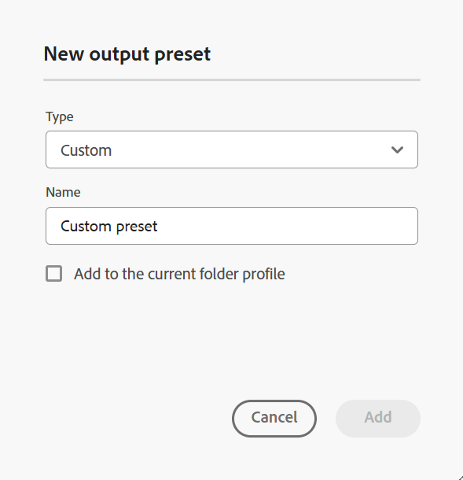

# カスタム {#id205BEF00PX0}

カスタム出力プリセットは、カスタム DITA-OT プラグインで使用できます。 カスタム DITA-OT プラグインを使用して、カスタム DITA-OT 出力プリセットを作成して出力を公開できます。

カスタムプリセットは、次の 2 つの方法で作成できます。

- [マップコンソールからのカスタムプリセットの作成](#create-the-custom-preset-from-the-map-console)
- [&#x200B; マップダッシュボードからのカスタムプリセットの作成 &#x200B;](#create-the-custom-preset-from-the-map-dashboard)

## マップコンソールからのカスタムプリセットの作成

次の手順を実行して、マップ コンソールからカスタムプリセットを作成します。

1. [Map コンソールで DITA マップファイルを開きます &#x200B;](./open-files-map-console.md)。

   また、「概要」セクションの **最近のファイル** ウィジェットからマップファイルにアクセスす [&#x200B; こともでき &#x200B;](./intro-home-page.md#overview) す。 選択したマップ ファイルは、マップ コンソールで開きます。
1. 「**出力プリセット**」タブで、「+」アイコンを選択して出力プリセットを作成します。
1. **新規出力プリセット** ダイアログボックスの「タイプ」ドロップダウンから **カスタム** を選択します。
1. 「**名前**」フィールドに、このプリセットの名前を入力します。
1. 「**現在のフォルダープロファイルに追加**」オプションを選択して、現在のフォルダープロファイル内に出力プリセットを作成します。  は、フォルダープロファイルレベルのプリセットを示します。

   詳しくは、[&#x200B; グローバルプロファイルおよびフォルダープロファイル出力プリセットの管理 &#x200B;](./web-editor-manage-output-presets.md) を参照してください。

1. 「**追加**」を選択します。

   カスタムプリセットが作成されます。

   {width="300" align="left"}

マップ コンソールでは、プリセット設定オプションは「一般 **タブと** 詳細 **タブの下に整理されて** ます。

{align="left"}

**一般** タブには、次の設定オプションがあります。

- DITA-OT コマンドライン引数
- 変換名
- ファイル名
- 出力パス
- 条件付きフィルタリング\（条件がマップに対して定義されている場合\）
- ベースラインの使用\（マップのベースラインが作成された場合\）
- 生成後のワークフロー

**詳細**

「詳細」タブには、次の設定オプションが含まれています。

- 一時ファイルを保持
- ファイルのプロパティ

プリセット設定オプションについて詳しくは、「[&#x200B; カスタムプリセット設定 &#x200B;](#custom-preset-configuration)」の節を参照してください。

## マップダッシュボードからのカスタムプリセットの作成

次の手順を実行して、マップ ダッシュボードからカスタム プリセットを作成します。

1. Assets UI で、に移動して DITA マップを選択し、マップダッシュボードで開きます。
1. 「**出力プリセット**」タブが選択されていることを確認します。
1. ツールバーの **作成** を選択します。

   新しい出力プリセット作成フォームが表示されます。

   {width="650" align="left"}

1. カスタムプリセットに必要な設定の詳細を入力します。
1. 「**完了**」を選択して、プリセット設定を保存します。

プリセット設定オプションについて詳しくは、「[&#x200B; カスタムプリセット設定 &#x200B;](#custom-preset-configuration)」の節を参照してください。

## カスタムプリセット設定

設定オプションは、プリセットをマップコンソールとマップダッシュボードのどちらから設定するかによって若干異なります。 一部のオプションはマップ ダッシュボードにのみ適用され、その他は両方に適用されます。

同じ設定に 2 つの異なるフィールドラベルがある場合、下の表では **/** で区切られます。 1 つ目は Map コンソールのラベルを表し、2 つ目は Map ダッシュボードのラベルを表します。

例えば、**出力パス/宛先パス** の場合、**出力パス** は Map コンソールで使用されるラベルで、**宛先パス** は同じ設定の Map ダッシュボードで使用されるラベルです。

| カスタム出力オプション | 説明 |
| --- | --- |
| 出力タイプ （*マップダッシュボードにのみ適用*） | 生成する出力のタイプ。 カスタム DITA-OT プラグインを使用して出力を生成するには、「カスタム」オプションを選択します。 |
| 設定名（*マップダッシュボードにのみ適用*） | 作成する出力設定にわかりやすい名前を付けます。 例えば、_内部顧客出力_ または _エンドユーザー出力_ を指定できます。 |
| DITA-OT コマンドライン引数 | 出力の生成時に DITA-OT で処理する追加の引数を指定します。 DITA-OT でサポートされるコマンドライン引数の詳細については、[DITA-OT documentation](https://www.dita-ot.org/) を参照してください。 |
| 変換名 | 生成する出力のタイプを指定します。 これは、DITA-OT プラグインに統合された独自のカスタムプラグインを使用して出力を生成する場合に必要です。 例えば、XHTML 出力を生成する場合は、`xhtml` を指定します。 DITA-OT で使用可能な変換のリストについては、OASIS DITA-OT ユーザーガイドの [DITA-OT 変換（出力形式） &#x200B;](http://www.dita-ot.org/2.3/user-guide/AvailableTransforms.html) を参照してください。 |
| ファイル名 | 出力を保存するファイル名を指定します。  **注**: ファイル名を指定しない場合、DITA マップのタイトルが最終的な出力ファイル名の生成に使用されます。 マップにタイトルがない場合は、DITA マップのファイル名が最終出力の名前として使用されます。 ファイル名は、無効な文字を処理するためにシステムで設定されたルールを使用してサニタイズされます。 |
| 条件付きフィルタリング/条件の適用 | 次のいずれかのオプションを選択します。  * **適用なし**：公開済みの出力に条件を適用しない場合は、このオプションを選択します。 * **DITAVAL ファイル**: パーソナライズされたコンテンツを生成するには、DITAVAL ファイルを選択します。 参照ダイアログを使用するか、ファイルパスを入力して、複数の DITAVAL ファイルを選択できます。 削除するには、ファイル名の近くにある十字のアイコンを使用します。 DITAVAL ファイルは指定された順序で評価されるため、最初のファイルで指定された条件は、後のファイルで指定された一致条件よりも優先されます。 ファイルを追加または削除することで、ファイルの順序を維持できます。 DITAVAL ファイルが他の場所に移動されたり、削除されても、マップ ダッシュボードから自動的には削除されません。 ファイルが移動または削除された場合は、場所を更新する必要があります。 ファイル名の上にマウスポインターを置くと、AEM リポジトリー内でファイルが格納されているパスが表示されます。 DITAVAL ファイルのみを選択できます。他のファイル タイプを選択した場合は、エラーが表示されます。 * **条件プリセット**：出力の公開中に条件を適用する条件プリセットをドロップダウンから選択します。 このオプションは、DITA マップコンソールの「条件プリセット」タブに存在する条件を追加した場合に表示されます。 条件プリセットについて詳しくは、「[&#x200B; 条件プリセットの使用 &#x200B;](generate-output-use-condition-presets.md#id1825FL004PN)」を参照してください。 |
| 出力パス/出力先パス | ePub出力が保存されるAEM リポジトリ内のパス。 出力パスは、管理者が設定する変数 `${base_output_path}` を使用して設定されます。 出力パスを設定するには、使用しているサービスに応じて、[&#x200B; クラウドサービスのベース出力場所を設定する &#x200B;](../native-pdf/configure-base-location-cs.md) または [&#x200B; オンプレミスのサービスのベース出力場所を設定する &#x200B;](../native-pdf/configure-base-output-location.md) を表示します。 |
| 一時ファイルを保持 | このオプションを選択すると、DITA-OT によって生成された一時ファイルが保持されます。 DITA-OT 経由で出力を生成するときにエラーが発生した場合は、このオプションを選択して一時ファイルを保持します。 その後、これらのファイルを使用して、出力生成エラーのトラブルシューティングを行うことができます。    出力を生成したら、「**一時ファイルをダウンロード** アイコンを選択して、一時ファイルを含む ZIP フォルダーをダウンロードします。   **メモ**：生成中にファイルプロパティが追加された場合、出力一時ファイルには、それらのプロパティを含む *metadata.xml* ファイルも含まれます。 |
| 生成後ワークフローを実行 | このオプションを選択すると、新しいポスト生成ワークフローのドロップダウンリストが表示され、AEMで設定されたすべてのワークフローが表示されます。 出力生成ワークフローの完了後に実行するワークフローを選択する必要があります。  **メモ**：カスタムの出力後生成ワークフローの作成について詳しくは、Adobe Experience Manager Guides as a Cloud Serviceのインストールと設定の _出力後生成ワークフローをカスタマイズ_ を参照してください。 |
| ベースラインの使用 | 選択した DITA マップにベースラインを作成した場合、このオプションを選択して、公開するバージョンを指定します。詳細については、「   ベースラインの使用 [」を &#x200B;](generate-output-use-baseline-for-publishing.md#id1825FI0J0PF) 照してください。 |
| ファイルのプロパティ/プロパティ | メタデータとして処理するプロパティを選択します。 これらのプロパティは、DITA マップまたはブックマップファイルの「プロパティ」 ページから設定されます。 ドロップダウンリストから選択したプロパティが **ファイルプロパティ** フィールドの下に表示されます。 プロパティを削除するには、プロパティの横にある十字アイコンを選択します。   **注意**: DITA-OT パブリッシングを使用して、出力にメタデータを渡すこともできます。 詳細ビューについては、[DITA-OT を使用してメタデータを出力に渡す &#x200B;](pass-metadata-dita-ot.md#id21BJ00QD0XA) を参照してください。 |

**親トピック：**&#x200B;[&#x200B; 出力プリセットについて &#x200B;](generate-output-understand-presets.md)

