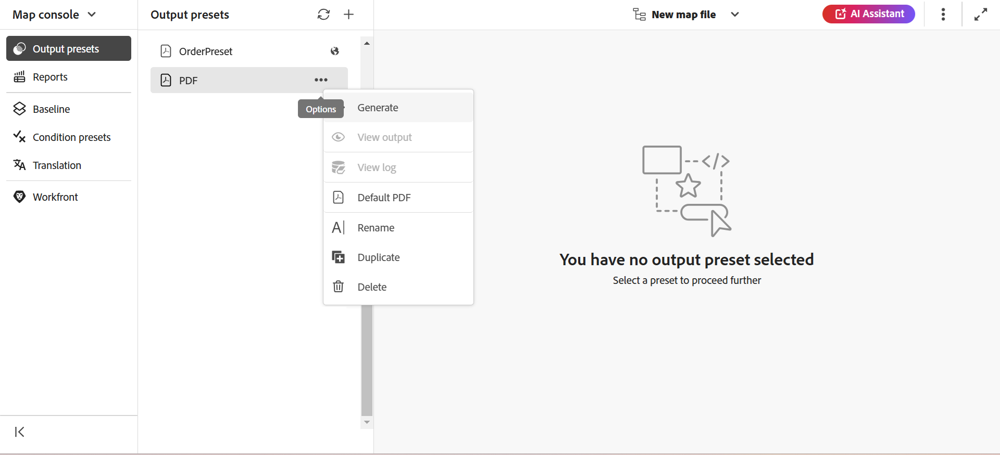

# 出力を生成

DITA マップの出力を生成する方法は 2 つあります。

- [Map コンソールから DITA マップの出力を生成する &#x200B;](#generate-output-for-a-dita-map-from-the-map-console)
- [マップダッシュボードから DITA マップの出力を生成します](#generate-output-for-a-dita-map-from-the-map-dashboard)

## Map コンソールから DITA マップの出力を生成

マップコンソールを使用して DITA マップの出力を生成するには、次の手順を実行します。

1. [&#x200B; マップコンソールでマップファイルを開きます &#x200B;](./open-files-map-console.md)。
2. 出力の生成に使用できる **出力プリセット** のリストとともに DITA マップコンソールが表示されます。

3. 出力の生成に使用するプリセットを開き、「**出力を生成**」を選択して生成プロセスを開始します。

   

   または、プリセットの上にマウスポインターを置き、プリセットのコンテキストメニューから「**生成**」を選択します。

   

出力の生成が完了したら、「**出力を表示**」を選択して出力を表示します。

画面の右下隅に **成功** ダイアログボックスが表示されます。

出力が成功しなかった場合は、次のエラーメッセージが表示されます。

エラーログを表示するには、「**解除**」を選択し、選択した「プリセット」タブにマウスポインターを置いて、プリセットコンテキストメニューから「**ログを表示**」を選択します。

## マップダッシュボードから DITA マップの出力を生成します

マップダッシュボードを使用して DITA マップの出力を生成するには、次の手順を実行します。

1. Assets UI で、公開する DITA マップファイルに移動して選択します。

   出力の生成に使用できる出力プリセットのリストが表示された DITA マップコンソールが表示されます。

1. 出力の生成に使用する 1 つまたは複数の出力プリセットを選択します。

   {align="left"}

1. 「**生成**」アイコンを選択して、出力生成プロセスを開始します。

出力生成リクエストの現在のステータスは、「**出力**」タブに表示されます。 詳しくは、[&#x200B; 出力生成タスクのステータスを表示 &#x200B;](./generate-output-manage-process.md#view-the-status-of-the-output-generation-task) を参照してください。

>[!IMPORTANT]
>
> プリセットの出力生成プロセスがキュー内または処理中の場合、同じプリセットに対して別の出力生成タスクを開始することはできません。

1 つ以上のトピックのAEM Sites出力や、DITA マップ全体をマップコンソールから生成することもできます。 詳しくは、[&#x200B; ナレッジベース出力の生成 &#x200B;](web-editor-article-publishing.md#id218CK0U019I) を参照してください。

## `chunk` 属性を使用した DITA マップ内の異なるトピックのマージ

DITA マップには、参照、概念、タスクなど、様々なトピックタイプを含めることができます。 `chunk=to-content` 属性を使用すると、これらのトピックを結合して、1 つのページ出力をAEM Sitesで生成できます。 ただし、マージしたトピックを適切に公開するには、管理者が DITA プロファイルに正しい XML カタログを設定していることを確認してください。

適切な DTD ルールを正しく識別して適用するには、XML カタログ内で `composite` キーワードを持つパブリック ID が必要です。
この設定は、標準の XML カタログにデフォルトで含まれています。 ただし、カスタム XML カタログを使用している場合は、この公開 ID が設定に管理者によって追加されていることを確認してください。 これがないと、結合されたトピックが正しく公開されない場合があります。

カスタム DTD/XSD でパブリック ID とシステム ID を使用する方法については、「[DITA 特殊化の統合 &#x200B;](../cs-install-guide/dita-ot-specialization.md#integrate-dita-specialization-id211mb0e00xa)」を参照してください。

**親トピック：**&#x200B;[&#x200B; 出力生成 &#x200B;](generate-output.md)
