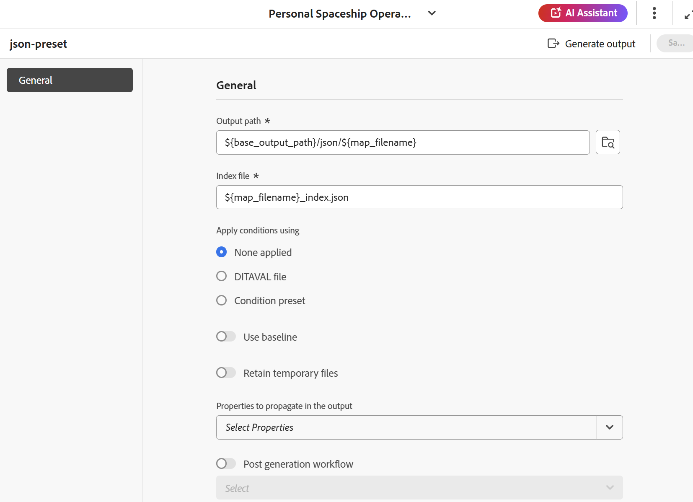

# JSON {#id231KK0180T4}

マップコンソールからJSON プリセットを作成するには、次の手順を実行します。

1. [&#x200B; マップコンソールでDITA マップファイルを開きます](./open-files-map-console.md)。

   [概要セクション &#x200B;](./intro-home-page.md#overview)の&#x200B;**最近のファイル** ウィジェットからマップファイルにアクセスすることもできます。 選択したマップファイルがマップコンソールで開きます。
1. 「**出力プリセット**」タブで、「+」アイコンを選択して出力プリセットを作成します。
1. **新規出力プリセット** ダイアログボックスの「タイプ」ドロップダウンから「**JSON**」を選択します。
1. 「**名前**」フィールドで、このプリセットに名前を付けます。
1. 「**現在のフォルダープロファイルに追加**」オプションを選択して、現在のフォルダープロファイル内に出力プリセットを作成します。 は、フォルダープロファイルレベルのプリセットを示します。

   [&#x200B; グローバルおよびフォルダープロファイル出力プリセットの管理](./web-editor-manage-output-presets.md)の詳細をご覧ください。

1. 「**追加**」を選択します。

   JSON プリセットが作成されます。

   {width="300"}

プリセットを作成したら、「一般」タブで使用できる次のプリセット設定を設定できます。

- 出力パス
- インデックスファイル
- \（条件がマップに定義されている場合\）を使用して条件を適用する
- ベースラインを使用\（マップにベースラインが作成されている場合\）
- 一時ファイルの保持
- 出力に反映するプロパティ
- 生成後のワークフロー

詳しくは、[JSON設定](#json-configuration)を参照してください。

## JSON設定

JSON プリセットでは、次のオプションを使用できます。

>[!NOTE]
>
> エディターでJSON ファイルを編集することもできます。

| JSON オプション | 説明 |
| --- | --- |
| 出力パス | JSON出力が保存されるAEM リポジトリ内のパス。 出力パスは、管理者が設定した変数`${base_output_path}`を通じて設定されます。 出力パスを設定するには、使用しているサービスに基づいて、[&#x200B; クラウドサービスの基本出力場所の設定](../native-pdf/configure-base-location-cs.md)または[&#x200B; オンプレミスサービスの基本出力場所の設定](../native-pdf/configure-base-output-location.md)を表示します。 |
| インデックスファイル | JSON出力用に作成するインデックスファイルの名前を指定できます。 デフォルトでは、DITA マップのファイル名を選択し、接尾辞（`map_filename_index.json`など）を追加します。   インデックスファイルの設定時に変数を使用することもできます。 変数の使用について詳しくは、[宛先パス、サイト名、またはファイル名のオプションを設定するための変数の使用](generate-output-use-variables.md#id18BUG70K05Z)を参照してください。 |
| を使用した条件の適用 | 次のいずれかのオプションを選択します。  * **適用なし**：公開された出力に条件を適用しない場合は、このオプションを選択します。 * **DITAVAL ファイル**：パーソナライズされたコンテンツを生成するには、DITAVAL ファイルを選択します。 参照ダイアログまたはファイルパスを入力して、複数のDITAVAL ファイルを選択できます。 ファイル名の近くにある十字アイコンを使用して削除します。 DITAVAL ファイルは指定された順序で評価されるので、最初のファイルで指定された条件は、後のファイルで指定された一致する条件よりも優先されます。 ファイルを追加または削除することで、ファイルの順序を維持できます。 DITAVAL ファイル内でフラグを適用して、コンテンツに視覚的にマークを付けることもできます。 各フラグには画像を含めることができ、太字や斜体などの書式を使用してスタイルを設定できます。 フラグ付きスタイルのカスタマイズや形式の競合の解決について詳しくは、[DITAVAL エディターの使用](../user-guide/ditaval-editor.md)を参照してください。 DITAVAL ファイルが別の場所に移動されたり、削除されたりした場合、マップダッシュボードから自動的に削除されることはありません。 ファイルが移動または削除された場合は、場所を更新する必要があります。 ファイル名にカーソルを合わせると、ファイルが保存されているAEM リポジトリ内のパスを表示できます。 DITAVAL ファイルのみを選択でき、他のファイルタイプを選択した場合はエラーが表示されます。 * **条件プリセット**：出力の公開中に条件を適用するには、ドロップダウンから条件プリセットを選択します。 このオプションは、DITA マップコンソールの「条件プリセット」タブに条件を追加した場合に表示されます。 条件プリセットについて詳しくは、[条件プリセットの使用](generate-output-use-condition-presets.md#id1825FL004PN)を参照してください。 |
| ベースラインを使用 | 選択したDITA マップのベースラインを作成した場合は、このオプションを選択して、公開するバージョンを指定します。  詳細については、[&#x200B; ベースラインの操作](generate-output-use-baseline-for-publishing.md#id1825FI0J0PF)を参照してください。 |
| 一時ファイルの保持 | DITA-OTで生成された一時ファイルを保持するには、このオプションを選択します。 DITA-OTを使用して出力を生成する際にエラーが発生した場合は、一時ファイルを保持するためにこのオプションを選択します。 その後、これらのファイルを使用して、出力生成エラーのトラブルシューティングを行うことができます。   出力を生成したら、**一時ファイルをダウンロード**  アイコンを選択して、一時ファイルを含むZIP フォルダーをダウンロードします。 ダウンロードされたファイルには、作成者URL、ローカル URL、公開URLに関する情報を提供する`system_config.xml` ファイルも含まれます。 これらのURLは、AEMの外部化設定で設定され、`system_config.xml` ファイルに反映されます。   **メモ**: ファイルのプロパティが生成中に追加された場合、出力された一時ファイルには、それらのプロパティを含む&#x200B;*metadata.xml* ファイルも含まれます。 |
| 出力に反映するプロパティ | メタデータとして処理するプロパティを選択します。 これらのプロパティは、DITA マップまたはブックマップファイルのプロパティページから設定します。 ドロップダウンリストから選択したプロパティは、「プロパティ」フィールドの下に表示されます。  **注**：カスタムプロパティを定義し、DITA-OT パブリッシングを使用してメタデータを出力に渡すこともできます。 詳細については、[&#x200B; メタデータの操作](metadata-dita.md#id21BJ00QD0XA)を参照してください。 |
| 生成後のワークフロー | このオプションを選択すると、AEMで設定されたすべてのワークフローを含む新しいポストジェネレーションワークフローのドロップダウンリストが表示されます。 出力生成ワークフローの完了後に実行するワークフローを選択する必要があります。  **注**: カスタム出力後の生成ワークフローの作成について詳しくは、「Adobe Experience Manager Guides as a Cloud Serviceのインストールと設定」ガイドの「_出力後の生成ワークフローをカスタマイズ_」を参照してください。 |

**親トピック：**&#x200B;[&#x200B;出力プリセットについて](generate-output-understand-presets.md)
