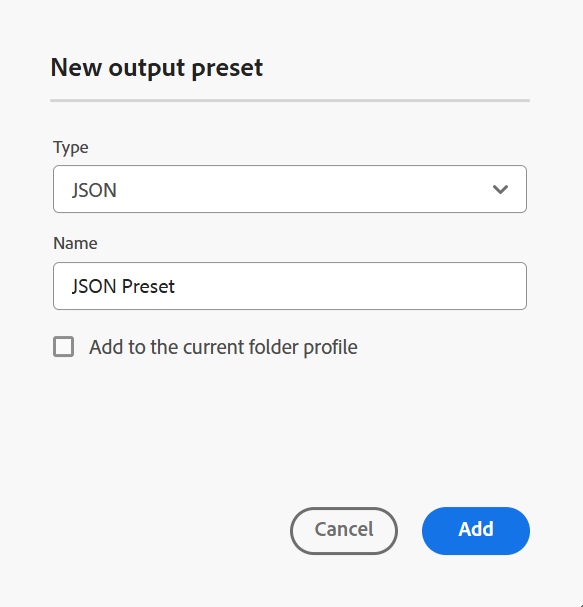

# JSON {#id231KK0180T4}

次の手順を実行して、Map コンソールから JSON プリセットを作成します。

1. [Map コンソールで DITA マップファイルを開きます ](./open-files-map-console.md)。

   また、「概要」セクションの **最近のファイル** ウィジェットからマップファイルにアクセスす [ こともでき ](./intro-home-page.md#overview) す。 選択したマップ ファイルは、マップ コンソールで開きます。
1. 「**出力プリセット**」タブで、「+」アイコンを選択して出力プリセットを作成します。
1. **新規出力プリセット** ダイアログボックスの「タイプ」ドロップダウンから **JSON** を選択します。
1. 「**名前**」フィールドに、このプリセットの名前を入力します。
1. 「**現在のフォルダープロファイルに追加**」オプションを選択して、現在のフォルダープロファイル内に出力プリセットを作成します。  は、フォルダープロファイルレベルのプリセットを示します。

   詳しくは、[ グローバルプロファイルおよびフォルダープロファイル出力プリセットの管理 ](./web-editor-manage-output-presets.md) を参照してください。

1. 「**追加**」を選択します。

   JSON プリセットが作成されます。

   {width="300" align="left"}

プリセットを作成したら、次のプリセット設定を指定できます。これらのプリセット設定は、「一般」タブで使用できます。

- 出力パス
- インデックスファイル
- \（条件がマップに対して定義されている場合\）を使用して条件を適用します。
- ベースラインの使用\（マップのベースラインが作成された場合\）
- 一時ファイルを保持
- 出力に反映するプロパティ
- 生成後のワークフロー

詳しくは、[JSON 設定 ](#json-configuration) を参照してください。

{width="800" align="left"}

## JSON 設定

JSON プリセットには次のオプションを使用できます。

>[!NOTE]
>
> また、エディターで JSON ファイルを編集することもできます。

| JSON オプション | 説明 |
| --- | --- |
| 出力パス | JSON 出力が保存されるAEM リポジトリ内のパス。 |
| インデックスファイル | JSON 出力用に作成するインデックスファイルの名前を指定できます。 デフォルトでは、DITA マップのファイル名が選択され、サフィックス （`map_filename_index.json` など）が追加されます。   インデックスファイルの設定時に変数を使用することもできます。 変数の使用の詳細については、[ 宛先パス、サイト名、ファイル名のオプションを設定するための変数を使用 ](generate-output-use-variables.md#id18BUG70K05Z) を参照してください。 |
| 次を使用して条件を適用 | 次のいずれかのオプションを選択します。  * **適用なし**：公開済みの出力に条件を適用しない場合は、このオプションを選択します。 * **DITAVAL ファイル**: パーソナライズされたコンテンツを生成するには、DITAVAL ファイルを選択します。 参照ダイアログを使用するか、ファイルパスを入力して、複数の DITAVAL ファイルを選択できます。 削除するには、ファイル名の近くにある十字のアイコンを使用します。 DITAVAL ファイルは指定された順序で評価されるため、最初のファイルで指定された条件は、後のファイルで指定された一致条件よりも優先されます。 ファイルを追加または削除することで、ファイルの順序を維持できます。 DITAVAL ファイルが他の場所に移動されたり、削除されても、マップ ダッシュボードから自動的には削除されません。 ファイルが移動または削除された場合は、場所を更新する必要があります。 ファイル名の上にマウスポインターを置くと、AEM リポジトリー内でファイルが格納されているパスが表示されます。 DITAVAL ファイルのみを選択できます。他のファイル タイプを選択した場合は、エラーが表示されます。 * **条件プリセット**：出力の公開中に条件を適用する条件プリセットをドロップダウンから選択します。 このオプションは、DITA マップコンソールの「条件プリセット」タブに存在する条件を追加した場合に表示されます。 条件プリセットについて詳しくは、「[ 条件プリセットの使用 ](generate-output-use-condition-presets.md#id1825FL004PN)」を参照してください。 |
| ベースラインの使用 | 選択した DITA マップにベースラインを作成した場合、このオプションを選択して、公開するバージョンを指定します。   詳細については、「[ ベースラインの使用 ](generate-output-use-baseline-for-publishing.md#id1825FI0J0PF) を参照してください。 |
| 一時ファイルを保持 | このオプションを選択すると、DITA-OT によって生成された一時ファイルが保持されます。 DITA-OT 経由で出力を生成するときにエラーが発生した場合は、このオプションを選択して一時ファイルを保持します。 その後、これらのファイルを使用して、出力生成エラーのトラブルシューティングを行うことができます。    出力を生成したら、「**一時ファイルをダウンロード** アイコンを選択して、一時ファイルを含む ZIP フォルダーをダウンロードします。   **メモ**：生成中にファイルプロパティが追加された場合、出力一時ファイルには、それらのプロパティを含む *metadata.xml* ファイルも含まれます。 |
| 出力に反映するプロパティ | メタデータとして処理するプロパティを選択します。 これらのプロパティは、DITA マップまたはブックマップファイルの「プロパティ」 ページから設定されます。 ドロップダウンリストから選択したプロパティが、「プロパティ」フィールドの下に表示されます。  **注意**: DITA-OT パブリッシングを使用して、カスタムプロパティを定義し、メタデータを出力に渡すこともできます。 詳細ビューについては、[ メタデータの操作 ](metadata-dita.md#id21BJ00QD0XA) を参照してください。 |
| 生成後のワークフロー | このオプションを選択すると、新しいポスト生成ワークフローのドロップダウンリストが表示され、AEMで設定されたすべてのワークフローが表示されます。 出力生成ワークフローの完了後に実行するワークフローを選択する必要があります。  **メモ**：カスタムの出力後生成ワークフローの作成について詳しくは、『Adobe Experience Manager Guides as a Cloud Serviceのインストールと設定 _ガイドの_ 出力後生成ワークフローのカスタマイズ」を参照してください。 |

**親トピック：**[ 出力プリセットについて ](generate-output-understand-presets.md)
