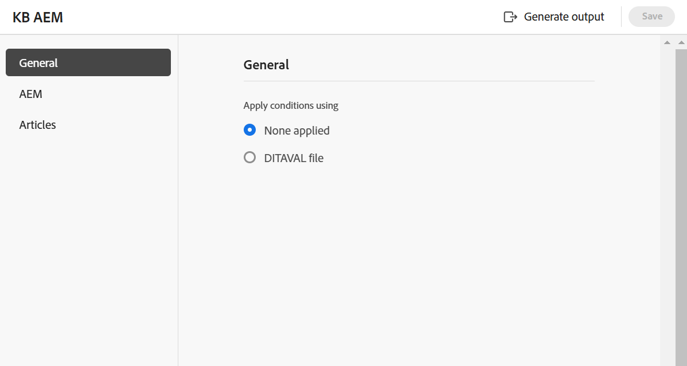

# ナレッジベース {#knowledge-base}

次の手順を実行して、マップコンソールから&#x200B;**ナレッジベース** プリセットを作成します。

1. [&#x200B; マップコンソールでDITA マップファイルを開きます](./open-files-map-console.md)。

   [概要セクション &#x200B;](./intro-home-page.md#overview)の&#x200B;**最近のファイル** ウィジェットからマップファイルにアクセスすることもできます。 選択したマップファイルがマップコンソールで開きます。
1. 「**出力プリセット**」タブで、「+」アイコンを選択して出力プリセットを作成します。
1. **新規出力プリセット** ダイアログボックスの「タイプ」ドロップダウンから「**ナレッジベース**」を選択します。
1. **Target** フィールドで、生成された出力のターゲットを選択します。 使用可能なオプションは、**Adobe Experience Manager**、**Salesforce**、**ServiceNow**&#x200B;です。

   {width="350"}

1. 「**現在のフォルダープロファイルに追加**」オプションを選択して、現在のフォルダープロファイル内に出力プリセットを作成します。 は、フォルダープロファイルレベルのプリセットを示します。

   [&#x200B; グローバルおよびフォルダープロファイル出力プリセットの管理](./web-editor-manage-output-presets.md)の詳細をご覧ください。

1. 「**追加**」を選択します。

   ナレッジベース用のプリセットが作成されます。

## ナレッジベース設定{#knowledge-base-configuration}

ナレッジベースのプリセット設定オプションは、**一般**、**記事**、および選択したターゲット （**AEM**/**ServiceNow**/**Salesforce**）タブの下に整理されます。

{width="550"}

### 一般

次の設定オプションは、**一般** タブで使用できます。

| ナレッジベースオプション | 説明 |
| --- | --- |
| を使用した条件の適用 | 次のいずれかのオプションを選択します。  * **適用なし**：公開された出力に条件を適用しない場合は、このオプションを選択します。 * **DITAVAL ファイル**：パーソナライズされたコンテンツを生成するには、DITAVAL ファイルを選択します。 参照ダイアログを使用するか、ファイルパスを入力することで、複数のDITAVAL ファイルを選択できます。 ファイル名の近くにある十字アイコンを使用して削除します。 DITAVAL ファイルは指定された順序で評価されるので、最初のファイルで指定された条件は、後のファイルで指定された一致する条件よりも優先されます。 ファイルを追加または削除することで、ファイルの順序を維持できます。 DITAVAL ファイルを別の場所に移動したり削除したりしても、プリセットから自動的に削除されることはありません。 ファイルが移動または削除された場合は、場所を更新する必要があります。 ファイル名にカーソルを合わせると、ファイルが保存されているAdobe Experience Manager リポジトリ内のパスを表示できます。 DITAVAL ファイルのみを選択できます。他の種類のファイルを選択すると、エラーが表示されます。   **メモ**: **Salesforce パブリッシング**&#x200B;にDITAVAL フィルタリングを使用する場合は、次の点を考慮してください。  - DITAVAL プロパティごとに`Include`および`Exclude`個のアクションのみがサポートされます。   – 出力でコンディショナルコンテンツを視覚的にマークまたは強調表示するフラグはサポートされていません。   – 出力プリセットでは、1つのDITAVAL ファイルのみを選択して公開できます。複数のDITAVAL ファイルの選択は、Salesforceの公開ではサポートされていません。 コンテンツ内の ～`ditavalref`参照はサポートされていません。   **条件プリセット**：出力の公開中に条件を適用する条件プリセットをドロップダウンから選択します。 このオプションは、DITA マップコンソールの「条件プリセット」タブに条件を追加した場合に表示されます。 条件プリセットについて詳しくは、[条件プリセットの使用](generate-output-use-condition-presets.md#id1825FL004PN)を参照してください。 |
| ベースラインを使用 | 選択したDITA マップのベースラインを作成した場合は、このオプションを選択して、公開するバージョンを指定します。  詳細については、[&#x200B; ベースラインの操作](generate-output-use-baseline-for-publishing.md#id1825FI0J0PF)を参照してください。 |
| 生成後のワークフロー | このオプションを選択すると、Adobe Experience Managerで設定されたすべてのワークフローを含む新しいポストジェネレーションワークフローのドロップダウンリストが表示されます。 出力生成が完了したら、実行するワークフローを選択する必要があります。  **注**：出力後の生成ワークフローを[&#x200B; カスタマイズする方法について詳しくは、Cloud Servicesのインストールおよび設定ガイドを参照してください。](../cs-install-guide/customize-workflows.md#id17A6GI004Y4) |

### 記事

このタブには、マップのツリーまたは階層ビューが表示されます。 ナレッジベースに公開するトピックを選択します。 目次ノードを展開し、公開するトピックを選択します。

### Target - Adobe Experience Manager/ServiceNow/Salesforce

設定オプションは、選択したターゲットに応じて変更されます。

**Adobe Experience Manager**

**Adobe Experience Manager**&#x200B;の次の設定オプションがターゲットとして表示されます。

>[!NOTE]
>
>Adobe Experience Manager ナレッジベースのプリセットは、管理者が設定している場合にのみ使用できます。

| Adobe Experience Managerオプション | 説明 |
| --- | --- |
| 記事のパスを使用 | このオプションを選択すると、ナレッジベーステンプレートを含むフォルダーの&#x200B;**記事パス**&#x200B;が表示されます。 |
| 記事のパス | このフィールドは、「**記事パスを使用**」オプションを選択した場合に表示されます。 参照して、出力が保存されているAdobe Experience Manager リポジトリ内のナレッジベースサイトを選択します。 |
| サイト | このフィールドを使用して、必要なAdobe Experience Manager ナレッジベースを選択します。 Adobe Experience Manager サイトで、権限に基づいてコンテンツを保存するようにナレッジベースを設定できます。 このDITA マップの記事は、これらのナレッジベースに公開できます。 |
| カテゴリ | ドロップダウンからカテゴリを選択して、Adobe Experience Manager サイトでそのカテゴリの目次のトピックを公開します。 |
| セクションテンプレートと記事テンプレート | アウトプットのコンテンツを整理するために使用される構造的コンポーネントです。 これらは、Adobe Experience Manager サイトテンプレートで事前定義されています。 |
| 生成後のワークフロー | このオプションを選択すると、Adobe Experience Managerで設定されたすべてのワークフローを含む新しいポストジェネレーションワークフローのドロップダウンリストが表示されます。 出力生成ワークフローの完了後に実行するワークフローを選択する必要があります。 出力後の生成ワークフローを[&#x200B; カスタマイズする方法について詳しくは、『インストールおよび設定ガイド』の「](../install-guide/customize-workflows.md#id17A6GI004Y4)」セクションを参照してください。 |

>[!TIP]
> 
>**更新** アイコンを選択して、選択したナレッジベーステンプレートに従って、フィールド内の各テンプレートを入力します。

**ServiceNow**

ターゲットとして&#x200B;**ServiceNow**&#x200B;に対して、次の設定オプションが表示されます。

| ServiceNow オプション | 説明 |
| --- | --- |
| パブリッシュプロファイル | ドロップダウンを使用して、管理者が設定したServiceNow接続プロファイルから選択します。 管理者が公開プロファイルを作成する方法について詳しくは、[左パネル &#x200B;](./web-editor-features.md#id2051EA0M0HS) セクションの&#x200B;**Workspace settings** （**オンプレミス**&#x200B;の&#x200B;**Settings**&#x200B;として表示）機能の説明を参照してください。 |
| ナレッジベース | このフィールドを使用して、必要なServiceNow ナレッジベースを選択します。 権限に基づいてコンテンツを保存するように、ServiceNow サイトでナレッジベースを設定できます。 このDITA マップの記事は、これらのナレッジベースに公開できます。 |
| カテゴリとサブカテゴリ | カテゴリは、ServiceNow ナレッジベース記事を検索および分類するために使用される階層木のようなものです。 カテゴリとサブカテゴリを追加して、目次のトピックとサブトピックをServiceNow サイトのそのカテゴリとサブカテゴリに公開します。 |

**Salesforce**

**Salesforce**&#x200B;の次の設定オプションがターゲットとして表示されます。

| Salesforceオプション | 説明 |
| --- | --- |
| パブリッシュプロファイル | ドロップダウンを使用して、管理者が設定したSalesforce接続プロファイルから選択します。 管理者が公開プロファイルを作成する方法について詳しくは、[&#x200B; タブバー](./web-editor-tab-bar.md)の&#x200B;**Workspace settings** （**オンプレミス**&#x200B;の&#x200B;**Settings**&#x200B;と表示）機能の説明を参照してください。 |
| レコードタイプ | ドロップダウンを使用して、ユーザープロファイルに基づく表示設定に従って、Salesforceで設定されたレコードタイプの中から選択します。 Salesforce レコードタイプは、そのオブジェクトに対して1つのタイプの多くのレコードをグループ化する方法です。 スタイルシステムは、公開の組織化方法を定義します。 例えば、FAQ レコードタイプを選択し、FAQ ページレイアウトとフィールドに従って公開できます。 |
| 記事コンテンツフィールド | レコードタイプテンプレートごとに、異なるフィールドと一意のレイアウトを設定できます。 これらのフィールドを使用して、記事の種類に応じて特定の情報を入力します。 例えば、FAQ記事のタイトル、回答、数式を表示できます。 |
| カテゴリ | ドロップダウンからカテゴリを選択して、Salesforce サイトでそのカテゴリの目次のトピックを公開します。 |

**その他のオプション**

SalesforceおよびServiceNow プリセットでは、次のオプションも表示できます。

| オプション | 説明 |
| --- | --- |
| 記事の本文からトピック見出しを削除します。 | 公開出力の記事からトピック見出しを削除するには、このオプションを選択します。 |
| ドラフトとしてアップロード | ユーザーがトピックを利用できるようにする前に、トピックをドラフトとして共有する場合は、このオプションを選択します。 |
| 画像をアップロード | トピック内の画像をパブリッシュされた出力に含める場合は、このオプションを選択します。 |
| リンクされたドキュメントのアップロード | このオプションを選択すると、トピック内でリンクされているドキュメントが公開された出力に含まれます。 |

**親トピック：** [出力プリセットについて](generate-output-understand-presets.md)
