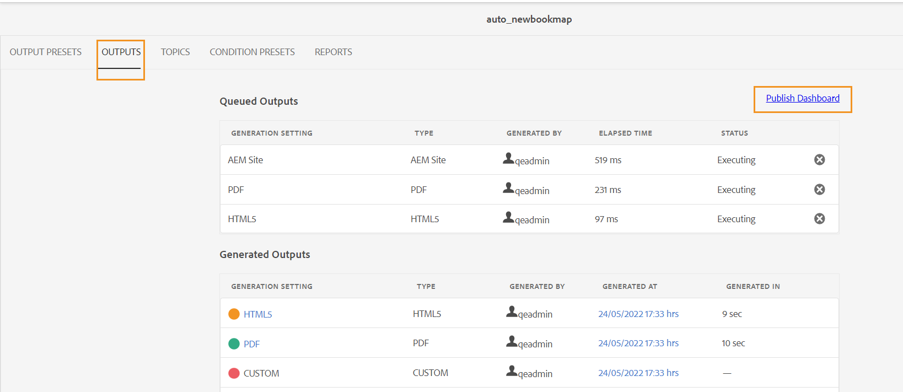
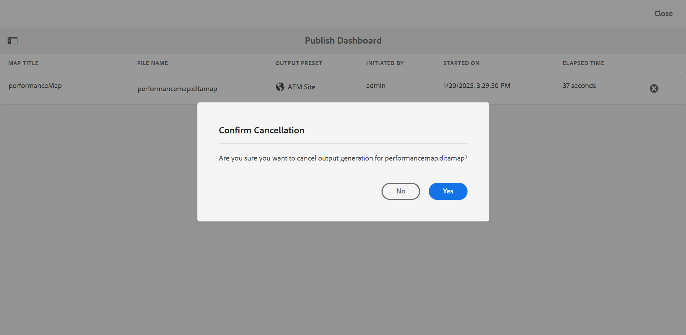
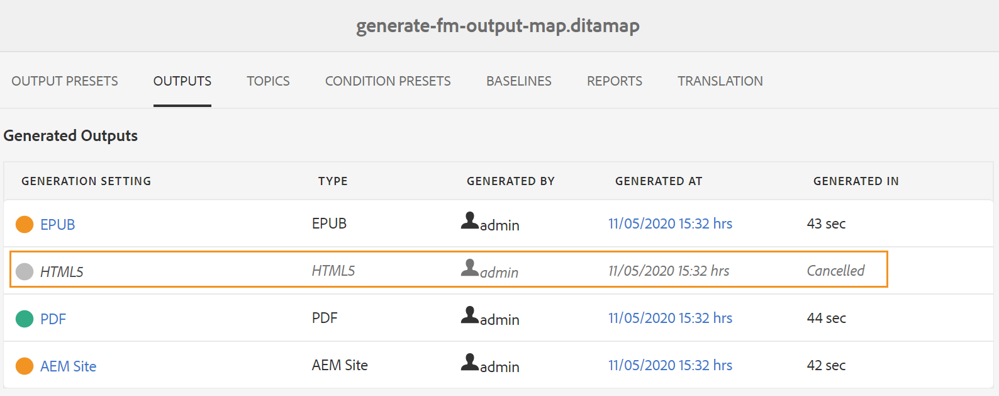

# 出力生成プロセスの管理

Adobe Experience Manager Guidesでは、生成された出力に対して次の操作を実行できます。

- [出力生成タスクのステータスを表示](#view-the-status-of-the-output-generation-task)
- [出力生成タスクのキャンセル](#cancel-an-output-generation-task)
- [出力タスクの削除](#delete-an-output-task)

## 出力生成タスクのステータスの表示

マップの出力生成タスクを開始するか、選択したトピックを再生成すると、Experience Manager Guidesはこのタスクを出力生成キューに送信します。 このキューはリアルタイムで更新され、キュー内の各出力生成タスクのステータスが表示されます。

1. Assets UIで、出力生成ステータスを確認するマップファイルに移動して開きます。

1. **出力**&#x200B;を選択します。

   

   出力ページは、次の2つの部分に分かれています。

   - **キューに入れた出力：**

     生成待ち、または生成処理中の出力を一覧表示します。 キュー内または処理中のタスクは、プリセット名の前に青いカラーアイコンで表示されます。 また、キューに入れられたタスクに使用される出力生成設定またはプリセット、タイプ、タスクを開始したユーザー、タスクがキューに入れてからの時間、および現在のステータスを確認することもできます。

     リンクを選択して&#x200B;**公開ダッシュボード**&#x200B;にアクセスし、現在の実行中のステータスを表示します。 アクティブなすべての公開タスクのリストは、公開ダッシュボードで使用できます。 **キュー出力**&#x200B;と&#x200B;**公開ダッシュボード** リンクは、生成待ちまたは生成処理中の出力がある場合にのみ表示されます。 出力タスクが完了した場合は表示されません。公開ダッシュボードについて詳しくは、[公開ダッシュボードを使用して公開タスクを管理](generate-output-publish-dashboard.md#)を参照してください。

   - **生成された出力**

     完了した出力タスクが一覧表示されます。 ここでも、ここに示す情報は、キュー出力セクションと似ていますが、いくつかの違いがあります。 出力結果アイコンと出力生成時間の形式で新しい情報セットが用意されています。

     このリストには、正常に実行されたタスク、メッセージで実行されたタスク、失敗したタスクがある場合があります。 成功したタスクは緑色のアイコンで表示され、メッセージを含むタスクにはオレンジ色のアイコンが表示され、失敗したタスクには赤色のアイコンが表示されます。

     すべてのタスクに対して、公開プロセスによってログファイル \（logs.txt\）が作成されます。このログファイルには、「生成時」列のリンクを選択してアクセスできます。 失敗したタスクやメッセージがあるタスクについては、ログファイルを確認できます。ログファイルについては、[表示とログファイルの確認](generate-output-basic-troubleshooting.md#id1822G0P0CHS)で説明しています。

     >[!NOTE]
     >
     > 生成されたPDF出力のリンクを選択すると、PDFのダウンロードを求められます。

## 出力生成タスクのキャンセル

Experience Manager Guidesを使用すると、パブリッシャーは進行中の公開タスクをキャンセルするシンプルで簡単な方法を入手できます。 パブリッシャーは、DITA マップコンソールまたは[公開ダッシュボード &#x200B;](generate-output-publish-dashboard.md#)から進行中の公開タスクをキャンセルできます。

DITA マップコンソールから出力生成タスクをキャンセルするには、次の手順を実行します。

1. Assets UIで、進行中の出力生成タスクをキャンセルするマップファイルに移動して開きます。

1. **出力**&#x200B;を選択します。

1. **キュー出力** リストで、キャンセルするタスクにポインターを合わせます。

1. 「**このジョブをキャンセル**」アイコンを選択します。

   

1. **解約を確認** メッセージ プロンプトで「**はい**」を選択します。

   

   タスクがまだ開始されていない場合は、そのタスクに対してキャンセル コマンドが実行されます。 キャンセル中のタスクの場合、ステータスはキャンセルに設定されます。

   タスクが正常にキャンセルされると、タスクは&#x200B;**キャンセル済み**&#x200B;のステータスで&#x200B;**生成出力** リストに移動されます。 キャンセルされたタスクにカーソルを合わせると、タスクをキャンセルしたユーザーの名前が表示されます。 次のスクリーンショットでは、*HTML5* タスクがキャンセルされています。

   

## 出力タスクの削除

DITA マップに対して複数の出力を生成すると、そのマップの「生成出力」リストが非常に長くなります。 発行者は、*生成出力* リストから古いタスクを削除することで、任意のマップファイルの出力履歴をクリーニングできます。 出力はシステムから削除されませんが、生成された出力のエントリのみが&#x200B;*生成出力* リストから削除されます。

次の手順を実行して、生成された出力リストから出力タスクを削除します。

1. Assets UIで、タスクを削除するマップファイルに移動して開きます。

1. **出力**&#x200B;を選択します。

1. **生成出力** リストで、削除するタスクにポインターを合わせます。

1. 削除アイコンを選択します。

   

1. 「**削除を確認**」メッセージプロンプトで「**はい**」を選択します。

   タスクは、生成出力リストから削除されます。
