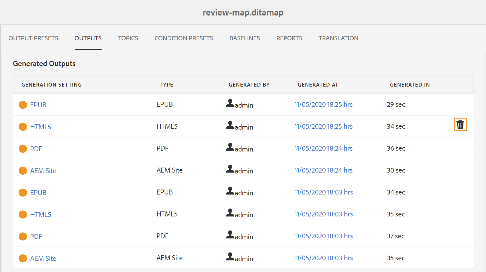

# 出力生成プロセスの管理

Adobe Experience Manager Guidesでは、生成された出力に対して次のアクションを実行できます。

- [&#x200B; 出力生成タスクのステータスの表示 &#x200B;](#view-the-status-of-the-output-generation-task)
- [出力生成タスクをキャンセル](#cancel-an-output-generation-task)
- [出力タスクの削除](#delete-an-output-task)

## 出力生成タスクのステータスの表示

マップの出力生成タスクを開始するか、選択したトピックを再生成すると、Experience Manager Guidesはこのタスクを出力生成キューに送信します。 このキューはリアルタイムで更新され、キュー内の各出力生成タスクのステータスを示します。

1. Assets UI で、出力の生成ステータスを確認するマップファイルを探して開きます。

1. **出力** を選択します。

   {align="left"}

   出力ページは、次の 2 つの部分に分かれています。

   - **キュー内の出力：**

     生成待ちまたは生成処理中の出力が一覧表示されます。 キューに入れられたタスクまたは処理中のタスクは、プリセット名の前に青色のアイコンで表示されます。 また、キューに登録されたタスクに使用する出力生成設定やプリセット、タイプ、タスクを開始したユーザー、タスクがキューに登録されてからの経過時間、現在のステータスも確認できます。

     リンクを選択して **公開ダッシュボード** にアクセスし、現在の実行中のステータスを表示します。 すべてのアクティブな公開タスクのリストが、公開ダッシュボードに表示されます。 **キュー内の出力** と **パブリッシュダッシュボード** リンクは、生成を待機している出力があるか、生成プロセス中の出力がある場合にのみ表示されます。 出力タスクが完了すると、これらは表示されません。公開ダッシュボードについて詳しくは、[&#x200B; 公開ダッシュボードを使用した公開タスクの管理 &#x200B;](generate-output-publish-dashboard.md#) を参照してください。

   - **生成された出力**

     完了済みの出力タスクを一覧表示します。 繰り返しますが、ここに示す情報は、いくつかの違いがあり、キュー内の出力セクションに似ています。 出力結果アイコンと出力生成時間の形式で新しい情報のセットがあります。

     このリストには、正常に実行したタスク、メッセージを使用して実行したタスク、失敗したタスクが表示されます。 成功したタスクには緑色のアイコンで表示され、メッセージを含むタスクにはオレンジ色のアイコンで表示され、失敗したタスクには赤色のアイコンで表示されます。

     すべてのタスクについて、公開プロセスによってログファイル\（logs.txt\）が作成されます。このファイルにアクセスするには、「生成場所」列のリンクを選択します。 失敗したタスクやメッセージが表示されたタスクの場合は、ログファイルを確認できます。詳しくは、[&#x200B; ログファイルの表示と確認 &#x200B;](generate-output-basic-troubleshooting.md#id1822G0P0CHS) の節で説明されています。

     >[!NOTE]
     >
     > 生成されたPDF出力のリンクを選択すると、PDFをダウンロードするよう求められます。

## 出力生成タスクをキャンセル

Experience Manager Guidesを使用すると、パブリッシャーは、進行中の公開タスクを簡単にキャンセルできます。 パブリッシャーは、進行中のパブリッシングタスクを DITA マップコンソールまたは [&#x200B; パブリッシュダッシュボード &#x200B;](generate-output-publish-dashboard.md#) からキャンセルできます。

次の手順を実行して、DITA マップコンソールから出力生成タスクをキャンセルします。

1. Assets UI で、進行中の出力生成タスクをキャンセルするマップファイルを探して開きます。

1. **出力** を選択します。

1. **待機中の出力** リストで、キャンセルするタスクにポインターを置きます。

1. **このジョブをキャンセル** アイコンを選択します。

   {align="left"}

1. **キャンセルを確認** メッセージプロンプトで **はい** を選択します。

   {align="left"}

   タスクがまだ開始されていない場合は、キャンセルコマンドがタスクに対して実行されます。 キャンセル中のタスクの場合、ステータスはキャンセルに設定されます。

   タスクが正常にキャンセルされると、そのタスクは「キャンセル **ステータスで** 生成された出力 **リストに移動** れます。 キャンセルされたタスクにポインタを合わせると、タスクをキャンセルしたユーザーの名前が表示されます。 次のスクリーンショットでは、*HTML5* タスクがキャンセルされています。

   {align="left"}

## 出力タスクの削除

DITA マップに対して複数の出力を生成すると、時間の経過とともに、このようなマップの「生成された出力」リストが非常に長くなります。 パブリッシャーは、古いタスクを *生成された出力* リストから削除することで、任意のマップ ファイルの出力履歴を消去できます。 出力はシステムから削除されず、生成された出力のエントリのみが *生成された出力* リストから削除されます。

生成された出力リストから出力タスクを削除するには、次の手順を実行します。

1. Assets UI で、タスクを削除するマップファイルに移動して開きます。

1. **出力** を選択します。

1. **生成された出力** リストで、削除するタスクの上にポインターを置きます。

1. 削除アイコンを選択します。

   {align="left"}

1. **削除を確認** メッセージプロンプトで **はい** を選択します。

   生成された出力リストからタスクが削除されます。
