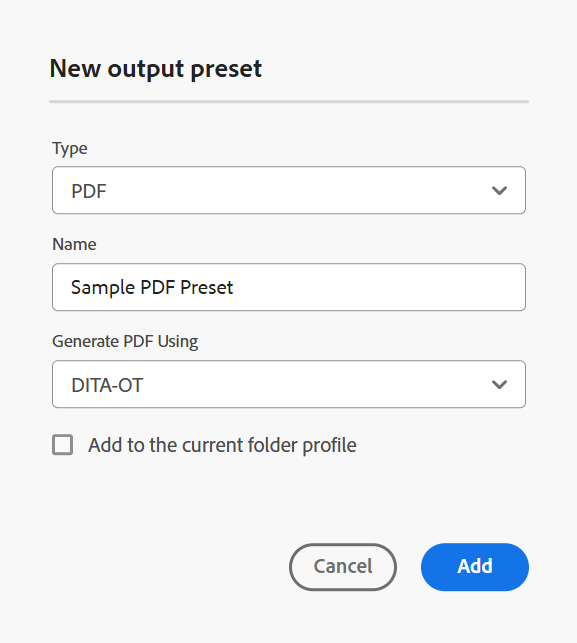
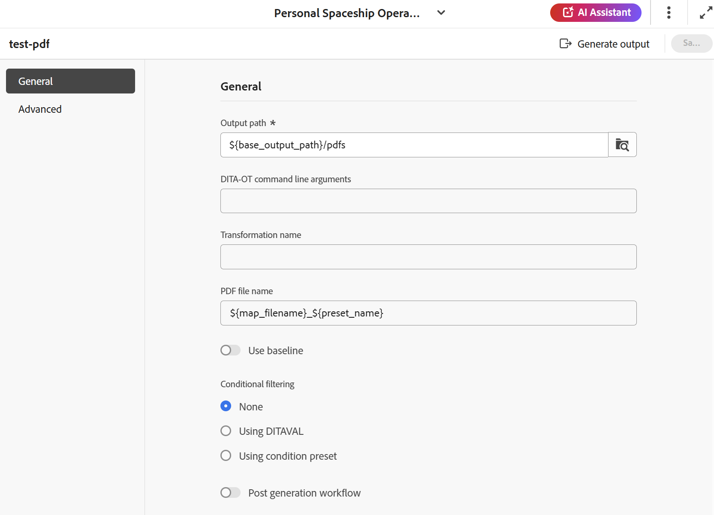

# DITA-OT PDF出力プリセットの作成 {#id205BE600HAH}

DITA-OT PDF出力プリセットは、次の2つの方法で作成できます。

- [マップコンソールからDITA-OT PDF プリセットを作成します](#create-the-dita-ot-pdf-preset-from-the-map-console)
- [マップダッシュボードからDITA-OT PDF プリセットを作成する](#create-the-dita-ot-pdf-preset-from-the-map-dashboard)

## マップコンソールからDITA-OT PDF プリセットを作成します

マップコンソールからPDF プリセットを作成するには、次の手順を実行します。

1. [ マップコンソールでDITA マップファイルを開きます](./open-files-map-console.md)。

   [概要セクション ](./intro-home-page.md#overview)の&#x200B;**最近のファイル** ウィジェットからマップファイルにアクセスすることもできます。 選択したマップファイルがマップコンソールで開きます。
1. 「**出力プリセット**」タブで、「+」アイコンを選択して出力プリセットを作成します。
1. **新規出力プリセット** ダイアログボックスの「タイプ」ドロップダウンから「**PDF**」を選択します。
1. 「**名前**」フィールドで、このプリセットに名前を付けます。
1. **Generate PDF Using** フィールドで、**DITA-OT**&#x200B;を選択します。
1. 「**現在のフォルダープロファイルに追加**」オプションを選択して、現在のフォルダープロファイル内に出力プリセットを作成します。 は、フォルダープロファイルレベルのプリセットを示します。

   [ グローバルおよびフォルダープロファイル出力プリセットの管理](./web-editor-manage-output-presets.md)の詳細をご覧ください。

1. 「**追加**」を選択します。

   PDFのプリセットが作成されます。

   {width="350"}

マップコンソールでは、DITA-OTのプリセット設定オプションが、マップコンソールの&#x200B;**一般** タブと&#x200B;**詳細** タブの下に整理されています。

{width="350"}

**一般**

「**一般**」タブには、次の設定オプションが含まれています。

- 出力パス
- DITA-OT コマンドライン引数
- PDF ファイル名
- 条件フィルタリング \（条件がマップに定義されている場合\）
- ベースラインを使用\（マップにベースラインが作成されている場合\）
- 生成後のワークフロー

**詳細**

「**詳細**」タブには、次の設定オプションが含まれています。

- バージョン管理を有効にする
- 一時ファイルの保持
- ファイルのプロパティ

プリセット設定オプションについて詳しくは、[PDF プリセット設定](#pdf-preset-configuration)の節を参照してください。

## マップダッシュボードからDITA-OT PDF プリセットを作成する

マップダッシュボードからPDF プリセットを作成するには、次の手順を実行します。

1. Assets UIで、に移動してDITA マップを選択し、マップダッシュボードで開きます。
1. 「**出力プリセット**」タブが選択されていることを確認します。
1. ツールバーで「**作成**」を選択します。

   新しい出力プリセット作成フォームが表示されます。

1. PDF プリセットに必要な設定の詳細を入力します。
1. 「**完了**」を選択して、プリセット設定を保存します。

## PDF プリセット設定

設定オプションは、マップコンソールまたはマップダッシュボードからプリセットを設定するかどうかに応じて少し異なります。 一部のオプションはマップダッシュボードにのみ適用され、他のオプションは両方に適用されます。

同じ設定に2つの異なるフィールドラベルがある場合は、**/**&#x200B;によって次の表で区切られます。 最初はマップコンソールのラベルを表し、2番目はマップダッシュボードのラベルを表します。

例えば、**出力パス/宛先パス** – ここでは、**出力パス**&#x200B;はマップコンソールで使用されるラベルであり、**宛先パス**&#x200B;は同じ設定のマップダッシュボードで使用されるラベルです。

| PDFオプション | 説明 |
| --- | --- |
| 出力タイプ （*マップダッシュボードにのみ適用*） | 生成する出力のタイプ。 PDF出力を生成するには、「PDF」オプションを選択します。 |
| 設定名（*マップダッシュボードにのみ適用*） | 作成するPDF出力設定にわかりやすい名前を付けます。 例えば、_社内ユーザー出力_&#x200B;または&#x200B;_エンドユーザー出力_&#x200B;を指定できます。 |
| （*マップダッシュボードにのみ適用できます*）を使用してPDFを生成 | 「**DITA-OT**」を選択して、PDF出力を生成します。 管理者がこのオプションを設定している場合は、**FrameMaker Publishing Server**&#x200B;を選択します。 FMPSを選択すると、設定オプションの一部が異なります。 また、FMPS設定オプションは、マップダッシュボードでのみ使用できます。 |
| 出力パス/出力先パス | PDFが保存されているAEM リポジトリ内のパス。 出力パスは、管理者が設定した変数`${base_output_path}`を通じて設定されます。 出力パスを設定するには、使用しているサービスに基づいて、[ クラウドサービスの基本出力場所の設定](../native-pdf/configure-base-location-cs.md)または[ オンプレミスサービスの基本出力場所の設定](../native-pdf/configure-base-output-location.md)を表示します。  一部の標準変数を使用して、出力パスを定義し、[宛先パス、サイト名、またはファイル名オプションの設定に変数を使用する](generate-output-use-variables.md#id18BUG70K05Z)こともできます。 |
| DITA-OT コマンドライン引数 | 出力の生成時にDITA-OTで処理する追加の引数を指定します。 DITA-OTでサポートされているコマンドライン引数について詳しくは、[DITA-OT ドキュメント ](https://www.dita-ot.org/)を参照してください。 |
| 変換名 | 生成する出力のタイプを指定します。 これは、DITA-OT プラグインに統合された独自のカスタムプラグインを使用して出力を生成する場合に必要です。 例えば、XHTML出力を生成する場合は、`xhtml`を指定します。 DITA-OTで使用可能な変換のリストについては、『 OASIS DITA-OT ユーザーガイド』の「[DITA-OT変換（出力形式） ](http://www.dita-ot.org/2.3/user-guide/AvailableTransforms.html)」を参照してください。 |
| PDF ファイル名/ファイル名 | PDFを保存するファイル名を指定します。  PDFのファイル名を設定する際に変数を使用することもできます。 変数の使用について詳しくは、[宛先パス、サイト名、またはファイル名のオプションを設定するための変数の使用](generate-output-use-variables.md#id18BUG70K05Z)を参照してください。  **注**: ファイル名を指定しない場合は、DITA マップのタイトルを使用して最終的なPDFのファイル名を生成します。 マップにタイトルがない場合は、DITA マップのファイル名を使用して最終的なPDFの名前を付けます。 ファイル名は、無効な文字を処理するためにシステムで設定されたルールを使用してサニタイズされます。 |
| 条件付きフィルタリング/条件を適用 | 次のいずれかのオプションを選択します。  * **適用なし**：公開された出力に条件を適用しない場合は、このオプションを選択します。 * **DITAVAL ファイル**：パーソナライズされたコンテンツを生成するには、DITAVAL ファイルを選択します。 参照ダイアログまたはファイルパスを入力して、複数のDITAVAL ファイルを選択できます。 ファイル名の近くにある十字アイコンを使用して削除します。 DITAVAL ファイルは指定された順序で評価されるので、最初のファイルで指定された条件は、後のファイルで指定された一致する条件よりも優先されます。 ファイルを追加または削除することで、ファイルの順序を維持できます。  DITAVAL ファイル内でフラグを適用して、コンテンツに視覚的にマークを付けることもできます。 各フラグには画像を含めることができ、太字や斜体などの書式を使用してスタイルを設定できます。 フラグ付きスタイルのカスタマイズや形式の競合の解決について詳しくは、[DITAVAL エディターの使用](../user-guide/ditaval-editor.md)を参照してください。 DITAVAL ファイルが別の場所に移動されたり、削除されたりした場合、マップダッシュボードから自動的に削除されることはありません。 ファイルが移動または削除された場合は、場所を更新する必要があります。 ファイル名にカーソルを合わせると、ファイルが保存されているAEM リポジトリ内のパスを表示できます。 DITAVAL ファイルのみを選択でき、他のファイルタイプを選択した場合はエラーが表示されます。 FrameMaker Publishing Serverでは、複数のDITAVAL ファイルはサポートされていません。 * **条件プリセット**：出力の公開中に条件を適用するには、ドロップダウンから条件プリセットを選択します。 このオプションは、DITA マップコンソールの「条件プリセット」タブに条件を追加した場合に表示されます。 条件プリセットについて詳しくは、[条件プリセットの使用](generate-output-use-condition-presets.md#id1825FL004PN)を参照してください。 |
| 生成後のワークフローの実行 | このオプションを選択すると、AEMで設定されたすべてのワークフローを含む新しいポストジェネレーションワークフローのドロップダウンリストが表示されます。 出力生成ワークフローの完了後に実行するワークフローを選択する必要があります。  **注**: カスタム出力後生成ワークフローの作成について詳しくは、「Adobe Experience Manager Guides as a Cloud Serviceのインストールと設定」の「出力後生成ワークフローのカスタマイズ」を参照してください。 |
| ベースラインを使用 | 選択したDITA マップのベースラインを作成した場合は、このオプションを選択して、公開するバージョンを指定します。  詳細については、[ ベースラインの操作](generate-output-use-baseline-for-publishing.md#id1825FI0J0PF)を参照してください。 |
| 一時ファイルの保持 | DITA-OTで生成された一時ファイルを保持するには、このオプションを選択します。 DITA-OTを使用して出力を生成する際にエラーが発生した場合は、一時ファイルを保持するためにこのオプションを選択します。 その後、これらのファイルを使用して、出力生成エラーのトラブルシューティングを行うことができます。   出力を生成したら、**一時ファイルをダウンロード**  アイコンを選択して、一時ファイルを含むZIP フォルダーをダウンロードします。 ダウンロードされたファイルには、作成者URL、ローカル URL、公開URLに関する情報を提供する`system_config.xml` ファイルも含まれます。 これらのURLは、AEMの外部化設定で設定され、`system_config.xml` ファイルに反映されます。   **メモ**: ファイルのプロパティが生成中に追加された場合、出力された一時ファイルには、それらのプロパティを含む&#x200B;*metadata.xml* ファイルも含まれます。 |
| ファイルのプロパティ | メタデータとして処理するプロパティを選択します。 これらのプロパティは、DITA マップまたはブックマップファイルのプロパティページから設定します。 ドロップダウンリストから選択したプロパティは、**ファイルプロパティ** フィールドの下に表示されます。 プロパティの横にある十字アイコンを選択して削除します。    メモ：DITA-OT パブリッシングを使用して、メタデータを出力に渡すこともできます。 詳細については、[DITA-OT](pass-metadata-dita-ot.md#id21BJ00QD0XA)を使用してメタデータを出力に渡します。 |

**親トピック：**[&#x200B;出力プリセットについて](generate-output-understand-presets.md)
