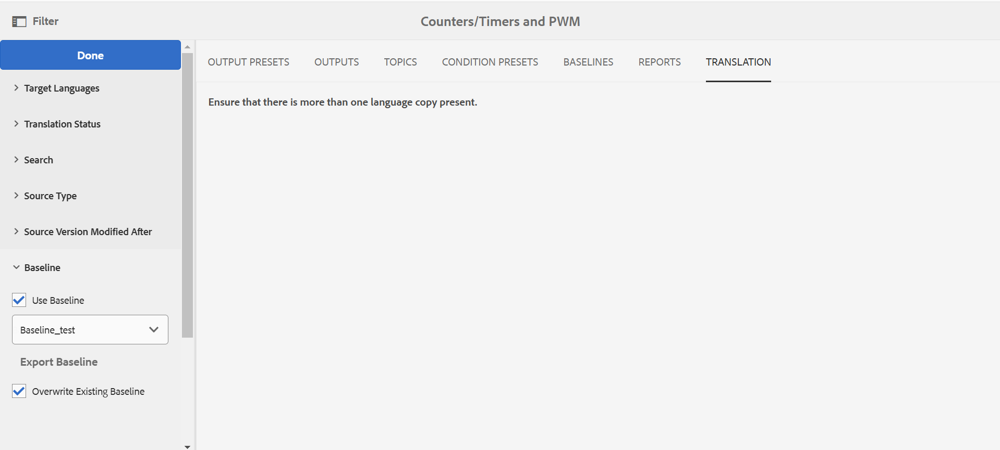

# マップダッシュボードからのベースラインの操作 {#id1825FI0J0PF}

Experience Manager Guidesでは、ベースラインを作成して、様々なバージョンのトピックを公開または翻訳するためのベースライン機能が提供されています。 また、同じ DITA マップの複数の出力プリセットを並行して公開することもできます。

>[!TIP]
>
> ベースラインの操作に関するベストプラクティスについては、ベストプラクティスガイドの *ベースライン* の節を参照してください。

管理者は、マップダッシュボードの「ベースライン」タブを設定できます。 詳細は、『インストールと設定ガイド』の *DITA マップダッシュボードの「ベースラインを設定」タブ* を参照してください。

**「ベースライン」タブ** では、次のアクションを実行できます。

- [ベースラインの作成](#create-a-baseline)
- [ベースラインのコンテンツの表示](#view-contents-of-a-baseline)
- [ベースラインの編集、複製、または削除](#edit-duplicate-or-remove-baselines)
- [ベースラインへのラベルの追加](#add-labels-to-a-baseline)

## ベースラインの作成

特定の日時に使用可能なトピックと参照コンテンツの特定のバージョン、またはトピックのバージョン用に定義されたラベルを使用して、ベースラインを作成できます。 ベースライン内で選択したトピックのバージョンを個別に指定できるので、発行または翻訳ワークフローでベースラインを適用するたびに、選択したトピックとそれに対応するバージョンを出力の生成または翻訳に含めることができます。

ベースラインを作成するには、次の手順を実行します。

1. Assets UI で DITA マップファイルを開き、**ベースライン** ページに移動します。
2. 左上の **作成** を選択します。
3. 「ベースライン」ページで、「ベースライン名 **フィールドにベースラインの名前を入力し** す。

   {width="300" align="left"}

4. **次に基づいてバージョンを設定** で、次のいずれかのオプションを選択します。

   - **ラベル**：適用されるラベルに従ってトピックを選択するには、このオプションを選択します。 入力した文字列に基づいてリストをフィルタリングするためのラベルを入力します。 フィルターで除外リストからラベルを選択して、指定したラベルを持つトピックや他のアセットを選択できます。

     「ラベル」を選択すると、指定したラベルが適用されていない最新バージョンのトピックを使用する追加のオプションも提供されます。 このオプションを選択しない場合、指定したラベルを持たないトピックまたはメディア ファイルがあると、ベースラインの作成プロセスは失敗します。 ラベルの追加の詳細については、ラベルの使用を参照してください。

   - **バージョン日**：指定された日時にトピックのバージョンを選択します。 ここで指定する時間は、Adobe Experience Manager サーバーのタイムゾーンに対応することに注意してください。 サーバーが異なるタイムゾーンにある場合、トピックは、ローカルタイムゾーンではなく、サーバーのタイムゾーンに従って取得されます。

     日付としてラベルまたはバージョンを選択すると、マップ内の参照されるトピックおよびメディア ファイルがすべて選択されます。 この選択したトピックは、ユーザーインターフェイスには表示されませんが、バックエンドで保存されます。
5. 「**保存**」を選択します。

## ベースラインのコンテンツの表示

既存のベースラインの内容を表示するには、「ベースライン」タブを選択し、リストから目的のベースラインバージョンを選択します。 ベースライン ページは、DITA マップファイル、マップのコンテンツまたはトピック、参照コンテンツの 3 つの部分に分かれています。 マップにサブマップが含まれている場合、サブマップから参照されるトピックも [ コンテンツ ] セクションに表示されます。 「ベースライン」ページの様々な列を以下に示します。

- **名前**: DITA マップまたはトピックのタイトルまたはアセットの名前（イメージのファイル名など）を一覧表示します。

- **種類**: DITA マップ、DITA トピック、画像形式など、マップ内のアセットの種類または種類を一覧表示します。

- **バージョン**: ベースラインで使用可能なアセットのバージョンをリストします。

- **バージョン日時**：選択したバージョンのアセットの作成日時をリストします。

- **最新**: アセットの最新バージョンをベースラインで使用するかどうかをリストします。

- **親マップ**：マップファイルにサブマップが含まれている場合、この列にはトピックが参照されているマップの名前が含まれます。

- **ラベル**: トピックのバージョンに適用されたラベルを一覧表示します。

- **参照元**：この列は、参照されているコンテンツでのみ使用できます。 これは、参照されるアセットの親トピックを示します。 アセットが複数のトピックで参照される場合、トピックはコンマで区切られます。

## ベースラインの編集、複製、または削除

**ベースラインの編集**

既存のベースラインを編集するには、次の手順を実行します。

1. 「ベースライン」を選択し、「**編集**」を選択します。
1. ベースラインに必要な変更を加えます。 トピックまたは参照コンテンツの名前とバージョンを変更できます。
1. 1 つ以上のトピックに異なるバージョンを使用する場合は、それらのトピックを手動で選択します。 「**トピックを参照**」を選択し、別のバージョンを使用するトピックを選択します。 選択したトピックの「バージョンを選択」ドロップダウンリストから、ベースラインで使用するトピックのバージョンを選択し、「**OK**」を選択します。

   {align="left"}

   トピックと選択したバージョンに関する情報がバックエンドに保存されます。 この手順を繰り返して、複数のトピックの選択したバージョンを変更できます。

1. DITA マップから参照されるすべてのトピックとメディアファイルをロードするには、「**すべてのトピックを参照**」リンクを選択します。 トピックとメディアファイルの UUID は、トピックのタイトルまたは\（media\）ファイル名の下にも表示されます。

   >[!NOTE]
   >
   > DITA マップに非常に大きなファイル セットがあり、ネストされたマップとトピックがある場合、[ すべてのトピックを参照 ] を選択すると、すべてのファイルをロードするのに時間がかかる場合があります。

   マップの内容は、マップ ファイル、コンテンツ \（トピック参照\）、参照コンテンツ \（ネストされたトピック、マップ、その他のアセット\）の 3 つのセクションに表示されます。 参照されているコンテンツをすべて使用したら、ベースラインで使用するトピックのバージョンを個別に選択できます。

   **バージョン** ドロップダウンリストには、トピックまたは参照コンテンツの使用可能なバージョンが表示されます。 参照されるコンテンツの場合は、バージョンを自動的に選択するオプションがあります。

   参照されるコンテンツに対して **自動的に選択** を選択した場合、システムは、参照されるコンテンツのバージョンに対応する、参照されるコンテンツのバージョンを自動的に選択します。 例えば、トピック A に画像 B への参照があるとします。トピック A のバージョン 1.5 を作成した時点では、リポジトリ内の画像 B のバージョンは 1.2 でした。 これで、トピック A のバージョン 1.5 でイメージ B が **自動的に選択** に設定された状態でベースラインが作成されると、イメージ B のバージョン 1.2 が自動的に選択されます。

   ラベルを使用してベースラインを作成すると、**自動的に選択** がすべての参照コンテンツのバージョンに適用されます。

   参照されているコンテンツまたはアセット\（トピック、サブマップ、画像またはビデオ\）がバージョン管理されていない場合（新しくアップロードされたコンテンツなど）、ベースラインを作成すると、そのようなファイルのバージョンが作成されます。 ただし、ファイルがバージョン管理されている場合、それらのファイルの増分バージョンは作成されません。 この動作は、バージョンを自動作成の設定で制御されます。この設定はデフォルトで有効になっています。 これは、翻訳プロセスですべてのファイルにバージョンが必要とされるコンテンツの翻訳にも必要です。

   >[!NOTE]
   >
   > 特定のリソースに異なるバージョンを指定する場合は、「**バージョン**」ドロップダウンリストから目的のバージョンを選択します。
1. 「**保存**」を選択します。

**ベースラインの複製**

「ベースライン」を選択し、「**複製**」を選択して、既存のベースラインのコピーを作成します。 ベースラインに別の名前を指定し、トピックと参照コンテンツのバージョン番号を選択して、「**保存**」を選択します。

**ベースラインの削除**

ベースラインのバージョンを選択し、「**削除**」を選択してベースラインを削除します。

## ベースラインへのラベルの追加

すべてのトピックにラベルを追加するのは時間がかかる場合があります。 Experience Manager Guidesには、DITA マップ内の複数のトピックおよび参照コンテンツにラベルを追加するシングルクリックメカニズムが用意されています。

次の手順を実行して、DITA マップ内の複数のトピックおよび参照コンテンツにラベルを追加します。

1. [ ベースライン ] ページで、ラベルを追加するトピックと参照コンテンツを含むベースラインを選択します。

   >[!NOTE]
   >
   > ベースラインに最新バージョンのトピックまたはアセットがないことを確認します。 ラベルは、バージョン管理されたトピックまたはアセットにのみ追加できます。

1. **ラベルを追加** を選択します。

   {align="left"}

1. **ラベルを追加** ダイアログで、このベースラインに関連付ける一意のラベルを指定します。

   管理者が事前定義済みのラベルを設定している場合は、それらのラベルがドロップダウンリストに表示されます。 リストからラベルを選択する必要があります。

1. サブマップから参照されるトピックにラベルを適用する場合は、[**子マップとその子の親にラベルを適用**] オプションを選択します。

   - 「**追加**」を選択します。
指定したラベルが DITA マップに追加され、参照されるトピックとコンテンツが追加されます。

     {width="650" align="left"}

## 翻訳済みベースラインのエクスポート

ベースラインを使用してコンテンツを翻訳できます。 例えば、フランス語に翻訳できるバージョン 1.1 のベースラインを作成できます。 「翻訳」タブでは、ベースラインを使用してコンテンツをフィルタリングし、コンテンツのバージョン 1.1 のベースラインを選択する必要があります。 コンテンツの翻訳にベースラインを使用すると、コンテンツの管理が容易になります。

コンテンツが翻訳されたら、翻訳済みベースラインをエクスポートしてアーカイブしたり、組織内の様々なチームと共有したりできます。 翻訳済みベースラインをエクスポートする前に、次の点を考慮する必要があります。

- ベースラインの書き出しは、ベースラインのコンテンツが翻訳された後でのみ可能です。 翻訳が開始されていないか、完了していないベースラインを書き出そうとすると、エラーが発生します。
- ベースラインを転送できるのは、翻訳済みのバージョンに対してのみです。 例えば、コンテンツのバージョン 1.1 のベースラインを作成し、同じベースラインが翻訳されている場合、このベースラインを書き出すことができます。 ただし、バージョン 1.2 のベースラインを作成し、そのベースラインが翻訳されていない場合、このベースラインをエクスポートすることはできません。
- ベースラインがすでにエクスポートされている場合、エクスポート時に「*既存ベースラインの上書き* オプションを選択することで、既存のベースラインを上書きできます。

次の手順を実行して、翻訳済みベースラインをエクスポートします。

1. 変換後のベースラインを含む DITA マップを開きます。

1. 「**翻訳**」タブで、左側のパネルにある「**ベースライン**」オプションを展開します。

   {align="left"}

1. 「**ベースラインを使用**」オプションを選択し、エクスポートするベースラインを選択します。

1. **ベースラインのエクスポート** を選択します。

   書き出しステータスが表示されます。 処理が成功すると、ベースラインが書き出される言語を示すメッセージが表示されます。 エラーが発生した場合は、エラーの原因が表示されます。

   既にエクスポートされているベースラインをエクスポートしようとすると、ベースライン作成の失敗メッセージも表示されます。

1. \（オプション\）既にエクスポートされているベースラインをエクスポートするには、「**既存のベースラインを上書き**」を選択してから、「**ベースラインのエクスポート**」を選択します。

**親トピック：**&#x200B;[&#x200B; 出力生成 &#x200B;](generate-output.md)
